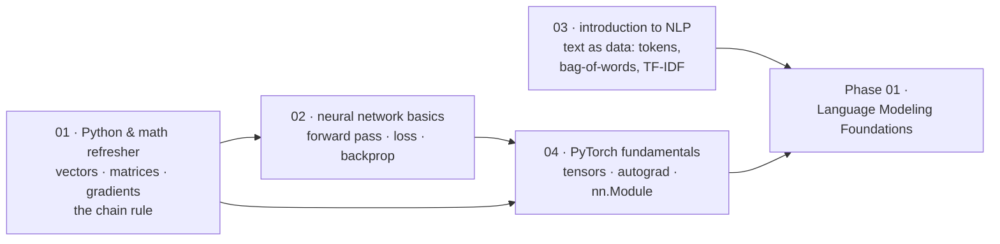

# Prerequisites (প্রয়োজনীয় পূর্বজ্ঞান)

[← Back to curriculum index](../README.md)

Transformer স্পর্শ করার আগে প্রয়োজনীয় math, Python এবং deep-learning basics ঝালিয়ে নিন।

## এই phase-এর পথ

চারটি lesson, এবং তার মধ্যে কেবল একটি text নিয়ে। লক্ষ্য হলো — Phase 02-তে যেখানে Transformer-কে খুলে দেখানো হবে, সেখানে কোনো কিছুই unfamiliar *mathematics* বা unfamiliar *PyTorch* না থাকে, যাতে আপনার পুরো মনোযোগ architecture-এর উপরই থাকে।

কোনো lesson-টা জানা থাকলে সেটি বাদ দিতে পারেন — এগুলো স্বাধীন, তবে 02-এর জন্য 01-এর উপর নির্ভরতা আছে, আর 04 পড়তে আগে 02 পড়া সহজ।

## এই phase-এর topic-গুলো

| # | Topic |
|---|-------|
| 01 | [Python and Math Refresher](01-Python-and-Math-Refresher/README.md) |
| 02 | [Neural Networks Basics](02-Neural-Networks-Basics/README.md) |
| 03 | [Introduction to NLP](03-Intro-to-NLP/README.md) |
| 04 | [PyTorch Fundamentals](04-PyTorch-Fundamentals/README.md) |