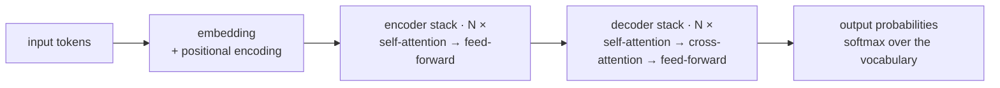

# Transformer-এর পরিচিতি

**Phase:** [Language Modeling Foundations](../README.md) · **Topic folder:** `05-Intro-to-Transformers`

## কেন এটি গুরুত্বপূর্ণ

এই পাঠটি পুরো কোর্সের ঘূর্ণন বিন্দু। এখন পর্যন্ত সবকিছু — n-gram, embedding, RNN, RNN-এর উপর বসানো attention — ছিল field-এর একটি ধারণার দিকে হাতড়ে বেড়ানো, যা একবার স্পষ্ট করে বললে প্রায় সুস্পষ্ট মনে হয়: **যদি attention একটি RNN-এর memory প্রতিস্থাপনের জন্য যথেষ্ট শক্তিশালী হয়, তবে RNN-কে আদৌ রাখা কেন?** Vaswani et al.-এর 2017-এর গবেষণাপত্র, যার স্পষ্ট শিরোনাম *"Attention Is All You Need"*, ঠিক এটিই উত্তর দিয়েছিল। এই পাঠটি আপনাকে বড় ছবি দেয়, [Phase 02](../../Phase-02-Transformer-Architecture-Deep-Dive/README.md)-তে architecture-কে টুকরো টুকরো করে ভেঙে from scratch পুনর্নির্মাণ করার আগে।

## এই পাঠে যা যা শেখা হবে

- কেন recurrence সম্পূর্ণ সরিয়ে ফেলাই ছিল মূল অন্তর্দৃষ্টি
- Self-attention: একটি একক sequence-এর *ভেতরে* প্রয়োগ করা attention
- Parallelization: Transformers জয়ের বাস্তব কারণ
- Vanishing-gradient path length সমস্যা ছাড়াই দীর্ঘ-পরিসরের dependency
- সামগ্রিক architecture-এর আকৃতির প্রথম ঝলক
- Transformer যে complexity trade-off চালু করেছিল
- Phase 02-তে গভীর ডুবের জন্য রোডম্যাপ

## 1. মূল অন্তর্দৃষ্টি: recurrence বাদ, attention রাখ

[Sequence-to-Sequence and Attention](../04-Seq2Seq-and-Attention/README.md) attention-কে একটি RNN-এর *পরিপূরক* হিসেবে ব্যবহার করেছিল — decoder তখনও একটি recurrent network ছিল, শুধু একটি সংকুচিত vector-এর উপর নির্ভর না করে সব encoder state-এর দিকে ফিরে তাকানোর সুযোগ পেত। Vaswani et al. প্রশ্ন করেছিলেন: attention যদি ইতিমধ্যেই সব প্রকৃত কাজ করে, তাহলে কী হবে? তাদের উত্তর ছিল RNN সম্পূর্ণ বাদ দেওয়া এবং **self-attention** দিয়ে গড়া একটি model — এমন attention যেখানে queries, keys এবং values *সবই একই sequence থেকে আসে*।

```
Seq2Seq + attention:  decoder (recurrent) queries -> encoder (recurrent) states
Self-attention:       every position in a sequence queries -> every position in that SAME sequence
```

প্রতিটি token সরাসরি sequence-এর অন্য প্রতিটি token-কে দেখতে পায় — তথ্যকে আর কয়েক ডজন recurrent timestep-এর মধ্য দিয়ে হাতে-হাতে যেতে হয় না।

## 2. কেন এটি ছিল বাস্তব অগ্রগতি: parallelization

[RNNs, LSTMs and GRUs §2](../03-RNN-LSTM-GRU/README.md#2-backpropagation-through-time-bptt) থেকে মনে করো: একটি RNN-কে timestep `t-1` প্রক্রিয়া করার আগে timestep `t` প্রক্রিয়া করতে হয় *বাধ্যতামূলকভাবে*। সেই sequential শৃঙ্খল একটি কঠিন সীমাবদ্ধতা যা কোনো পরিমাণ চতুর প্রকৌশল দূর করে না।

Self-attention-এর এমন কোনো সীমাবদ্ধতা নেই। প্রতিটি token কীভাবে অন্য প্রতিটি token-কে দেখে তা গণনা করা, যেমনটি `example.py`-তে দেখবে, *গোটা sequence একসাথে* নিয়ে অল্প কয়েকটি বড় matrix multiplication — ঠিক সেই ধরনের গণনা যা GPU-গুলো অত্যন্ত দ্রুত সমান্তরালে করতে তৈরি। এটি যুক্তিযুক্তভাবে **ই** কারণ, যার জন্য Transformers জিতেছে: তারা নিজেরা স্মার্টতর বলে নয়, বরং একই wall-clock সময়ে অনেক বেশি ডেটায় train করা যায়, আর scale (দেখো [Phase 03: Scaling Laws](../../Phase-03-LLM-Architectures-and-Types/05-Scaling-Laws/README.md)) অত্যন্ত গুরুত্বপূর্ণ বলে প্রমাণিত হয়েছে।

## 3. কাঠামোগতভাবে দীর্ঘ-পরিসরের dependency

একটি RNN-এ, দুটি token `i` ও `j`-এর মধ্যে computation graph-এর "path length" হলো `|i - j|` ধাপ — ঠিক এই কারণেই gradient (এবং তথ্য) [পাঠ 3](../03-RNN-LSTM-GRU/README.md#3-vanishing-and-exploding-gradients)-এ দূরত্বের সাথে ক্ষয় হতো। Self-attention-এ, *যেকোনো* দুটি token-এর মধ্যে path length **সর্বদা 1** — প্রতিটি token অন্য প্রতিটি token-এর সাথে সরাসরি dot product গণনা করে, sequence-এ তারা যত দূরেই থাকুক না কেন। এটি distance-এর সাথে vanishing-signal সমস্যাকে কাঠামোগতভাবে সরিয়ে দেয়, LSTM gating-এর মতো শুধু প্রশমিত করে নয়।

## 4. Architecture-এর আকৃতি (preview)

মূল Transformer একটি encoder-decoder model, পাঠ 4-এর Seq2Seq আকৃতির ঘনিষ্ঠ প্রতিরূপ, কিন্তু প্রতিটি recurrent layer-কে self-attention + একটি ছোট feedforward network দিয়ে প্রতিস্থাপিত:



এখানে দুটি অংশের কোনো RNN অনুরূপ নেই এবং পরবর্তী phase-এ তাদের নিজস্ব পূর্ণ পাঠ আছে:

- **Positional Encoding**: self-attention-এর word order সম্পর্কে কোনো সহজাত বোধ নেই (একটি RNN-এর বিপরীতে, যা token-গুলোকে কঠোরভাবে ক্রমানুসারে প্রক্রিয়া করে) — order স্পষ্টভাবে inject করতে হয়। দেখো [Phase 02: Positional Encoding](../../Phase-02-Transformer-Architecture-Deep-Dive/03-Positional-Encoding/README.md)।
- **Multi-head attention**: একটি attention pattern গণনা করার বদলে, সমান্তরালে কয়েকটি গণনা করো, প্রতিটি সম্ভাব্যভাবে বিভিন্ন ধরনের সম্পর্কের উপর focus করতে শেখে। দেখো [Phase 02: Self-Attention and Multi-Head Attention](../../Phase-02-Transformer-Architecture-Deep-Dive/02-Self-Attention-and-Multi-Head-Attention/README.md)।

## 5. ট্রেড-অফ: quadratic complexity

কিছুই বিনামূল্যে নয়। যেহেতু প্রতিটি token অন্য প্রতিটি token-কে দেখে, দৈর্ঘ্য `T`-এর একটি sequence-এর জন্য self-attention compute ও memory — দুটিতেই `O(T²)` খরচ করে — একটি RNN-এর `O(T)`-এর তুলনায়। কিছুকাল এটি একটি ভালো বিনিময় ছিল (parallelism এর ঘাটতি ঢেকে দিত), কিন্তু "খুব দীর্ঘ sequence সস্তায় কীভাবে সামলাব" ঠিক এই কারণেই একটি পৃথক বড় গবেষণা ক্ষেত্রে পরিণত হয়েছিল — এই কোর্সে পরে দেখো [Phase 03: Long-Context Techniques](../../Phase-03-LLM-Architectures-and-Types/06-Long-Context-Techniques/README.md) এবং [Phase 10: State Space Models](../../Phase-10-Advanced-and-Frontier-Topics/03-State-Space-Models-Mamba/README.md)।

## 6. রোডম্যাপ: Phase 02 গভীরে কী আচ্ছাদন করে

এই পাঠটি ইচ্ছাকৃতভাবে "বড় ছবি" সংস্করণ। Phase 02 প্রতিটি অংশ from scratch পুনর্নির্মাণ করবে: [Tokenization](../../Phase-02-Transformer-Architecture-Deep-Dive/01-Tokenization/README.md), সঠিক [self-attention](../../Phase-02-Transformer-Architecture-Deep-Dive/02-Self-Attention-and-Multi-Head-Attention/README.md) গণিত (কেন এটি *scaled* এবং কেন *একাধিক* head সাহায্য করে — সেই ব্যাখ্যা-সহ), [positional encoding](../../Phase-02-Transformer-Architecture-Deep-Dive/03-Positional-Encoding/README.md), [পূর্ণ encoder-decoder architecture](../../Phase-02-Transformer-Architecture-Deep-Dive/04-Transformer-Encoder-Decoder/README.md), এবং শেষে [from scratch একটি কার্যকরী mini-GPT একত্র করা](../../Phase-02-Transformer-Architecture-Deep-Dive/06-Mini-Transformer-From-Scratch/README.md)।

## Video Script Outline

1. Motivation — "একটি বাক্য field-কে নতুন করে লেখে: attention is all you need"
2. Self-attention বনাম Seq2Seq-attention: একই mechanism, আর কোনো RNN wrapper নেই
3. Parallelization: RNN dependency chain বনাম self-attention all-pairs matrix আঁকো
4. Path length: দুটি token-এর মধ্যে তথ্য যাওয়ার O(1) বনাম O(distance)
5. উচ্চ-স্তরের architecture diagram, দুটি সত্যিকার নতুন অংশের নামকরণ (positional encoding, multi-head)
6. O(T²) ট্রেড-অফ, সংক্ষেপে
7. `example.py`-র walkthrough — একটি ন্যূনতম single-head self-attention layer, সাথে sequential বনাম parallel প্রক্রিয়াকরণের একটি টয় timing তুলনা
8. Recap + Phase 02 রোডম্যাপ

## Further Reading

- Vaswani et al. (2017), *Attention Is All You Need*
- Jay Alammar, *The Illustrated Transformer* (jalammar.github.io) — এই architecture-এর সর্বাধিক-উদ্ধৃত চাক্ষুষ ব্যাখ্যাকারী
- Jay Alammar, *The Illustrated Self-Attention* section within the above
- Sasha Rush et al., *The Annotated Transformer* — গবেষণাপত্রটি PyTorch-এ line by line পুনরায় implement করা