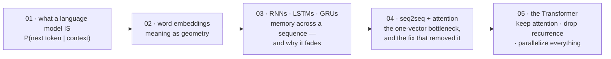

# Language Modeling Foundations

[← Back to curriculum index](../README.md)

একটি language model আসলে কী, আর Transformer-এর আবির্ভাবের আগে কীভাবে এই ক্ষেত্রটি n-gram থেকে attention পর্যন্ত বিবর্তিত হলো — তা বুঝুন।

## এই phase-এর পথ

এই phase ইচ্ছাকৃতভাবে ঐতিহাসিক: প্রতিটি lesson একটি সমাধান introduces করে, আর পরের lesson দেখায় সেই সমাধানের বাকি সমস্যাটা। শেষে Transformer আসে কোনো নতুনত্ব হিসেবে নয়, বরং একটি নির্দিষ্ট bottleneck-এর সুস্পষ্ট উত্তর হিসেবে — যে bottleneck-টি আপনি আগেই ব্যর্থ হতে দেখেছেন।

## এই phase-এর topic-গুলো

| # | Topic |
|---|-------|
| 01 | [What is a Language Model](01-What-is-a-Language-Model/README.md) |
| 02 | [Word Embeddings](02-Word-Embeddings/README.md) |
| 03 | [RNNs, LSTMs and GRUs](03-RNN-LSTM-GRU/README.md) |
| 04 | [Sequence-to-Sequence and Attention](04-Seq2Seq-and-Attention/README.md) |
| 05 | [Introduction to Transformers](05-Intro-to-Transformers/README.md) |