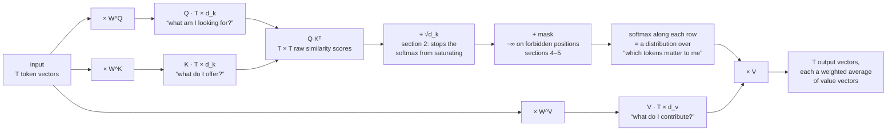
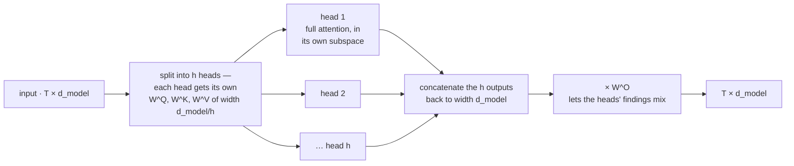

# Self-Attention and Multi-Head Attention

**Phase:** [Transformer Architecture Deep Dive](../README.md) · **Topic folder:** `02-Self-Attention-and-Multi-Head-Attention`

## কেন এই বিষয়টি গুরুত্বপূর্ণ

[Phase 01: Introduction to Transformers](../../Phase-01-Language-Modeling-Foundations/05-Intro-to-Transformers/README.md) আপনাকে intuition গড়ে তোলার জন্য একটি ন্যূনতম, untrained self-attention layer দিয়েছিল। এই লেসনটি সেটিকে rigoroস ও সম্পূর্ণ করে তোলে: স্কোরগুলো *কেন* `√d_k` দিয়ে ভাগ হয়, একাধিক attention "head" কীভাবে কাজ করে এবং কেন তারা সহায়ক, এবং decoder-কে ভবিষ্যতের token-এর দিকে তাকিয়ে "প্রতারণা" করা থেকে কীভাবে আটকানো যায়। শেষে আপনি এই কোর্সের প্রতিটি Transformer-এর ভেতরে ব্যবহৃত সঠিক, production-grade attention mechanism পাবেন — এখন PyTorch-এ সঠিকভাবে তৈরি।

## এই লেসনে যা যা শেখানো হবে

- Scaled dot-product attention, এবং scaling factor-টির ঠিক কী কারণে প্রয়োজন
- Multi-head attention: subspace-এ ভাগ করা, সমান্তরালে attention চালানো, পুনরায় একত্রিত করা
- Decoder-ধরনের model-গুলোর জন্য causal (look-ahead) masking
- Batched, পরিবর্তনশীল-দৈর্ঘ্যের sequence-গুলোর জন্য padding mask
- দুইটিই reusable `nn.Module` হিসেবে PyTorch-এ তৈরি করা

## ১. Scaled dot-product attention

[Phase 01 §1](../../Phase-01-Language-Modeling-Foundations/05-Intro-to-Transformers/README.md#1-the-key-insight-drop-the-recurrence-keep-the-attention) ও [Seq2Seq attention লেসন](../../Phase-01-Language-Modeling-Foundations/04-Seq2Seq-and-Attention/README.md#5-this-is-already-queryknowledgevalue) থেকে রিক্যাপ:

```
Attention(Q, K, V) = softmax( Q Kᵀ / √d_k ) V
```

- `Q, K, V` — shape `(T, d_k)` (বা `V`-এর ক্ষেত্রে `(T, d_v)`)-এর matrix, প্রতিটি token-এর জন্য একটি করে row
- `Q Kᵀ` — প্রতিটি query-কে প্রতিটি key-এর সাথে dot করা: `(T, T)` shape-এর raw similarity score-এর matrix
- `softmax(·)` — প্রতিটি row-কে "কোন token-গুলো গুরুত্বপূর্ণ" তার উপর একটি probability distribution-এ পরিণত করে ([Phase 00 §4](../../Phase-00-Prerequisites/01-Python-and-Math-Refresher/README.md#4-probability))
- `· V` — সেই distribution অনুযায়ী value vector-গুলোর weighted average নেওয়া



## ২. কেন `√d_k` দিয়ে ভাগ?

এটি সেই বিবরণ যা Phase 01-এর প্রিভিউ বাদ দিয়েছিল। ধরে নিন `Q` ও `K`-র entry-গুলো স্বাধীন random মান, যাদের mean 0 ও variance 1। Dot product `q · k = Σᵢ qᵢkᵢ` হলো `d_k`টি স্বাধীন পদের যোগফল, তাই **এর variance `d_k`-এর সাথে রৈখিকভাবে বাড়ে** — বড় `d_k`-র (যেমন 64 বা 128) জন্য raw dot product-এর মান বেশ বড় মাত্রার হতে পারে। এই বড়-মানের স্কোরগুলো `softmax`-এ দিলে এটি saturate হয়ে যায়: একটি স্কোর সম্পূর্ণরূপে আধিপত্য করে, `softmax`-এর gradient প্রায় সর্বত্র শূন্যের কাছাকাছি হয়ে যায়, আর training থমকে যায়। `√d_k` দিয়ে ভাগ করলে সেই variance বৃদ্ধি ঠিকভাবে বাতিল হয় (যেহেতু `Var(q·k / √d_k) = Var(q·k) / d_k`), ফলে মাত্রা যাই হোক না কেন স্কোরগুলো সুষম পরিসরে থাকে। `example.py` এই saturation প্রভাবটিকে সরাসরি, সংখ্যাগতভাবে দেখায়।

## ৩. Multi-head attention

একটি একক attention গণনা model-কে token-গুলোর মধ্যে *সব* প্রাসঙ্গিক সম্পর্ককে প্রতি জোড়ার জন্য একটি ওজনে মিশিয়ে দিতে বাধ্য করে। Multi-head attention বদলে **কয়েকটি ছোট attention গণনা সমান্তরালে চালায়**, প্রতিটি নিজের শেখা subspace-এ; ফলে ভিন্ন ভিন্ন head বিশেষায়িত হতে পারে (একটি হয়তো শিখতে পারে "কোন noun-কে এই adjective modify করে", অন্যটি "এই শব্দের পূর্বের ঘটনা", ইত্যাদি — এমন প্যাটার্ন যা প্রকৃত trained model-গুলোকে শিখতে দেখা যায়):

```
head_i = Attention(Q Wᵢ^Q, K Wᵢ^K, V Wᵢ^V)          for i = 1..h
MultiHead(Q, K, V) = Concat(head_1, ..., head_h) W^O
```



যদি `d_model = 512` ও `h = 8`টি head হয়, তবে প্রতিটি head `d_k = d_model / h = 64` মাত্রায় কাজ করে — ফলে multi-head attention-এর **মোট compute ও parameter বাজেট সম্পূর্ণ `d_model`-এর উপর একটি বড় attention গণনার সমান**, কেবল `h`টি স্বাধীন, সরু দৃষ্টিভঙ্গিতে বিভক্ত।

## ৪. Causal masking

একটি decoder যখন একবারে একটি করে token তৈরি করে, তখন অবস্থান `t`-কে অবস্থান `> t`-এর দিকে মনোযোগ দেওয়া উচিত নয় — তা হলে উত্তর তৈরি করার আগেই উত্তর দেখে ফেলা হয়। এটি **masking** দিয়ে জোরদার করা হয়: softmax-এর আগে প্রতিটি "ভবিষ্যতের" (future) স্কোর `-∞` করে দিন (বাস্তবে একটি অতি বড় ঋণাত্মক সংখ্যা), ফলে `softmax` তাকে মূলত `0` weight দেয়:

```
scores[i, j] = -inf   whenever j > i
```

এটি সম্পূর্ণ self-attention-কে **causal self-attention**-এ পরিণত করে — এটি সেই exact mechanism যা প্রতিটি decoder-only model ([Phase 03: GPT family](../../Phase-03-LLM-Architectures-and-Types/01-Decoder-Only-Models-GPT-Family/README.md)) ব্যবহার করে, আর এর কারণেই [Phase 02-এর Lesson 6&#39;s mini-GPT](../06-Mini-Transformer-From-Scratch/README.md) autoregressively text তৈরি করে।

## ৫. Padding mask

ভিন্ন ভিন্ন দৈর্ঘ্যের sequence-গুলো একসাথে batch করার সময়, ছোটগুলো `<pad>` token দিয়ে padding করা হয় ([Lesson 1 §6](../01-Tokenization/README.md#6-special-tokens))। একটি **padding mask** একইভাবে pad অবস্থানগুলোর সাথে জড়িত স্কোরগুলো `-∞` করে দেয়, যাতে model কখনো অর্থহীন filler token-এ attention weight নষ্ট না করে এবং gradient-ও তাদের মধ্য দিয়ে না যায়।

## Video Script Outline

1. Motivation — "আগের ফেজের untrained toy, এবার rigoroস করা"
2. Scaled dot-product attention, স্ক্রিনে সূত্র
3. লাইভ ডেমো: unscaled বনাম scaled স্কোর → softmax saturation, পাশাপাশি
4. Multi-head attention: split → সমান্তরাল attention → concat → project
5. Causal masking: upper-triangular mask আঁকা, "ভবিষ্যত দেখতে পারে না"-এর সাথে যুক্ত করা
6. `example.py`-এর ওয়াকথ্রু — PyTorch বাস্তবায়ন, shape, এবং masking ডেমো
7. রিক্যাপ + Positional Encoding-এর দিকে pointer (attention-এর এখনও কোনো ধারণা নেই যে token-গুলো কী ক্রমে এসেছিল!)

## Further Reading

- Vaswani et al. (2017), *Attention Is All You Need*, Section 3.2 (এই লেসনটি এর সরাসরি বিস্তারিত রূপ)
- Jay Alammar, *The Illustrated Transformer* — বিশেষত multi-head attention-এর diagram-গুলো
- PyTorch docs: `torch.nn.MultiheadAttention` (এখানে আমরা যা হাতে বানাই, তারই লাইব্রেরি সংস্করণ)