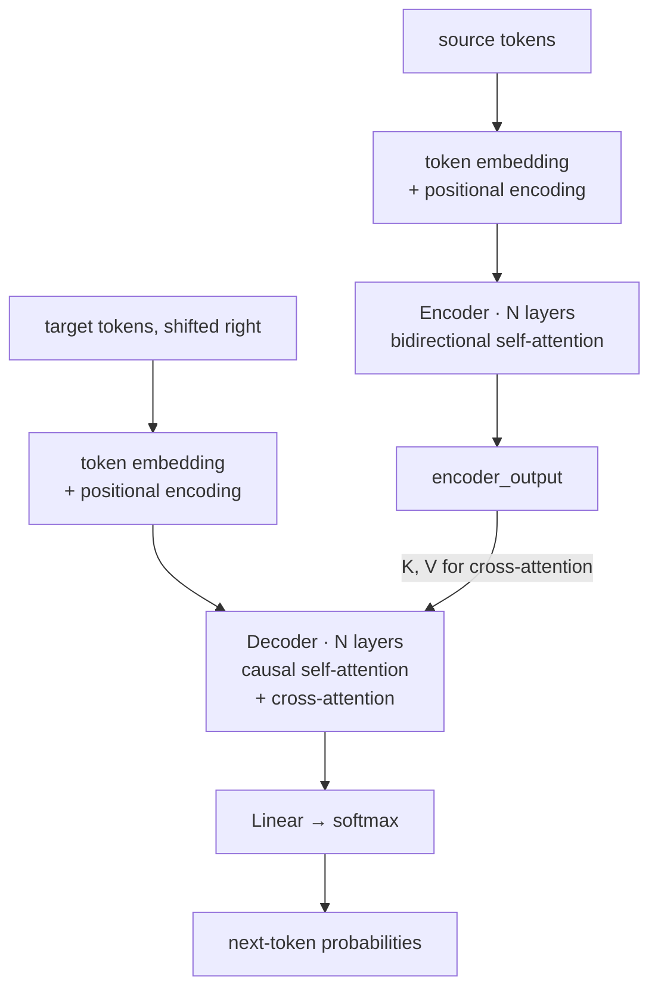

# Transformer Encoder-Decoder Architecture

**Phase:** [Transformer Architecture Deep Dive](../README.md) · **Topic folder:** `04-Transformer-Encoder-Decoder`

## কেন এই বিষয়টি গুরুত্বপূর্ণ

এখন আপনার কাছে প্রতিটি পৃথক অংশ রয়েছে: [tokenization](../01-Tokenization/README.md), [multi-head attention](../02-Self-Attention-and-Multi-Head-Attention/README.md) ও [positional encoding](../03-Positional-Encoding/README.md)। এই লেসনেই সেগুলোকে Vaswani et al. (2017)-এর সম্পূর্ণ স্থাপত্যে জোড়া লাগানো হয় — মূল Transformer, যা machine translation-এর জন্য তৈরি; কাঠামোটি [Phase 01-এর Seq2Seq model](../../Phase-01-Language-Modeling-Foundations/04-Seq2Seq-and-Attention/README.md#1-sequence-to-sequence-seq2seq)-এর হুবহু, কিন্তু প্রতিটি recurrent layer-এর বদলে attention।

## এই লেসনে যা যা শেখানো হবে

- সম্পূর্ণ encoder stack
- সম্পূর্ণ decoder stack, **cross-attention** সহ
- Cross-attention কীভাবে দুই stack-কে সংযুক্ত করে
- সম্পূর্ণ forward-pass data flow, শুরু থেকে শেষ
- Encoder-only, decoder-only ও encoder-decoder model-গুলো কীভাবে এই ভিত্তি থেকে ভিন্ন পথে চলে (Phase 03-এর প্রিভিউ)

## ১. Encoder stack

Encoder-এর কাজ: source sequence নিয়ে প্রতিটি token-এর একটি সমৃদ্ধ, contextualized representation তৈরি করা; যেখানে প্রতিটি token-এর representation ইতিমধ্যে sequence-এর প্রতিটি অন্য token-কে "দেখেছে" (কারণ encoder self-attention-এ কোনো causal mask নেই — এটি bidirectional)। একটি encoder layer:

```
x = x + MultiHeadAttention(x, x, x)     # self-attention sublayer, residual added
x = LayerNorm(x)
x = x + FeedForward(x)                   # position-wise FFN sublayer, residual added
x = LayerNorm(x)
```

(`LayerNorm`-এর সঠিক অবস্থান — প্রতিটি sublayer-এর আগে বনাম পরে — ঠিক সেই বিষয় যা [Lesson 5](../05-LayerNorm-Residuals-FFN/README.md) গভীরভাবে আলোচনা করে; উপরের স্কেচটি মূল কাগজের "Post-LN" সংস্করণ।) সম্পূর্ণ encoder পেতে এই অভিন্ন layer-গুলোর `N`টি (মূল কাগজে `N=6`) স্ট্যাক করুন।

## ২. Decoder stack

Decoder target sequence তৈরি করে একবারে একটি token, এবং প্রতিটি decoder layer-এ দুইটির বদলে **তিনটি** sublayer থাকে:

```
x = x + MaskedMultiHeadAttention(x, x, x)              # 1. causal self-attention over target-so-far
x = LayerNorm(x)
x = x + MultiHeadAttention(query=x, key=enc_out, value=enc_out)   # 2. cross-attention over the SOURCE
x = LayerNorm(x)
x = x + FeedForward(x)                                    # 3. position-wise FFN
x = LayerNorm(x)
```

Sublayer 1-এ [Lesson 2-এর causal mask](../02-Self-Attention-and-Multi-Head-Attention/README.md#4-causal-masking) ব্যবহৃত হয়, যেন decoder এখনও তৈরি করেনি এমন target token-এর দিকে উঁকি দিতে না পারে। Sublayer 3 encoder-এর FFN-এর রূপের হুবহু অনুরূপ।

## ৩. Cross-attention: যেখানে দুই stack-এর দেখা হয়

Sublayer 2 হলো একমাত্র সত্যিকারের নতুন অংশ, এবং এটি [Phase 01-এর Bahdanau/Luong attention](../../Phase-01-Language-Modeling-Foundations/04-Seq2Seq-and-Attention/README.md#3-the-fix-attention)-এর সরাসরি generalization:

```
CrossAttention: queries come from the DECODER, keys and values come from the ENCODER's final output
```

এটি সেই mechanism, যার জোরে একটি translation model-এর decoder, প্রতিটি target শব্দ তৈরি করার সময় পুরো source বাক্যের দিকে ফিরে তাকাতে পারে এবং সিদ্ধান্ত নিতে পারে কোন source শব্দগুলো *এই মুহূর্তে* প্রাসঙ্গিক — কোনো একক নির্দিষ্ট context vector নেই, কোনো bottleneck নেই। এটি self-attention-এর একই attention গণিত; একমাত্র পার্থক্য *কোথা থেকে* `Q` বনাম `K`/`V` আসে।

## ৪. সম্পূর্ণ forward pass



"Shifted right" অর্থ: training-এর সময়, অবস্থান `t`-এ decoder-এর input হলো অবস্থান `t-1`-এর *প্রকৃত* target token (একে **teacher forcing** বলে), এবং এর causal mask নিশ্চিত করে যে অবস্থান `t`-এর output কেবল target-এর অবস্থান `< t`-এর উপর নির্ভর করেছে — ফলে পুরো target sequence-কে একবারে একটি token না করে একটিমাত্র সমান্তরাল forward pass-এ training করা যায়।

## ৫. স্থাপত্যগুলো কোথায় এখান থেকে ভিন্ন পথে চলে

এই সম্পূর্ণ encoder-decoder আকৃতিটি তিনটি প্রধান প্যাটার্নের একটি, যেগুলোকে [Phase 03: LLM Architectures and Types](../../Phase-03-LLM-Architectures-and-Types/README.md)-এ আনুষ্ঠানিকভাবে দেখবেন:

- **Encoder-only** (BERT-স্টাইল): কেবল encoder stack রাখুন, next-token prediction-এর বদলে masked-token prediction দিয়ে training করুন — বোধগম্যতা (understanding) কাজের জন্য ভালো, generation-এর জন্য নয়।
- **Decoder-only** (GPT-স্টাইল): কেবল decoder stack রাখুন, আর cross-attention sublayer-টি নিছক *বাদ দিন* (আলাদা কোনো source sequence নেই — প্রতিটি অবস্থান একই sequence-এর আগের অবস্থানগুলোর দিকে causally মনোযোগ দেয়)। এটি প্রায় প্রতিটি আধুনিক general-purpose LLM-এর স্থাপত্য, এবং [Phase 02-এর Lesson 6&#39;s mini-GPT](../06-Mini-Transformer-From-Scratch/README.md) ঠিক এটিই তৈরি করে।
- **Encoder-decoder** (T5/BART-স্টাইল): এই লেসনে বর্ণিত সম্পূর্ণ স্থাপত্য রাখুন — স্পষ্ট input/output বিভেদ আছে এমন কাজের (যেমন translation বা summarization) জন্য এখনও এটি স্বাভাবিক পছন্দ।

## Video Script Outline

1. Motivation — "প্রতিটি অংশ আছে, এখানেই তারা জোড়া লাগে"
2. Encoder stack: self-attention + FFN, residual, N layer
3. Decoder stack: masked self-attention + cross-attention + FFN
4. Cross-attention-কে generalized Bahdanau/Luong attention হিসেবে ব্যাখ্যা
5. সম্পূর্ণ data flow diagram, teacher forcing-এর ব্যাখ্যা
6. `example.py`-এর ওয়াকথ্রু — PyTorch-এ একটি কার্যকর encoder + decoder stack, toy forward pass
7. রিক্যাপ + প্রিভিউ: Phase 03-তে encoder-only / decoder-only / encoder-decoder বিভাজন

## Further Reading

- Vaswani et al. (2017), *Attention Is All You Need*, Section 3.1 ও Figure 1 (প্রামাণ্য স্থাপত্য diagram)
- Jay Alammar, *The Illustrated Transformer* — সম্পূর্ণ encoder-decoder ওয়াকথ্রু সেকশন
- Sasha Rush et al., *The Annotated Transformer* — সম্পূর্ণ স্থাপত্য, প্রতিটি লাইন ব্যাখ্যাসহ বাস্তবায়িত