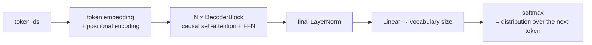

# Building a Mini-Transformer / Mini-GPT From Scratch

**Phase:** [Transformer Architecture Deep Dive](../README.md) · **Topic folder:** `06-Mini-Transformer-From-Scratch`

## কেন এই বিষয়টি গুরুত্বপূর্ণ

এটিই পুরো ফেজের প্রতিদান। প্রতিটি অংশ — [BPE tokenization](../01-Tokenization/README.md), [multi-head causal self-attention](../02-Self-Attention-and-Multi-Head-Attention/README.md), [positional encoding](../03-Positional-Encoding/README.md), [decoder স্থাপত্য](../04-Transformer-Encoder-Decoder/README.md), আর [residuals/LayerNorm/FFN](../05-LayerNorm-Residuals-FFN/README.md) — একটি ছোট, **সম্পূর্ণ কার্যকর, trainable language model**-এ জোড়া লাগানো হয়: একটি decoder-only Transformer, যা এই কোর্সের প্রতিটি GPT-শৈলীর LLM যে স্থাপত্য-পরিবারের অন্তর্ভুক্ত ঠিক সেই পরিবার ([Phase 03: Decoder-Only Models](../../Phase-03-LLM-Architectures-and-Types/01-Decoder-Only-Models-GPT-Family/README.md))। আপনি এটিকে এলোমেলোভাবে initialized weight থেকে প্রকৃত text-এ training করবেন এবং দেখবেন এটি অর্থহীন শব্দগুচ্ছ তৈরি করা থেকে স্বীকৃত কাঠামো তৈরিতে উন্নীত হয় — প্রতিটি প্রকৃত LLM-কে training করতে ব্যবহৃত একই training পদ্ধতি (next-token prediction, cross-entropy loss, gradient descent), কেবল এমন একটি স্কেলে যা এই লেসনের মধ্যেই খাপ খায়।

## এই লেসনে যা যা শেখানো হবে

- কেন একটি decoder-only model cross-attention সম্পূর্ণভাবে বাদ দেয়
- Token embedding + positional encoding + N decoder block + output head জোড়া লাগানো
- Training objective: next-token prediction, [Phase 01: What is a Language Model](../../Phase-01-Language-Modeling-Foundations/01-What-is-a-Language-Model/README.md)-এর ঠিক মতোই, তবে এবার n-gram count-এর বদলে একটি neural network
- Autoregressive text generation
- প্রকৃত, production-scale LLM-এ আসলে কী ভিন্ন (এবং কী ভিন্ন নয়)

## ১. Encoder-decoder থেকে decoder-only

[Lesson 4](../04-Transformer-Encoder-Decoder/README.md#5-where-architectures-diverge-from-here) এরই পূর্বাভাস দিয়েছিল: একটি decoder-only model হলো Lesson 4-এর decoder stack, যার cross-attention sublayer নিছক **সরিয়ে** দেওয়া হয়েছে (মনোযোগ দেওয়ার মতো আলাদা কোনো source sequence নেই — প্রতিটি অবস্থান *একই* sequence-এর আগের অবস্থানগুলোর দিকে causally মনোযোগ দেয়):

```
x = x + CausalSelfAttention(LayerNorm(x))     # sublayer 1 (Pre-LN, per Lesson 5 §4)
x = x + FeedForward(LayerNorm(x))              # sublayer 2
```

এই block-টি `N` বার স্তূপীকৃত করলে, "target sequence" ও "source sequence" একই জিনিস হয়ে যায়: model কেবল একটি অবিচ্ছিন্ন স্ট্রিমে আগের সবকিছু থেকে প্রতিটি পরবর্তী token-এর পূর্বাভাস দেয়। এটিই GPT-1/2/3-পরিবারের model-গুলোর সম্পূর্ণ স্থাপত্য।

## ২. সম্পূর্ণ model



এটি এই ফেজের প্রতিটি আগের লেসনের একটি সরাসরি, line-for-line সংমিশ্রণ, কেবল cross-attention sublayer ছাড়া।

## ৩. Training objective: next-token prediction

[Phase 01 Lesson 1](../../Phase-01-Language-Modeling-Foundations/01-What-is-a-Language-Model/README.md#1-what-a-language-model-actually-is)-এর objective-টির হুবহু অনুরূপ, কেবল raw n-gram count-এর বদলে conditional probabilities-গুলো এখন একটি neural network অনুমান করে:

```
Loss = CrossEntropy( model(tokens[:-1]), tokens[1:] )
```

Model-কে token `0..T-2` খাওয়ান; প্রতিটি অবস্থান `t`-এ এর causal-masked output-এর token `t+1` পূর্বাভাস দেওয়া উচিত। Causal mask-এর কারণে, এটি *প্রতিটি* অবস্থানের জন্য একটিমাত্র সমান্তরাল forward pass-এ গণনা করা যায় (প্রতি অবস্থানের জন্য আলাদা forward pass দরকার নেই) — দৈর্ঘ্য `T`-এর একটি sequence-তে decoder-only Transformer-কে training করলে একটিমাত্র pass থেকেই `T`টি next-token-prediction training সংকেত কার্যত ফ্রি পাওয়া যায়।

## ৪. Autoregressive generation

Inference-এর সময় খাওয়ানোর মতো ground-truth "next token" নেই — তাই generation হয় একবারে একটি token: এ পর্যন্ত token-গুলোতে model চালান, *শেষ* অবস্থানের probability distribution নিন, পরবর্তী token-টি sample করুন (বা সবচেয়ে সম্ভাব্যটি নিন), যোগ করুন, এবং পুনরাবৃত্তি করুন। এটি [Phase 01-এর bigram model-এর generation loop](../../Phase-01-Language-Modeling-Foundations/01-What-is-a-Language-Model/example.py)-এর কাঠামোগতভাবে অভিন্ন — কেবল যে distribution থেকে sample করা হচ্ছে তা এখন একটি count টেবিলের বদলে একটি সম্পূর্ণ Transformer তৈরি করে।

> **Runtime note:** `example.py` ২০০০ ধাপে training করে, যাতে CPU-তে প্রায় ১-২ মিনিট লাগে। loss-কে ~3.6 (২৯-অক্ষরের vocabulary-র ওপর প্রায়-random) থেকে ~0.1-এ পড়তে দেখা, আর generated text-কে অর্থহীনতা থেকে সাবলীল, ব্যাকরণগত বাক্যে (যা training corpus-এর সাথে মিলে যায়) রূপান্তরিত হতে দেখা — এটিই মূল লক্ষ্য; এটিকে চালিয়ে যেতে দিন।

## ৫. প্রকৃত LLM-এ কী ভিন্ন (এবং কী নয়)

`example.py` একটি সত্যিই ক্ষুদ্র model-কে training দেয় (কয়েক লক্ষ parameter, কয়েকটি layer, কয়েক ডজন অক্ষরের context window) কিছু ছোট text-এ, CPU-তে কয়েক মিনিটে। একটি production LLM নিম্নলিখিত বিষয়ে ভিন্ন:

- **Scale**: কোটি কোটি parameter, ট্রিলিয়ন training token, হাজার হাজার GPU — দেখুন [Phase 03: Scaling Laws](../../Phase-03-LLM-Architectures-and-Types/05-Scaling-Laws/README.md) ও [Phase 04: Pretraining LLMs](../../Phase-04-Pretraining-LLMs/README.md)।
- **Tokenization**: কয়েক হাজার token-এর একটি প্রকৃত byte-level BPE vocabulary ([Lesson 1](../01-Tokenization/README.md)), সরলতার জন্য এখানে ব্যবহৃত character-level tokenizer নয়।
- **Training infrastructure**: distributed training, mixed precision, learning-rate schedule — পুরো [Phase 04](../../Phase-04-Pretraining-LLMs/README.md)।
- **Pretraining-এর পরে যা আসে**: instruction tuning ও alignment ([Phase 05](../../Phase-05-Finetuning-LLMs/README.md), [Phase 06](../../Phase-06-Alignment-and-RLHF/README.md)) — এর আগে এটি assistant-এর মতো আচরণ করে না।

যা **ভিন্ন নয়**: `example.py`-এর মূল স্থাপত্য ও training loop — embedding, causal self-attention, feed-forward, residual, LayerNorm, next-token prediction-এ cross-entropy, gradient descent — *একই* রেসিপি, প্রতিটি স্কেলে, একদম উপরে পর্যন্ত।

## Video Script Outline

1. Motivation — "এই পুরো ফেজের প্রতিটি অংশ, এমন কিছুতে জোড়া লাগানো যা সত্যিই শেখে"
2. Decoder-only আকৃতি: cross-attention সরানো, বাকি সব একই
3. Training objective রিক্যাপ: next-token prediction, এবার একটি প্রকৃত neural network দিয়ে
4. `example.py`-এর ওয়াকথ্রু — model তৈরি, training, loss curve দেখা, training-এর আগে ও পরে text generation
5. সৎ স্কেল তুলনা: প্রকৃত LLM-এ কী ভিন্ন, আর কী সত্যিই ভিন্ন নয়
6. পুরো ফেজের রিক্যাপ + Phase 03-এর প্রিভিউ: এই exact ভিত্তির উপর গড়ে ওঠা model স্থাপত্য-পরিবারগুলো

## Further Reading

- Radford et al. (2018), *Improving Language Understanding by Generative Pre-Training* (GPT-1 — প্রথম decoder-only Transformer LM)
- Andrej Karpathy, *Let's build GPT: from scratch, in code, spelled out* (ভিডিও) ও `nanoGPT` repository — এই লেসনের কাঠামোর সরাসরি অনুপ্রেরণা
- Sasha Rush et al., *The Annotated Transformer*