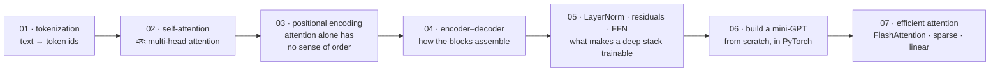

# Transformer Architecture Deep Dive

[← Back to curriculum index](../README.md)

Transformer-কে টুকরো টুকরো করে খুলে দেখুন এবং PyTorch-এ from scratch একটি mini version আবার বানিয়ে ফেলুন।

## এই phase-এর পথ

Transformer-এর প্রতিটি component, সেটি বানানোর জন্য যেসব ক্রমে দরকার — শেষেও একটি কাজ করা mini-GPT from scratch লেখা, তারপর efficiency-র সেই কাজ, যা দিয়ে বাস্তব context length সম্ভব হয়।

Lesson 01–05 হলো যন্ত্রাংশ; Lesson 06-এ সেগুলো এমন একটি model-এ পরিণত হয় যা train ও sample করা যায়। Lesson 07 জিজ্ঞেস করে — sequence দীর্ঘ হলে কী বদলাতে হয়।

## এই phase-এর topic-গুলো

| # | Topic |
|---|-------|
| 01 | [Tokenization](01-Tokenization/README.md) |
| 02 | [Self-Attention and Multi-Head Attention](02-Self-Attention-and-Multi-Head-Attention/README.md) |
| 03 | [Positional Encoding](03-Positional-Encoding/README.md) |
| 04 | [Transformer Encoder-Decoder Architecture](04-Transformer-Encoder-Decoder/README.md) |
| 05 | [Layer Norm, Residuals and Feed-Forward Sublayers](05-LayerNorm-Residuals-FFN/README.md) |
| 06 | [Building a Mini-Transformer / Mini-GPT From Scratch](06-Mini-Transformer-From-Scratch/README.md) |
| 07 | [Efficient Attention: FlashAttention, Sparse and Linear Attention](07-Efficient-Attention-FlashAttention-and-Approximations/README.md) |