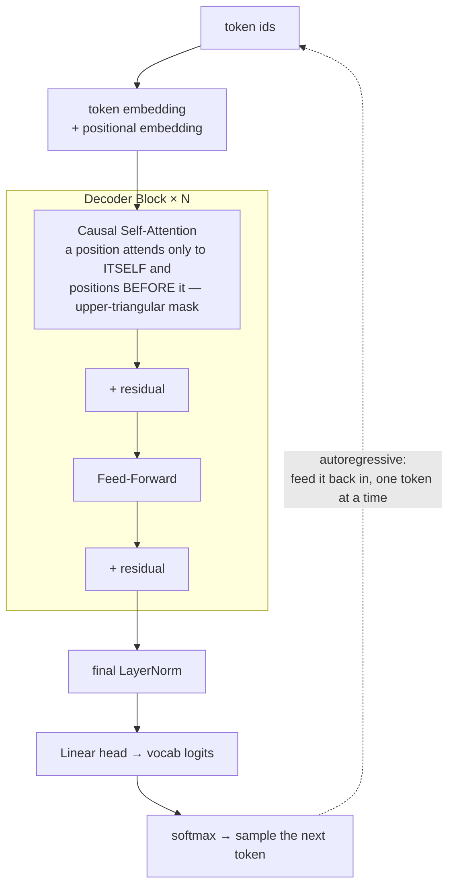

# Decoder-Only মডেল: GPT ফ্যামিলি

**Phase:** [LLM Architectures and Types](../README.md) · **Topic folder:** `01-Decoder-Only-Models-GPT-Family`

## কেন এটি গুরুত্বপূর্ণ

আপনি ইতিমধ্যে [Phase 02-এর capstone](../../Phase-02-Transformer-Architecture-Deep-Dive/06-Mini-Transformer-From-Scratch/README.md) পাঠে একটি কার্যকরী decoder-only Transformer তৈরি করে ফেলেছেন। এই পাঠটি জুম আউট করে দেখায়: সেই একই architecture ফ্যামিলি — স্কেল বাড়িয়ে, বেশি সময় ধরে training করিয়ে, আরও বেশি data দিয়ে — *হলোই* GPT-1, GPT-2, GPT-3, এবং (এই phase-এ পরে আচ্ছাদিত কয়েকটি refinement-সহ) আজ প্রোডাকশনে থাকা প্রায় প্রতিটি general-purpose LLM, যার মধ্যে [Lesson 7](../07-Survey-of-Popular-Open-LLMs/README.md)-এ জরিপ করা open মডেলগুলোও আছে। কেন decoder-only বিকল্প encoder-only এবং encoder-decoder-এর (Lessons 2 এবং 3-এ আচ্ছাদিত) উপরে জয়ী হলো তা বোঝা এই কোর্সের বাকি অংশের জন্য অপরিহার্য context।

## Architecture এক নজরে

কোনো encoder নেই, কোনো cross-attention নেই — শুধু উপরের blockটি `N` বার স্ট্যাক করা। প্রতিটি কাজই হয়ে যায় "পরবর্তী token-টি পূর্বাভাস করো," আর সেজন্যই একই architecture কোনো structural পরিবর্তন ছাড়াই pretraining, fine-tuning এবং open-ended generation সামলাতে পারে। `example.py` এই স্ট্যাকটিকে বাস্তব, trainable PyTorch কোড হিসেবে তৈরি করে (নিচের parameter-কাউন্ট সূত্রগুলোই নয়) এবং training-এর আগে ও পরে এটি থেকে text generate করে।

## এই পাঠে যা শেখা হবে

- GPT-1: decoder-only pretraining + task-নির্দিষ্ট fine-tuning
- GPT-2: স্কেল আপ করা, byte-level BPE এবং zero-shot task transfer
- GPT-3: শুধু স্কেল থেকেই in-context learning-এর আবির্ভাব
- Phase 02-এর mini-GPT থেকে কীভাবে GPT-এর architecture বিকশিত হয়ে বাস্তব প্রোডাকশন স্কেলে পৌঁছাল
- কেন decoder-only general-purpose LLM-গুলোর জন্য ডিফল্ট পছন্দ হয়ে উঠল

## 1. GPT-1: pretrain, তারপর fine-tune

Radford et al. (2018) রেসিপিটি প্রবর্তন করেছিলেন: unlabeled text-এ সাধারণ next-token prediction ([Phase 01](../../Phase-01-Language-Modeling-Foundations/01-What-is-a-Language-Model/README.md)) দিয়ে একটি decoder-only Transformer pretrain করুন, তারপর প্রতিটি নির্দিষ্ট downstream task-এর (sentiment classification, entailment ইত্যাদি) জন্য ছোট একটি অতিরিক্ত output head যোগ করে **fine-tune** করুন। এই "একবার pretrain, প্রতি task-এ fine-tune" প্যাটার্ন — প্রতিটি task-এর জন্য স্ক্র্যাচ থেকে নতুন মডেল training করার বিপরীতে — ছিল এই paper-টির কেন্দ্রীয় অবদান, এবং এটি হলো [Phase 05: Fine-tuning LLMs](../../Phase-05-Finetuning-LLMs/README.md)-এর সরাসরি পূর্বসূরি।

## 2. GPT-2: স্কেল, byte-level BPE এবং zero-shot transfer

GPT-2 (Radford et al., 2019) একই architecture ফ্যামিলি রাখলেও তা উল্লেখযোগ্যভাবে স্কেল আপ করেছিল (চারটি সাইজ, 117M থেকে 1.5B parameter), **byte-level BPE** tokenization-এ স্যুইচ করেছিল (মনে পড়ুন [Phase 02 Lesson 1 §5](../../Phase-02-Transformer-Architecture-Deep-Dive/01-Tokenization/README.md#5-byte-level-bpe-what-gpt-family-models-actually-use) — এই ধারণাটা আক্ষরিক অর্থেই সেখান থেকে এসেছে), এবং অনেক বড় ও আরও বৈচিত্র্যময় web-scraped corpus (WebText)-এ training করেছিল। প্রধান ফলাফল: যথেষ্ট স্কেল পেলে, মডেলটি **যে কাজগুলোর জন্য কখনো স্পষ্টভাবে fine-tune করা হয়নি** — summarization, translation, question answering — সেগুলোতে শুধু সঠিকভাবে prompt দেয়ার মাধ্যমেই যুক্তিসঙ্গত পারফরম্যান্স দেখাতে শুরু করে। এটাই **zero-shot task transfer**, আর এটিই প্রথম দৃঢ় ইঙ্গিত ছিল যে task-নির্দিষ্ট engineering নয়, বরং স্কেল নিজেই অধিকতর আশাপ্রদ পথ।

## 3. GPT-3: in-context learning-এর আবির্ভাব

GPT-3 (Brown et al., 2020) স্কেলকে আরও এগিয়ে নিল (175B parameter) এবং GPT-2-এর zero-shot পর্যবেক্ষণকে অনেক বেশি নাটকীয় ও নির্ভরযোগ্য করল: মডেলটি prompt-এ সরাসরি রাখা মাত্র কয়েকটি উদাহরণ থেকে **কোনো gradient update ছাড়াই** নতুন কাজ করতে পারত — এটিই **few-shot in-context learning**, এবং [Phase 07: Prompt Engineering and In-Context Learning](../../Phase-07-Prompt-Engineering-and-In-Context-Learning/README.md) সম্পূর্ণরূপে এই সামর্থ্যের চারপাশে গড়ে উঠেছে। এটি সক্ষম করতে architecture-তে কিছুই পরিবর্তন হয়নি — GPT-1-এর মতোই একই decoder-only Transformer এবং একই next-token-prediction objective, শুধু প্রায় ১৫০০ গুণ বেশি parameter সহ।

## 4. Architecture-এর বৃদ্ধি, কংক্রিটভাবে

| Model               | Layers   | `d_model` | Heads    | Context length | Parameters   |
| ------------------- | -------- | ----------- | -------- | -------------- | ------------ |
| GPT-1               | 12       | 768         | 12       | 512            | ~117M        |
| GPT-2 (small → XL) | 12 → 48 | 768 → 1600 | 12 → 25 | 1024           | 117M → 1.5B |
| GPT-3               | 96       | 12288       | 96       | 2048           | 175B         |

প্রতিটি সারি হলো [Phase 02 Lesson 6](../../Phase-02-Transformer-Architecture-Deep-Dive/06-Mini-Transformer-From-Scratch/README.md#2-the-full-model)-এর *হুবহু একই block* — causal self-attention + feed-forward, `N` বার স্ট্যাক করা — শুধু বড় সংখ্যা দিয়ে। `example.py` এই কনফিগারেশনগুলো থেকে scaling-laws গবেষণা যে সূত্র ব্যবহার করে (এখানে প্রিভিউ, সম্পূর্ণ আলোচনা [Lesson 5](../05-Scaling-Laws/README.md)-এ) সেই একই সূত্র দিয়ে বাস্তব parameter সংখ্যা গণনা করে।

## 5. কেন decoder-only জয়ী হলো

তিনটি architecture ফ্যামিলিকে পাশাপাশি তুলনা করুন (এই phase-এর Lessons 1-3): encoder-only মডেলগুলো ([Lesson 2](../02-Encoder-Only-Models-BERT-Family/README.md)) একেবারেই open-ended text generate করতে পারে না; encoder-decoder মডেলগুলোর ([Lesson 3](../03-Encoder-Decoder-Models-T5-BART/README.md)) "input" ও "output"-এর মধ্যে একটি পরিষ্কার বিভাজন দরকার, যা বেশিরভাগ বাস্তব কাজের (open-ended chat, reasoning, code) প্রকৃতিতে স্বাভাবিকভাবে থাকে না। Decoder-only মডেল দুটি সমস্যাই এড়িয়ে যায়: **যেকোনো task-কে "এই text-টি চালিয়ে যাও" হিসেবে খাপানো যায়** — question answering, summarization, translation, classification, chatting — সবই ভিন্ন ভিন্ন prompt-সহ একই next-token-prediction objective হয়ে যায়। একটি architecture, একটি training objective, একটি tokenizer, একটি মডেল — স্কেল করার জন্য অনেক সহজ সিস্টেম, আর দেখা গেল architectural চতুরতার চেয়ে স্কেলই বেশি গুরুত্বপূর্ণ।

## Video Script Outline

1. Motivation — "যে মডেলটি আপনি ইতিমধ্যে তৈরি করেছেন, শুধু আরও বড় — তিনবার, তিনটি ভিন্ন শিক্ষা সহ"
2. GPT-1: pretrain + fine-tune paradigm
3. GPT-2: স্কেল + byte-level BPE → zero-shot transfer-এর আবির্ভাব
4. GPT-3: আরও স্কেল → few-shot in-context learning, কোনো gradient update নেই
5. Architecture টেবিল ওয়াকথ্রু, প্রতিটি সারিকে Phase 02-এর mini-GPT block-এর সাথে যুক্ত করা
6. `example.py`-এর ওয়াকথ্রু — কনফিগ থেকে বাস্তব GPT-2-ফ্যামিলি parameter সংখ্যা গণনা, তারপর স্ক্র্যাচ থেকে প্রকৃত decoder-only block তৈরি ও training, training-এর আগে ও পরে text generate করা
7. Recap: কেন "এক architecture, এক objective, সবকিছুকে text continuation হিসেবে ফ্রেম করা" জয়ী হলো → Lessons 2-3-এর প্রিভিউ দেখানো যে কী পেছনে পড়ে গেল

## Further Reading

- Radford et al. (2018), *Improving Language Understanding by Generative Pre-Training* (GPT-1)
- Radford et al. (2019), *Language Models are Unsupervised Multitask Learners* (GPT-2)
- Brown et al. (2020), *Language Models are Few-Shot Learners* (GPT-3)
- Wei et al. (2022), *Emergent Abilities of Large Language Models* (স্কেলের সাথে সামর্থ্য আবির্ভূত হওয়ার বিস্তৃত ঘটনা)
- Sanh et al. (2019), *DistilBERT* — এটি যে distillation রেসিপি প্রবর্তন করে তা decoder-only মডেলেও (যেমন DistilGPT2) সমানভাবে প্রযোজ্য; সম্পূর্ণ mechanism-এর জন্য দেখুন [Phase 09 Lesson 5: Model Distillation and Pruning](../../Phase-09-Deployment-and-Inference-Optimization/05-Model-Distillation-and-Pruning/README.md)