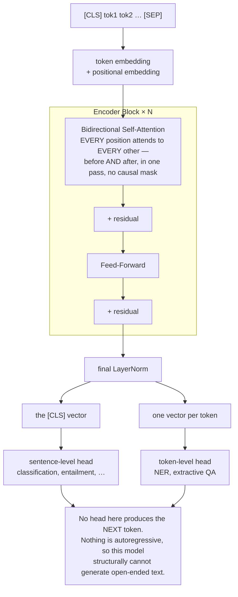

# Encoder-Only মডেল: BERT ফ্যামিলি

**Phase:** [LLM Architectures and Types](../README.md) · **Topic folder:** `02-Encoder-Only-Models-BERT-Family`

## কেন এটি গুরুত্বপূর্ণ

Lesson 1 আলোচনা করেছে কেন *general-purpose, generative* LLM-গুলোর জন্য decoder-only জয়ী হলো। কিন্তু encoder-only মডেলগুলো একটি সত্যিকারের ভিন্ন সমস্যা আরও ভালোভাবে সমাধান করে, আর কেন ঠিক তা বোঝা architectural trade-off-কে শুধু দাবি করা নয় বরং কংক্রিট করে তোলে। BERT (Devlin et al., 2018) এছাড়াও **masked language modeling** প্রবর্তন করেছে — একটি pretraining objective যা এই কোর্সের অন্য সব জায়গায় ব্যবহৃত causal next-token prediction থেকে মৌলিকভাবে ভিন্ন — `example.py`-তে এর নিজের একটি ক্ষুদ্র সংস্করণ training করলে encoder-only/decoder-only পার্থক্যটি শুধু ধারণাগত নয়, সরাসরি বোধগম্য হয়ে উঠবে।

## Architecture এক নজরে



[Lesson 1](../01-Decoder-Only-Models-GPT-Family/README.md#architecture-at-a-glance)-এর decoder-এর মতোই একই block আকৃতি — পুরো architectural পার্থক্য হলো *কোনো causal mask নেই*। `example.py` বাস্তব MLM masking-সহ ঠিক এই স্ট্যাকটি স্ক্র্যাচ থেকে তৈরি ও training করে।

## এই পাঠে যা শেখা হবে

- Bidirectional encoder স্ট্যাক, এবং কেন এটি open-ended text generate করতে পারে না
- Masked Language Modeling (MLM): BERT-এর মূল pretraining objective
- Next Sentence Prediction (NSP), এবং কেন এটি পরে বাদ পড়ে গেল
- `[CLS]` এবং `[SEP]`: BERT কীভাবে classification task-গুলোর জন্য input প্যাকেজ করে
- Downstream task-গুলোর জন্য BERT fine-tuning
- RoBERTa এবং আজকের encoder-only ফ্যামিলি

## 1. শুধু encoder স্ট্যাক — গঠনগতভাবেই bidirectional

মনে পড়ুন [Phase 02 Lesson 4 §1](../../Phase-02-Transformer-Architecture-Deep-Dive/04-Transformer-Encoder-Decoder/README.md#1-the-encoder-stack): encoder-এর self-attention-এ **কোনো causal mask নেই** — প্রতিটি position একই forward pass-এ নিজের আগের ও পরের প্রতিটি position-এ attend করতে পারে। BERT আক্ষরিক অর্থেই এই স্ট্যাক, কোনো decoder ছাড়াই। এই bidirectional context-ই encoder-only মডেলগুলোকে *বোঝার* কাজগুলোতে (classification, named-entity recognition, extractive question answering) সেরা করে তোলে, যেখানে পুরো input শুরু থেকেই পাওয়া যায় — এবং একই সাথে তাদের structurally open-ended generation করতে অক্ষম করে: যখন প্রতিটি position অন্য সব position-কে দেখতে পারে, "পরবর্তী token generate করো" ধারণাটিই অর্থহীন, কারণ এখনো "generate" হয়নি এমন position-ও দেখা যাচ্ছে।

## 2. Masked Language Modeling (MLM)

সাধারণ next-token prediction দিয়ে একটি bidirectional মডেল training করা যায় না — যে position ভবিষ্যৎ দেখতে পারে, সে তো সহজেই তা কপি করে "predict" করে ফেলবে। BERT-এর সমাধান: input-এর প্রায় ~১৫% token এলোমেলোভাবে বাছাই করুন, আর মডেলটিকে bidirectional context থেকে *সেই নির্দিষ্ট tokenগুলো* predict করার জন্য training দিন, প্রকৃত token-টিকে যেখানে প্রতিস্থাপিত করা হয়েছে:

- `[MASK]` token দিয়ে, ৮০% সময়
- এলোমেলো অন্য একটি token দিয়ে, ১০% সময়
- মূল (অপরিবর্তিত) token দিয়েই, ১০% সময়

শেষ দুটি ক্ষেত্র বিশেষভাবে রাখা হয়েছে যাতে মডেলটি সহজভাবে "অ-`[MASK]` position-গুলো উপেক্ষা করা শিখে না যায়" — কোন position-গুলো মূল্যায়ন করা হচ্ছে তা কখনো নিশ্চিতভাবে না জানায়, তাই প্রতিটি position-এ সত্যিই কার্যকর representation গড়তে হয়। Loss **শুধুমাত্র masked position-গুলোর উপর** গণনা করা হয় — [Phase 01/02-এর causal language modeling loss](../../Phase-02-Transformer-Architecture-Deep-Dive/06-Mini-Transformer-From-Scratch/README.md#3-training-objective-next-token-prediction) থেকে এটিই মূল যান্ত্রিক পার্থক্য, যেখানে sequence-এর প্রতিটি position-ই supervision পায়।

## 3. Next Sentence Prediction (NSP)

BERT-এর মূল pretraining-এ একটি দ্বিতীয় objective-ও ছিল: দুটি text segment দিলে ভবিষ্যদ্বাণী করা যে দ্বিতীয়টি source document-এ সত্যিই প্রথমটির পরে আসে নাকি এলোমেলো সম্পর্কহীন একটি segment — question answering-এর মতো কাজের জন্য দরকারি sentence-পেয়ার সম্পর্ক শেখানোর উদ্দেশ্যে একটি binary classification task। পরবর্তী গবেষণা (বিশেষত RoBERTa, নিচে দেখুন) খুঁজে পেয়েছিল যে NSP সামান্য অবদান রাখে বা এমনকি পারফরম্যান্স ক্ষতিগ্রস্ত করে, এবং বেশিরভাগ আধুনিক encoder-only মডেল এটি সম্পূর্ণ বাদ দেয় — একটি দরকারি স্মারক যে প্রভাবশালী paper-এর প্রতিটি ধারণাই ফলো-আপ যাচাইয়ে টিকে থাকে না।

## 4. `[CLS]` এবং `[SEP]`: classification-এর জন্য input প্যাকেজিং

BERT প্রতিটি input-এর শুরুতে একটি বিশেষ `[CLS]` token যোগ করে, এবং segment-গুলো আলাদা করতে `[SEP]` ব্যবহার করে (যেমন, একটি প্রশ্ন এবং একটি passage):

```
[CLS] the movie was great [SEP]
```

Pretraining-এর পর, *`[CLS]` position-এ* final-layer representation-টিকে একটি pooled, পুরো-sequence সারাংশ হিসেবে ধরা হয় — শুধুমাত্র সেই একটি vector-এর উপরে ছোট একটি classification head sentence-স্তরের কাজগুলো (sentiment, entailment) সামলায়, আর token-স্তরের কাজগুলো (NER, extractive QA)-তে প্রতি-token output vector সরাসরি ব্যবহার করা হয়।

## 5. BERT fine-tuning

[Lesson 1 §1](../01-Decoder-Only-Models-GPT-Family/README.md#1-gpt-1-pretrain-then-fine-tune)-এর GPT-1 রেসিপিটি হুবহু, একটি bidirectional মডেলের ক্ষেত্রে প্রয়োগ করা: unlabeled text-এ একবার MLM (ঐচ্ছিকভাবে NSP-সহ) দিয়ে pretrain, তারপর একটি ছোট task-নির্দিষ্ট head সংযুক্ত করে নির্দিষ্ট downstream task-এর labeled data-তে পুরো মডেলটি (বা শুধু head-টি) fine-tune করুন। এই pretrain-then-fine-tune প্যাটার্নটি GPT-এর পূর্ববর্তী এবং সরাসরি সমান্তরাল — দুই paper-ই পরস্পরের কয়েক মাসের মধ্যে, বিপরীত architectural প্রারম্ভিক বিন্দু থেকে কাঠামোগতভাবে একই রকম রেসিপিতে পৌঁছেছিল।

## 6. RoBERTa এবং আজকের encoder-only দৃশ্যপট

RoBERTa (Liu et al., 2019) BERT-এর রেসিপি আবার চালিয়েছিল আরও data, দীর্ঘ training, dynamically-generated mask (BERT mask একবার precompute করত; RoBERTa প্রতি epoch-এ নতুন করে mask করে), এবং **কোনো NSP objective ছাড়া**, এবং সব দিক দিয়ে BERT-কে ছাড়িয়ে গিয়েছিল — প্রমাণ যে BERT তার capacity-র তুলনায় undertrained ছিল, architecture ভুল ছিল তা নয়। Encoder-only মডেলগুলো general-purpose ব্যবহারে decoder-only LLM-রা দখল নেওয়ায় শিরোনামের "chatbot" খবর থেকে বেশিরভাগই সরে গেল, তবে এরা আজও আদর্শ পছন্দ: search/similarity-র জন্য text **embedding** তৈরি (এই কাজে তাদের bidirectional pooled representation সাধারণত decoder-only মডেলের চেয়ে শক্তিশালী হয়), classification pipeline, এবং যেকোনো latency-sensitive কাজ, যেখানে শক্তিশালী বোঝাপড়া দরকার কিন্তু কোনো generationই নয়।

## Video Script Outline

1. Motivation — "Phase 02-এর encoder-অর্ধেক, একা — কেবল bidirectional হলে কী পাওয়া যায়, আর কী মূল্য দিতে হয়?"
2. কেন bidirectional self-attention কাঠামোগতভাবে open-ended generation করতে পারে না
3. Masked Language Modeling: ৮০/১০/১০ masking রেসিপি, শুধু masked position-এ loss
4. NSP, এবং কেন এটি বাদ পড়ল (RoBERTa)
5. `[CLS]`/`[SEP]` এবং fine-tuning রেসিপি
6. `example.py`-এর ওয়াকথ্রু — স্ক্র্যাচ থেকে একটি ক্ষুদ্র MLM মডেল training, Phase 02-এর causal LM training-এর সাথে সরাসরি বৈপরীত্য
7. Recap: আজ encoder-only-এর স্থান → Lesson 3-এর মধ্যভাগ (encoder-decoder)-এর প্রিভিউ

## Further Reading

- Devlin, Chang, Lee, Toutanova (2018), *BERT: Pre-training of Deep Bidirectional Transformers for Language Understanding*
- Liu et al. (2019), *RoBERTa: A Robustly Optimized BERT Pretraining Approach*
- Sanh et al. (2019), *DistilBERT, a distilled version of BERT* ([Phase 09: Model Distillation and Pruning](../../Phase-09-Deployment-and-Inference-Optimization/05-Model-Distillation-and-Pruning/README.md)-এর compression ধারণাগুলোর একটি প্রিভিউ)