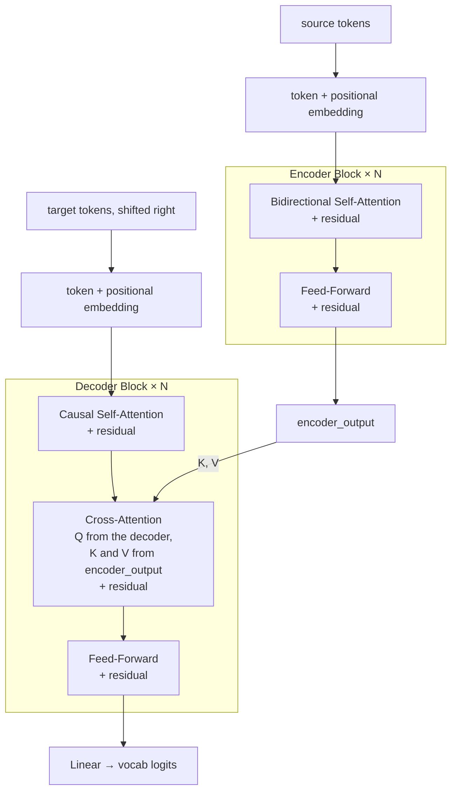

# Encoder-Decoder মডেল: T5 এবং BART

**Phase:** [LLM Architectures and Types](../README.md) · **Topic folder:** `03-Encoder-Decoder-Models-T5-BART`

## কেন এটি গুরুত্বপূর্ণ

Lessons 1 এবং 2 দুটি "শুদ্ধ" architecture আচ্ছাদন করেছে: decoder-only (generation, কোনো bidirectional input বোঝাপড়া নেই) এবং encoder-only (bidirectional বোঝাপড়া, কোনো generation-ই নেই)। [Phase 02 Lesson 4-এর সম্পূর্ণ encoder-decoder architecture](../../Phase-02-Transformer-Architecture-Deep-Dive/04-Transformer-Encoder-Decoder/README.md)-টি হলো সেই মডেল ফ্যামিলি যা দুটোই পায়: input-এর bidirectional বোঝাপড়া *এবং* output-এর autoregressive generation, cross-attention দিয়ে যুক্ত। T5 এবং BART হলো এই আকৃতিটি training করার সবচেয়ে প্রভাবশালী দুটি উপায়, এবং প্রতিটিই আপনারা ইতিমধ্যে বাস্তবায়ন করা সাধারণ causal LM ও MLM-এর বাইরে একটি সত্যিই নতুন pretraining objective প্রবর্তন করে।

## Architecture এক নজরে



দুটি সম্পূর্ণ স্ট্যাক, **cross-attention** দিয়ে যুক্ত: decoder-এর queries আসে এখন পর্যন্ত যা generate করেছে তা থেকে, কিন্তু এর keys/values আসে *encoder-এর* output থেকে — তাই প্রতিটি generated token পুরো (bidirectionally-প্রসেসড) source-এর দিকে ফিরে তাকাতে পারে, আবার নিজে autoregressively generate-ও করতে থাকে। `example.py` উভয় স্ট্যাক end to end তৈরি করে এবং ফলাফলকে বাস্তব T5-স্টাইল span-corruption জোড়ায় training করে।

## এই পাঠে যা শেখা হবে

- T5-এর "text-to-text" ফ্রেমিং: প্রতিটি NLP task একটি সমন্বিত ফরম্যাটে
- T5-এর pretraining objective: span corruption
- BART: একটি bidirectional encoder + একটি autoregressive decoder, denoising দিয়ে pretraining করা
- কখন encoder-decoder বাস্তবে decoder-only-কে হারায়
- কেন decoder-only তবুও general-purpose LLM-এ আধিপত্য বিস্তার করল

## 1. T5-এর text-to-text ফ্রেমিং

T5 (Raffel et al., 2020 — "Text-to-Text Transfer Transformer") একটি সহজ কিন্তু প্রভাবশালী পর্যবেক্ষণ করে: translation, summarization, classification এবং regression — সবকিছুই "text input নাও, text output দাও" হিসেবে খাপানো যায়, একটি task prefix দিয়ে মডেলকে বলে দেয় কোন task করতে হবে:

```
input:  "translate English to German: The house is wonderful."
output: "Das Haus ist wunderbar."

input:  "summarize: <long article text...>"
output: "<short summary text>"

input:  "cola sentence: The cat sat the mat."   (grammar acceptability judgment)
output: "unacceptable"
```

প্রতিটি task একই মডেল, একই loss (generated token-গুলোর উপর cross-entropy), এবং [Phase 02 Lesson 4](../../Phase-02-Transformer-Architecture-Deep-Dive/04-Transformer-Encoder-Decoder/README.md)-এর একই encoder-decoder architecture ব্যবহার করে — শুধু text-টি বদলায়। এটি encoder-decoder জগতের সেই একীভূতকরণ, আর decoder-only-র "সবকিছুকে next-token prediction হিসেবে ফ্রেম করো" ([Lesson 1 §5](../01-Decoder-Only-Models-GPT-Family/README.md#5-why-decoder-only-won))।

## 2. T5-এর pretraining objective: span corruption

পৃথক পৃথক token masking করার (BERT-এর MLM, [Lesson 2 §2](../02-Encoder-Only-Models-BERT-Family/README.md#2-masked-language-modeling-mlm)) বদলে T5 input-এর **একটানা span**-গুলো করাপ্ট করে, প্রতিটি সম্পূর্ণ span-কে একটি মাত্র sentinel token দিয়ে প্রতিস্থাপন করে, এবং decoder-কে তার target sequence হিসেবে শুধুমাত্র হারানো span-গুলো (আর কিছুই নয়) পুনর্গঠন করতে training দেয়:

```
original:  "the quick brown fox jumps over the lazy dog"
input:     "the quick <X> jumps over the <Y> dog"
target:    "<X> brown fox <Y> lazy <Z>"
```

লক্ষ করুন target input-এর চেয়ে *অনেক ছোট* — এতে শুধু হারানো অংশগুলো থাকে, কোন sentinel কোনটির জায়গায় বসে তা ট্যাগ করা। এটি T5-এর pretraining-কে প্রতি উদাহরণে পুরো sequence পুনর্গঠনের চেয়ে গণনাগতভাবে সস্তা করে, তবুও encoder-কে পুরো (করাপ্টেড) input বুঝতে এবং decoder-কে সাবলীল, সঠিক-ক্রমের প্রতিস্থাপন তৈরি করতে হয়।

## 3. BART: bidirectional encoder + autoregressive decoder, denoising pretraining

BART (Lewis et al., 2019) হুবহু একই architecture আকৃতি ব্যবহার করে কিন্তু ভিন্ন একটি training দর্শন: **input text-কে বিভিন্নভাবে করাপ্ট করো, তারপর মডেলকে decoder-এর target হিসেবে *পুরো মূল, অকরাপ্টেড text-টি* পুনর্গঠন করতে training দাও** (T5-এর বিপরীতে, যা শুধু হারানো span পুনর্গঠন করে)। BART-এর paper বেশ কয়েকটি corruption কৌশল নিয়ে পরীক্ষা করে:

- **Token masking** — এলোমেলো token-গুলো `[MASK]` দিয়ে প্রতিস্থাপন (BERT-স্টাইল)
- **Token deletion** — এলোমেলো token-গুলো সম্পূর্ণ মুছে ফেলা (মডেলকে *কোথায়* কিছু হারিয়েছে তাও বের করতে হবে)
- **Sentence permutation** — document-এর মধ্যে বাক্যগুলোর ক্রম এলোমেলো করা
- **Document rotation** — document-টি এলোমেলো বিন্দু থেকে শুরু করা, মডেলকে প্রকৃত শুরুর বিন্দু শনাক্ত করতে হবে

যেহেতু decoder একটি সম্পূর্ণ autoregressive Transformer (BERT-এর মতো masked position-এর উপর শুধু classification head নয়), BART-কে *সাবলীল সম্পূর্ণ text* পুনর্গঠন করতে training করা যায় — ঠিক এজন্যই এটি বিশেষত summarization ও text infilling-এর মতো generation-ভারী কাজে উৎকৃষ্ট, পাশাপাশি encoder-পাশে BERT-ধাঁচের bidirectional বোঝাপড়াও ধরে রাখে।

## 4. কখন encoder-decoder এখনো জেতে

General-purpose assistant-এ decoder-only-র আধিপত্য থাকা সত্ত্বেও, encoder-decoder মডেলগুলো বিশেষত তখনই একটি শক্তিশালী, মাঝে মাঝে আরও ভালো পছন্দ থাকে:

- কাজটিতে input ও output-এর মধ্যে একটি **পরিষ্কার, কাঠামোগত বিভাজন** থাকে (translation, summarization), open-ended continuation নয়
- **output দৈর্ঘ্য** task-সামঞ্জস্যপূর্ণভাবে input দৈর্ঘ্য থেকে নাটকীয়ভাবে ভিন্ন হয়
- আপনি চান *input*-টি সত্যিই bidirectional প্রসেসিং পাক (প্রতিটি input token পুরো input দেখে), *ক্রমবর্ধমান output*-এর জন্য bidirectional প্রসেসিং-এর খরচ না দিয়েই (decoder-এর এখনও শুধু এখন পর্যন্ত generate-করা অংশের উপর causal self-attention দরকার, সাথে ইতিমধ্যে সম্পূর্ণ encode করা input-এর দিকে cross-attention)

## 5. কেন general-purpose LLM-এ decoder-only তবুও জিতল

দুটি পৃথক স্ট্যাক, দুটি attention pattern, এবং একটি training/inference pipeline যাকে ঠিক করতে হয় "input কী, output কী" — এগুলো বাস্তব engineering জটিলতা যোগ করে যা ততক্ষণে নিজের খরচ তুলে আনে না, যতক্ষণ না একটি একক decoder-only মডেল, যথেষ্ট ভালোভাবে prompt করলে (দেখুন [Phase 07](../../Phase-07-Prompt-Engineering-and-In-Context-Learning/README.md)), translation, summarization, *এবং* open-ended chat *এবং* code *এবং* reasoning — সব এক সমন্বিত interface-এ সামলাতে পারে। তবে T5 ও BART-এর ধারণাগুলো হারিয়ে যায়নি — span corruption এবং denoising pretraining সরাসরি প্রভাবিত করেছে কীভাবে পরবর্তী মডেলগুলো pretraining objective নিয়ে ভাবে, এবং encoder-decoder মডেল আজও নিবেদিত, উচ্চ-ভলিউম translation ও summarization সিস্টেমের জন্য ডিফল্ট পছন্দ।

## Video Script Outline

1. Motivation — "Phase 02-এর সম্পূর্ণ architecture, এবং এটি training করার দুটি বিখ্যাত উপায়"
2. T5: task prefix-সহ text-to-text ফ্রেমিং, লাইভ উদাহরণ
3. T5-এর span-corruption objective, হাতে ধরে কাজ করা
4. BART: denoising pretraining, চারটি corruption কৌশল
5. কখন encoder-decoder প্রকৃতপক্ষে decoder-only-কে হারায়, কংক্রিটভাবে
6. `example.py`-এর ওয়াকথ্রু — স্ক্র্যাচ থেকে T5-স্টাইল span-corruption জোড়া এবং BART-স্টাইল noising ফাংশন তৈরি, তারপর সেই span-corruption জোড়ায় প্রকৃত encoder-decoder architecture end to end তৈরি ও training, held-out বাক্যের হারানো span ভরাট করা
7. Recap: তিনটি architecture ফ্যামিলি এখন আচ্ছাদিত → Lesson 4 (Mixture of Experts)-কে variation-এর একটি orthogonal অক্ষ হিসেবে প্রিভিউ

## Further Reading

- Raffel et al. (2020), *Exploring the Limits of Transfer Learning with a Unified Text-to-Text Transformer* (T5)
- Lewis et al. (2019), *BART: Denoising Sequence-to-Sequence Pre-training for Natural Language Generation, Translation, and Comprehension*
- Devlin et al. (2018), *BERT* — এই পাঠের পরে পুনরায় পড়া দরকারী, T5/BART masked single token-এর বাইরে ঠিক কী generalization করেছে তা দেখতে