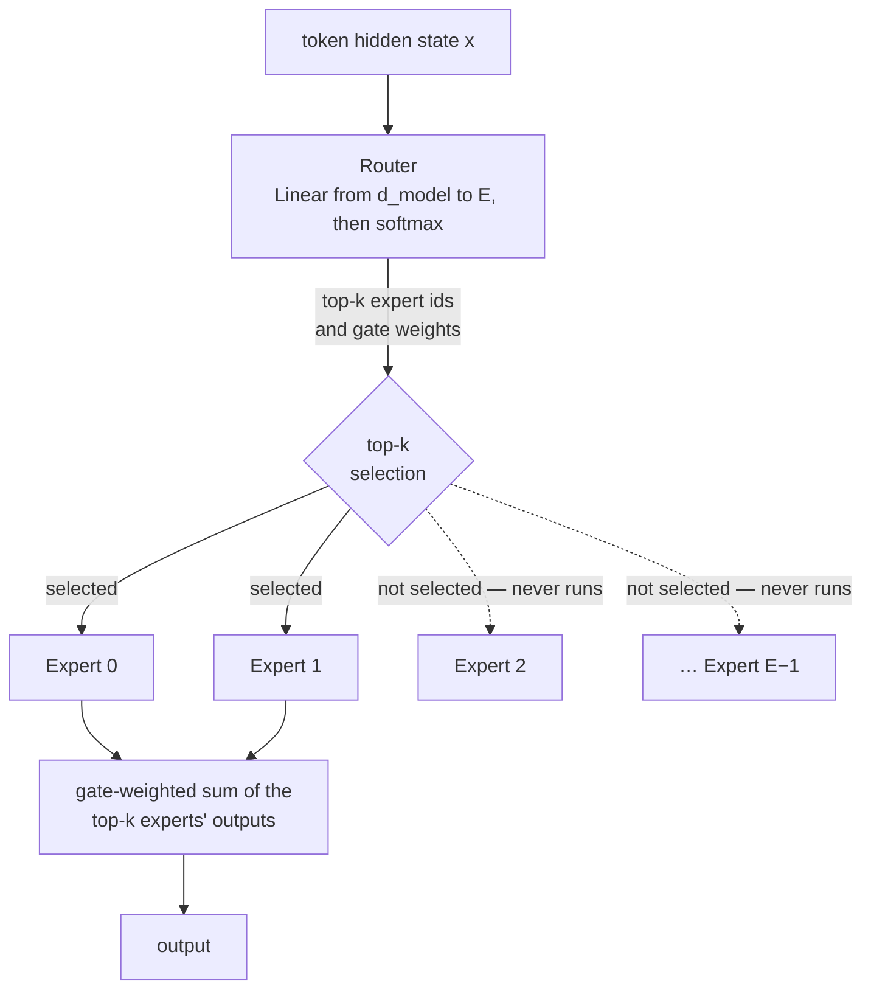

# Mixture of Experts

**Phase:** [LLM Architectures and Types](../README.md) · **Topic folder:** `04-Mixture-of-Experts`

## কেন এটি গুরুত্বপূর্ণ

Lessons 1-3 আচ্ছাদন করেছে *কীভাবে* attention এবং generation সংগঠিত হয় (decoder-only বনাম encoder-only বনাম encoder-decoder)। Mixture of Experts (MoE) সম্পূর্ণ ভিন্ন একটি orthogonal ধারণা: এটি পরিবর্তন করে *যেকোনো প্রদত্ত token-এর জন্য মডেলের কতটি parameter সত্যিই ব্যবহৃত হয়*। কিছু আজকের সবচেয়ে বড় মডেল (Mixtral, DeepSeek-V2/V3, কিছু গণমাধ্যম প্রতিবেদন অনুযায়ী GPT-4) কীভাবে বিশাল মোট parameter সংখ্যা রাখতে পারে অথচ প্রতি token-এর প্রকৃত compute খরচ একই মোট সাইজের একটি dense মডেলের চেয়ে অনেক কম রাখে — এর পেছনের মূল কৌশল এটি।

## Architecture এক নজরে



এটি একটি decoder block ([Lesson 1](../01-Decoder-Only-Models-GPT-Family/README.md#architecture-at-a-glance)) বা encoder block ([Lesson 2](../02-Encoder-Only-Models-BERT-Family/README.md#architecture-at-a-glance))-এর ভিতরে **শুধুমাত্র FFN sublayer-টিকেই** প্রতিস্থাপন করে — attention, residuals এবং LayerNorm সব অপরিবর্তিত থাকে। এটি variation-এর একটি orthogonal অক্ষ, পঞ্চম architecture ফ্যামিলি নয়: একটি decoder-only মডেল *বা* একটি encoder-decoder মডেল — প্রতিটিই dense FFN বা MoE FFN দিয়ে তৈরি করা যায়। `example.py` এই router + experts layer-টিকে বাস্তব, trainable PyTorch কোড হিসেবে তৈরি করে।

## এই পাঠে যা শেখা হবে

- মূল ধারণা: মোট parameter-কে compute-per-token থেকে আলাদা করা
- Gating/router network এবং top-k routing
- FFN sublayer-কে একাধিক expert FFN দিয়ে প্রতিস্থাপন
- Load-balancing সমস্যা, এবং যে auxiliary loss এটি সমাধান করে
- Trade-off: memory বনাম compute, এবং distributed-training ওভারহেড

## 1. মূল ধারণা

[Phase 02 Lesson 5 §5](../../Phase-02-Transformer-Architecture-Deep-Dive/05-LayerNorm-Residuals-FFN/README.md#5-the-position-wise-feed-forward-network-ffn) থেকে মনে করুন: feed-forward sublayer প্রতিটি token-কে স্বাধীনভাবে প্রসেস করে, এবং সাধারণত একটি dense Transformer layer-এর প্রায় দুই-তৃতীয়াংশ parameter ধারণ করে। একটি dense মডেলে, **প্রতিটি একক token-এর জন্য প্রতিটি একক parameter ব্যবহৃত হয়** — FFN-এর সাইজ দ্বিগুণ করলে তার মধ্য দিয়ে যাওয়া প্রতিটি token-এর compute খরচও দ্বিগুণ হয়।

MoE সেই জোড়াটি ভেঙে দেয়: একটি FFN-এর বদলে, একটি layer `E` টি পৃথক "expert" FFN ধারণ করে (ধরুন, `E=8`), এবং একটি হালকা **router** *প্রতি token-এ* ঠিক করে কোন ছোট experts-এর উপসেট (সাধারণত শীর্ষ 1 বা 2) প্রকৃতপক্ষে সেই token-টি প্রসেস করবে। বাকি `E-2` experts-এর weights সেই token-এর জন্য একেবারেই স্পর্শ করা হয় না। মোট parameter সংখ্যা `E`-এর সাথে স্কেল করে (প্রতিটি expert *সংরক্ষণ* করতেই হয়), কিন্তু প্রতি-token compute প্রায় ধ্রুবক থাকে, `E` যত বড়ই হোক না কেন — একেই বলে **sparse activation**।

## 2. Router এবং top-k routing

Router হলো শুধু একটি ছোট linear layer ও softmax, প্রতিটি token-এর hidden vector-কে `E` টি experts-এর উপর একটি probability distribution-এ ম্যাপ করে:

```
router_logits = x @ W_router                 # (E,) -- one score per expert
router_probs  = softmax(router_logits)        # a distribution over experts
top_k_experts, top_k_weights = top_k(router_probs, k)   # e.g. k=2
output = Σ_{i in top_k_experts} top_k_weights[i] * Expert_i(x)
```

সেই token-এর জন্য শুধুমাত্র বাছাই করা top-`k` experts-এর FFN-গুলোই মূল্যায়ন করা হয় — বাকিরা সেই token-এর forward (বা backward) pass-এ কিছুই অবদান রাখে না, আর compute সাশ্রয় ঠিক এখান থেকেই আসে।

## 3. Load-balancing সমস্যা

অবস্থা অনুযায়ী রেখে দিলে, শুধু task loss কমাতে প্রশিক্ষিত একটি router **collapse** করতে থাকে: কয়েকটি expert সামান্য ভালো প্রাথমিক routing score পায়, বেশি token পায়, বেশি gradient update পায়, task-এ আরও ভালো হয় এবং আরও বেশি token পায় — একটি rich-get-richer feedback loop, যা বেশিরভাগ expert-কে undertrained এবং কার্যত নষ্ট অবস্থায় ফেলে। এটি অনেক experts থাকার পুরো উদ্দেশ্যই ব্যর্থ করে।

মানক সমাধান হলো একটি **auxiliary load-balancing loss**, যা সাধারণ task loss-এর উপরে যোগ করা হয় এবং অসম routing-কে স্পষ্টভাবে penalize করে — উদাহরণস্বরূপ, প্রতিটি expert-এর কাছে routed হওয়া token-এর ভগ্নাংশকে `1/E`-এর কাছাকাছি রাখতে উৎসাহ দেয়। `example.py` সরাসরি routing imbalance পরিমাপ করে এবং এই incentiv যোগ করার প্রভাব দেখায়।

## 4. Trade-off

- **Memory**: প্রতিটি expert-এর weights সংরক্ষণ করতে হয় (এবং সাধারণত দ্রুত accelerator memory-তে রাখতে হয়), তাই মোট memory footprint মোট parameters-এর সাথে স্কেল করে — সেই সাইজের একটি dense মডেলের মতোই; MoE-এর সাশ্রয় *compute*-এ, memory-তে নয়।
- **Distributed training/inference ওভারহেড**: যেহেতু একটি batch-এর ভিন্ন token ভিন্ন expert-এ routed হয়, এবং experts প্রায়ই ভিন্ন accelerator-এ ছড়ানো থাকে, তাই token-গুলোকে ("all-to-all" communication দিয়ে) shuffle করতে হয় যাতে প্রতিটি token সেই device-এ পৌঁছায় যেখানে তার নিযুক্ত expert থাকে — এটি একটি প্রকৃত systems-engineering খরচ, যা dense মডেলগুলোর নেই।
- **Training stability**: routing সিদ্ধান্তগুলো discrete (top-k মসৃণভাবে differentiable নয়), যা ঐতিহাসিকভাবে MoE training-কে ঝামেলাপূর্ণ করেছিল — load-balancing loss এবং সতর্ক initialization দুটোই আংশিকভাবে এই লক্ষ্যেই।

## Video Script Outline

1. Motivation — "মডেলের অনেক বেশি parameter থাকলে কি হবে, অথচ forward pass-এর খরচ তেমন বাড়বে না?"
2. Router + top-k selection, Phase 02-এর একক FFN-কে প্রতিস্থাপন করা
3. Rich-get-richer collapse সমস্যা, কংক্রিটভাবে
4. Load-balancing auxiliary loss
5. Memory বনাম compute trade-off, এবং distributed "all-to-all" খরচ
6. `example.py`-এর ওয়াকথ্রু — একটি কার্যকরী top-k MoE layer, সমতুল্য dense FFN-এর সাথে compute-cost তুলনা, এবং load-balancing প্রভাব সরাসরি পরিমাপ
7. Recap + [Lesson 7-এর জরিপের](../07-Survey-of-Popular-Open-LLMs/README.md) দিকে pointer, যেখানে MoE Mixtral-এর মতো বাস্তব ডিপ্লয়ড মডেলে দেখা যায়

## Further Reading

- Shazeer et al. (2017), *Outrageously Large Neural Networks: The Sparsely-Gated Mixture-of-Experts Layer* (deep learning-এর জন্য আধুনিক MoE-এর উৎস)
- Fedus, Zoph, Shazeer (2021), *Switch Transformers: Scaling to Trillion Parameter Models with Simple and Efficient Sparsity*
- Jiang et al. (2024), *Mixtral of Experts* (একটি ব্যাপক ব্যবহৃত open MoE মডেল, [Lesson 7](../07-Survey-of-Popular-Open-LLMs/README.md)-এ পুনরালোচিত)