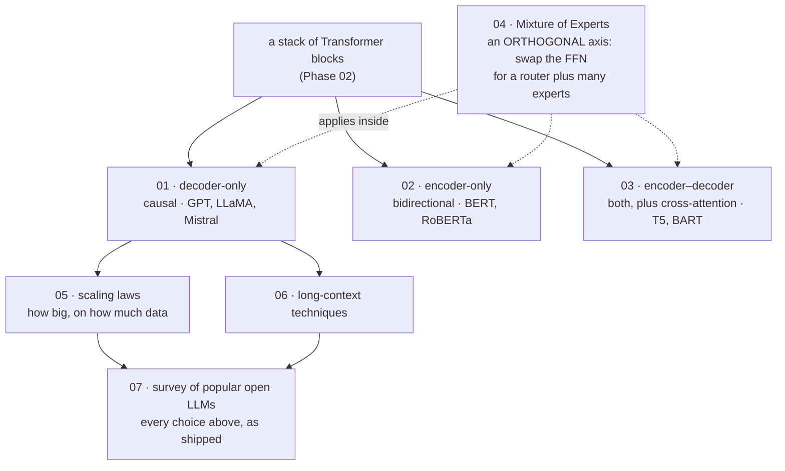

# LLM Architectures and Types

[← Back to curriculum index](../README.md)

Transformer-ভিত্তিক model-গুলোর প্রধান পরিবারগুলো এবং যে design choice-গুলো তাদের সংজ্ঞায়িত করে, তার জরিপ।

## এই phase-এর পথ

Phase 02-এর block-গুলো সাজানোর তিনটি উপায়, আর সেই design axis-গুলো, যা একটি architecture-কে *model family*-তে পরিণত করে। Mixture of Experts হলো গুরুত্বপূর্ণ non-obvious ব্যাপার: এটি চতুর্থ পরিবার নয়, বরং একটি modification, যা তিনটি পরিবারের যেকোনোটির ভেতরে প্রযোজ্য।

## এই phase-এর topic-গুলো

| # | Topic |
|---|-------|
| 01 | [Decoder-Only Models: the GPT Family](01-Decoder-Only-Models-GPT-Family/README.md) |
| 02 | [Encoder-Only Models: the BERT Family](02-Encoder-Only-Models-BERT-Family/README.md) |
| 03 | [Encoder-Decoder Models: T5 and BART](03-Encoder-Decoder-Models-T5-BART/README.md) |
| 04 | [Mixture of Experts](04-Mixture-of-Experts/README.md) |
| 05 | [Scaling Laws](05-Scaling-Laws/README.md) |
| 06 | [Long-Context Techniques](06-Long-Context-Techniques/README.md) |
| 07 | [Survey of Popular Open LLMs](07-Survey-of-Popular-Open-LLMs/README.md) |

## তিনটি architecture পরিবার, পাশাপাশি

Lesson 1–3 encoder ও decoder stack সাজানোর তিনটি উপায় নিয়ে; Lesson 4 (MoE) একটি orthogonal axis, যা তিনটির *ভেতরে* প্রযোজ্য। প্রতিটি lesson-এর README-তে তার block-এর পূর্ণ diagram আছে "Architecture at a glance" শিরোনামে — এই টেবিলটি সেই দ্রুত তুলনা:

| | Decoder-only ([Lesson 1](01-Decoder-Only-Models-GPT-Family/README.md#architecture-at-a-glance)) | Encoder-only ([Lesson 2](02-Encoder-Only-Models-BERT-Family/README.md#architecture-at-a-glance)) | Encoder-decoder ([Lesson 3](03-Encoder-Decoder-Models-T5-BART/README.md#architecture-at-a-glance)) |
|---|---|---|---|
| Self-attention | Causal (শুধু left-to-right) | Bidirectional (প্রতিটি position অন্য প্রতিটিকে দেখে) | Encoder-এ bidirectional, decoder-এ causal |
| Cross-attention | None | None | হ্যাঁ — decoder queries, encoder keys/values |
| Pretraining objective | Next-token prediction | Masked Language Modeling | Span corruption (T5) / denoising (BART) |
| Open-ended text generate করতে পারে? | হ্যাঁ | না | হ্যাঁ, encoded input-এর শর্তে |
| সর্বোচ্চ উপযোগী | Open-ended generation, chat, one-model-for-everything | Classification, embeddings, extractive QA | Translation, summarization — পরিষ্কার input→output split-এর কাজ |
| উদাহরণ | GPT-1/2/3, LLaMA, Mistral | BERT, RoBERTa | T5, BART |

Lesson 1–3-এর প্রতিটির `example.py` এখন তার architecture-এর প্রকৃত model class PyTorch-এ from scratch তৈরি ও train করে — শুধু বর্ণনা নয়; code ও training/generation run-এর জন্য প্রতিটি lesson দেখুন।

## model compression কোথায় মানায়

একটি trained model-কে ছোট করা (distillation, pruning, quantization) একটি *deployment* বিষয়, চতুর্থ architecture পরিবার নয় — তাই এটি পরে আচ্ছাদিত হয়েছে **[Phase 09 Lesson 5: Model Distillation and Pruning](../Phase-09-Deployment-and-Inference-Optimization/05-Model-Distillation-and-Pruning/README.md)**-এ — এটিই DistilBERT (যেটির উল্লেখ [Lesson 2](02-Encoder-Only-Models-BERT-Family/README.md#6-roberta-and-todays-encoder-only-landscape)-এ আছে) এবং DistilGPT2-এর পেছনের mechanism। এটি এই পৃষ্ঠার প্রতিটি architecture-তে প্রযোজ্য: আপনি একটি decoder-only, encoder-only, বা encoder-decoder teacher-কে একই পরিবারের ছোট student-এ distill করতে পারেন।