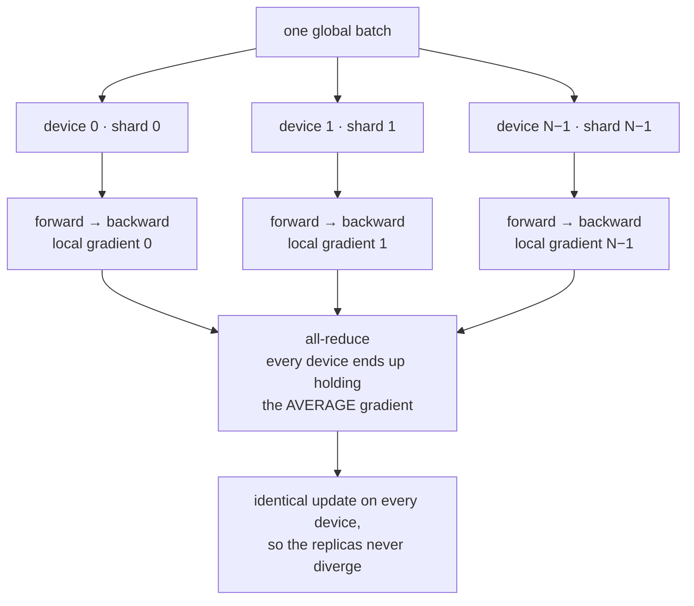
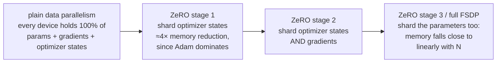

# Distributed Training Basics

**Phase:** [Pretraining LLMs](../README.md) · **Topic folder:** `03-Distributed-Training-Basics`

## কেন এটি গুরুত্বপূর্ণ

[Lesson 2](../02-Pretraining-Objectives/README.md)-এ স্থির হয়েছে *কী* signal-এ প্রশিক্ষণ দিতে হবে। এই পাঠ অনেক বেশি রূঢ় একটি সমস্যার মুখোমুখি হয়: [Phase 03 Lesson 5-এর scaling laws](../../Phase-03-LLM-Architectures-and-Types/05-Scaling-Laws/README.md) প্রতিষ্ঠিত করেছে যে প্রতিযোগিতামূলক LLM-এর জন্য বিলিয়ন-বিলিয়ন parameter দরকার, trillions token-এ প্রশিক্ষিত — আর তা *মেমরি* কিংবা *ওয়াল-ক্লক কম্পিউট*, কোনোটিই একটিমাত্র accelerator-এ খাপ খায় না। প্রতিটি বাস্তব pretraining run — এই পুরো কোর্স যার দিকে এগোচ্ছে সেই frontier model-গুলো-ও — শত শত বা হাজার হাজার GPU/TPU-তে একসাথে ঘটে। এই পাঠ সেই কাজ আসলে কীভাবে হয় তার মানসিক মডেল গড়ে তোলে, যাতে [Phase 02 Lesson 6](../../Phase-02-Transformer-Architecture-Deep-Dive/06-Mini-Transformer-From-Scratch/README.md)-এর training loop — যা আপনি এখন একক CPU core-এ কয়েকবার প্রশিক্ষণ দিয়েছেন — আর খেলনা না থেকে বাস্তব জিনিসের মতো দেখাতে শুরু করে, শুধু "অনেক মেশিন" অংশটি বাদে (যা `example.py` সিমুলেট করে, সত্যিই দাবি করে না)।

## এই পাঠে কী শেখানো হয়

- কেন একটি একক accelerator কোনো বাস্তব LLM-এর training step ধরে রাখতে বা গণনা করতে পারে না
- Data Parallelism (DP): model রেপ্লিকেট করুন, batch ভাগ করুন, gradient গড় করুন
- Tensor/Model Parallelism: স্বতন্ত্র weight matrix-গুলোকে device-গুলোর মধ্যে ভাগ করুন
- Pipeline Parallelism: layer-গুলোকে device-গুলোর মধ্যে ভাগ করুন, আর তাদের মধ্য দিয়ে microbatch pipeline চালান
- ZeRO/FSDP: optimizer state, gradient ও parameter রেপ্লিকেট না করে shard করুন
- এই কৌশলগুলো বাস্তব বড়-স্কেল training-এ কীভাবে মিলিত হয়

## 1. কেন single-device training স্কেল হয় না

মডেল আকার বাড়ার সঙ্গে সঙ্গে দুটি স্বাধীন সীমা (wall) আঘাত করে:

**মেমরি।** Training-কে একসাথে, on-device, ধরে রাখতে হয়:
- **Parameters** — weight-গুলো নিজেরাই
- **Gradients** — প্রতি parameter-এ একটি মান, backprop-এ উৎপন্ন
- **Optimizer states** — Adam/AdamW ([Lesson 4](../04-Mixed-Precision-and-Optimization/README.md#3-adamw-decoupled-weight-decay)) প্রতি parameter-এ চলমান momentum *ও* variance estimate রাখে — parameter-সংখ্যার দ্বিগুণ, আরও একবার
- **Activations** — forward pass-এর প্রতিটি মধ্যবর্তী layer-এর output, backprop-এর প্রয়োজন বলে জমানো

`N` parameter-এর একটি মডেল mixed precision-এ Adam দিয়ে প্রশিক্ষিত হলে, শুধু params+gradients+optimizer-states-ই প্রায় `16N` বাইট হয় (`example.py`-তে বাস্তব সংখ্যাসহ ঠিক হিসাব করা হয়েছে — 2 bytes/param fp16 weight + 2 bytes/param fp16 gradient + optimizer-এ fp32 master weight, momentum ও variance-এর জন্য 4+4+4 bytes/param)। 7-বিলিয়ন-parameter মডেলের জন্য একা এরই দরকার **~112GB** — কোনো activation জমানোর আগেই; যা ইতিমধ্যে একটি হাই-এন্ড একক accelerator-এর (সাধারণত 40-80GB) ধারণক্ষমতা ছাড়িয়ে যায়।

**Compute (ওয়াল ক্লক)।** মেমরি বাধা না হলেও, এক device-এ trillions token-এ প্রশিক্ষিত বড় মডেল কেবলই অনেক বেশি সময় নেবে — frontier-স্কেল রানের জন্য বছর। *সমান্তরালে* চলা অনেক device-এর মধ্যে *কাজ* ভাগ করাই একমাত্র উপায় ওয়াল-ক্লক সময়কে কার্যকর মাত্রায় নামিয়ে আনার।

চারটি পরিপূরক কৌশল এই দুটি সীমাকে ভিন্নভাবে আক্রমণ করে।

## 2. Data Parallelism (DP): সহজতম রূপ

`N`টি device-এর প্রতিটিতে model-এর একটি সম্পূর্ণ কপি রাখুন, প্রতিটি training batch-কে `N`টি সমান shard-এ ভাগ করুন (প্রতি device-এ একটি), এবং প্রতিটি device তার নিজের shard-এ নিজের forward + backward pass **স্বাধীনভাবে ও সমান্তরালে** চালাক:



প্রতিটি device-এর এখন *ভিন্ন* gradient থাকে (data-এর ভিন্ন অংশ থেকে গণনা করা), কিন্তু synchronized থাকতে হলে সব device-কে *একই* update প্রয়োগ করতে হয়। সমাধান হলো **all-reduce**: প্রতিটি device তার local gradient-টি অন্য প্রতিটি device-এ পাঠায় এবং সবাই `N`টি shard জুড়ে *গড়* gradient ধারণ করে — এক (অসীম-বড়) device-এ পুরো batch-এর gradient গণনা করার সাথে গাণিতিকভাবে অভিন্ন, কারণ loss হলো example-গুলোর গড় আর shard-গড়গুলোর গড় (সমান shard আকারে) পুরোটার গড়। `example.py` এই সমতা সংখ্যাগতভাবে যাচাই করে। DP compute-কে স্কেল করে (`N` device সমান্তরালে কাজ করে) কিন্তু মেমরির জন্য *কিছুই* করে না — প্রতিটি device-কে এখনও model, gradient ও optimizer state-এর সম্পূর্ণ কপি রাখতে হয়।

## 3. Tensor / Model Parallelism: স্বতন্ত্র layer ভাগ করা

যখন একটি একক weight matrix এক device-এর মেমরিতে খাপ খায় না (অথবা আপনি চান একটি layer-এর matmul ভাগ করে দ্রুত চলুক), **tensor parallelism** matrix-টিকেই device-গুলোর মধ্যে ভাগ করে। linear layer `Y = XW`-এর জন্য, `W`-কে 2 device-এ কলাম-ভিত্তিকভাবে ভাগ করুন `W = [W_1 | W_2]`:

```
device 0 computes: Y_1 = X @ W_1
device 1 computes: Y_2 = X @ W_2
Y = concat(Y_1, Y_2)     -- requires communication to assemble
```

প্রতিটি device এখন শুধু ওই layer-এর weight-এর *ভগ্নাংশ*-ই কখনো জমা রাখে ও গণনা করে — এটিই সেসব মডেল train করা সম্ভব করে, যাদের স্বতন্ত্র layer এক device-এ খাপ খায় না (Megatron-LM-এর বিশাল Transformer FFN ও attention projection matrix-এর পদ্ধতি)। খরচ হলো দুটি device-কে যোগাযোগ করতে হয় (একটি all-gather বা অনুরূপ) পরের layer ব্যবহার করার আগে সম্পূর্ণ ফলটি পুনরায় একত্র করার জন্য — data parallelism-এর প্রতি-step once-per-step all-reduce-এর চেয়ে অনেক বেশি যোগাযোগ-ভারী, প্রতি layer-এ।

## 4. Pipeline Parallelism: device-গুলোর মধ্যে layer ভাগ করা

*Layer-এর ভেতরে* ভাগ না করে, pipeline parallelism মডেলটিকে *layer অনুযায়ী* ভাগ করে: device 0-তে layer 1-8, device 1-তে layer 9-16, এভাবে চলতে থাকে, আর data নেটওয়ার্কের ভেতর দিয়ে যাওয়ার সময় activation শারীরিকভাবে device থেকে device-এ প্রবাহিত হয় — অ্যাসেম্বলি লাইনের মতো। নিষ্পাপভাবে, এটি বেশিরভাগ device-কে বেশিরভাগ সময় অলস রাখে (device 1-এর কিছু করার থাকে না, যতক্ষণ না device 0 *বর্তমান* batch-এর layer 1-8 শেষ করে)। প্রমিত সমাধান: প্রতিটি batch-কে কয়েকটি **microbatch**-এ ভাগ করে stage-গুলোর মধ্য দিয়ে pipeline করা, যাতে device 1 যখন microbatch 1 প্রক্রিয়া করছে, device 0 ইতিমধ্যে microbatch 2 শুরু করে — প্রতিটি stage একইসাথে ব্যস্ত থাকে, খরচ হিসেবে প্রতিটি batch-এর একদম শুরুতে ও শেষে কিছু অনিবার্য "bubble" (অলস) সময় থাকে।

## 5. ZeRO / FSDP: shard করুন, রেপ্লিকেট নয়

Data parallelism-এর মূল অদক্ষতা হলো প্রতিটি device parameter, gradient ও optimizer state-এর একটি **সম্পূর্ণ, অপ্রয়োজনীয়** কপি জমা রাখে। **ZeRO** (Zero Redundancy Optimizer, Rajbhandari et al., 2020) এবং PyTorch-এর **FSDP** (Fully Sharded Data Parallel) এটা সরাসরি ঠিক করে: `N`টি data-parallel device-এর প্রতিটিতে 100% optimizer states/gradients/parameters ধারণ করার বদলে, প্রতিটি device শুধু একটি `1/N` **shard** ধারণ করে, এবং সম্পূর্ণ মানগুলো (যোগাযোগের মাধ্যমে) চাহিদামাফিক শুধু তখনই পুনর্গঠিত হয়, যখন নির্দিষ্ট layer-এর forward/backward গণনার জন্য আসলেই দরকার, তারপর আবার বাদ দেওয়া হয়:



এটি DP-এর compute প্যাটার্ন (প্রতিটি device এখনও নিজের batch shard প্রক্রিয়া করে) সাথে tensor-parallelism-ধাঁচের মেমরি সাশ্রয় — আপনি *দুটোই* পান: data parallelism-এর সমান্তরাল-compute সুবিধা আর সেই per-device মেমরি হ্রাস, যা আগে model/tensor parallelism দাবি করত। `example.py` হিসাব করে, `N` বাড়ার সঙ্গে per-device মেমরি ঠিক কীভাবে কমে, প্রতিটি ZeRO stage-এর জন্য — ZeRO paper-এর প্রমিত `16Ψ`-ধাঁচের byte-হিসাব সূত্র ব্যবহার করে।

## 6. বাস্তব প্রশিক্ষণ কীভাবে এই সব মিলিয়ে চলে

Frontier LLM pretraining run-গুলো প্রায় কখনোই এই কৌশলগুলোর মধ্যে শুধু একটি ব্যবহার করে না — তারা সেগুলোকে রচনা (compose) করে: tensor parallelism *একটি* ফিজিক্যাল multi-GPU server-এর *ভেতরে* (যেখানে interconnect সবচেয়ে দ্রুত), pipeline parallelism *server-এর গ্রুপগুলোর* মধ্যে, আর ZeRO/FSDP-ধাঁচের sharded data parallelism সবচেয়ে বাইরের, সবচেয়ে বড় replica-গ্রুপ জুড়ে — এই পরিকল্পনাকে প্রায়ই **3D parallelism** বলা হয়। সঠিক সমন্বয় ও প্রতিটির মাত্রা বেছে নেওয়া নিজেই একটি উল্লেখযোগ্য systems-engineering সমস্যা, প্রতি cluster ও প্রতি model আকারে টিউন করা।

## Video Script Outline

1. Motivation — "GPT-স্কেল মডেল train করার জন্য কেন GPU নয়, একটি data-center লাগে?"
2. দুটি সীমা: মেমরি (params+grads+optimizer+activations) এবং wall-clock compute
3. Data parallelism ও all-reduce, একটি ছোট সিমুলেটেড উদাহরণ দিয়ে চিত্রিত
4. Tensor parallelism: device-গুলোর মধ্যে একটি matrix ভাগ করা
5. Pipeline parallelism: layer ভাগ করা, আর idle bubble এড়ানোর microbatch কৌশল
6. ZeRO/FSDP: রেপ্লিকেট না করে sharding, এবং কেন এটি সবচেয়ে বড় ব্যবহারিক মেমরি-লাভ
7. `example.py`-এর walkthrough — সিমুলেটেড multi-device gradient averaging, এবং ZeRO stage-গুলোর মধ্যে একটি memory calculator
8. Recap: বাস্তব-জগতের সমন্বয় হিসেবে চারটির মিলন — 3D parallelism + Lesson 4-এর প্রিভিউ (mixed precision, যা এই পাঠের সবকিছুর সঙ্গে গুণিত হয়)

## Further Reading

- Rajbhandari, Rasley, Ruwase, He (2020), *ZeRO: Memory Optimizations Toward Training Trillion Parameter Models*
- Shoeybi et al. (2019), *Megatron-LM: Training Multi-Billion Parameter Language Models Using Model Parallelism* (tensor parallelism)
- Huang et al. (2019), *GPipe: Efficient Training of Giant Neural Networks using Pipeline Parallelism*
- Narayanan et al. (2021), *Efficient Large-Scale Language Model Training on GPU Clusters Using Megatron-LM* (3D parallelism in practice)
- PyTorch documentation, *Fully Sharded Data Parallel (FSDP)*