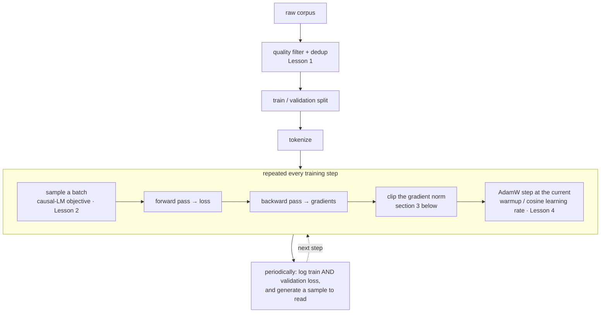

# Pretraining a Small LLM From Scratch

**Phase:** [Pretraining LLMs](../README.md) · **Topic folder:** `05-Pretraining-a-Small-LLM-From-Scratch`

## কেন এটি গুরুত্বপূর্ণ

এই পাঠটি pretraining phase-এর capstone — এবং এটি [Phase 02 Lesson 6-এর mini-GPT](../../Phase-02-Transformer-Architecture-Deep-Dive/06-Mini-Transformer-From-Scratch/README.md)-এর পুনরাবৃত্তি *নয়*। সেই আগের পাঠ প্রমাণ করেছিল যে *architecture*-টি আদৌ train হয়। এই পাঠ প্রমাণ করে *recipe*-টি — এই phase জুড়ে তৈরি প্রতিটি অংশ, একটি run-এ মিলিত: একটি data pipeline ধাপ ([Lesson 1](../01-Pretraining-Data-Pipeline/README.md)), causal-LM objective ([Lesson 2](../02-Pretraining-Objectives/README.md)), এবং AdamW with gradient clipping ও warmup+cosine schedule ([Lesson 4](../04-Mixed-Precision-and-Optimization/README.md)) — সাথে দুটি সংযোজন, যা প্রতিটি বাস্তব pretraining run-এ থাকে অথচ Phase 02-এর demo-তে ছিল না: একটি সত্যিকারের আড়ালে রাখা (held-out) **validation set** (যাতে memorization ও generalization আলাদা করা যায়) এবং প্রশিক্ষণ জুড়ে **checkpointed generation samples** (যাতে "মডেল শিখছে" ঘটনাটি আপনাকে দেখতে হয়, শুধু loss সংখ্যা নামা নয়)।

## এই পাঠে কী শেখানো হয়

- প্রশিক্ষণ শুরু হওয়ার আগেই একটি ক্ষুদ্র data-pipeline ধাপ তৈরি (quality filter + exact dedup)
- আড়ালে রাখা validation data ভাগ করা এবং train বনাম validation loss আলাদাভাবে ট্র্যাক করা
- Gradient clipping: একটি নতুন, আগে-অপ্রবর্তিত stability কৌশল
- AdamW + warmup/cosine schedule + gradient clipping একটি training loop-এ যুক্ত করা
- প্রশিক্ষণ জুড়ে বেশ কয়েকটি checkpoint-এ generation-এর মান উন্নত হতে দেখা
- একটি সৎ স্কেল তুলনা: এখানে ঠিক কী toy, আর একটি বাস্তব pretraining run কী যোগ করে

## 1. Pipeline ধাপ: প্রশিক্ষণের আগে filter ও deduplicate

[Lesson 1](../01-Pretraining-Data-Pipeline/README.md#3-quality-filtering) মনে করুন — খারাপ data শুধু compute নষ্ট করে না, সক্রিয়ভাবে খারাপ অভ্যাস শেখায়, আর duplicate data একই string পুনরায় মুখস্থ করতে capacity নষ্ট করে। এই পাঠের কাঁচা corpus ইচ্ছা করেই কয়েকটি ঢোকানো সমস্যা-সহ তৈরি (কিছু junk/low-quality document, কিছু exact duplicate), যাতে `example.py` §1 একটি বাস্তব (যদিও সরলীকৃত) quality filter ও exact-deduplication pass চালাতে পারে, এবং দেখাতে পারে যে প্রশিক্ষণের একটি মাত্র step চালানোর আগেই ফলিত corpus কাঁচা input-এর চেয়ে ছোট ও পরিষ্কার।

## 2. Train/validation split: memorization ও generalization আলাদা করা

এই কোর্সের প্রতিটি আগের from-scratch training demo (Phase 02 Lesson 6-এর mini-GPT-সহ) একই corpus থেকে train ও generate করেছে, ফলে নামতে থাকা loss-এর অর্থ — মডেল সাধারণ কাঠামো শিখছে নাকি নির্দিষ্ট training text মুখস্থ করছে — তা বলা অসম্ভব ছিল। এই পাঠ **validation set**-কে আড়ালে রাখে — যে text-এ মডেল কখনো train করে না — এবং পুরো প্রশিক্ষণে দুটি loss-ই ট্র্যাক করে। ছোট হতে থাকা training loss আর সমতল (বা বাড়তে থাকা) validation loss-এর মাঝে প্রশস্ত হতে থাকা ফাঁকটিই হলো **overfitting** — শব্দ হিসেবে নয়, মেট্রিকেই দেখা যায় — আর `example.py` দুটি সংখ্যাই পাশাপাশি রিপোর্ট করে।

## 3. Gradient clipping: একটি নতুন stability কৌশল

একটি বাস্তব pretraining recipe-র একটি অংশ, যা এখনও অপ্রবর্তিত: **gradient clipping**। মাঝে মাঝে একটি একক batch অস্বাভাবিকভাবে বড় gradient তৈরি করে (একটি token sequence, যার ব্যাপারে মডেল এই মুহূর্তে খুব ভুল) — একে অযত্নে ছেড়ে দিলে এটি ধ্বংসাত্মকভাবে বড় একটি optimizer step ট্রিগার করতে পারে, যা প্রশিক্ষণকে পথচ্যুত করে — বিশেষত [Lesson 4-এর warmup phase-এ](../04-Mixed-Precision-and-Optimization/README.md#4-learning-rate-schedules-warmup-then-decay), যখন মডেল সবচেয়ে কম স্থিতিশীল। Gradient clipping পুরো gradient vector-টিকে (একসাথে সব parameter জুড়ে) পুনরায়-স্কেল করে, যদি এর সামগ্রিক norm `max_norm` threshold অতিক্রম করে — দিক সংরক্ষণ করে কিন্তু magnitude সীমিত করে:

```
if ||g|| > max_norm:
    g = g * (max_norm / ||g||)
```

এটি যেকোনো training loop-এ এক-লাইনের সংযোজন (PyTorch-এ `torch.nn.utils.clip_grad_norm_`) এবং মূলত প্রতিটি বাস্তব LLM pretraining run-এ প্রমিত।

## 4. সম্পূর্ণ recipe, একত্রিত



এই প্রতিটি লাইন এই phase-এর আগের কোনো পাঠে ফিরে যায় — gradient clipping ছাড়া, যা এখানেই প্রথমবার চালু করা হয়েছে, কারণ এই কোর্সের এটিই প্রথম জায়গা যেখানে একটি পূর্ণ training run এত দীর্ঘ/অস্থিতিশীল যে এটি প্রয়োজনীয়।

## 5. এখানে কী toy, আর একটি বাস্তব run কী যোগ করে

`example.py` একটি CPU-তে প্রায় এক-দুই মিনিট train করে, একটি হাতে-লেখা কয়েক হাজার character-এর corpus-এ, কয়েক লাখ parameter-এর একটি মডেল দিয়ে। একটি বাস্তব pretraining run এই সংখ্যাগুলোর *প্রতিটি* কে বহু order of magnitude-এ স্কেল করার মাধ্যমে ভিন্ন হয় — হাজার হাজার accelerator জুড়ে [distributed training](../03-Distributed-Training-Basics/README.md), [mixed-precision](../04-Mixed-Precision-and-Optimization/README.md#1-fp32-vs-fp16-vs-bf16) arithmetic, terabytes (কিলোবাইট নয়) প্রক্রিয়াকারী একটি [data pipeline](../01-Pretraining-Data-Pipeline/README.md), এবং [Phase 03-এর scaling laws](../../Phase-03-LLM-Architectures-and-Types/05-Scaling-Laws/README.md) অনুযায়ী বেছে নেওয়া একটি token budget — "দুই মিনিটে যা শেষ হয়" তা নয়। যা **বদলায় না:** causal-LM loss, AdamW+warmup+cosine+clipping recipe, আর train/validation-split অনুশীলন — এই exact lesson-টিই প্রতিটি স্কেলে ব্যবহৃত recipe, এই কোর্সের জরিপের সবচেয়ে বড় মডেল পর্যন্ত ([Phase 03 Lesson 7](../../Phase-03-LLM-Architectures-and-Types/07-Survey-of-Popular-Open-LLMs/README.md))।

এই পাঠের সঙ্গে pretraining phase সম্পূর্ণ — [Phase 05](../../Phase-05-Finetuning-LLMs/README.md) ঠিক সেখান থেকে শুরু করে, যেখানে এমন একটি pretrained base model শেষ হয়: instruction অনুসরণ করতে adapt করা, শুধু text চালিয়ে যাওয়া নয়।

## Video Script Outline

1. Motivation — "Phase 02-এর mini-GPT-এর পুনরাবৃত্তি নয়: শুধু architecture নয়, সম্পূর্ণ recipe"
2. কাঁচা corpus-এর ঢোকানো সমস্যাগুলো নিয়ে হাঁটা, তারপর লাইভ filter+dedup pass
3. Train/validation split, এবং কেন দুটি loss curve-ই দেখার বিষয়
4. Gradient clipping: একমাত্র নতুন উপাদান, এবং কেন এটি দরকার তার অন্তর্দৃষ্টি
5. `example.py`-এর walkthrough — একত্রিত training loop, train চলাকালীন টিক টিক করা warmup/cosine LR schedule
6. Checkpoint জুড়ে generation sample-গুলো উন্নত হতে দেখা, পাশাপাশি
7. চূড়ান্ত train-বনাম-validation loss ফাঁকটি একসাথে পড়া
8. পুরো pretraining phase-এর ধাপ recap, এবং Phase 05-এর fine-tuning-এ হ্যান্ডঅফ

## Further Reading

- Pascanu, Mikolov, Bengio (2013), *On the difficulty of training Recurrent Neural Networks* (মূল gradient-clipping paper)
- Brown et al. (2020), *Language Models are Few-Shot Learners* (GPT-3-এর Appendix B/C স্কেলে ঠিক এই recipe-র একটি বাস্তব সংস্করণ নথিভুক্ত করে)
- Karpathy, *nanoGPT* (github.com/karpathy/nanoGPT) — `example.py`-তে নির্মিত training loop-এর একটি বাস্তব, চালানযোগ্য, বৃহত্তর-স্কেল সংস্করণ