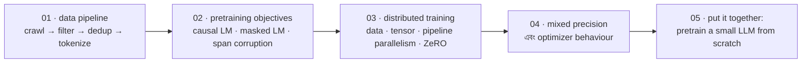

# Pretraining LLMs

[← Back to curriculum index](../README.md)

একটি base model কীভাবে raw text থেকে scale-এ সত্যিই train হয়, তার ভেতরের দৃশ্য।

## এই phase-এর পথ

Pretraining-ই সেই জায়গা, যেখানে একটি model যা কিছু জানে সব অর্জন করে — এবং এটি বেশিরভাগই একটি *engineering* সমস্যা: objective হলো এক লাইন code, আর বাকি চারটি lesson সেই এক লাইনকে ট্রিলিয়ন token-এর উপর ধসে না পড়ে চালানোর বিষয়ে।

Lesson 05-ই ফলাফল: একই loop, এক মেশিনে চলে এমন আকারে, সাথে loss curve এবং sample — প্রমাণ যে এটি সত্যিই কাজ করেছে।

## এই phase-এর topic-গুলো

| # | Topic |
|---|-------|
| 01 | [Pretraining Data Pipeline](01-Pretraining-Data-Pipeline/README.md) |
| 02 | [Pretraining Objectives](02-Pretraining-Objectives/README.md) |
| 03 | [Distributed Training Basics](03-Distributed-Training-Basics/README.md) |
| 04 | [Mixed Precision and Optimization](04-Mixed-Precision-and-Optimization/README.md) |
| 05 | [Pretraining a Small LLM From Scratch](05-Pretraining-a-Small-LLM-From-Scratch/README.md) |