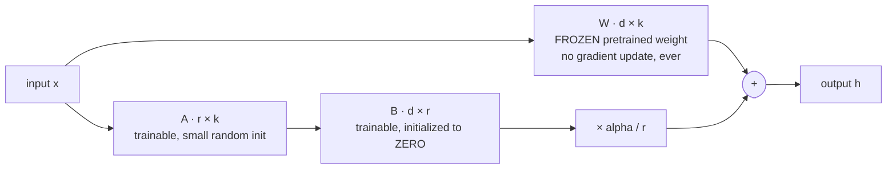

# LoRA এবং QLoRA

**Phase:** [LLM ফাইন-টিউনিং](../README.md) · **টপিক ফোল্ডার:** `02-LoRA-and-QLoRA`

## কেন এটি গুরুত্বপূর্ণ

[Lesson 1](../01-Full-Finetuning-vs-PEFT/README.md)-এ আমরা সাধারণ PEFT কৌশলটি প্রতিষ্ঠা করেছি — base model freeze করো, ছোট একটি add-on train করো — আর সেই memory-র হিসাবও দেখেছি, যা এই পদ্ধতিটিকে অনুপ্রাণিত করে। এই lesson-টি সেই add-on-কে কংক্রিট করে তোলে অনুশীলনে সবচেয়ে বেশি ব্যবহৃত PEFT পদ্ধতি দিয়ে: **LoRA**। আজকাল আপনি "আমার নিজের data-তে একটি open LLM fine-tune করি" ধরনের প্রায় প্রতিটি workflow-ই পাবেন (যার মধ্যে [Lesson 5-এর Hugging Face walkthrough](../05-Finetuning-with-HuggingFace-PEFT-TRL/README.md)-ও আছে), সেগুলো ডিফল্ট হিসেবে LoRA বা তার quantized খুড়তুতো ভাই QLoRA-ই ব্যবহার করে — বিশেষ করে সেই mechanism-টির কারণেই, যেটি এই lesson-এ আমরা স্ক্র্যাচ থেকে তৈরি করব।

## এই lesson-এ যা যা শেখানো হবে

- LoRA-র মূল ধারণা: একটি frozen weight matrix-এর সাথে একটি trainable low-rank update
- কেন low-rank update-এ এত কম parameter থাকে, আর rank `r` কীভাবে এই trade-off-টি নিয়ন্ত্রণ করে
- inference-র সময় LoRA weight-গুলো base model-এ merge করে দেওয়া, ফলে কোনো অতিরিক্ত latency থাকে না
- QLoRA: frozen base-এর 4-bit quantization, যা অনেক কম GPU memory-তেই fine-tuning সম্ভব করে
- PyTorch-এ স্ক্র্যাচ থেকে একটি LoRA linear layer তৈরি, আর যাচাই করা যে frozen weights সত্যিই কখনো বদলায় না

## ১. মূল ধারণা: `W` freeze করো, low-rank update শেখো

Hu et al. (2021) লক্ষ্য করেন যে, fine-tuning-এর একটি run-এ একটি pretrained weight matrix-এ যে *পরিবর্তন* ঘটে, তার "intrinsic rank" সাধারণত matrix-টির নিজের rank-এর চেয়ে অনেক কম — অর্থাৎ update-টিকে কার্যকর হতে হলে dense `d x k` matrix-র পুরো অভিব্যক্তিশক্তি লাগে না। LoRA সরাসরি এই বৈশিষ্ট্যটি কাজে লাগায়: একটি weight matrix `W` (আকৃতি `d x k`) fine-tune করার বদলে **`W`-কে পুরোপুরি freeze** করে এবং দুটি অনেক ছোট matrix-এর গুণফল হিসেবে প্রকাশ করা একটি trainable update যোগ করে:

```
W' = W + (alpha / r) * B @ A

W : d x k    (frozen -- the original pretrained weight, never updated)
A : r x k    (trainable, initialized to small random values)
B : d x r    (trainable, initialized to all zeros)
r << min(d, k)                (the LoRA "rank" -- typically 4-64)
alpha                          (a fixed scaling constant; alpha/r sets the update's magnitude)
```



step 0-তে নিচের পথটি ঠিক কিছুই অবদান রাখে না, তাই model-টি *আসলে* pretrained model-টিই; এরপর training এই পথটিকে ততটুকুই খোলে, যতটুকু data সমর্থন করে। `B`-কে শূন্য দিয়ে initialize করা হয়, যেন training-এর একদম শুরুতে `B @ A = 0` আর `W' = W` নিখুঁতভাবে হয় — অর্থাৎ fine-tuning শুরু হয় pretrained model-টির হুবহু মূল আচরণ থেকে, আর `A` ও `B` শেখার সাথে সাথে ধীরে ধীরে সেখান থেকে সরে আসে। একটি ইনপুট `x`-এর জন্য forward pass দাঁড়ায়:

```
h = x @ W.T + (alpha / r) * x @ A.T @ B.T
```

শুধু `A` ও `B` gradient পায়; `W`-এর ভেতর দিয়ে backpropagation-এর সময় gradient *বহিত* হয় (chain rule-এর তবু `dL/dx` দরকার), কিন্তু `W` নিজে কখনো gradient *update* পায় না — এটি [Lesson 1 §4](../01-Full-Finetuning-vs-PEFT/README.md#4-the-peft-idea-freeze-almost-everything)-এর ঠিক সেই frozen-parameter কৌশল।

## ২. কেন parameter count এত কমে যায়

একটি dense `d x k` weight matrix-এ `d * k` টি parameter থাকে। LoRA-র update matrix-গুলোতে সেই তুলনায় থাকে `r * k + d * r = r * (d + k)` টি parameter। একটি `4096 x 4096` attention projection matrix-এর জন্য (7B-parameter-শ্রেণির model-এর ক্ষেত্রে বাস্তবসম্মত আকার) আর `r = 16` ধরলে:

```
dense:  4096 * 4096          = 16,777,216 parameters
LoRA:   16 * (4096 + 4096)   =    131,072 parameters   (~0.78% of the dense count)
```

`example.py` এটি `r`-এর বেশ কয়েকটি মানের জন্য নিখুঁতভাবে হিসাব করে, এবং প্রকৃত PyTorch parameter-count-এর বিপরীতে যাচাই করে।

## ৩. inference-এর সময় merge করা: zero extra latency

যেহেতু `W` ও `B @ A` দুটোই কেবল `d x k` matrix, তাই training শেষ হওয়ার পর offline-এ এদের **একবার যোগ করে ফেলা** যায়:

```
W_merged = W + (alpha / r) * B @ A
```

`W_merged` একটি সাধারণ ওজনেরই সাধারণ একটি weight matrix, আকৃতিতে মূল matrix-টির হুবহু সমান। এটি deploy করলে মূল অপরিবর্তিত model-এর চেয়ে inference-time compute ও latency-তে *ঠিক* একই খরচ — serving-এর সময় কোনো অতিরিক্ত matrix multiplication নেই, adapter বা prefix tuning-এর মতো নয় ([Lesson 3](../03-Prompt-Tuning-Prefix-Tuning-Adapters/README.md)), যারা প্রতিটি forward pass-এ অল্প compute যোগ করে। এই "merge for free" বৈশিষ্ট্যটি LoRA-র সবচেয়ে বড় ব্যবহারিক সুবিধাগুলোর একটি, আর এটিও বিপরীতমুখী: `A` ও `B` আলাদা রেখে দিলে, একই base model-এর অনেক merged ভ্যারিয়েন্টের মধ্যে swap করা যায় — frozen weights কখনো পুনরায় load না করেই।

## ৪. QLoRA: quantized base-এ LoRA

Dettmers et al. (2023) LoRA-র memory সাশ্রয়কে আরও এগিয়ে নিয়ে যান **QLoRA**-র মাধ্যমে: যেহেতু base weight `W` freeze করা এবং কখনো update হয় না, তাই সেগুলোকে full precision-এ সংরক্ষণ করার কোনো দরকারই নেই — QLoRA সেগুলো সংরক্ষণ করে specially-designed **4-bit format (NF4, "4-bit NormalFloat")**-এ, যা pretrained neural network weights-এর যে আনুমানিক Gaussian বণ্টন (distribution) থাকে তার জন্য অপটিমাইজ করা, এবং প্রতিটি forward/backward computation-এর সময়মাত্র block-by-block সেগুলোকে *dequantize* করে উচ্চ precision-এ (যেমন bf16) ফিরিয়ে আনে। `A` ও `B` (ছোট trainable অংশগুলো) এখনো full precision-এ রাখা ও update করা হয়, কারণ এটিই আসলে সেই অংশটুকু, যাকে শিখতে হয়। তিনটি কৌশল মিলে এটিকে ভালোভাবে কাজ করায়:

- **NF4 quantization** — এমন একটি 4-bit format, যার quantization level-গুলো pretrained weights-এর প্রত্যাশিত distribution-এর সাথে মিলিয়ে বসানো, ফলে এই বিশেষ ব্যবহার-ক্ষেত্রে একটি নিষ্পাপ uniform 4-bit স্কিমের চেয়ে quantization error কম হয়।
- **Double quantization** — quantization-এর নিজেরই যে ছোট per-block scaling constants দরকার হয়, সেগুলো *নিজেরাই* quantized হয়, ফলে তাদের overhead আরও কমে।
- **Paged optimizers** — একটি batch-এর কারণে memory-স্পাইক হলে optimizer state-এর জন্য GPU memory pages স্বয়ংক্রিয়ভাবে CPU memory-তে spill হয়, ফলে কোনো manual হস্তক্ষেপ ছাড়াই out-of-memory ক্র্যাশ এড়ানো যায়।

সব মিলিয়ে ফলাফল: QLoRA একটি 65B-parameter model fine-tune করার জন্য প্রয়োজনীয় GPU memory 780 GB-রও বেশি (full fine-tuning) থেকে কমিয়ে 48 GB-র নিচে নামিয়ে আনে — যা একটি একক high-end consumer/workstation GPU-তেও ধরে — আবার paper-এর benchmark-গুলোতে full fine-tuning-এর task performance-ও বজায় রাখে। `example.py` 4-bit block quantization-এর একটি সরলীকৃত স্ক্র্যাচ-থেকে-তৈরি simulation বাস্তবায়ন করে, যাতে mechanism-টি (আর এর error/memory trade-off) কংক্রিট হয়ে ওঠে।

## ৫. এই lesson-এর কোড যা করে (আর বাস্তব workflow-এ তার বদলে কী ব্যবহৃত হয়)

`example.py` কাঁচা PyTorch-এ সম্পূর্ণ স্ক্র্যাচ থেকে একটি `LoRALinear` module বাস্তবায়ন করে — কোনো বাহ্যিক PEFT লাইব্রেরি ছাড়াই — কারণ mechanism-টিকে খোলাখুলিভাবে দেখা-ই এই lesson-এর উদ্দেশ্য। বাস্তব প্রজেক্টে বরং Hugging Face-এর `peft` লাইব্রেরি (`LoraConfig`, `get_peft_model`) ব্যবহার করা হয়, ঠিক এই mechanism-টিকেই কয়েক লাইনে একটি প্রকৃত pretrained model-এ প্রয়োগ করতে — "under the hood"-এ যা ঘটে সেটিই — [Lesson 5](../05-Finetuning-with-HuggingFace-PEFT-TRL/README.md) সেই প্রকৃত API-টি নিয়ে হেঁটে দেখায় এবং প্রতিটি config option-কে এখানে তৈরি `LoRALinear` class-এর সাথে সরাসরি ম্যাপ করে।

## ভিডিও স্ক্রিপ্ট আউটলাইন

1. Motivation — "আজকের বাস্তব LLM-গুলো যেভাবে fine-tune হয়, তার সবচেয়ে প্রচলিত পদ্ধতিটি, স্ক্র্যাচ থেকে তৈরি"
2. frozen-`W`-এর সাথে low-rank update-এর ধারণা, আর `B`-কে শূন্য দিয়ে initialize করার গুরুত্ব
3. Parameter-count-এর হিসাব: dense `d*k` বনাম LoRA-র `r*(d+k)` — বাস্তব সংখ্যা দিয়ে কংক্রিট
4. zero-extra-latency inference-এর জন্য `W`-তে merge করে ফেলা
5. QLoRA: frozen base-এর 4-bit NF4 quantization, double quantization, paged optimizers
6. `example.py`-এর ওয়াকথ্রু — একটি LoRA layer train করো, যাচাই করো `W` সত্যিই কখনো বদলায় না, বিভিন্ন rank-এ parameter count তুলনা করো, 4-bit quantization error/memory trade-off simulate করো
7. Recap + preview: Lesson 3 সেই PEFT বিকল্পগুলো নিয়ে আলোচনা করে, যেগুলো এত পরিচ্ছন্নভাবে merge হয় না (prompt/prefix tuning, adapters)

## আরও পড়ার জন্য

- Hu et al. (2021), *LoRA: Low-Rank Adaptation of Large Language Models*
- Dettmers, Pagnoni, Holtzman, Zettlemoyer (2023), *QLoRA: Efficient Finetuning of Quantized LLMs*
- Dettmers et al. (2022), *LLM.int8(): 8-bit Matrix Multiplication for Transformers at Scale* (একটি পূর্ববর্তী quantization কৌশল, যাকে QLoRA ধারণাগতভাবে অনুসরণ করে)
- Hugging Face `peft` library documentation, `LoraConfig` এবং `get_peft_model` (বাস্তব-জগতের API — দেখো [Lesson 5](../05-Finetuning-with-HuggingFace-PEFT-TRL/README.md))