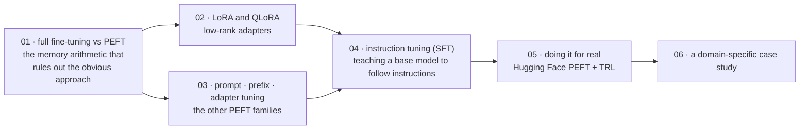

# Fine-tuning LLMs

[← Back to curriculum index](../README.md)

একটি pretrained base model-কে নির্দিষ্ট কাজ এবং instruction-এর জন্য দক্ষভাবে মানিয়ে নেওয়া।

## এই phase-এর পথ

একটি pretrained base model সম্ভাব্য continuation predict করে; প্রশ্নের উত্তর দেয় না। এই phase সেই ফাঁক সস্তায় বন্ধ করার বিষয়ে — প্রথমে পদ্ধতি, তারপর tooling, তারপর একটি পরিপূর্ণ case study।

## এই phase-এর topic-গুলো

| # | Topic |
|---|-------|
| 01 | [Full Fine-tuning vs Parameter-Efficient Fine-tuning](01-Full-Finetuning-vs-PEFT/README.md) |
| 02 | [LoRA and QLoRA](02-LoRA-and-QLoRA/README.md) |
| 03 | [Prompt Tuning, Prefix Tuning and Adapters](03-Prompt-Tuning-Prefix-Tuning-Adapters/README.md) |
| 04 | [Instruction Tuning (SFT)](04-Instruction-Tuning-SFT/README.md) |
| 05 | [Fine-tuning with Hugging Face (PEFT + TRL)](05-Finetuning-with-HuggingFace-PEFT-TRL/README.md) |
| 06 | [Domain-Specific Fine-tuning Case Study](06-Domain-Specific-Finetuning-Case-Study/README.md) |