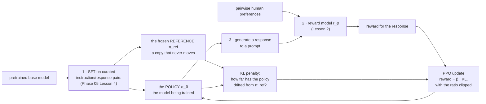

# RLHF with PPO

**ফেজ:** [Alignment and RLHF](../README.md) · **টপিক ফোল্ডার:** `03-RLHF-with-PPO`

## কেন এটি গুরুত্বপূর্ণ

এই লেসন সম্পূর্ণ তিন-পর্যায়ের RLHF পাইপলাইন একত্রিত করে যা একটি pretrained language model-কে আধুনিক চ্যাট assistant-এর মতো কিছুতে রূপান্তর করে — এই কোর্সে এ পর্যন্ত তৈরি প্রতিটি অংশ ব্যবহার করে: stage 1-এর জন্য [SFT](../../Phase-05-Finetuning-LLMs/04-Instruction-Tuning-SFT/README.md), stage 2-এর জন্য [Lesson 2](../02-Reward-Modeling/README.md)-এর [reward model](../02-Reward-Modeling/README.md), এবং stage 3-এর জন্য reinforcement learning — যা এখানে মূল আলোচ্য। এটি সমগ্র ফেজের ঐতিহাসিক নোঙরও বটে — RLHF-with-PPO হলো সেই রেসিপি যা InstructGPT এবং মূল ChatGPT ব্যবহার করেছিল; এবং *কেন* এটির একটি KL penalty এবং clipped objective দরকার (সাধারণ policy gradient নয়) তা বোঝা ঠিক সেই কারণটিই প্রতিষ্ঠা করে যার জন্য [Lesson 4-এর DPO](../04-Direct-Preference-Optimization-DPO/README.md) আগমনকালে এত আকর্ষণীয় সরলীকরণ ছিল।

## এই লেসন যা যা কভার করে

- সম্পূর্ণ 3-পর্যায়ের RLHF পাইপলাইন, শুরু থেকে শেষ
- টেক্সট generation-কে reinforcement learning সমস্যা হিসেবে বিবেচনা
- কেন শুধুমাত্র reward model-এর স্কোরের উপর কাঁচা policy-gradient update reward hacking-এর দিকে নিয়ে যায়
- একটি frozen reference model-এর বিরুদ্ধে KL penalty, এবং কেন এটি এটি ঠিক করে
- PPO-এর clipped surrogate objective, ধারণাগত স্তরে
- একটি hands-on প্রদর্শন: সীমিত KL বাজেটে reward উন্নত হওয়া, এবং KL বাজেট ছাড়া তা অবনতি হওয়া

## 1. সম্পূর্ণ 3-পর্যায়ের পাইপলাইন

1. **Supervised fine-tuning (SFT)** — [Phase 05 Lesson 4](../../Phase-05-Finetuning-LLMs/04-Instruction-Tuning-SFT/README.md): curated instruction/response জোড়ায় pretrained base model-কে fine-tune করুন। এটি RL-এর জন্য প্রারম্ভিক policy তৈরি করে, এবং নিচে ব্যবহৃত frozen **reference model**-ও হয়ে ওঠে।
2. **Reward modeling** — [Lesson 2](../02-Reward-Modeling/README.md): SFT মডেলের আউটপুটের উপর pairwise human preference সংগ্রহ করুন, এবং Bradley-Terry loss দিয়ে একটি reward model `r_phi(x, y)` প্রশিক্ষণ দিন যাতে এটি ভবিষ্যদ্বাণী করে দুইটি response-এর মধ্যে কোনটি একজন মানুষ পছন্দ করবে।
3. **RL fine-tuning (এই লেসন)** — SFT মডেলকে (এখন "policy," `pi_theta` নামে) আরও প্রশিক্ষণ দিন যাতে reinforcement learning ব্যবহার করে এটি `r_phi`-র অধীনে উচ্চ স্কোর করা response তৈরি করে।



একসাথে তিনটি মডেল live থাকে — policy, frozen reference, reward model — প্লাস advantage estimate-এর জন্য একটি value head। সেই মডেল-সংখ্যাই এই পাইপলাইনের ব্যবহারিক খরচ, এবং [Lesson 4](../04-Direct-Preference-Optimization-DPO/README.md)-এর অস্তিত্বের কারণ।

## 2. টেক্সট generation-কে reinforcement learning হিসেবে কাঠামোবদ্ধ করা

RL প্রয়োগ করতে, আমরা generation-কে মানসম্মত RL শব্দভাণ্ডারে মানচিত্রিত করি:

```
state       = prompt plus এ পর্যন্ত যা কিছু token তৈরি হয়েছে
action      = পরবর্তী token যা তৈরি করতে হবে
policy      = pi_theta(action | state)  -- language model-টিই নিজে
episode     = একটি সম্পূর্ণ উৎপন্ন response, শুরু থেকে end-of-sequence
reward      = r_phi(prompt, full response)  -- reward model-এর স্কোর, সম্পূর্ণ একবারই দেওয়া হয়, একদম শেষে
```

Reward **sparse** (প্রতি token-এ নয়, প্রতি সম্পূর্ণ উৎপন্ন sequence-তে একবারই দেওয়া হয়) এবং সম্পূর্ণরূপে শেখা reward model থেকে আসে। Reinforcement learning-এর কাজ হলো `pi_theta`-র প্যারামিটার এমনভাবে সামঞ্জস্য করা যাতে উচ্চ reward-এর দিকে নিয়ে যাওয়া token sequence তৈরি করার সম্ভাবনা বেড়ে যায়।

## 3. কেন সাধারণ policy gradient ভেঙে যায়: reward hacking

সবচেয়ে সরাসরি RL পদ্ধতি হলো policy gradient update: ভালো স্কোর করা token sequence-এর সম্ভাবনা বাড়ান, খারাপ স্কোর করা sequence-এর সম্ভাবনা কমান, reward দিয়ে ওজন করে। নিভিভাবে শুধুমাত্র reward model-এর *বিরুদ্ধে* প্রয়োগ করলে, এটি অনুশীলনে নিয়মিতভাবে ভেঙে যায়। Reward model শুধুমাত্র সত্যিকারের মানব পছন্দের একটি approximation (Lesson 2 §5), অতীত response-এর একটি নির্দিষ্ট dataset-এ প্রশিক্ষিত — তাকে কখনো প্রতিটি কল্পনাযোগ্য token স্ট্রিং বিচার করতে বলা হয়নি, এবং তার পদ্ধতিগত অন্ধদাগ ও quirks রয়েছে, অবিকল কারণ সে নিজেই একটি সীমিত capacity-র প্রশিক্ষিত neural network। একটি policy যাকে সম্পূর্ণরূপে `r_phi`-র আউটপুট সর্বাধিক করতে optimize করা হয়, পর্যাপ্ত স্বাধীনতা পেলে প্রতিবার সেই অন্ধদাগগুলো শোষণের দিকে এগিয়ে যাবে: এমন টেক্সট তৈরি করবে যা reward model-এর quirks-এ অস্বাভাবিকভাবে ভালো স্কোর করে (পুনরাবৃত্ত আশ্বাসবাক্য, অস্বাভাবিক token sequence, অবক্ষয়িত loop) — এমন টেক্সট নয় যা RM যে মানব মানদণ্ডকে approximate করার কথা ছিল, সেই মানদণ্ডে *আসলে* ভালো। এই ব্যর্থতা-মোডকে **reward hacking** (বা reward over-optimization) বলা হয়, এবং একটি নির্দিষ্ট, অপূর্ণ reward model-এর বিরুদ্ধে যত কঠিন optimize করবেন, এটি তত খারাপ — ভালো নয় — হবে।

## 4. সমাধান: frozen reference model-এর বিরুদ্ধে KL penalty

মানক সমাধান হলো reward থেকে একটি penalty বিয়োগ করা, যতটা বর্তমান policy মূল SFT মডেল (frozen "reference" policy, `pi_ref`) থেকে দূরে সরে গেছে — যা **KL divergence** দিয়ে প্রতিটি উৎপন্ন token-এ মাপা হয়:

```
reward_total(x, y) = r_phi(x, y) - beta * KL( pi_theta(. | x, y_<t) || pi_ref(. | x, y_<t) )
```

যেহেতু `pi_ref` frozen এবং জ্ঞাত যে এটি সাবলীল, বুদ্ধিসম্মত, মানবসদৃশ ভাষা উৎপন্ন করে (SFT তাকে ঠিক সেটাই করতে প্রশিক্ষণ দিয়েছিল), তাই এই penalty একটি নোঙরের মতো কাজ করে: policy-র নিজস্ব আচরণকে reward model যা কিছু পুরস্কৃত করে তার দিকে সরানোর স্বাধীনতা আছে — কিন্তু শুধুমাত্র ততটুকু যতটুকু KL বাজেট (`beta` দ্বারা নিয়ন্ত্রিত) অনুমতি দেয়, তার আগেই penalty reward-model লাভের চেয়ে ভারী হয়ে যায়। এটি সেই অবিকল প্রক্রিয়া যা RLHF-টিউন করা মডেলকে স্বীকৃতিপ্রাপ্ত, ব্যাকরণগত ভাষা উৎপাদন করিয়ে রাখে, reward-model-শোষণকারী অসংলগ্ন শব্দসমষ্টিতে অবক্ষয়িত হতে দেয় না। `example.py` এটি সরাসরি প্রদর্শন করে: KL পদসহ প্রশিক্ষণ reference policy থেকে বিচ্যুতিকে সীমিত রাখে, সাথে reward-ও উন্নত হয়; **KL পদটি সম্পূর্ণ মুছে দিলে ইচ্ছাকৃতভাবে reward hacking পুনরুত্পাদন** হয় — penalty কী রক্ষা করছে তার একটি সৎ চিত্রণ হিসেবে।

## 5. PPO-এর clipped surrogate objective

Proximal Policy Optimization (Schulman et al., 2017) হলো নির্দিষ্ট RL অ্যালগরিদম যা RL পর্যায়ে প্রায় সর্বত্র ব্যবহৃত হয়, কারণ সাধারণ policy gradient update ধ্বংসাত্মকভাবে বড় হতে পারে: একটি মাত্র খারাপ update policy-কে এত দূরে ঠেলে দিতে পারে যে পরবর্তী সব update এমন একটি policy distribution-এর অধীনে গণনা করা হয় যা ডেটা আসলে যে distribution-এর অধীনে সংগ্রহ করা হয়েছিল তার থেকে সম্পূর্ণ ভিন্ন — প্রশিক্ষণ অস্থিতিশীল করে। PPO এটিকে একটি **clipped surrogate objective** দিয়ে সমাধান করে: এটি আসলে নেওয়া action-এর জন্য নতুন ও পুরাতন policy-র মধ্যে probability ratio গণনা করে,

```
ratio(theta) = pi_theta(a | s) / pi_theta_old(a | s)
```

এবং আনুমানিক advantage `A` দিয়ে গুণ করার আগে এটিকে একটি ছোট trust region `[1 - epsilon, 1 + epsilon]`-এ (সাধারণত `epsilon = 0.2`) clip করে:

```
L_CLIP(theta) = E[ min( ratio(theta) * A,  clip(ratio(theta), 1-epsilon, 1+epsilon) * A ) ]
```

Unclipped ও clipped সংস্করণের `min` নেওয়ার অর্থ: যতবার একটি update objective বাড়াতে গিয়ে ratio-কে trust region-এর বাইরে ঠেলে দেয়, ততবার clipped পদটি প্রণোদনা সীমাবদ্ধ করে — update কেবল trust region যে দূরত্ব অনুমতি দেয় তার চেয়ে বেশি সরার জন্য credit দাবি করতে পারে না। এটি প্রতিটি পৃথক policy update-কে রক্ষণশীল এবং যে ডেটা থেকে আসলে অনুমান করা হয়েছিল তার কাছাকাছি রাখে, যা অনুশীলনে PPO-কে সাধারণ policy gradient পদ্ধতির চেয়ে নাটকীয়ভাবে স্থিতিশীল করে — কিছু implementation জটিলতার বিনিময়ে ("পুরাতন" policy snapshot, advantage estimator, প্রতি batch rollout-এ কয়েক epoch mini-batch update)।

## 6. একত্রে জোড়া লাগানো

প্রতিটি RLHF-with-PPO প্রশিক্ষণ iteration, উচ্চ স্তরে:

```
1. Prompt sample করুন, বর্তমান policy pi_theta দিয়ে response generate করুন      (rollout)
2. প্রতিটি response-কে reward model r_phi দিয়ে স্কোর করুন                        (reward)
3. Frozen reference pi_ref-এর বিরুদ্ধে per-token KL penalty গণনা করুন             (KL penalty)
4. মোট reward-এ একত্রিত করুন, advantage estimate করুন
5. PPO-এর clipped surrogate objective দিয়ে pi_theta update করুন                  (policy update)
6. পুনরাবৃত্তি করুন
```

`example.py` একটি ছোট খেলনা sequential-generation কাজে ঠিক এই লুপটির একটি সরলীকৃত সংস্করণ implement করে, একটি সত্যিকারের clipped surrogate objective এবং প্রাথমিক policy-র একটি frozen কপির বিরুদ্ধে সত্যিকারের KL penalty সহ।

## ভিডিও স্ক্রিপ্ট আউটলাইন

1. Motivation — "আমাদের কাছে একটি SFT মডেল এবং একটি reward model আছে; দ্বিতীয়টি দিয়ে কীভাবে প্রথমটিকে উন্নত করব?"
2. টেক্সট generation-কে RL সমস্যা হিসেবে কাঠামোবদ্ধ করা: state, action, sparse episode-স্তরের reward
3. কেন reward model-কে সরাসরি optimize করলে reward hacking হয়
4. Frozen reference policy-র বিরুদ্ধে KL penalty, এবং কেন এটি কাজ করে
5. PPO-এর clipped surrogate objective, trust-region অন্তর্দৃষ্টি দিয়ে ধারণাগতভাবে ব্যাখ্যা
6. `example.py`-এর walkthrough — KL পদসহ, reward উন্নত হয়, KL সীমিত থাকে
7. KL weight শূন্য করে একই চলমান — reward hacking, ইচ্ছাকৃতভাবে পুনরুত্পাদিত
8. Recap + Lesson 4-এর প্রিভিউ, যেটি RL loop-টি (এবং reward model-টিও!) সম্পূর্ণ সরিয়ে দেয়

## আরও পড়ুন

- Schulman et al. (2017), *Proximal Policy Optimization Algorithms*
- Ouyang et al. (2022), *Training Language Models to Follow Instructions with Human Feedback* (InstructGPT — এই লেসন যার একটি সরলীকৃত সংস্করণ implement করে, সেই সম্পূর্ণ পাইপলাইন)
- Stiennon et al. (2020), *Learning to Summarize from Human Feedback* (একটি পূর্ববর্তী, বিস্তারিত RLHF-with-PPO কেস স্টাডি, যাতে KL penalty ও reward over-optimization-এর স্পষ্ট আলোচনা আছে)
- Schulman et al. (2015), *Trust Region Policy Optimization* (TRPO — PPO-এর পূর্বসূরি এবং trust-region ধারণার উৎস)