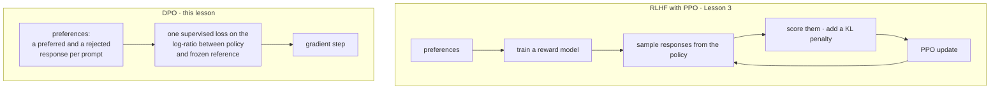

# Direct Preference Optimization (DPO)

**ফেজ:** [Alignment and RLHF](../README.md) · **টপিক ফোল্ডার:** `04-Direct-Preference-Optimization-DPO`

## কেন এটি গুরুত্বপূর্ণ

[Lesson 2](../02-Reward-Modeling/README.md) pairwise human preference-কে একটি scalar reward model-এ রূপান্তরের জন্য Bradley-Terry objective উদ্ভাবন করেছে, এবং [Lesson 3](../03-RLHF-with-PPO/README.md) সেই reward model-এর বিরুদ্ধে policy-কে reinforcement learning দিয়ে optimize করার প্রয়োজনীয় যন্ত্রপাতি নিয়ে পুরো একটি পাইপলাইন পর্যায় ব্যয় করেছে: rollout, frozen reference model-এর বিরুদ্ধে KL penalty, এবং PPO-এর clipped surrogate objective। **Direct Preference Optimization** (Rafailov et al., 2023) একটি তীক্ষ্ণ প্রশ্ন করে: যদি আমরা শেষ পর্যন্ত যা চাই তা একটি policy যেটি *একই* Bradley-Terry preference objective পূরণ করে, তাহলে কি reward model এবং RL loop-কে আলাদা যন্ত্রপাতি হিসেবে আমাদের সত্যিই দরকার, নাকি বীজগণিতকে এমনভাবে সাজানো যায় যাতে একটি একক supervised-স্টাইল loss আমাদের সরাসরি সেখানে পৌঁছে দেয়? দেখা গেল বীজগণিতটি পরিষ্কারভাবে পুনর্বিন্যাস হয় — DPO RLHF-with-PPO-র মতো একই optimum-এ পৌঁছায় (একই KL-constrained objective-র অধীনে) একইসাথে একটি পুরো training stage মুছে দেয়। এই লেসন Lesson 2 ও 3-এর একটি সরাসরি ফলাফল: DPO বোঝার জন্য বুঝতে হবে যে এটি ঠিক কী বাদ দিচ্ছে। এটি [Lesson 5 (RLAIF and Constitutional AI)](../05-RLAIF-and-Constitutional-AI/README.md)-কেও প্রস্তুত করে, যেখানে একবার preference *label*-গুলো মানুষ থেকে আসার বদলে AI থেকে এলে, RLHF-with-PPO বা DPO — যেকোনোটিই underlying optimizer হিসেবে কাজ করতে পারে।

## এই লেসন যা যা কভার করে

- KL-constrained RLHF objective, পুনর্ব্যক্ত, এবং এটি যে closed-form optimal policy বোঝায়
- সেই closed-form সমাধান কীভাবে আপনাকে reward model-কে policy-র নিজস্ব পদে বীজগণিতগতভাবে প্রতিস্থাপন করতে দেয়
- DPO loss, পদে পদে, এবং কেন এটি Lesson 2-এর Bradley-Terry loss — শুধু একটি *implicit* reward সহ
- DPO Lesson 3-এর পাইপলাইন থেকে কী সরিয়ে দেয়, এবং কী ধরে রাখে
- একটি hands-on প্রদর্শন: শুধুমাত্র DPO loss দিয়ে একটি ছোট language model প্রশিক্ষণ — কোনো reward model নেই, কোনো RL rollout নেই

## 1. RLHF objective এবং এর closed-form optimal policy

মনে করুন RLHF (Lesson 3) যে KL-constrained objective-টি optimize করে: reference policy `pi_ref`-এর কাছাকাছি থাকার সাথে সাথে reward model-এর স্কোর সর্বাধিক করুন,

```
maximize_theta   E_{y ~ pi_theta(.|x)} [ r(x, y) ]  -  beta * KL( pi_theta(.|x) || pi_ref(.|x) )
```

এই objective-এর একটি পরিচিত closed-form সমাধান আছে (KL-regularized control / maximum-entropy RL-এর একটি মানক ফলাফল): optimal policy হলো exponentiated reward দিয়ে পুনরায় ওজন করা reference policy,

```
pi*(y|x) = ( 1 / Z(x) ) * pi_ref(y|x) * exp( r(x, y) / beta )
```

যেখানে `Z(x) = sum_y pi_ref(y|x) * exp(r(x,y)/beta)` একটি (অসমাধেয়, প্রতি-prompt) normalizing constant। PPO-এর অস্তিত্ব অবিকল এই কারণে যে এই সমীকরণটি সরাসরি ব্যবহার করা যায় না — কেউই `Z(x)` গণনা করার জন্য প্রতিটি সম্ভাব্য response `y` গণনা করতে পারে না, তাই Lesson 3 objective-টিকে sampled rollout ও gradient ascent দিয়ে পরোক্ষভাবে optimize করে।



একই objective, তাতে পৌঁছানোর ভিন্ন পথ: কোনো reward model নেই, কোনো sampling loop নেই, কোনো value head নেই — শুধু একটি loss যা আপনি একটি নির্দিষ্ট dataset-এ গণনা করতে পারেন। পরের অংশগুলো উদ্ভাবন করে কেন সেটি কেবল সুবিধাজনক নয়, বৈধ।

## 2. মূল কৌশল: policy-র বদলে reward-এর জন্য সমাধান

DPO-এর অন্তর্দৃষ্টি হলো এই সমীকরণটিকে বীজগণিতগতভাবে উল্টানো। `r(x, y)`-এর জন্য পুনর্বিন্যাস করলে:

```
r(x, y) = beta * log( pi*(y|x) / pi_ref(y|x) )  +  beta * log Z(x)
```

প্রতিটি reward function `r(x, y)`-কে তাই *কোনো* policy `pi*` এবং reference policy-র পদে পুনরায় প্রকাশ করা যায় — তাদের মধ্যে log-ratio, `beta` দিয়ে স্কেল করা, প্লাস একটি পদ যা শুধুমাত্র prompt `x`-এর উপর নির্ভর করে (`y`-এর উপর নয়)। এখন `r(x, y_w)` ও `r(x, y_l)`-এর জন্য এই অভিব্যক্তিটি [Lesson 2 section 2](../02-Reward-Modeling/README.md#2-the-bradley-terry-model-of-preferences)-এর Bradley-Terry preference মডেলে প্রতিস্থাপন করুন:

```
P(y_w > y_l | x) = sigmoid( r(x, y_w) - r(x, y_l) )
```

`beta * log Z(x)` পদগুলো `y_w` ও `y_l`-এর জন্য অভিন্ন (দুইটিই *একই* prompt `x`-এর response) এবং বিয়োগে **হুবহু বাতিল** হয়ে যায়। যা থাকে তা হলো একটি preference probability যা সম্পূর্ণরূপে একটি policy-র log-probability এবং reference model-এর log-probability-এর পদে প্রকাশিত — কোথাও কোনো reward model নেই, কোনো অসমাধেয় `Z(x)` নেই।

## 3. DPO loss

সেই বাতিলকরণকে Bradley-Terry negative log-likelihood-এ প্রতিস্থাপন করলে (হুবহু [Lesson 2 section 3](../02-Reward-Modeling/README.md#3-the-reward-model-loss)-এর loss, কিন্তু এখন optimal `pi*`-এর পরিবর্তে একটি *policy* `pi_theta`-র পদে সরাসরি লেখা) DPO loss পাওয়া যায়:

```
loss(theta) = - E_{(x, y_w, y_l)} [ log( sigmoid(
                  beta * ( log( pi_theta(y_w|x) / pi_ref(y_w|x) )
                          - log( pi_theta(y_l|x) / pi_ref(y_l|x) ) )
              ) ) ]
```

পদে পদে:

- `pi_theta` — বর্তমানে প্রশিক্ষিত policy (SFT মডেল থেকে initialize করা, Lesson 3-এর RL policy-র মতোই)।
- `pi_ref` — SFT মডেলের একটি **frozen** কপি, শুধুমাত্র স্কোর করার জন্য ব্যবহৃত, কখনো update হয় না। এর ভূমিকা Lesson 3-এর KL penalty-র reference model-এর মতোই।
- `beta` — একটি temperature যা নির্ধারণ করে প্রদত্ত log-ratio margin-এ loss কতটা তীক্ষ্ণভাবে সাড়া দেয়; এটির ভূমিকা হুবহু মূল objective-এ (section 1) Lesson 3-এর KL-penalty weight `beta`-র ভূমিকা, কারণ এটি আক্ষরিকভাবে সেই একই `beta`, বীজগণিতের মাধ্যমে সূত্রিত।
- `log( pi_theta(y|x) / pi_ref(y|x) )` — **implicit reward**: DPO কখনো এমন একটি network প্রশিক্ষণ দেয় না যার পুরো কাজ scalar স্কোর আউটপুট করা, কিন্তু section 2 অনুযায়ী এই log-ratio গাণিতিকভাবে একটি reward function, এবং এটি `y_w`-র জন্য উপরে এবং `y_l`-এর জন্য নিচে যায় — হুবহু যেভাবে একটি স্পষ্ট reward model-এর স্কোর যেত।

এই loss `pi_theta`-র প্যারামিটারে end-to-end differentiable — প্রতিটি preference triple-তে policy (এবং frozen reference) দিয়ে একটি forward pass ছাড়া আর কিছুই লাগে না — সাধারণ supervised-স্টাইল gradient descent, কোনো sampling নেই, কোনো rollout নেই, কোনো advantage estimation নেই, কোনো PPO clipping নেই।

## 4. কেন এটি কাজ করে: policy-র ভেতরে লুকানো একটি implicit reward model

DPO দেখার সহজাত উপায় হলো: **বর্তমান policy ও reference policy-র অনুপাত, যেকোনো প্রদত্ত response-এ, ইতিমধ্যেই সেই response-এর জন্য একটি reward স্কোরের মতো হুবহু আচরণ করে** — মডেল যে response-গুলো reference model-এর চেয়ে বেশি সম্ভাবনাময় করে তুলেছে (এই সমীকরণ অনুযায়ী) সেগুলি উচ্চতর implicit reward-এর response, এবং বিপরীতটিও সত্য। এই implicit reward দিয়ে সরাসরি Bradley-Terry loss-এ প্রশিক্ষণ `pi_theta`-কে প্রতিটি পর্যবেক্ষিত preference জোড়ার জন্য `pi_theta(y_w|x)/pi_ref(y_w|x)`-কে `pi_theta(y_l|x)/pi_ref(y_l|x)`-এর সাপেক্ষে বাড়াতে ঠেলে দেয়। যেহেতু এটি হুবহু সেই একই Bradley-Terry objective যাকে সন্তুষ্ট করতে Lesson 2-এর স্পষ্ট reward model প্রশিক্ষিত ছিল, এবং যেহেতু section 1-এর closed-form ফলাফল দেখায় দুইটি objective একই optimum ভাগ করে, তাই **DPO একই policy-তে পৌঁছায় যেটি RLHF-with-PPO পৌঁছাতে চেয়েছিল — এটি কেবল সমস্যাটিকে পুনরায় প্যারামিটারাইজ করে যাতে reward model এবং RL optimizer দুটোই অদৃশ্য হয়ে যায়**, তার জায়গায় থাকে একটি মাত্র loss যা policy ও reference model-এর ইতিমধ্যে তৈরি করা জানা log-probability-গুলিতে সরাসরি গণনা করা হয়। `example.py` এটি concretely যাচাই করে: এটি শুধুমাত্র এই loss দিয়ে একটি ছোট মডেল প্রশিক্ষণ দেয় এবং নিশ্চিত করে যে chosen ও rejected response-এর মধ্যে ফলে আসা log-probability margin ঠিক তত্ত্ব যেভাবে ভবিষ্যদ্বাণী করে সেভাবে বাড়ে।

## 5. DPO কী সরিয়ে দেয়, এবং কী ধরে রাখে

|                                                    | RLHF with PPO (Lesson 3)                     | DPO                                                                                                                                           |
| -------------------------------------------------- | -------------------------------------------- | --------------------------------------------------------------------------------------------------------------------------------------------- |
| আলাদা reward model                                 | হ্যাঁ, আগে প্রশিক্ষিত (Lesson 2)             | না — implicit, policy/reference log-ratio দ্বারা সংজ্ঞায়িত                                                                                    |
| প্রশিক্ষণের সময় Sampling / rollout                | হ্যাঁ, প্রতিটি iteration-এ                     | না — triple-এর একটি নির্দিষ্ট, স্থির dataset-এ প্রশিক্ষণ                                                                                        |
| RL algorithm (PPO, advantage estimation, clipping) | হ্যাঁ                                        | না — একটি একক supervised-স্টাইল loss                                                                                                          |
| Reference model                                    | হ্যাঁ (KL penalty)                           | হ্যাঁ (একই ভূমিকা, বীজগণিতগতভাবে loss-এ ভাঁজ করা)                                                                                              |
| `beta` hyperparameter                            | KL penalty weight                            | একই ভূমিকা, একই নাম, একই প্রভাব                                                                                                                 |
| Training stability উদ্বেগ                          | Rollout variance, reward hacking, PPO tuning | কম চলমান অংশ, কিন্তু `beta`-র প্রতি এবং `pi_theta` preference data যে distribution-এর অধীনে সংগ্রহ করা হয়েছিল তা থেকে কত দূরে সরে যায় তার প্রতি সংবেদনশীল |

DPO preference data-র প্রয়োজন **মুছে দেয় না**, এবং frozen reference model-কেও মুছে দেয় না — এটি reward-model-প্রশিক্ষণ stage এবং তার চারপাশে নির্মিত পুরো RL loop মুছে দেয়, যা অনুশীলনে Lesson 3-এর বেশিরভাগ implementation জটিলতা এবং compute খরচ।

## ভিডিও স্ক্রিপ্ট আউটলাইন

1. Motivation — "আমাদের কাছে একটি Bradley-Terry objective এবং একটি KL-constrained RL objective আছে; কি এই দুইটি আলাদা আলাদা training stage হতে বাধ্য?"
2. KL-constrained RLHF objective এবং এর closed-form optimal policy (section 1)
3. বীজগণিত কৌশল: policy-র পদে reward-এর জন্য সমাধান, এবং Bradley-Terry-তে প্রতিস্থাপন (section 2)
4. DPO loss, পদে পদে ব্যাখ্যা: pi_theta, pi_ref, beta এবং implicit reward (section 3)
5. কেন এটি RLHF-with-PPO-র মতো একই optimum-এ পৌঁছায়, সহজাতভাবে (section 4)
6. পাশাপাশি তুলনা টেবিল: Lesson 3-এর সাপেক্ষে DPO কী সরায় বনাম কী ধরে রাখে (section 5)
7. `example.py`-এর walkthrough — synthetic preference triple-তে শুধুমাত্র DPO loss দিয়ে একটি ছোট GPT প্রশিক্ষণ দিন, এবং loop-এ কোথাও কোনো reward model বা RL rollout ছাড়াই chosen-বনাম-rejected log-probability margin বাড়তে দেখুন
8. Recap + Lesson 5-এর প্রিভিউ, যেখানে preference *label-গুলিই* মানুষ থেকে আসা বন্ধ করে দেয়

## আরও পড়ুন

- Rafailov et al. (2023), *Direct Preference Optimization: Your Language Model is Secretly a Reward Model*
- Schulman et al. (2017), *Proximal Policy Optimization Algorithms* (DPO-এর উদ্ভাবন যে algorithm-টি এড়াতে দেখায়, সেটি)
- Ouyang et al. (2022), *Training Language Models to Follow Instructions with Human Feedback* (DPO যে RLHF পাইপলাইনটিকে সরল করে, সেটি)
- Azar et al. (2023), *A General Theoretical Paradigm to Understand Learning from Human Preferences* (DPO-এর objective ও তার অনুমানগুলোর একটি অনুসরণীয় বিশ্লেষণ)