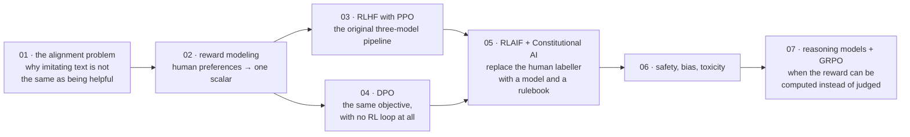

# Alignment এবং RLHF

[← Back to curriculum index](../README.md)

pretraining-এর পরে কীভাবে model-গুলোকে helpful, honest এবং harmless আচরণের দিকে চালিত করা হয়, তা বুঝুন।

## এই phase-এর পথ

Fine-tuning ([Phase 05](../Phase-05-Finetuning-LLMs/README.md)) একটি model-কে ভালো উত্তর অনুকরণ করতে শেখায়। Alignment শেখায় সেগুলোকে *পছন্দ* করতে — যার জন্য দরকার এমন একটি signal, যা বলে কোনো একটি উত্তর অন্য উত্তরের চেয়ে ভালো, এবং সেই signal-এর বিপরীতে optimize করার একটি উপায় — model-টিকে ধ্বংস না করেই।

## এই phase-এর topic-গুলো

| # | Topic |
|---|-------|
| 01 | [The Alignment Problem](01-The-Alignment-Problem/README.md) |
| 02 | [Reward Modeling](02-Reward-Modeling/README.md) |
| 03 | [RLHF with PPO](03-RLHF-with-PPO/README.md) |
| 04 | [Direct Preference Optimization (DPO)](04-Direct-Preference-Optimization-DPO/README.md) |
| 05 | [RLAIF and Constitutional AI](05-RLAIF-and-Constitutional-AI/README.md) |
| 06 | [Safety, Bias and Toxicity Mitigation](06-Safety-Bias-and-Toxicity-Mitigation/README.md) |
| 07 | [Reasoning Models and GRPO](07-Reasoning-Models-and-GRPO/README.md) |