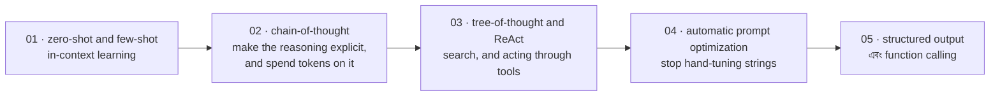

# Prompt Engineering এবং In-Context Learning

[← Back to curriculum index](../README.md)

একটি frozen model-এর সর্বোচ্চ ব্যবহার পাওয়া — শুধু আপনি যেভাবে কথা বলেন সেটার মাধ্যমে।

## এই phase-এর পথ

এখানে সবকিছু inference time-এ ঘটে, weights frozen অবস্থায় — এ কারণেই এটি গুরুত্বপূর্ণ: এটি একমাত্র phase, যার কৌশল আপনি এমন একটি model-এ প্রয়োগ করতে পারেন, যা আপনি train করেননি এবং modify-ও করতে পারবেন না।

## এই phase-এর topic-গুলো

| # | Topic |
|---|-------|
| 01 | [Prompting Basics: Zero-Shot and Few-Shot](01-Prompting-Basics-Zero-Few-Shot/README.md) |
| 02 | [Chain-of-Thought and Reasoning Prompts](02-Chain-of-Thought-and-Reasoning-Prompts/README.md) |
| 03 | [Tree-of-Thought and ReAct](03-Tree-of-Thought-and-ReAct/README.md) |
| 04 | [Automatic Prompt Optimization](04-Automatic-Prompt-Optimization/README.md) |
| 05 | [Structured Output and Function Calling](05-Structured-Output-and-Function-Calling/README.md) |