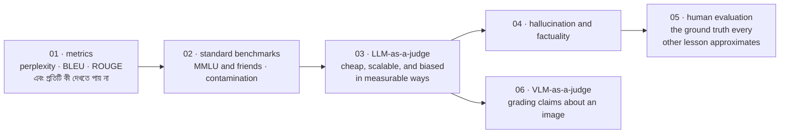

# Evaluation of LLMs

[← Back to curriculum index](../README.md)

একটি model ভালো, নিরাপদ এবং উন্নতিশীল কি না — তা সত্যিই কীভাবে মাপা যায়, শিখুন।

## এই phase-এর পথ

এই phase-এর প্রতিটি lesson একই অস্বস্তিকর প্রশ্নের একটি রূপ: *এই সংখ্যাটি কি এর নাম যা বলে, তাই বোঝায়?* ক্রমটি চলে সবচেয়ে সস্তা, সবচেয়ে কম তথ্যপূর্ণ measurement থেকে সবচেয়ে ব্যয়বহুল এবং সবচেয়ে বিশ্বস্ত measurement পর্যন্ত।

## এই phase-এর topic-গুলো

| # | Topic |
|---|-------|
| 01 | [Evaluation Metrics](01-Evaluation-Metrics/README.md) |
| 02 | [Standard Benchmarks](02-Standard-Benchmarks/README.md) |
| 03 | [LLM-as-a-Judge](03-LLM-as-a-Judge/README.md) |
| 04 | [Hallucination and Factuality Evaluation](04-Hallucination-and-Factuality-Evaluation/README.md) |
| 05 | [Human Evaluation Methodologies](05-Human-Evaluation-Methodologies/README.md) |
| 06 | [VLM-as-a-Judge](06-VLM-as-a-Judge/README.md) |