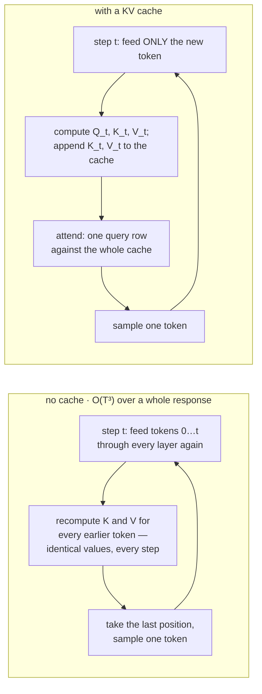
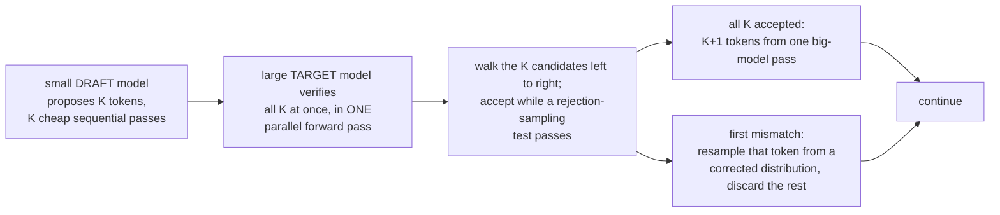

# KV Cache এবং Speculative Decoding

**Phase:** [Deployment and Inference Optimization](../README.md) · **Topic folder:** `03-KV-Cache-and-Speculative-Decoding`

## কেন এটি গুরুত্বপূর্ণ

[Lesson 2](../02-Quantization/README.md) model-টিকেই ছোট করেছিল। এই lesson সম্পূর্ণ ভিন্ন একটি খরচ আক্রমণ করে: **autoregressive generation**-এর সময় একটি Transformer-এর করা অগণিত পুনরাবৃত্তিমূলক গণনা। এই কোর্সের প্রতিটি LLM এক সময়ে একটি করে token তৈরি করে, প্রতিটি নতুন token-কে আবার ভেতরে ঢুকিয়ে পরেরটি পূর্বাভাস করে ([Phase 02 Lesson 6&#39;s mini-GPT](../../Phase-02-Transformer-Architecture-Deep-Dive/06-Mini-Transformer-From-Scratch/README.md#4-autoregressive-generation)) — এবং naiveভাবে, এর অর্থ হলো প্রতিটি ধাপে স্ক্র্যাচ থেকে *সম্পূর্ণ* এখনো-পর্যন্ত-সিকোয়েন্স-এর উপর causal self-attention ([Phase 02 Lesson 2](../../Phase-02-Transformer-Architecture-Deep-Dive/02-Self-Attention-and-Multi-Head-Attention/README.md)) আবার চালানো। **KV cache** হলো LLM inference-এর সবচেয়ে গুরুত্বপূর্ণ একক systems-level optimization, এবং এটি সেই সুনির্দিষ্ট মেশিনারি যা [Phase 03 Lesson 7-এর Grouped-Query Attention আলোচনা](../../Phase-03-LLM-Architectures-and-Types/07-Survey-of-Popular-Open-LLMs/README.md#4-grouped-query-attention-gqa-a-new-practically-important-variant) ইতিমধ্যে forward-referenced করেছিল যখন এটি ব্যাখ্যা করেছিল কেন GQA-এর ছোট K/V projections গুরুত্বপূর্ণ। এই lesson **speculative decoding**-ও কভার করে — একটি পরিপূরক কৌশল যা একটি output token-ও না বদলে generation-কে আরও দ্রুত করে। এই দুটো কৌশলই সেই ভিত্তি যার চারপাশে [Lesson 4](../04-Serving-Frameworks/README.md)-এর serving frameworks নির্মিত।

## এই lesson যা কভার করে

- কেন naive autoregressive generation বারবার একই attention কাজ পুনরায় গণনা করে
- **Prefill** এবং **decode**: প্রতিটি LLM inference request-এর মধ্য দিয়ে যাওয়া দুটি নামধারী phase
- KV cache: প্রতিটি token-এর Key ও Value ভেক্টর cache করা যাতে প্রতিটি নতুন ধাপে খরচ O(T^2) না হয়ে O(T) হয়
- কীভাবে Grouped-Query Attention (recap) সেই cache-এর আকার সংকুচিত করে
- Speculative decoding: একটি সস্তা draft model ব্যবহার করে token প্রস্তাব করা, আর একটি বড় model সেগুলো সমান্তরালে যাচাই করে
- কেন speculative decoding output distribution একেবারেই না বদলে গতি বাড়ায়
- **TTFT এবং ITL**: prefill ও decode প্রতিটির তৈরি হওয়া দুটি per-request latency মেট্রিক
- EAGLE-style speculative decoding: একটি আলাদা model-এর বদলে target model-এর নিজস্ব features থেকে drafting, এবং একসাথে guess-গুলোর একটি সম্পূর্ণ *tree* যাচাই করা

## 1. Recap: কেন self-attention O(T^2)

Self-attention ([Phase 02 Lesson 2](../../Phase-02-Transformer-Architecture-Deep-Dive/02-Self-Attention-and-Multi-Head-Attention/README.md)) একটি দৈর্ঘ্যের `T` সিকোয়েন্সের জন্য attention scores-এর একটি পূর্ণ `T x T` matrix গণনা করে:

```
scores = (Q @ K^T) / sqrt(d_k)        # (T, T) -- every query attends to every key
```

এই matrix তৈরি করতে O(T^2) dot products খরচ হয়, এবং প্রশিক্ষণের সময় একটি সম্পূর্ণ সিকোয়েন্স **সমান্তরালে** প্রসেস করার সময় (এই [Phase 02 Lesson 6 §3](../../Phase-02-Transformer-Architecture-Deep-Dive/06-Mini-Transformer-From-Scratch/README.md#3-training-objective-next-token-prediction)-এর পুরো উদ্দেশ্য: একটি forward pass, বিনামূল্যে T training signals) প্রতিটি অবস্থানে স্ক্র্যাচ থেকে সেই matrix তৈরি করা অনিবার্য। কিন্তু generation ভিন্ন: inference-এ একসাথে খাওয়ানোর জন্য কোনো ground-truth sequence নেই — token-গুলো একবারে একটি করে, ক্রমানুসারে তৈরি হতে হবে।

## 2. Naive (এবং অপচয়কারী) generation উপায়

প্রতিটি LLM inference request দুটি স্বতন্ত্র, স্ট্যান্ডার্ড-নামধারী phase-এর মধ্য দিয়ে যায়। **Prefill** হলো প্রথমটি: সম্পূর্ণ input prompt একটিই সমান্তরাল forward pass-এ model-এর মধ্য দিয়ে খাওয়ানো হয়, এবং প্রথম output token তৈরি করতে model-এর last-position আউটপুট থেকে sample নেওয়া হয় — প্রতি layer-এ এটি একটি বড় matmul, সব prompt token একসাথে, ঠিক সেই "একটি পুরো সিকোয়েন্স সমান্তরালে প্রসেস করো" মোড যা [Phase 02 Lesson 6 §3](../../Phase-02-Transformer-Architecture-Deep-Dive/06-Mini-Transformer-From-Scratch/README.md#3-training-objective-next-token-prediction) প্রশিক্ষণের জন্যও ব্যবহার করেছিল। **Decode** হলো এর পরের সবকিছু: প্রতিটি পরবর্তী forward pass ঠিক আরও একটি token তৈরি করে — পূর্ববর্তী ধাপে তৈরি token-টি খাওয়ানো হয় — এবং উত্তর শেষ না হওয়া পর্যন্ত এটি পুনরাবৃত্ত হয়। [Lesson 1 §6](../01-GPU-and-Hardware-Fundamentals/README.md#6-the-payoff-why-prefill-is-compute-bound-and-decode-is-memory-bound) প্রকৃত arithmetic-intensity সংখ্যা-সহ দেখায় কেন এই দুটি phase compute-bound/memory-bound রেখার বিপরীত পাশে বসে — prefill-এর একটি বড় matmul compute-bound, decode-এর এক-টোকেন-এ-একবার matmuls memory-bound; এই বিভেদটি এই lesson-এর বাকি অংশের জন্য অনুমিত কনটেক্সট।

একটি ক্রমবর্ধমান সিকোয়েন্স `x[0..t]`-এর জন্য decode বাস্তবায়নের সবচেয়ে স্পষ্ট উপায় হলো: *সম্পূর্ণ* সিকোয়েন্স আবার model-এর মধ্য দিয়ে চালাও, last-position আউটপুট নাও, পরবর্তী token-কে sample করো, এটা যোগ করো এবং পুনরাবৃত্তি করো ([Phase 02 Lesson 6 §4](../../Phase-02-Transformer-Architecture-Deep-Dive/06-Mini-Transformer-From-Scratch/README.md#4-autoregressive-generation) সরলতার জন্য ঠিক এটিই করে)। সমস্যা: ধাপ `t`-এ, token `0..t-1` **ইতিমধ্যে এই সুনির্দিষ্ট গণনাটি** ধাপ `t-1`-এ করেছে। তাদের Key ও Value vectors মোটেও বদলায়নি — শুধু নতুন যোগ করা token-টির নতুন K/V vectors দরকার, এবং attention-score matrix-এর একটি নতুন row মাত্র গণনা করতে হবে (নতুন token-এর query, তার আগের সবকিছুর বিরুদ্ধে — causal masking মানে এখনো নতুন token-এর প্রতি নতুন কিছু attend করতে হবে না, যেহেতু আগের অবস্থানগুলোর জন্য এর অস্তিত্বই নেই)। প্রতিটি decode ধাপে স্ক্র্যাচ থেকে পুরো `T x T` score matrix পুনরায় গণনা করা বোঝায় যে `T` টি token তৈরি করার মোট কাজ হলো O(T^3) — একটি attention pass-এর O(T^2) খরচ, `T` টি generation ধাপের প্রতিটিতে আবার দেওয়া।

## 3. KV cache: প্রতিটি token-এর K/V-র জন্য ঠিক একবার pay করুন

ফিক্স হলো প্রতিটি token-এর Key ও Value ভেক্টর **cache** করা যত তাড়াতাড়ি সেগুলো গণনা হয়, এবং প্রতিটি পরবর্তী ধাপে সেগুলো পুনরায় গণনা না করে পুনরায় ব্যবহার করা:

```
step t:  compute Q_t, K_t, V_t for ONLY the new token
         append K_t, V_t to the cache  ->  cache now holds K_0..K_t, V_0..V_t
         attend:  scores_t = (Q_t @ cache_K^T) / sqrt(d_k)     # (1, t+1), not (t+1, t+1)
         output_t = softmax(scores_t) @ cache_V
```

প্রতিটি generation ধাপ এখন O(t) কাজ করে (`t` টি cached key-র বিরুদ্ধে একটি query) মূল O(t^2) কাজের (position `t` পর্যন্ত পূর্ণ matrix পুনরায় গণনা) বদলে। `T` টি token তৈরি করতে, মোট কাজ O(T^3) থেকে O(T^2)-এ নেমে আসে — পুরো সিকোয়েন্সের উপর একটি সাধারণ forward pass-এর মতোই মোট খরচ, যা যেকোনো causal-attention model-এর জন্য সম্ভব সেরা। এটি একটি বিশুদ্ধ engineering optimization: cache-সহ বা ছাড়া প্রতিটি অবস্থানে attention-এর *গাণিতিক* output অভিন্ন (`example.py` এটি সরাসরি যাচাই করে — একটি naive এবং একটি cached generation loop byte-for-byte অভিন্ন token sequences তৈরি করে কিনা তা পরীক্ষা করে)। খরচ হলো memory, compute নয়: প্রতিটি layer-কে নিজের K/V cache স্মৃতিতে রাখতে হয়, যা সিকোয়েন্স দৈর্ঘ্য ও batch size-এর সাথে রৈখিকভাবে বাড়ে।



## 4. Recap: Grouped-Query Attention cache-কে সংকুচিত করে

[Phase 03 Lesson 7 §4](../../Phase-03-LLM-Architectures-and-Types/07-Survey-of-Popular-Open-LLMs/README.md#4-grouped-query-attention-gqa-a-new-practically-important-variant) ইতিমধ্যে ফলাফল দেখিয়েছে: এই cache-এর আকার সরাসরি model-টির আলাদা K/V projections-এর সংখ্যার সাথে scale করে, অর্থাৎ `num_kv_heads`-এর সাথে, `num_heads` নয়। সাধারণ multi-head attention প্রতি head-এ একটি K/V pair cache করে; Grouped-Query Attention একটি *গ্রুপের* heads জুড়ে একটি K/V pair ভাগ করে, আর Multi-Query Attention *সব* heads জুড়ে একটি একক K/V pair ভাগ করে। সেই lesson-এর cache-size ফর্মুলা:

```
KV cache bytes = 2 * batch * seq_len * num_kv_heads * d_k * num_layers * bytes_per_value
```

এই lesson-এর সব KV-cache mechanics GQA/MQA models-এ অপরিবর্তিত প্রযোজ্য — শুধু সেই ফর্মুলার `num_kv_heads` বদলায়; caching *অ্যালগরিদম* (নতুন K/V যুক্ত করো, বাকিটা পুনরায় ব্যবহার করো) অভিন্ন।

## 5. Speculative decoding: একটি pass-এর দামে বেশ কয়েকটি token যাচাই করা

KV cache থাকলেও, generation মৌলিকভাবে ক্রমিকই থাকে: (বড়, ব্যয়বহুল) model-এর প্রতি forward pass-এ একটি করে নতুন token, এবং প্রতিটি forward pass-এর একটি স্থির overhead থাকে, তা সে যত কম নতুন token-ই তৈরি করুক না কেন (ছোট batch size-এ memory-bandwidth-bound, compute-bound নয় — model-এর বেশিরভাগ weights প্রতি ধাপে একবার memory থেকে পড়তে হয়ই)। **Speculative decoding** (Leviathan, Kalman & Matias, 2023; স্বাধীনভাবে, Chen et al., 2023) "একটি বড়-model pass-এ একটি token" অনুমানটি ভেঙে দেয়:

```
1. A small, fast "draft" model proposes K candidate next tokens autoregressively
   (K cheap forward passes through the SMALL model).
2. The large "target" model verifies ALL K candidates in a SINGLE parallel forward
   pass (feeding all K draft tokens at once, same trick as parallel training).
3. Walk through the K candidates left to right. Accept a candidate if a rejection-
   sampling test passes (comparing the target model's and draft model's
   probabilities for that token); reject at the first mismatch.
4. On rejection, sample one token from a corrected distribution derived from the
   target model at that position, discard the rest of the draft, and start the
   next round from there.
```



## 6. কেন এটি exact, এবং কেন এটি দ্রুততর

ধাপ 3-এর rejection-sampling নিয়মটি গুরুত্বপূর্ণ বিবরণ: এটি এমনভাবে নির্মিত যে গৃহীত token-গুলোর উপর *প্রান্তিক* বিতরণ প্রমাণযোগ্যভাবে অভিন্ন — target model নিজে এক-এক করে token sample করলে যা তৈরি করত তার সাথে। Speculative decoding একটি বিশুদ্ধ speed optimization, approximation নয়, ঠিক KV cache-এর মতো। Output গুণমানে এর কোনো খরচ নেই।

Speedup আসে **amortization** থেকে: `K` টি draft token যাচাই করতে target model-কে খরচ হয় *একটি* forward pass (সমান্তরাল যাচাই মোটামুটি একটি token তৈরি করার মতোই সস্তা, কারণ একসাথে যত token-ই স্কোর করা হোক memory-bandwidth bottleneck-ই প্রাধান্য পায়), কিন্তু সেই `K` টি token-এর মধ্যে যদি বেশ কয়েকটি গৃহীত হয়, তাহলে target model কার্যকরভাবে একটি ব্যয়বহুল pass-এর দামে একাধিক token তৈরি করেছে। Draft model-এর forward passes সস্তা কারণ এটি ছোট। নিট লাভ সম্পূর্ণভাবে **acceptance rate**-এর উপর নির্ভর করে: একটি draft model যে target-এর সাথে প্রায়ই একমত হয়, তা প্রতি রাউন্ডে অনেক token-কে ঢুকতে দেয়; একটি draft model যে ক্রমাগত দ্বিমত পোষণ করে, তা এক-এক-টোকেন target generation-এ ফিরে যায়, যা speculative decoding একেবারেই না ব্যবহার করার চেয়ে খারাপ নয় (একটি ছোট ধ্রুবক overhead পর্যন্ত)। `example.py` এটি সরাসরি মাপে: কয়েকটি draft/target agreement rate-এ, speculative decoding-সহ বনাম ছাড়া একটি স্থির-দৈর্ঘ্যের সিকোয়েন্স তৈরি করতে প্রয়োজনীয় ব্যয়বহুল target-model call-এর সংখ্যা।

## 7. TTFT এবং ITL: দুটি per-request latency মেট্রিক

Prefill এবং decode প্রতিটি নিজস্ব মানক latency মেট্রিক তৈরি করে। **TTFT (Time to First Token)** হলো যখন একটি request আসে থেকে তার প্রথম output token তৈরি হয় পর্যন্ত latency — prefill phase-এর compute time দ্বারা প্রভাবিত (যোগ সেই সময় যা request-টি অন্য কাজের পেছনে queued কাটিয়েছে), যেহেতু পুরো prompt-এর উপর সেই প্রথম সমান্তরাল forward pass শেষ না হওয়া পর্যন্ত user-কে কিছুই ফেরত দেওয়া যায় না। **ITL (Inter-Token Latency)** হলো প্রতিটি পরবর্তী output token pair-এর মধ্যে latency — একটি decode ধাপের খরচ, যা প্রতি ধাপে একবার model-এর weights (এবং ক্রমবর্ধমান KV cache) পড়ার memory-bandwidth খরচ দ্বারা প্রভাবিত, ঠিক [Lesson 1's](../01-GPU-and-Hardware-Fundamentals/README.md) memory-bound regime। এগুলো একত্রে মোট request latency-তে রচিত হয়:

```
total latency  ≈  TTFT  +  (num_output_tokens - 1) * average ITL
```

একটি দীর্ঘ prompt TTFT-কে ফুলিয়ে দেয় (প্রথম token-এর আগে বেশি prefill compute); একটি দীর্ঘ উত্তর মোট latency-কে বেশিরভাগই `ITL` পদ দিয়ে, এক সময়ে একটি decode ধাপ করে, ফুলিয়ে তোলে। Speculative decoding (§5-6 উপরে) বিশেষভাবে একটি **ITL** অপ্টিমাইজেশন — এটি prefill বা TTFT-কে মোটেই স্পর্শ করে না, শুধু decode-এর per-step খরচ। এই দুটি per-request সংখ্যা হলো [Lesson 6](../06-Cost-and-Latency-Optimization/README.md) fleet স্তরে কভার করে এমন সারাংশ throughput/latency trade-off-এর নীচের সূক্ষ্ম-grained building blocks: একটি serving system-এর *সারাংশ* throughput এবং *per-request* latency হলো শুধু TTFT এবং ITL, একটি request-এর বদলে অনেক সমকালীন request জুড়ে মাপা (Pope et al., 2022, নিচে ইতিমধ্যে উদ্ধৃত, serving scale-এ ঠিক এই decomposition-এর জন্য একটি ভালো রেফারেন্স)।

## 8. EAGLE-style speculative decoding: features থেকে draft, tree যাচাই

§5-7-এর speculative decoding-এর একটি *আলাদা*, স্বাধীনভাবে প্রশিক্ষিত ছোট model দরকার যা ঘটনাক্রমে target model-এর আচরণকে ভালোভাবে অনুমান করে — একটি ভালো draft model খুঁজে পাওয়া বা প্রশিক্ষণ দেওয়া নিজেই প্রকৃত engineering overhead, এবং `K` টি draft guess-এর একটি রৈখিক শৃঙ্খল প্রতি অবস্থানে কেবল একটি প্রার্থী continuations অফার করে। **EAGLE** (Li et al., 2024) এবং এর আত্মীয়রা দুটি সীমাবদ্ধতাই একসাথে ঠিক করে:

- **একটি আলাদা model-এর guesses-এর বদলে target-এর নিজস্ব features থেকে draft।** একটি স্বাধীন ছোট LM-এর বদলে, EAGLE একটি ক্ষুদ্র অতিরিক্ত head প্রশিক্ষণ দেয় যা target model-এর নিজস্ব দ্বিতীয়-থেকে-শেষ layer-এর hidden states (features যা এটি ইতিমধ্যে গণনা করছিল) যোগ প্রকৃত next-token embedding খায়, এবং পূর্বাভাস করে target-এর *পরবর্তী* hidden state (এবং তাই পরবর্তী token) সম্ভবত কী হবে। এভাবে drafting একটি সাধারণভাবে-সদৃশ ছোট model-এর চেয়ে অনেক ঘনিষ্ঠভাবে সেই নির্দিষ্ট target model-কে অনুসরণ করে, কারণ এটি আক্ষরিকভাবে সেই model-এর নিজস্ব অভ্যন্তরীণ উপস্থাপনাকে এক ধাপ সামনে extrapolate করছে, স্ক্র্যাচ থেকে এর input/output আচরণ অনুমান করছে না।
- **A chain নয়, tree যাচাই করুন।** `K` টি draft guess-এর একটি রৈখিক সিকোয়েন্সের (কোনো একটি ভুল guess তার পরে থাকা সবকিছু বাতিল করে দেয়) বদলে, EAGLE প্রতিটি অবস্থানে বেশ কয়েকটি *বিকল্প* পরবর্তী token draft করে, প্রার্থী continuations-এর একটি ছোট tree গঠন করে, এবং target model সেই tree-এর প্রতিটি শাখা একটি সমান্তরাল forward pass-এ যাচাই করে (একই "একসাথে একাধিক প্রার্থী খাওয়াও" কৌশল যা §5 ব্যবহার করে, শুধু একটি লাইনের worth-এর বদলে একটি tree-এর worth-এর positions জুড়ে)। একটি tree-এর মাধ্যমে দীর্ঘতম সঠিক *পথ* গ্রহণ করা একটি সঠিক continuation-কে রক্ষা করে এমনকি যখন কোনো অবস্থানে সবচেয়ে-সম্ভাব্য draft guess ভুল হতো — প্রতিটি ব্যয়বহুল target-model call-এর জন্য একটি chain-এর তুলনায় গৃহীত থাকার কঠোরভাবে বেশি সুযোগ।

§6-এর exactness গ্যারান্টি অক্ষত: যাচাই এখনো target model-এর প্রকৃত বিতরণের বিরুদ্ধে একই rejection-sampling নিয়ম, শুধু যেই tree পথটি পরীক্ষা করা হচ্ছে সেখানে প্রয়োগ করা হয় — EAGLE শুধু *guess-গুলো কত ভালো* এবং *প্রতি call-এ কতগুলো পরীক্ষা হয়* পরিবর্তন করে, সেগুলো গ্রহণের সঠিকতা যুক্তি নয়। বাস্তবে এটি acceptance rate (§6) কে একটি তুলনীয়-আকারের স্বাধীন draft model-এর অর্জনের চেয়ে অর্থপূর্ণভাবে উঁচুতে ঠেলে দেয়, কখনোই একটি দ্বিতীয় সম্পূর্ণ model প্রশিক্ষণ ও রক্ষণাবেক্ষণের প্রয়োজন ছাড়াই।

## Video Script Outline

1. Motivation — "generation sequential; আমরা কি ইতিমধ্যেই করা কাজ পুনরায় করা বন্ধ করতে পারি?"
2. Prefill বনাম decode: দুটি নামধারী phase, এবং কেন Lesson 1 সেগুলোকে compute-bound/memory-bound রেখার বিপরীত পাশে রাখে
3. Naive regeneration: কেন প্রতিটি decode ধাপে পুরো সিকোয়েন্স পুনরায় চালানো মোটের উপর O(T^3)
4. KV cache: K/V cache করো, প্রতিটি ধাপে append করো, প্রতি ধাপে O(T) / মোট O(T^2)
5. Recap: GQA/MQA-কে cache-size ফর্মুলার উপর একটি সরাসরি lever হিসেবে
6. Speculative decoding: draft প্রস্তাব করে, target সমান্তরালে যাচাই করে, দীর্ঘতম-সঠিক-prefix গৃহীত হয়
7. কেন rejection-sampling scheme output distribution-কে হুবহু অপরিবর্তিত রাখে
8. `example.py`-এর walkthrough — cache-সহ/ছাড়া মিলিত outputs, প্রকৃত attention-computation counts, এবং speculative decoding-এর target-model-call সাশ্রয়
9. TTFT এবং ITL: prefill ও decode প্রতিটি তৈরি করা দুটি per-request latency সংখ্যার নামকরণ, এবং কীভাবে speculative decoding বিশেষভাবে ITL-কে লক্ষ্য করে
10. EAGLE-style drafting: একটি আলাদা model-এর বদলে target-এর নিজস্ব features থেকে পূর্বাভাস, এবং একটি chain-এর বদলে candidates-এর একটি tree যাচাই
11. Recap + pointer [Lesson 4: Serving Frameworks](../04-Serving-Frameworks/README.md)-এর দিকে, যেখানে KV cache সেই রিসোর্স হয়ে ওঠে যা PagedAttention দক্ষতার সাথে পরিচালনা করে

## Further Reading

- Leviathan, Kalman & Matias (2023), *Fast Inference from Transformers via Speculative Decoding*
- Chen et al. (2023), *Accelerating Large Language Model Decoding with Speculative Sampling*
- Pope et al. (2022), *Efficiently Scaling Transformer Inference* (KV cache memory/bandwidth analysis at serving scale)
- Ainslie et al. (2023), *GQA: Training Generalized Multi-Query Transformer Models from Multi-Head Checkpoints*
- Li, Wei, Zhang, et al. (2024), *EAGLE: Speculative Sampling Requires Rethinking Feature Uncertainty*
- Cai, Li, Geng, et al. (2024), *Medusa: Simple LLM Inference Acceleration Framework with Multiple Decoding Heads* (a related tree-based multi-head drafting approach)