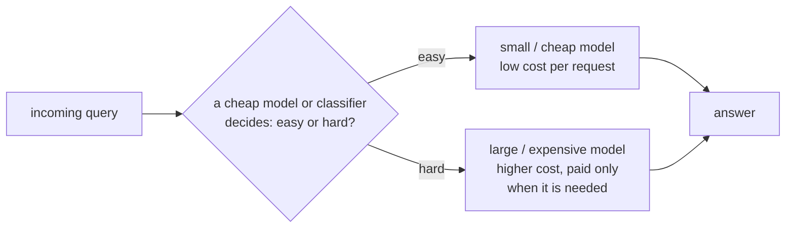

# Cost এবং Latency Optimization

**Phase:** [Deployment and Inference Optimization](../README.md) · **Topic folder:** `06-Cost-and-Latency-Optimization`

## কেন এটি গুরুত্বপূর্ণ

এই phase-এর প্রতিটি আগের lesson cost ও latency-কে *model* বা *system* দিক থেকে আক্রমণ করেছে: [quantization](../02-Quantization/README.md) weights ছোট করে, [KV caching and speculative decoding](../03-KV-Cache-and-Speculative-Decoding/README.md) generation-এর সময় অপ্রয়োজনীয় compute কাটে, [serving frameworks](../04-Serving-Frameworks/README.md) একটি নির্দিষ্ট hardware-এর batch থেকে আরও throughput চেপে বের করে, আর [distillation and pruning](../05-Model-Distillation-and-Pruning/README.md) ছোট models তৈরি করে যা পরিচালনা করা প্রথম থেকেই সস্তা। এই lesson-টি হলো capstone: এটি পুরো *serving system এবং traffic pattern*-এর স্তরে এক ধাপ পিছিয়ে, এবং জিজ্ঞাসা করে কীভাবে ইতিমধ্যে নির্মিত সবকিছুকে একটি প্রকৃত cost/latency বাজেটে একত্র করা যায়। এখানে দুটি ধারণা বাস্তব production systems-এ প্রাধান্য পায় — **batching trade-off** ([Lesson 4's](../04-Serving-Frameworks/README.md#4-hugging-face-tgi-continuous-in-flight-batching) batching আলোচনার একটি প্রত্যক্ষ পরিণতি) এবং **সস্তা models সস্তা model-এর সমস্যায় routing করা** (যা ঠিক সেই কারণ [Lesson 5](../05-Model-Distillation-and-Pruning/README.md)-এর ছোট distilled বা pruned models-গুলো আদৌ রাখার মতো — বড় model-কে সর্বত্র প্রতিস্থাপন করার জন্য নয়, বরং *traffic-এর সহজ ভগ্নাংশ শুষে নেওয়ার* জন্য)। এটি Phase 09-কে শেষ করে; [Phase 10](../../Phase-10-Advanced-and-Frontier-Topics/README.md) frontier research topics দিয়ে ফিরে নেয় যা এই সমগ্র deployment toolkit-এর উপর নির্মিত।

## এই lesson যা কভার করে

- Batching-এর অন্তর্নিহিত throughput vs. latency trade-off
- Prefix caching: অনেক requests জুড়ে একটি shared prompt-এর KV cache পুনরায় ব্যবহার
- Model routing এবং cascades: সহজ queries-কে সস্তা models-এ, কঠিন queries-কে ব্যয়বহুল ones-এ পাঠানো
- GPU-hour economics: throughput ও rental cost-কে একটি প্রকৃত $/million-tokens ফিগারে রূপান্তর
- Model sizing এবং quantization economics-কে concrete, quantified cost levers হিসেবে, শুধু performance levers নয়
- কীভাবে এই সব কৌশল একটি cost/latency বাজেটে কম্পোজ হয়

## 1. Throughput vs. latency trade-off

[Lesson 4](../04-Serving-Frameworks/README.md#4-hugging-face-tgi-continuous-in-flight-batching) প্রতিষ্ঠা করেছে *কেন* batching বিদ্যমান: কয়েকটি sequences-কে একসাথে model-এর মধ্য দিয়ে চালানো একটি forward pass-এর স্থির overhead (kernel launches, memory থেকে weight loads) অনেক requests জুড়ে ভাগ করে দেয়, তাই batch size বাড়লে *hardware-level* খরচ প্রতি request-এ কমে। কিন্তু সেই একই fixed-size batch-এর একটি খরচ আছে যা কেউ বিনামূল্যে পায় না: একটি **static** batch শুরু হতে পারে না যতক্ষণ না এটি ভরাট করার জন্য পর্যাপ্ত requests queue-তে এসে পড়ে, এবং সেই batch-এর প্রতিটি request batch শুরু হওয়ার আগে *শেষ* request-টি প্রস্তুত হওয়ার জন্য আটকে থাকে —

```
per-request latency ~= (time waiting for the batch to fill) + (time for the whole batch to be processed)
```

প্রথম পদটি batch size `B`-এর সাথে বাড়ে (batch পূর্ণ হওয়ার আগে বেশি requests দরকার মানে দীর্ঘ গড় অপেক্ষা), যখন প্রতি batch-এর স্থির processing cost সমান্তরাল hardware-এর জন্য মোটামুটি ধ্রুবক থাকে — তাই batch-এর **throughput ceiling** (`B / batch_processing_time`) `B`-এর সাথে বাড়ে, এমনকি প্রতিটি স্বতন্ত্র request-এর **wait**-ও বাড়ে। এমন কোনো batch size নেই যা একই সাথে উভয় মেট্রিকের জন্য সেরা: একটি service যাকে কম per-request latency নিশ্চিত করতে হবে (interactive chat) ছোট batches বা continuous batching চায় ([Lesson 4 §4](../04-Serving-Frameworks/README.md#4-hugging-face-tgi-continuous-in-flight-batching)); একটি service যা requests-এর একটি বড় backlog প্রসেস করছে যেখানে কেউ spinner-এর দিকে তাকিয়ে নেই (nightly batch summarization jobs), সে hardware-এ ধরে এমন সবচেয়ে বড় batch চায়। `example.py` §1 এই trade-off-কে প্রকৃত, এলোমেলোভাবে-আগত requests-সহ সরাসরি সিমুলেট করে এবং batch sizes-এর একটি পরিসর জুড়ে দুটো সংখ্যাই প্রতিবেদন করে।

## 2. Prefix caching: একটি shared prompt-এর জন্য একবার pay করা

অনেক বাস্তব workloads বারবার *একই* দীর্ঘ prefix-টি একটি ভিন্ন ছোট suffix-সহ প্রতি request-এ পাঠায় — একটি নির্দিষ্ট system prompt, few-shot examples-এর একটি নির্দিষ্ট সেট, অথবা একটি দীর্ঘ নথি যার বিরুদ্ধে অনেক ভিন্ন প্রশ্ন জিজ্ঞাসা করা হয়। [Lesson 3](../03-KV-Cache-and-Speculative-Decoding/README.md#3-the-kv-cache-pay-for-each-tokens-kv-exactly-once) থেকে মনে করুন, KV cache কিছু tokens-এর একটি prefix-এর উপর forward pass থেকে সংরক্ষিত key/value vectors ছাড়া আর কিছুই নয়। যদি অনেক requests একটি অভিন্ন prefix ভাগ করে, **সেই prefix-এর KV cache একবার গণনা করে পুনরায় ব্যবহার করা যেতে পারে** প্রতিটি request-এ যে এটি ভাগ করে, প্রতিটির জন্য স্ক্র্যাচ থেকে পুনরায় গণনার বদলে:

```
Without prefix caching: cost per request  = prefill(shared_prefix) + prefill(unique_suffix) + decode
With prefix caching:     cost per request  = prefill(unique_suffix) + decode      (shared_prefix cost paid ONCE, amortized)
```

যদিও shared prefix-টি unique suffix-এর চেয়ে অনেক লম্বা হয় এমন workload-এ (দীর্ঘ system prompt বা বড় retrieved document, সাথে একটি ছোট user question), এটি প্রথমটির পরে প্রতিটি request-এর জন্য majority of prefill compute দূর করতে পারে। এটি ঠিক সেই systems ধারণা যা vLLM-এর prefix-caching feature-এর পেছনে এবং major hosted LLM providers (Anthropic, OpenAI, এবং অন্যান্য) -এর পাঠানো "prompt caching" features-এর পেছনে — Further Reading-এর provider documentation দেখুন। এটি সরাসরি [Lesson 4's PagedAttention](../04-Serving-Frameworks/README.md#2-vllms-pagedattention)-এর সাথে কম্পোজ করে, যা ঠিক সেই mechanism যা অনেক sequences-কে একটি cached prefix-এর KV blocks-এর *pages ভাগ* করা সস্তা করে, copying ছাড়াই।

## 3. Model routing এবং cascades

প্রতিটি query-র সবচেয়ে বড়, সবচেয়ে ব্যয়বহুল উপলব্ধ model-এর দরকার হয় না। একটি **cascade** প্রতিটি আগত query-কে ক্রমবর্ধমান cost ও capability-র কয়েকটি models-এর একটিতে routes করে, শুধুমাত্র প্রয়োজন হলেই escalate করে:



Routing সিদ্ধান্তটিই তার উৎপাদিত সাশ্রয়ের তুলনায় সস্তা হতে হবে — সাধারণত হয় (a) একটি ছোট, আলাদাভাবে-প্রশিক্ষিত classifier যা সস্তা features (length, topic, একটি দ্রুত embedding) থেকে query difficulty পূর্বাভাস করে, অথবা (b) কেবল ছোট model-এর *নিজস্ব* confidence তার উত্তরে (যেমন এর output distribution-এর entropy বা max-probability) escalation ন্যায়সঙ্গত কিনা তার proxy হিসেবে ব্যবহৃত। যেহেতু বেশিরভাগ বাস্তব-বিশ্ব query distributions সহজ/সাধারণ ক্ষেত্রগুলোর দিকে skewed, এমনকি "hard" queries-এর একটি নম্র ভগ্নাংশকে ব্যয়বহুল model-এ routing করলেও ব্যয়বহুল model-এর accuracy-র বেশিরভাগ দখল করা যায়, তার cost শুধুমাত্র traffic-এর সংখ্যালঘু অংশের জন্য দিয়ে যা আসলেই এটি প্রয়োজন। ঝুঁকিটি অসমমিত এবং ইচ্ছাকৃতভাবে টিউন করতে হবে: একটি systematically overconfident সস্তা model-সহ cascade নীরবে সেই hard queries-এর জন্য ভুল উত্তর দেবে যেগুলোকে এটি সহজ মনে করে — একটি leaky cascade-এর accuracy loss cost-এ প্রকাশ পায় না, শুধু quality-তে, তাই cascades-কে shipping-এর আগে *দুই* মেট্রিকের-ই প্রকৃত held-out evaluation দরকার, ঠিক যেমন `example.py` §2 একটি toy setup-এ করে।

## 4. GPU-hour economics: throughput থেকে একটি dollar ফিগারে

এই phase-এর প্রতিটি কৌশলকে শেষ পর্যন্ত একটি প্রশ্নের dollar-এ উত্তর দিতে হবে: এই traffic serve করা আসলে কত খরচ? §1-এর throughput number হাতে থাকলে মূল রূপান্তরটি সহজ:

```
cost per million tokens = gpu_cost_per_hour / (3600 * tokens_per_sec) * 1,000,000
```

এই একক ফর্মুলাটিই আগের প্রতিটি lesson-এর throughput/latency/memory জয়কে একটি তুলনীয়, apples-to-apples cost ফিগারে পরিণত করে, এবং এটি দুটি কংক্রিট deployment সিদ্ধান্তকে চালিত করে:

- **Model sizing।** একটি workload-এর প্রয়োজনের চেয়ে বড় model মোতায়েন করা উপরের ফর্মুলার *উভয়* পাশে খরচ করে: একটি বড় model প্রতি ধাপে ধীরে চলে (একই hardware-এ কম `tokens_per_sec`) এবং প্রায়শই তার weights ও KV cache ধরে রাখতে আরও বা দামি GPUs দরকার হয় (উচ্চতর `gpu_cost_per_hour`) — তাই তার cost-per-token উভয় পদেই একইসাথে খারাপ, যতক্ষণ না traffic আসলেই সেই quality-র প্রয়োজন করে যা size কিনে দেয়। এটি ঠিক §3-এর cascade-এর অর্থনৈতিক যুক্তি: traffic-এর সহজ majority-কে একটি ছোট, সস্তা model-এ routing করা শুধু abstract-এ একটি accuracy/cost trade-off নয়, এটি queries-এ এই দ্বিগুণ-খারাপ cost-per-token এড়ানো যেগুলোর কখনোই প্রয়োজন ছিল না।
- **Quantization economics।** [Lesson 2's](../02-Quantization/README.md) memory সাশ্রয় সরাসরি এই একই ফর্মুলায় অনুবাদ করে: একটি quantized model-এর ছোট weights মানে per memory-bandwidth-bound decode step-এ কম HBM traffic ([Lesson 1 §6](../01-GPU-and-Hardware-Fundamentals/README.md#6-the-payoff-why-prefill-is-compute-bound-and-decode-is-memory-bound)), যেটি ঠিক একই GPU-তে কোনো অতিরিক্ত rental cost ছাড়াই `tokens_per_sec` বাড়ায় — `gpu_cost_per_hour` পদটিকে মোটেই স্পর্শ না করেই cost-per-token উন্নত করে। Quantization প্রায়শই এই পুরো phase-এর toolkit-এ একক সর্বোচ্চ-leverage lever, ঠিক এই কারণে: এটি এখানকার কয়েকটি কৌশলের মধ্যে একটি যা ফর্মুলার লব ও হর একসাথে, বিনামূল্যে, কোনো traffic-routing logic ছাড়াই উন্নত করে। `example.py` §3 কয়েকটি দৃষ্টান্তমূলক কনফিগারেশন জুড়ে প্রকৃত cost-per-million-tokens ফিগার গণনা করে এবং এই সাশ্রয় সরাসরি মাপে।

## 5. সব একসাথে রাখা

এই ধারণাগুলোর কোনোটি পারস্পরিক-বহির্ভূত নয় — একটি production system সাধারণত সবগুলো একসাথে চালায়: একটি quantized, সম্ভবত distilled সস্তা model একটি routing cascade-এর সহজ প্রান্ত সামলায়; ব্যয়বহুল tier তার shared system prompt-এর জন্য prefix-cached KV blocks পুনরায় ব্যবহার করে; এবং উভয় tier paged KV-cache memory-তে নির্মিত একটি continuous-batching server ব্যবহার করে concurrent requests batch করে। প্রকৃত deployment-এর স্তরে cost ও latency optimization হলো এই phase-এর প্রতিটি কৌশলের সমন্বয়, একটি বাস্তব traffic distribution-এর বিরুদ্ধে একসাথে প্রয়োগ করা এবং §4-এর $/token পদে রূপান্তর করা — একটি বিচ্ছিন্নভাবে প্রয়োগ করা একক কৌশল নয়।

## Video Script Outline

1. Motivation — প্রতিটি আগের lesson model বা server আক্রমণ করেছে; এই lesson system ও traffic আক্রমণ করে
2. Batching trade-off, formalized: fill-wait batch size-এর সাথে বাড়ে, throughput ceiling batch size-এর সাথে বাড়ে, কোনো batch size উভয়ই জেতে না
3. `example.py` §1-এর walkthrough — একটি প্রকৃত simulated request stream, batch-size sweep জুড়ে throughput এবং latency মাপা
4. Prefix caching: একটি shared prompt-এর KV cache পুনরায় ব্যবহার, Lesson 3-এর KV cache ও Lesson 4-এর PagedAttention-এর সাথে back-লিংক
5. Model routing এবং cascades: সস্তা classifier বা self-confidence, শুধু hard ভগ্নাংশ escalate
6. `example.py` §2-এর walkthrough — একটি trained toy difficulty classifier, cascade বনাম always-cheap বনাম always-expensive, প্রকৃত cost/accuracy সংখ্যা
7. কেন leaky cascades বিপজ্জনক: cost সাশ্রয় দৃশ্যমান, misrouted hard queries-এ accuracy loss নয়
8. GPU-hour economics: cost-per-million-tokens ফর্মুলা, এবং কেন model sizing ও quantization উভয়ই এর উপর concrete levers
9. `example.py` §3-এর walkthrough — দৃষ্টান্তমূলক কনফিগারেশন জুড়ে প্রকৃত $/million-tokens ফিগার, quantization-এর সাশ্রয় ও oversized-model-এর খরচ সরাসরি মাপা
10. পুরো phase-এর toolkit-এর recap, এবং [Phase 10](../../Phase-10-Advanced-and-Frontier-Topics/README.md)-এর frontier topics-এর দিকে এক নজর

## Further Reading

- Chen, Zaharia, Zou (2023), *FrugalGPT: How to Use Large Language Models While Reducing Cost and Improving Performance*
- Pope et al. (2022), *Efficiently Scaling Transformer Inference* (the throughput/latency trade-offs of batched serving at scale)
- Provider prompt-caching documentation (Anthropic, OpenAI, এবং অন্যান্য hosted LLM API providers) — production APIs-এ prefix caching কীভাবে প্রকাশিত হয় তার জন্য