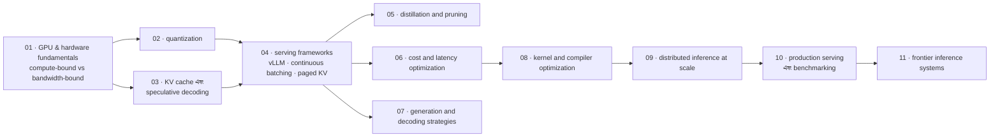

# Deployment এবং Inference Optimization

[← Back to curriculum index](../README.md)

একটি trained model-কে production-এ serve করার জন্য দ্রুত, সস্তা এবং নির্ভরযোগ্য করুন।

## এই phase-এর পথ

Training একবারের খরচ; inference হলো প্রতিদিন আসা বিল। এই phase শুরু হয় hardware থেকে, কারণ এখানে প্রায় প্রতিটি optimization দুটি সীমার একটির উত্তর — arithmetic throughput বা memory bandwidth — এবং আপনি কোনটিতে আঘাত করছেন তা জানলেই ঠিক হয় কোন technique কাজে লাগবে।

## এই phase-এর topic-গুলো

| # | Topic |
|---|-------|
| 01 | [GPU and Hardware Fundamentals](01-GPU-and-Hardware-Fundamentals/README.md) |
| 02 | [Quantization](02-Quantization/README.md) |
| 03 | [KV Cache and Speculative Decoding](03-KV-Cache-and-Speculative-Decoding/README.md) |
| 04 | [Serving Frameworks](04-Serving-Frameworks/README.md) |
| 05 | [Model Distillation and Pruning](05-Model-Distillation-and-Pruning/README.md) |
| 06 | [Cost and Latency Optimization](06-Cost-and-Latency-Optimization/README.md) |
| 07 | [Generation and Decoding Strategies](07-Generation-and-Decoding-Strategies/README.md) |
| 08 | [Kernel and Compiler Optimization](08-Kernel-and-Compiler-Optimization/README.md) |
| 09 | [Distributed Inference at Scale](09-Distributed-Inference-at-Scale/README.md) |
| 10 | [Production Serving and Benchmarking](10-Production-Serving-and-Benchmarking/README.md) |
| 11 | [Frontier Inference Systems](11-Frontier-Inference-Systems/README.md) |