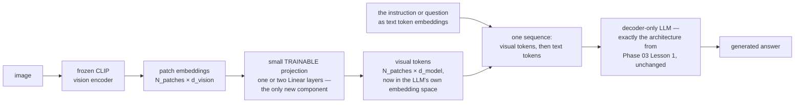

# Multimodal LLMs

**Phase:** [Advanced and Frontier Topics](../README.md) · **Topic folder:** `01-Multimodal-LLMs`

## কেন এটি গুরুত্বপূর্ণ

এই কোর্সে এ পর্যন্ত যা যা দেখেছ — [self-attention এবং multi-head attention](../../Phase-02-Transformer-Architecture-Deep-Dive/02-Self-Attention-and-Multi-Head-Attention/README.md) থেকে শুরু করে [decoder-only architecture](../../Phase-03-LLM-Architectures-and-Types/01-Decoder-Only-Models-GPT-Family/README.md), আর [instruction tuning](../../Phase-05-Finetuning-LLMs/04-Instruction-Tuning-SFT/README.md) পর্যন্ত — সব জায়গাতেই input-কে *text* token-এর একটি sequence হিসেবে ধরা হয়েছে। কিন্তু একটি decoder-only Transformer-এর core mechanism আসলে জানে না, কিংবা পাত্তাও দেয় না, যে একটি "token" শব্দার্থগতভাবে (semantically) কী বোঝায়; তার শুধু দরকার একটি shared embedding space-এ থাকা vector-এর একটি sequence, সাথে position। এই একটি পর্যবেক্ষণই আধুনিক multimodal LLM-গুলোর (GPT-4V/GPT-4o, Gemini, Claude-এর vision capability, LLaVA, Flamingo) পেছনের সম্পূর্ণ কৌশল: তুমি যদি একটি image-কে এমন একটি ছোট vector-sequence-এ রূপান্তর করতে পারো যা text-token embedding-এর *একই* space-এ বসবাস করে, তাহলে আগের phase-গুলোর ঠিক একই causal self-attention machinery এবং ঠিক একই next-token-prediction training objective দিয়েই "এই image-টা দেখ এবং এটি নিয়ে একটি প্রশ্নের উত্তর দাও" ধরনের কাজ প্রক্রিয়া করা সম্ভব — কোনো নতুন core architecture উদ্ভাবন করতে হয় না। এই lesson-এ সেই দুটি ধারণা আচ্ছাদিত হবে যেগুলো এটি সম্ভব করে তোলে — CLIP-স্টাইল contrastive alignment এবং LLaVA-স্টাইল visual instruction tuning — কোর্সের চূড়ান্ত phase-এর প্রথম lesson হিসেবে। এখান থেকে phase-টি এগিয়ে যাবে [Mixture of Experts, Advanced](../02-Mixture-of-Experts-Advanced/README.md)-এর দিকে।

## এই lesson-এ কী কী আচ্ছাদিত হবে

- কেন vision-language model-গুলোর বাকি সবকিছু কাজ করার আগে একটি *shared* embedding space প্রয়োজন
- CLIP: একটি symmetric InfoNCE loss-এর মাধ্যমে image এবং text-কে align করা contrastive pretraining
- CLIP-এর aligned space কী সক্ষম করে: zero-shot classification এবং cross-modal retrieval
- LLaVA-স্টাইল architecture: image patch-কে এমন "visual token"-এ রূপান্তর করা যেগুলো একটি LLM পড়তে পারে
- Visual instruction tuning: image সম্পর্কে নির্দেশনা আসলেই মেনে চলতে model-কে প্রশিক্ষণ দেওয়া
- এই ধারণাগুলো কোথায় সীমাবদ্ধ থাকে, এবং সম্পূর্ণ end-to-end multimodal training এর উপরে কী যোগ করে

## 1. মূল সমস্যা: image এবং text শুরুতেই তুলনাযোগ্য (comparable) নয়

টেক্সটের একটি অংশ, একবার tokenize করা হলে, পূর্ণসংখ্যার একটি sequence-এ পরিণত হয়, যাকে একটি learned embedding table vector-এ রূপান্তর করে। অন্যদিকে image হলো pixel-এর একটি গ্রিড — সম্পূর্ণ ভিন্ন ধরনের একটি বস্তু, যার কোনো সুস্পষ্ট "vocabulary" নেই। একটি LLM-এর attention layer image নিয়ে কোনো দরকারি কাজ করার আগে দুটি সমস্যার সমাধান করতে হবে:

1. **image-কে কোনোভাবে vector-এর একটি sequence-এ রূপান্তর করা।** Vision Transformer (ViT) থেকে পরিচিত মানক পদ্ধতিটি হলো image-কে নির্দিষ্ট মাপের patch-এ (যেমন 14x14 pixel) কেটে প্রতিটি patch-কে flatten করে linear projection করা, আর ফলে পাওয়া patch-vector-এর sequence-কে ঠিক সেভাবে ব্যবহার করা যেভাবে একটি Transformer token embedding-এর sequence ব্যবহার করে — সাথে একটি learned positional encoding যোগ করা হয়, যা text-এর জন্য [Phase 02-এর positional encoding](../../Phase-02-Transformer-Architecture-Deep-Dive/03-Positional-Encoding/README.md)-এর হুবহু অনুরূপ।
2. **সেই vector-গুলোকে text-এর সাথে সম্পর্কিত করে আসলেই কিছু *অর্থ* বহন করানো।** Random ভাবে initialize করা একটি patch projection এমন vector তৈরি করে যেগুলো LLM-এর text-token embedding space-এর সাথে কোনো সম্পর্কবিহীন একটি ইচ্ছামতো vector space-এ থাকে। এগুলোকে যেভাবে আছে সেভাবেই একটি language model-এর attention layer-এ ঢুকিয়ে দিলে সেটা model-কে noise দেওয়ার মতো হবে — তাই আগে দুটি modality-কে *aligned* করতে হবে।

CLIP সমস্যা 2-টি সরাসরি সমাধান করে: এটি একটি image encoder এবং একটি text encoder-কে scratch থেকে এমনভাবে প্রশিক্ষণ দেয় যাতে এদের output space দুটির মধ্যে যেকোনোটি কোনো language model-এর সংস্পর্শে আসার আগেই aligned হয়ে থাকে।

## 2. CLIP: contrastive language-image pretraining

CLIP (Radford et al., 2021) দুটি আলাদা encoder প্রশিক্ষণ দেয় — একটি vision encoder `f_img` (একটি ViT বা CNN) এবং একটি text encoder `f_text` (একটি Transformer, আগের phase-গুলোর মতোই causal বা bidirectional শৈলীতে) — আর এতে **কোনো manually labeled class-ই নেই**। একমাত্র supervision হলো ওয়েব থেকে সংগ্রহ করা স্বাভাবিকভাবে-ঘটে-থাকা (image, caption) জোড়া: মূল paper-এ এমন 400 million জোড়া ছিল।

training signal হলো একটি **contrastive loss**। `N` সংখ্যক (image, text) জোড়ার একটি batch-এর জন্য:

```
image_embeds = normalize( f_img(images) )     # (N, d), unit-length rows
text_embeds  = normalize( f_text(texts) )     # (N, d), unit-length rows

logits = (image_embeds @ text_embeds.T) * exp(temperature)   # (N, N) similarity matrix
```

`logits`-এর `i` নম্বর সারি ও `j` নম্বর কলাম হলো image `i` এবং text `j`-এর মধ্যে cosine similarity, যাকে একটি learned temperature দিয়ে scale করা হয়। image `i`-এর জন্য **একমাত্র** সঠিক match হলো text `i` (যে caption-এর সাথে এটিকে আসলে জোড়া দেওয়া হয়েছিল) — batch-এর বাকি প্রতিটি text-কে negative ধরা হয়। এতে সমস্যাটি একটি `N`-way classification-এ পরিণত হয়, যা সাধারণ cross-entropy দিয়ে *উভয়* দিকে সমাধান করে গড় করা হয় (এটিই loss-এর "symmetric" অংশ):

```
L_image_to_text = CrossEntropy( logits,   labels = [0, 1, ..., N-1] )   # rows: pick the right column
L_text_to_image = CrossEntropy( logits.T, labels = [0, 1, ..., N-1] )   # columns: pick the right row
L_CLIP = (L_image_to_text + L_text_to_image) / 2
```

এটি হুবহু InfoNCE contrastive loss, যাকে batch-কে নিজের negative-এর সেট হিসেবে ব্যবহার করে প্রয়োগ করা হয় — আলাদা কোনো negative-sampling পদ্ধতির দরকার নেই, কারণ batch-এর প্রতিটি non-matching জোড়া স্বয়ংক্রিয়ভাবে দুটি encoder-ের জন্যই একইসাথে negative হয়ে যায়। এই loss-কে minimize করলে প্রতিটি image-এর embedding তার নিজ caption-এর embedding-এর কাছে (উচ্চ cosine similarity) এবং batch-এর অন্য সব caption-এর embedding থেকে দূরে সরে যায়, আর text-এর জন্যও symmetric ভাবে একই ঘটে। মনে রেখো একই loss থেকে gradient *দুটি* encoder-েই প্রবাহিত হয় — দুটি tower-কে যৌথভাবে (jointly) প্রশিক্ষণ দেওয়া হয়, একটিকে freeze রেখে অন্যটির বিপরীতে নয়।

এই প্রশিক্ষণ পদ্ধতির সরাসরি ফল হলো, দুটি encoder শেষ পর্যন্ত একটি embedding space ভাগাভাগি করে, যা আর কোনো অতিরিক্ত প্রশিক্ষণ ছাড়াই দুটি জিনিস সক্ষম করে:

- **Zero-shot classification**: class-এর নামগুলোকে text prompt-এ রূপান্তর করো ("a photo of a {class}"), সবগুলোকে `f_text` দিয়ে embed করো, একটি নতুন image-কে `f_img` দিয়ে embed করো, আর সেই class-টি বেছে নাও যার text embedding-এর সাথে image-টির cosine similarity সবচেয়ে বেশি — কোনো classification head নেই, সেই dataset-এর label-এর উপর কোনো fine-tuning নেই।
- **Cross-modal retrieval**: একটি modality-তে query দেওয়া হলে, shared space-এ cosine similarity অনুযায়ী অন্য modality-এর প্রার্থীদের (candidates) র্যাংক করো। `example.py` টয় ডেটার (toy data) উপর ঠিক এই retrieval কাজটি বাস্তবায়ন করে — contrastive training-এর আগে ও পরে — যাতে loss-টির প্রভাব সরাসরি পরিমাপযোগ্য হয়।

## 3. aligned space থেকে multimodal LLM: LLaVA

CLIP তোমাকে একটি aligned embedding space দেয়, কিন্তু এটি মূলত *encoder*-এর একটি জোড়া — এটি বোঝাতে পারে একটি image আর একটি text কতটা মেলে, কিন্তু এটি কথোপকথন (conversation) চালাতে পারে না, নির্দেশনা মানতে পারে না, বা image নিয়ে স্বাধীনভাবে (free-form) text লিখতে পারে না। LLaVA (Liu et al., 2023, *Visual Instruction Tuning*) দেখায় কীভাবে খুব সামান্য নতুন machinery দিয়ে একটি CLIP-স্টাইল vision encoder-কে একটি decoder-only LLM-এর সাথে যুক্ত করা যায়:



তিনটি অংশ:

- **একটি pretrained (প্রায়ই frozen) vision encoder** — সাধারণত CLIP-এর নিজস্ব vision tower, কারণ এটিকে ইতিমধ্যেই এমন vector তৈরির জন্য প্রশিক্ষণ দেওয়া হয়েছে যা text-এর অর্থের সাথে অর্থপূর্ণভাবে aligned। এটি image-কে একটি fixed-length patch embedding-এর sequence-এ রূপান্তর করে।
- **একটি ছোট trainable projection layer** — একমাত্র সত্যিকার অর্থে নতুন উপাদান। এর পুরো কাজ হলো CLIP-এর vision-embedding space-কে LLM-এর token-embedding space-এ ম্যাপ করা, যাতে একটি "visual token" এবং একটি স্বাভাবিক text-token embedding মাত্রা-ও-অর্থ (dimensionally and semantically) দিক থেকে যথেষ্ট সামঞ্জস্যপূর্ণ হয় যেন *একই* attention layer দুটোই প্রক্রিয়া করতে পারে।
- **decoder-only LLM নিজেই**, সাধারণত pretrained এবং frozen অথবা হালকা (lightly) fine-tuned, যেমনটি [Phase 03 Lesson 1](../../Phase-03-LLM-Architectures-and-Types/01-Decoder-Only-Models-GPT-Family/README.md)-এ আচ্ছাদিত হয়েছে। এটি একটি interleaved sequence পায় — "image-এর ভেতরে যা আছে"-র প্রতিনিধিত্বকারী visual token, তার পরে (বা মাঝে মাঝে সন্নিবেশিত) ব্যবহারকারীর প্রশ্নের জন্য সাধারণ text-token embedding — আর পুরো জিনিসটিকে সাধারণ causal self-attention দিয়ে autoregressively প্রক্রিয়া করে। attention mechanism-এর কোনো পরিবর্তন হয় না: একটি text token ঠিক যেভাবে আগের যেকোনো text token-কে দেখতে পারে, সেভাবেই একটি visual token-কে দেখতে পারে; কারণ নির্মাণগতভাবে (by construction) তারা এখন একই space-এ থাকে।

এই সিস্টেমকে প্রশিক্ষণ দেওয়া একটি দুই-ধাপের (two-stage) পদ্ধতি, আর দ্বিতীয় ধাপটি [instruction tuning / SFT](../../Phase-05-Finetuning-LLMs/04-Instruction-Tuning-SFT/README.md)-এর সরাসরি প্রয়োগ:

1. **Feature alignment pretraining**: vision encoder এবং LLM দুটোই frozen থাকাবস্থায় *শুধু* ছোট projection layer-টিকে (image, caption) জোড়ার উপর প্রশিক্ষণ দাও, যাতে এটি visual token-গুলোকে এমন জায়গায় বসাতে শেখে যেখানে frozen LLM ইতিমধ্যেই অর্থবহভাবে interpret করতে পারে।
2. **Visual instruction tuning**: projection layer-কে (এবং সাধারণত LLM-কেও) (image, instruction, response) ট্রিপল-এর একটি dataset-এর উপর fine-tune করো — "এই হলো একটি image, এই হলো এটি নিয়ে একটি প্রশ্ন বা নির্দেশ, এই হলো আদর্শ উত্তর" — response token-গুলির উপর সেই একই next-token-prediction cross-entropy loss ব্যবহার করে যেটি সাধারণ text-only SFT ব্যবহার করে। এটা ঠিক Phase 05-এর instruction-tuning ধারণা, শুধু "instruction"-এর কিছু অংশ এখন খাঁটি text-এর বদলে image হিসেবে প্রকাশ করা হয়।

ফলাফল হলো এমন একটি model যাকে কখনও-না-দেখা একটি image-এর সাথে একটি free-form instruction ("describe this," "what's wrong with this chart?," "read the text in this sign") দেখানো যায়, আর এটি একটি সাবলীল, grounded, autoregressive text response তৈরি করে — [Phase 02-এর mini-Transformer lesson](../../Phase-02-Transformer-Architecture-Deep-Dive/06-Mini-Transformer-From-Scratch/README.md#4-autoregressive-generation)-এর ঠিক সেই একই generation loop ব্যবহার করে, শুধু আরও সমৃদ্ধ একটি input sequence দিয়ে।

## 4. এখানে কী কী বাদ দেওয়া হয়েছে

- **Resolution এবং patch count**: বাস্তব vision encoder প্রতি image-এ শত শত patch token তৈরি করে, যা সম্পূর্ণ LLM context window-এর মধ্য দিয়ে চালানো ব্যয়বহুল; production সিস্টেমগুলোতে patch merging, resampling (নিচে Flamingo-এর Perceiver Resampler-এর মতো), বা উচ্চ-রেজোলিউশনের image-এর জন্য dynamic tiling-এর মতো কৌশল ব্যবহার করা হয়।
- **Video এবং audio**: একই "একটি vector-sequence-এ encode করো, তারপর LLM-এর space-এ project করো" পদ্ধতিটি অন্যান্য modality-তেও প্রযোজ্য; তবে video একটি temporal dimension যোগ করে, আর audio-র নিজস্ব encoder পরিবার আছে (যেমন Whisper-স্টাইল encoder); মূল ধারণা বদলায় না।
- **Interleaved, multi-image এবং image-generation-এর ক্ষেত্রে**: এই lesson image-কে input হিসেবে বোঝার বিষয়টি আচ্ছাদন করে; কিছু frontier সিস্টেম output হিসেবে image বা video-ও *generate* করে, যার জন্য ভিন্ন একটি decoding mechanism দরকার (diffusion, বা discrete image-token autoregression)।

এই ঘাটতিগুলোর প্রতিটিই সঠিকভাবে নেওয়া হয়েছে **[Phase 11 — Vision-Language Models](../../Phase-11-Vision-Language-Models/README.md)**-এ, যেটি এই lesson-টির পূর্বাভাস দেওয়া এগারো-lesson-এর গভীর ডুব: vision encoder এবং resolution/token trade ([11.01](../../Phase-11-Vision-Language-Models/01-Vision-Encoders-and-Image-Tokenization/README.md)), contrastive pretraining কী বর্জন করে ([11.02](../../Phase-11-Vision-Language-Models/02-Vision-Language-Pretraining-Objectives/README.md)), Flamingo-এর cross-attention সহ তিনটি fusion strategy ([11.03](../../Phase-11-Vision-Language-Models/03-VLM-Architectures-and-Fusion-Strategies/README.md)), resampler এবং token compression ([11.04](../../Phase-11-Vision-Language-Models/04-Connectors-and-Visual-Token-Compression/README.md)), staged training pipeline ([11.05](../../Phase-11-Vision-Language-Models/05-Training-a-VLM-Staged-Pipeline/README.md)), instruction data ([11.06](../../Phase-11-Vision-Language-Models/06-Visual-Instruction-Tuning-and-VLM-Data/README.md)), hallucination এবং alignment ([11.07](../../Phase-11-Vision-Language-Models/07-VLM-Hallucination-and-Alignment/README.md)), grounding/OCR/video/GUI capability ([11.08](../../Phase-11-Vision-Language-Models/08-VLM-Capabilities-Grounding-OCR-Video-GUI/README.md)), evaluation ([11.09](../../Phase-11-Vision-Language-Models/09-Evaluating-VLMs/README.md)), serving ([11.10](../../Phase-11-Vision-Language-Models/10-VLM-Inference-and-Deployment/README.md)), আর vision-এর বাইরের multimodality — audio, video, 3D এবং any-to-any generation ([11.11](../../Phase-11-Vision-Language-Models/11-Beyond-Vision-Full-Multimodality/README.md))।

## ভিডিও স্ক্রিপ্টের রূপরেখা

1. মোটিভেশন (motivation) — attention-এর শুধু একটি shared space-এ vector দরকার; multimodality হলো "মাত্র" সেই space-টি তৈরি করা
2. দুটি উপ-সমস্যা: pixel-কে একটি sequence-এ রূপান্তর করা, আর সেই sequence-কে text-এর সাপেক্ষে অর্থপূর্ণ করা
3. CLIP-এর contrastive setup: দুটি encoder, একটি batch, একটি similarity matrix, একটি symmetric cross-entropy loss
4. একটি aligned space বিনামূল্যে কী দেয়: zero-shot classification এবং retrieval
5. LLaVA-এর তিনটি অংশ: frozen vision encoder, trainable projection, অপরিবর্তিত decoder-only LLM
6. image-সহ SFT হিসেবে visual instruction tuning — Phase 05-এর সাথে সংযোগ স্থাপন
7. `example.py`-এর walkthrough — scratch থেকে toy CLIP-style training, আগে vs. পরে retrieval accuracy মাপা
8. পুনরালোচনা + কী বাদ দেওয়া হয়েছে + [Mixture of Experts, Advanced](../02-Mixture-of-Experts-Advanced/README.md)-এর পূর্বাভাস

## আরও পড়ার জন্য

- Radford et al. (2021), *Learning Transferable Visual Models From Natural Language Supervision* (CLIP paper-টি)
- Liu, Li, Wu, Lee (2023), *Visual Instruction Tuning* (LLaVA paper-টি)
- Alayrac et al. (2022), *Flamingo: a Visual Language Model for Few-Shot Learning* (vision এবং language-এর মধ্যে সেতুবন্ধনের Perceiver Resampler পদ্ধতি)
- Dosovitskiy et al. (2021), *An Image is Worth 16x16 Words: Transformers for Image Recognition at Scale* (Vision Transformer / patch-embedding কাঠামো, যার উপর CLIP-এর vision tower এবং LLaVA দুটোই নির্মিত)