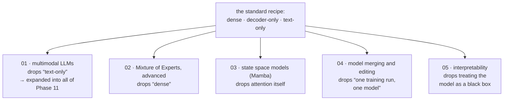

# Advanced এবং Frontier Topics

[← Back to curriculum index](../README.md)

এখন-স্ট্যান্ডার্ড Transformer রেসিপির বাইরে LLM research কোথায় যাচ্ছে, তা অন্বেষণ।

## এই phase-এর পথ

Phase 02–09 একটি নির্দিষ্ট রেসিপি তৈরি করেছে: একটি dense, decoder-only, text-only Transformer। এখানে প্রতিটি lesson সেই বাক্যটির একটি ভিন্ন অনুমান ভেঙে ফেলে, আর lessons-গুলো স্বাধীন — যেকোনো ক্রমে পড়ুন।

## এই phase-এর topic-গুলো

| # | Topic |
|---|-------|
| 01 | [Multimodal LLMs](01-Multimodal-LLMs/README.md) |
| 02 | [Mixture of Experts, Advanced](02-Mixture-of-Experts-Advanced/README.md) |
| 03 | [State Space Models (Mamba)](03-State-Space-Models-Mamba/README.md) |
| 04 | [Model Merging and Editing](04-Model-Merging-and-Editing/README.md) |
| 05 | [Interpretability and Mechanistic Interpretability](05-Interpretability-and-Mechanistic-Interpretability/README.md) |