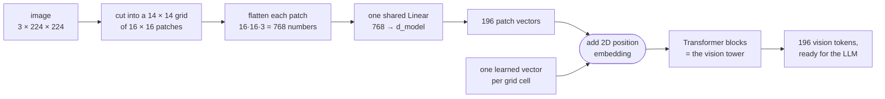
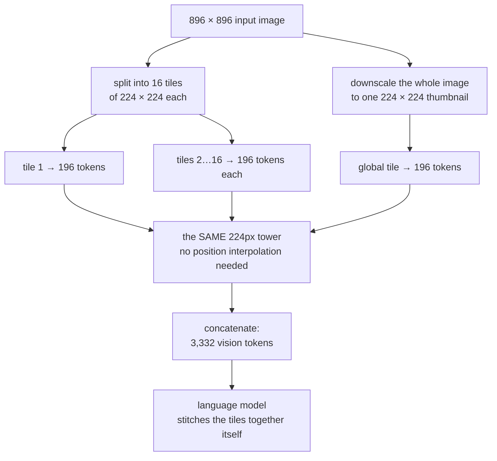
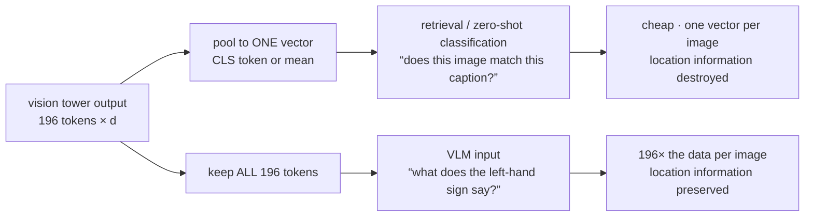

# ভিশন এনকোডার ও ইমেজ টোকেনাইজেশন

**Phase:** [Vision-Language Models](../README.md) · **Topic folder:** `01-Vision-Encoders-and-Image-Tokenization`

## কেন এটি গুরুত্বপূর্ণ

[Phase 10 Lesson 1](../../Phase-10-Advanced-and-Frontier-Topics/01-Multimodal-LLMs/README.md)-এ এই পুরো phase-এর কেন্দ্রীয় দাবিটি এক বাক্যে বলা হয়েছিল: একটি decoder-only Transformer একটি token কী *বোঝায়* তা নিয়ে ভাবে না, সেটি কেবল সঠিক space-এ একটি vector কিনা তা নিয়ে ভাবে, তাই multimodality আসলে ওই vectorগুলো তৈরি করার ব্যাপারে নেমে আসে। সেই lesson তারপর সরাসরি CLIP ও LLaVA-তে চলে যায়। এই phase-এ ফিরে গিয়ে পাইপলাইনটি ঠিকভাবে তৈরি করা হয়, আর সেই পাইপলাইনের প্রথমেই দরকার এমন একটি অংশ যা সবকিছুর আগে থাকে: পিক্সেলের একটি grid-কে একটি **sequence**-এ রূপান্তরকারী জিনিস। সেই component — ভিশন এনকোডার — নিচের প্রায় সবকিছুই নির্ধারণ করে। একটি ইমেজের কতগুলো token খরচ হয়, মডেল ছোট টেক্সট পড়তে পারে কি না, জিনিসগুলো *কোথায়* আছে তা জানতে পারে কি না, ইমেজটি LLM-এর context window-এর কতটা খেয়ে ফেলে, আর serving-এ prefill কতটা ব্যয়বহুল — সবই এখানে সিদ্ধান্ত হয়, ইমেজের tokenizer-এ, ঠিক যেমন [টেক্সট টোকেনাইজেশন](../../Phase-02-Transformer-Architecture-Deep-Dive/01-Tokenization/README.md) টেক্সটের জন্য সেগুলো নির্ধারণ করে। এই lesson-এ scratch থেকে একটি ইমেজ tokenizer তৈরি করা হয় এবং তার খরচ মাপা হয়; phase-এর বাকি অংশ এই প্রশ্ন নিয়ে — এর সাথে কী যুক্ত করবেন।

## এক-প্যারাগ্রাফ ওরিয়েন্টেশন

একটি **vision encoder** (বা "vision tower") হল VLM-এর ইমেজ-সংক্রান্ত অর্ধেক: পিক্সেল ভিতরে, vector-এর একটি sequence বাইরে। প্রভাবশালী ডিজাইন হল **Vision Transformer (ViT)** — [Phase 02](../../Phase-02-Transformer-Architecture-Deep-Dive/README.md)-এর সেই একই আর্কিটেকচার, শুধু subword token-এর বদলে ইমেজের বর্গাকার patch-এ প্রয়োগ করা। এই lesson-এর সবকিছুই এমন কিছুর ইমেজ-সংস্করণ যা আপনি টেক্সটের জন্য আগেই দেখেছেন:

| টেক্সট পাইপলাইন (Phases 02–03) | ইমেজ পাইপলাইন (এই lesson) |
|---|---|
| একটি string | একটি পিক্সেল grid, `(3, H, W)` |
| BPE tokenizer সেটিকে subword-এ ভাগ করে | patch embedding সেটিকে নির্দিষ্ট আকারের বর্গাকারে কাটে |
| ~50k শেখা embedding-এর একটি vocabulary | কোনো vocabulary নেই — প্রতিটি patch সরাসরি project হয় |
| প্রতি token-এ embedding-table lookup | flatten হওয়া patch-এর উপর একটি shared `Linear` |
| **একটি** অক্ষ বরাবর অবস্থান | **দুটি** অক্ষ বরাবর অবস্থান (একটি grid) |
| টেক্সটের প্রতি 4 অক্ষরে ~1 token | 224×224 ইমেজ প্রতি 196 token |
| sequence-টি Transformer-এ প্রবেশ করে | *ঠিক একই ধরনের* sequence Transformer-এ প্রবেশ করে |

শেষ সারিটিই পুরো phase-এর মূল কথা: এই ধাপের পরে, নিচের কোনো কিছুই বলতে পারবে না যে tokenগুলো পিক্সেল থেকে এসেছে। তাই এনকোডার এখানে যা হারায় তা চিরতরে হারায় — এজন্যই patch আকার নিয়ে একটি lesson শেষ পর্যন্ত hallucination (Lesson 7), OCR ক্ষমতা (Lesson 8) এবং আপনার serving বিল (Lesson 10)-এ প্রভাব ফেলে।

## এই lesson যা covers

- Patch embedding: ইমেজকে token sequence-এ রূপান্তরকারী সেই একটি অপারেশন, এবং কেন এটি `kernel_size == stride` বিশিষ্ট একটি `Conv2d`
- Vision-encoder পরিবার ও তাদের কী কী trade-off: ViT, CNN tower, ConvNeXt, এবং hybrid ডিজাইন
- ইমেজের জন্য 2D positional encoding, এবং কীভাবে একটি নির্দিষ্ট position grid নতুন resolution-এ টানা হয়
- Resolution-এর খরচ বক্ররেখা: token `res²` হারে, vision-tower attention `res⁴` হারে বাড়ে
- Dynamic tiling / AnyRes: উচ্চ-রেজোলিউশন ইমেজের production সমাধান
- Pooling: কেন একটি CLIP retrieval model প্রতি ইমেজে একটি vector রাখে আর একটি VLM সবগুলো রাখে
- Realistically কোন এনকোডার checkpoint VLM-গুলো ব্যবহার করে, এবং কেন

## 1. Patch embedding: ইমেজ tokenizer

টেক্সট আসে discrete symbol হিসেবে, আর [Phase 02 Lesson 1](../../Phase-02-Transformer-Architecture-Deep-Dive/01-Tokenization/README.md) ছিল একটি string-কে সেগুলোর sequence-এ খোদাই করা নিয়ে। একটি ইমেজ আসে ঘন `(C, H, W)` float tensor হিসেবে, যার মধ্যে কোনো symbolই নেই, আর এটিকে কোনো সুস্পষ্ট vocabulary-তে খোদাই করার উপায় নেই। Vision Transformer-এর উত্তর (Dosovitskiy et al., 2021) ইচ্ছা করেই সরল এবং আশ্চর্যজনকভাবে ভালো কাজ করে: ইমেজটিকে অসম্পন্ন, নির্দিষ্ট-আকারের patch-এর একটি grid-এ কাটুন — 14×14 বা 16×16 পিক্সেলই প্রমিত — প্রতিটি patch-কে `patch² × 3` সংখ্যার একটি vector-এ flatten করুন, আর সবগুলোকে **একটি shared linear layer** দিয়ে `d_model` মাত্রায় পাঠান।



এগোনোর আগে ওই ডায়াগ্রামে তিনটি বিষয় লক্ষ করার মতো। Patch grid **input resolution-এর দ্বারা নির্ধারিত**, তাই token সংখ্যা কোনো learning শুরু হওয়ার আগেই ঠিক হয়ে যায় (§4)। Projectionটি **একটি shared layer**, তাই patch 1 আর patch 196-কে অভিন্ন weight দিয়ে embed করা হয় — *কোথা* থেকে patch এসেছে সেই সম্পর্কিত সব জ্ঞান position embedding (§3)-এর মাধ্যমে আসে। আর tower-এর আউটপুট একটি **sequence**, কোনো ছবি নয়: এখান থেকে মডেল 196টি vector-কে কোনো এক ক্রমে ব্যবহার করে, 2D কাঠামো শুধু তাই যা position embedding কোড করেছে।

প্রতিটি ViT বাস্তবায়ন এটিকে একটিমাত্র `nn.Conv2d(3, d_model, kernel_size=P, stride=P)` হিসেবে লেখে। এটি কোনো approximation বা convolutional shortcut নয় — যখন kernel size সমান stride, তখন patchগুলো কখনোই overlapping হয় না আর convolution আক্ষরিক অর্থেই "প্রতিটি patch flatten করো, একই `Linear` প্রয়োগ করো।" `example.py` §1 এটি হাতে-কলে যাচাই করে: conv weight-কে একটি matrix-এ reshape করে, ম্যানুয়ালি স্লাইস করা flattened patch-এর সাথে গুণ করে, আর নিশ্চিত হয় যে ফলাফল conv আউটপুটের সাথে `1e-6` পর্যন্ত মেলে। কোনো অবশিষ্ট convolutional inductive bias বাকি থাকে না; মডেলটিকে শুধু position embedding ও attention-এর মাধ্যমেই স্থানিক কাঠামো শিখতে হয়।

জরুরি পরিণতি হল **token বাজেট**। 16px patch-এ 224px মানে 196 token। এটি ইমেজের সম্পূর্ণ প্রতিনিধিত্ব, আর মোটামুটি 150-শব্দের একটি অনুচ্ছেদের দৈর্ঘ্যের সমান। ছবি সম্পর্কে মডেল যা কিছু জানবে, তা এই 196টি vector-এ টিকে থাকতে হবে।

## 2. এনকোডার পরিবার: ওই vectorগুলো আসলে কী তৈরি করে

Patch embedding আপনাকে একটি sequence দেয়; এরপর কিছু একটা সেই sequence-কে contextualize করবে। বাস্তব VLM-এ চারটি পরিবার দেখা যায়:

| পরিবার | কীভাবে token তৈরি করে | শক্তি | দুর্বলতা |
|---|---|---|---|
| **ViT** (CLIP-ViT, SigLIP, DINOv2) | patch embed → আদর্শ Transformer block-এর স্তূপ | একরূপ token grid, data-র সাথে ভালো স্কেল হয়, LLM-এর নিজস্ব যন্ত্রের সাথে তুচ্ছভাবে সামঞ্জস্যপূর্ণ | token সংখ্যায় quadratic, খুব উচ্চ resolution-এ দুর্বল, data-ক্ষুধার্ত |
| **CNN tower** (ResNet, EfficientNet) | conv stage → চূড়ান্ত feature map token-এ flatten | শক্তিশালী locality prior, উচ্চ resolution-এ সস্তা, কম data-তেও ভালো | নির্দিষ্ট receptive-field কাঠামো, দুর্বল global reasoning, আধুনিক VLM-এ মূলত স্থানচ্যুত |
| **ConvNeXt / hierarchical** (ConvNeXt, Swin) | multi-scale stage, ধীরে ধীরে downsampled | multi-scale feature, উচ্চ resolution-এ sub-quadratic | ইন্টারফেস করা জটিলতর, অ-একরূপ token grid |
| **Native-resolution ViT** (NaViT, Qwen-VL-এর ViT) | প্রতি ইমেজে পরিবর্তনশীল patch সংখ্যা, sequence packing | কোনো নির্দিষ্ট বর্গাকার resize নেই, যেকোনো aspect ratio সামলায় | training-এ masking/packing যন্ত্রপাতি প্রয়োজন |

গুরুত্বপূর্ণ আর্কিটেকচারাল বিষয় হল চারটি পরিবারই একই জায়গায় শেষ হয় — একটি `(N, d_vision)` sequence — সুতরাং VLM stack-এর বাকি অংশ কোনটি ব্যবহার করছেন তার প্রতি agnostic। বাস্তবে পছন্দটি আর্কিটেকচারের চেয়ে বেশি নির্ধারিত হয় **এনকোডারটি কী দিয়ে pretrain করা হয়েছিল** সেটি দিয়ে, যা Lesson 2-এর বিষয়: একটি CLIP বা SigLIP tower ভাষার বিপরীতে প্রশিক্ষিত হয়েছে, তাই এটি ইতিমধ্যেই শব্দের সাথে সম্পর্কযুক্ত feature নির্গত করে, অন্যদিকে একটি DINOv2 tower শুধু self-supervision দিয়ে প্রশিক্ষিত এবং এটি তীক্ষ্ণ স্থানিক কাঠামোর কিন্তু কোনো ভাষাগত alignment ছাড়াই feature নির্গত করে। বেশ কয়েকটি শক্তিশালী VLM উভয় ধরনের feature একত্রে concatenate করে।

## 3. অবস্থান: মডেলকে বলা প্রতিটি patch কোথায় ছিল

একটি patch sequence-এর [Phase 02 Lesson 3](../../Phase-02-Transformer-Architecture-Deep-Dive/03-Positional-Encoding/README.md)-এ টেক্সটের জন্য চিহ্নিত সেই একই সমস্যা আছে: attention permutation-invariant, তাই স্পষ্ট সংকেত ছাড়া মডেল উপরে-বামের একটি patch-কে নিচে-ডানের একটি থেকে আলাদা করতে পারে না। আদর্শ সমাধান হল **প্রতি grid cell-এর জন্য একটি learned position embedding**, যা patch vector-এর সাথে যোগ করা হয় — টেক্সটের জন্য learned absolute position embedding-এর সরাসরি 2D প্রতিরূপ। আধুনিক tower-গুলো ক্রমবর্ধমানভাবে 2D RoPE ব্যবহার করে, যা Phase 02-এর rotary scheme-কে দুইটি অক্ষে প্রসারিত করে এবং অদেখা grid আকারে আরও ভালোভাবে generalizes।

Learned absolute grid-এর একটি নির্দিষ্ট ব্যবহারিক সমস্যা আছে। 224px-এ pretrained একটি tower-এর কাছে ঠিক `14 × 14 = 196`টি position vector আছে। 448px-এ চালান এবং আপনার দরকার `28 × 28 = 784` — এমন position যা কখনো প্রশিক্ষিত হয়নি। সর্বজনীন সমাধান হল position grid-কে `d_model` চ্যানেল-ওয়ালা একটি ছোট 2D ইমেজ হিসেবে ভাবা এবং নতুন grid আকারে এটিকে **bicubically interpolate** করা। `example.py` §3 এটি বাস্তবায়ন করে এবং একটি র্যান্ডম grid এবং একটি smoothed grid — দুইটির উপরই round trip (14 → 28 → 14) মাপে, দেখায় যে grid স্থানিকভাবে মসৃণ হলে error কমে। এটিই পুরো যুক্তি: প্রকৃত প্রশিক্ষিত position grid-গুলো প্রতিবেশী cell-এর মধ্যে দৃঢ়ভাবে সম্পর্কযুক্ত, তাই সেগুলোকে resample করা অর্থহীনতা নয়, বরং একটি মৃদু approximation। এটি এখনও একটি approximation, তাই যেসব মডেল resolution পরিবর্তন করে সেগুলো প্রায় সবসময়ই পরে সংক্ষেপে fine-tune করা হয়।

## 4. Resolution-এর খরচ বক্ররেখা

এটি সেই সংখ্যা যা phase-এর বাকি অংশে প্রতিটি ডিজাইন সিদ্ধান্ত নিয়ন্ত্রণ করে। নির্দিষ্ট patch আকারে, token সংখ্যা ইমেজ বাহু-এর **বর্গ** হারে বাড়ে, আর tower-এর ভেতরের self-attention সেটির *বর্গ* হারে বাড়ে:

```
resolution   patch tokens   attn cells (N²)   relative attn cost
   224px             196            38,416                 1.0x
   448px             784           614,656                16.0x
   896px           3,136         9,834,496               256.0x
  1344px           7,056        49,787,136              1296.0x
```

(প্রকৃত সংখ্যা, `example.py` §2 দ্বারা মুদ্রিত।) ওই টেবিলে দুইটি আলাদা খরচ লুকিয়ে আছে। Vision tower-এর নিজস্ব `res⁴` attention খরচটি দৃশ্যমান, কিন্তু একটি deployed system-এ সাধারণত যে খরচ প্রাধান্য পায় তা **রৈখিক** একটি: সেই 3,136 token পরে LLM-কে দেওয়া হয়, যেখানে তারা context দখল করে, প্রতিটি layer-এ একটি KV cache এন্ট্রি পায়, আর প্রতিটি generated token তাদের প্রতি attend করে। একটিমাত্র 896px ইমেজ, 3,136 token-এ, একই request-এ থাকা অধিকাংশ ব্যবহারকারীর প্রশ্নের চেয়ে বেশি LLM context খরচ করে — এমন একটি সত্য যা Lessons 4 এবং 10 দুটোই আবার ফিরে আসে।

## 5. বাস্তবে উচ্চ resolution: dynamic tiling

"তাহলে কম resolution ব্যবহার করো" — এটা সবসময় উত্তর হতে পারে না: রসিদ পড়া, চার্টের অক্ষ-লেবেল, বা রাস্তার সাইনবোর্ডের টেক্সট সত্যিই পিক্সেল দাবি করে। LLaVA-NeXT/AnyRes, InternVL, Qwen-VL ও অন্যান্যরা ব্যবহৃত production উত্তর হল **tiling**: উচ্চ-রেজোলিউশন ইমেজটিকে tower-এর *native* প্রশিক্ষিত resolution-এর tile-এ ভাগ করুন, প্রতিটি tile স্বাধীনভাবে encode করুন, আর পুরো ইমেজের একটি downscaled কপিও global layout-এর জন্য একটি "thumbnail" tile হিসেবে encode করুন। সেই সব ফলে আসা token concatenate করুন।



thumbnail শাখাটিই সেই অংশ যা লোকেরা ভুলে যায়, আর এটি-ই স্কিমটিকে কার্যকর করে: প্রতিটি detail tile নিজের 224px অঞ্চলটি পূর্ণ বিশ্বস্ততায় দেখে কিন্তু বাকি ইমেজটি কেমন তা জানার কোনো উপায় নেই, তাই global দৃশ্য ছাড়া মডেল একটি দরজার হাতল বর্ণনা করতে পারে আর মিস করতে পারে যে সে আসলে একটি দরজা দেখছে।

`example.py` §4 একটি 896×896 ইমেজের জন্য উভয় বাজেট হিসাব করে। Tiling token সংখ্যা **কমানোয় না** — এটি 3,332 বনাম 3,136, মূলত একই — কিন্তু ভিশন-tower attention কাজ ~15× কমায় এবং, আরও গুরুত্বপূর্ণ, প্রতিটি tile-কে এনকোডার প্রকৃতপক্ষে যে resolution-এর জন্য প্রশিক্ষিত ছিল সেটিতে রাখে, position-interpolation mismatch সম্পূর্ণরূপে দূর করে। দাম হলো, বিভিন্ন tile-এর patchগুলো tower-এর ভেতরে কখনো একে অপরের প্রতি attend করে না; cross-tile সংযোজন LLM-এর উপর বর্তায়, এজন্যই global thumbnail tile এত গুরুত্বপূর্ণ।

## 6. Pooling: একটি vector নাকি সবগুলো

একটি vision tower-কে দুইভাবে পড়া যায়, আর এই পছন্দ retrieval model-কে VLM থেকে আলাদা করে:

- **একটি vector-এ pool করা** (CLS token, বা patch-এর উপর mean)। CLIP এটি করে, কারণ এর contrastive loss কখনোই একটি ইমেজ vector-এর সাথে একটি টেক্সট vector ছাড়া অন্য কিছু তুলনা করে না। সস্তা, আর retrieval বা zero-shot classification-এর জন্য যথেষ্ট।
- **পুরো patch sequence রাখা।** একটি VLM এটি করে, কারণ "বাম পাশের সাইনবোর্ডে কী লেখা?" — এই প্রশ্নের উত্তর একটি global summary থেকে দেওয়া যায় না।



`example.py` §5 ক্ষতিকে concretely দেখায়: এটি দুটি ইমেজ তৈরি করে যাতে অভিন্ন উজ্জ্বল বর্গ আছে, একটি উপরে-বামে আর একটি নিচে-ডানে, position term সরিয়ে দেয়, আর দেখায় তাদের mean-pooled representation-এর cosine similarity `1.0000` — আক্ষরিক অর্থে আলাদা করা যায় না — অথচ আলাদা patch token-এর 50% ভিন্ন। Pooling অবস্থান ধ্বংস করে। "এই ইমেজটি কি এই caption-এর সাথে মেলে?" — এই প্রশ্নের জন্য এটি ঠিক আছে, কিন্তু "উপরের-ডান কোণে কী আছে?" — এর জন্য মারাত্মক।

এটিই সেই টান যা পুরো phase-টি চলে: সব token রাখলে detail রক্ষা পায়, আর খরচ হয় context। Lesson 4 সম্পূর্ণরূপে সেই trade-কে নিয়ে।

## 7. VLM-গুলো আসলে কী ব্যবহার করে

ওরিয়েন্টেশনের জন্য, কারণ checkpoint নাম VLM paper-গুলোতে ক্রমাগত দেখা যায়:

- **CLIP ViT-L/14 @336px** — 576 token/ইমেজ; মূল LLaVA vision tower এবং এখনও একটি সাধারণ baseline।
- **SigLIP / SigLIP2 (So400m)** — Lesson 2-এর sigmoid loss দিয়ে প্রশিক্ষিত; এখন নতুন open VLM-এ বেশি সাধারণ default।
- **DINOv2** — self-supervised, কোনো ভাষাগত alignment নেই, অস্বাভাবিকভাবে শক্তিশালী spatial/dense feature; প্রায়ই CLIP-ধাঁচের tower-এর সাথে একত্রিত হয়।
- **Native-resolution tower (Qwen-VL series, NaViT-ধাঁচের)** — packing-সহ প্রতি ইমেজে পরিবর্তনশীল token সংখ্যা; square-resizing সম্পূর্ণ এড়ায়।

## Video Script Outline

1. প্রেরণা — Phase 10 বলেছিল "শুধু vector বানাও"; এই lesson সেই জিনিসটি তৈরি করে যে সেগুলো বানায়
2. Scratch থেকে patch embedding, এবং `Conv2d(kernel=stride)` identity, সংখ্যাভিত্তিকভাবে যাচাইকৃত
3. Token বাজেট: 196টি vector-ই সম্পূর্ণ ইমেজ
4. এনকোডার পরিবার এবং প্রকৃত নির্বাচনের মানদণ্ড — tower কী দিয়ে pretrain হয়েছে, এর block নয়
5. 2D position embedding, এবং একটি 14×14 grid-কে 28×28-এ interpolate করা
6. `res²` / `res⁴` খরচ টেবিল, আর deployment-এ এই দুই খরচের কোনটি সত্যিই কামড়ায়
7. Dynamic tiling: একই token সংখ্যা, native resolution, কোনো cross-tile attention নেই
8. Pooling ডেমো — দুইটি ইমেজ, অভিন্ন mean-pooled vector, token-এর 50% ভিন্ন
9. Recap + [Lesson 2](../02-Vision-Language-Pretraining-Objectives/README.md)-এর পূর্বাভাস: কীভাবে এই feature-গুলো প্রথমে ভাষার সাথে aligned হয়

## Further Reading

- Dosovitskiy et al. (2021), *An Image is Worth 16x16 Words* (the ViT patch-embedding scheme everything here is built on)
- Radford et al. (2021), *Learning Transferable Visual Models From Natural Language Supervision* (CLIP; the vision towers most VLMs start from)
- Oquab et al. (2023), *DINOv2: Learning Robust Visual Features without Supervision* (the self-supervised alternative tower)
- Dehghani et al. (2023), *Patch n' Pack: NaViT, a Vision Transformer for any Aspect Ratio and Resolution* (native-resolution encoding)
- Liu et al. (2024), *LLaVA-NeXT* (the AnyRes dynamic-tiling scheme described in §5)