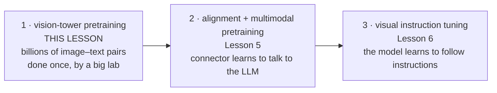
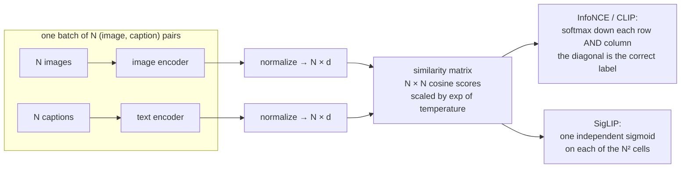
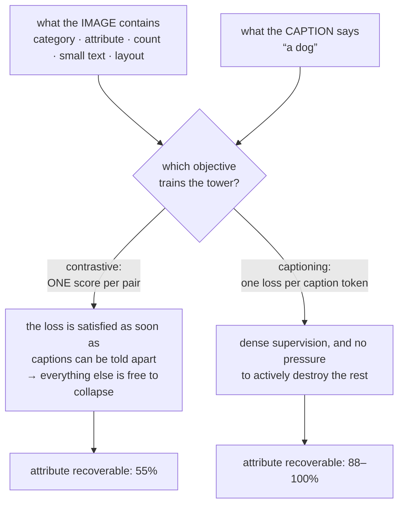

# ভিশন-ল্যাঙ্গুয়েজ প্রিট্রেইনিং অবজেকটিভ

**Phase:** [Vision-Language Models](../README.md) · **Topic folder:** `02-Vision-Language-Pretraining-Objectives`

## কেন এটি গুরুত্বপূর্ণ

[Lesson 1](../01-Vision-Encoders-and-Image-Tokenization/README.md)-এ সেই যন্ত্রপাতি তৈরি হয়েছিল যা পিক্সেলকে ভেক্টরের একটি sequence-এ রূপান্তর করে, আর শেষ করা হয়েছিল এই পর্যবেক্ষণে যে tower-এর *আর্কিটেকচার*-এর চেয়ে অনেক বেশি গুরুত্বপূর্ণ তাকে যা করতে প্রশিক্ষণ দেওয়া হয়েছে। এই lesson সেই "যা"টি। একটি vision tower-এর pretraining অবজেকটিভ ঠিক করে যে একটি ইমেজ সম্পর্কে কোন তথ্য তার feature-এ টিকে থাকে আর কোনগুলো ফেলে দেওয়া হয়, আর — কারণ একটি VLM সাধারণত একটি frozen বা প্রায় frozen tower-এর উপর তৈরি হয় — এখানে যা কিছু বাদ পড়ে তা চিরতরে চলে যায়, পরে যুক্ত করা language model যত ভালোই হোক না কেন। [Phase 04 Lesson 2](../../Phase-04-Pretraining-LLMs/02-Pretraining-Objectives/README.md) টেক্সটের জন্য একই যুক্তি দিয়েছিল: আর্কিটেকচার নয়, অবজেকটিভই ঠিক করে যে একটি pretrained মডেল কী জানে। এখানে দাঁড়িপাল্লা আরও বেশি, কারণ এখানে প্রস্তাবিত অবজেকটিভগুলো পরস্পরের চেয়ে অনেক বেশি ভিন্ন — causal LM আর masked LM-এর তুলনায়ও যত ভিন্ন নয় — আর সবচেয়ে জনপ্রিয়টি, CLIP-এর contrastive loss, একটি নির্দিষ্ট, পরিমাপযোগ্য উপায়ে প্রমাণযোগ্যভাবে lossy।

## ওরিয়েন্টেশন: এটি কোন training run?

একটি VLM-এ **তিনটি** আলাদা training effort থাকে, আর এই lesson প্রথমটি নিয়ে — যা সাধারণত VLM তৈরিকারী ব্যক্তি করেন না:



প্রায় সবাইই একটি শেষ করা tower (CLIP, SigLIP, DINOv2) ডাউনলোড করেন এবং step 2 থেকে শুরু করেন। step 1 নিজেই একটি আলাদা lesson-এর যোগ্য হওয়ার ঠিক কারণটি এটাই: **আপনি এর blind spot-গুলো উত্তরাধিকার সূত্রে পান এবং সেগুলো আর ফিরিয়ে আনতে পারেন না।** নিচে ব্যবহৃত পরিভাষাগুলোর একটি দ্রুত glossary, সবগুলোই অবজেকটিভ — ডেটাকে gradient-এ রূপান্তরের রেসিপি:

| পরিভাষা | এক লাইনে অর্থ |
|---|---|
| **Contrastive / ITC** | মিল থাকা (image, caption) জোড়াগুলোকে টানা, মিল না থাকা জোড়াগুলোকে ঠেলে দওয়া |
| **InfoNCE** | batch-এর উপর একটি `N`-way softmax classification হিসেবে লেখা contrastive loss (CLIP) |
| **Temperature** | softmax-এর আগে similarity score-গুলোকে তীক্ষ্ণ করা একটি learned scalar |
| **SigLIP** | batch-জুড়ে softmax-এর বদলে প্রতি জোড়ায় একটি independent sigmoid নিয়ে একই ভাবনা |
| **Captioning** | ইমেজ দেখে caption-এর সাধারণ next-token prediction |
| **ITM** | দুইটি modalityই cross-attention-এ *interaction* দেখা একটি binary "এই দুটো কি মেলে?" head |
| **Hard negative** | মডেল বর্তমানে মনে করে এটি মেলে এমন একটি অমিল জোড়া — তথ্যপূর্ণ ধরনটি |

## এই lesson যা covers

- Contrastive alignment: InfoNCE (CLIP) বিস্তারিত, এবং এটি batch size-কে কেন এত ক্ষুধার্ত করে
- SigLIP-এর pairwise sigmoid loss, আর global softmax সরিয়ে পাওয়া যায় কী
- Learned temperature ও bias, আর দুটোই কেন থাকে
- Generative অবজেকটিভ: captioning (CapPa, CoCa), এবং hard negative সহ image-text matching (BLIP)
- Masked ও self-supervised অবজেকটিভ (BEiT-3, FLAVA, DINOv2) ভাষাহীন বিকল্প হিসেবে
- পরিমাপ করা হয়েছে: একটি contrastive tower যা **ধ্বংস** করে আর একটি captioning tower যা রেখে দেয়
- Loss নয়, ডেটা: alt-text, filtering, আর re-captioning কৌশল যা যেকোনো অবজেকটিভ পরিবর্তনের চেয়ে বেশি কিছু ঠিক করেছে

## 1. Contrastive alignment: InfoNCE

[Phase 10 Lesson 1 §2](../../Phase-10-Advanced-and-Frontier-Topics/01-Multimodal-LLMs/README.md#2-clip-contrastive-language-image-pretraining) CLIP-এর symmetric InfoNCE loss পরিচয় করিয়েছিল; এই অংশ তার পরিণতি নিয়ে। `N` সংখ্যক (image, text) জোড়ার একটি batch-এর জন্য দুটি encoder-ই unit-norm ভেক্টর নির্গত করে, একটি `N × N` similarity matrix তৈরি হয়, আর diagonal-কে correct label ধরে দুই অক্ষ বরাবর cross-entropy প্রয়োগ করা হয়:

```
logits = exp(t) * image_embeds @ text_embeds.T          # (N, N)
L = ½ · [ CE(logits, arange(N)) + CE(logitsᵀ, arange(N)) ]
```



মূল কাঠামোগত বৈশিষ্ট্যটি হল softmax **সম্পূর্ণ batch জুড়ে** normalize করে। batch-এর প্রতিটি অন্যান্য আইটেমই একটি negative, তাই একটি একক training example-এর কাজ হল "`N`-টির মধ্যে সঠিক caption-টি বেছে নাও" — আর একটি `N`-way classification সর্বোচ্চ `log N` nats তথ্য বহন করে। `N = 4`-এ কাজটি তুচ্ছ; encoder-গুলো একটি মোটামুটি representation দিয়ে সেটি সমাধান করে ফেলে আর তারপর আর কিছু শেখার থাকে না। `N = 32,768`-এ (CLIP-এর প্রকৃত batch size) কাজটি সত্যিই কঠিন, আর fine-grained representation তৈরির চাপ পুরো training জুড়ে টেকে থাকে।

`example.py` §1 ঠিক এটিই মাপে। আটটি encoder *একই* সংখ্যক example-এ প্রশিক্ষণ নেয় (শুধু batch size, তাই step count ভিন্ন) এবং held-out 256-way retrieval দিয়ে স্কোর করা হয়:

```
  batch   steps   negatives/anchor   InfoNCE R@1   Sigmoid R@1
      4    8000                  3        63.5%        81.4%
     16    2000                 15        76.8%        96.7%
     64     500                 63        97.0%        97.9%
    256     125                255        98.1%        97.2%
```

ডেটা বাজেট স্থির রেখে InfoNCE 63.5% থেকে 98.1% পর্যন্ত ওঠে — কেবল প্রতি step কতগুলো negative দেখে তার একটিমাত্র ফাংশন হিসেবে। এই একটি তথ্যই প্রকৃত engineering-এর বিরাট অংশ চালায়: contrastive training run-গুলো batch-কে শত শত accelerator-এ shard করে এবং প্রতিটি embedding **all-gather** করে, যাতে প্রতিটি device-এর softmax বৈশ্বিক batch দেখে। `32,768²` logits matrix নিজেই fp16-এ 2.1 GB, তাই production বাস্তবায়নগুলো সম্পূর্ণভাবে materialize না করে chunks-এ হিসাব করে।

## 2. SigLIP: softmax বাদ দেওয়া

SigLIP (Zhai et al., 2023) batch-wise softmax-এর বদলে প্রতিটি জোড়ায় একটি independent **sigmoid** বসায় — সব `N²` cell-এ একটি binary "এই দুটো কি একসাথে যায়?" classification:

```
logits  = exp(t) * image_embeds @ text_embeds.T + b
targets = +1 on the diagonal, −1 everywhere else
L = − Σ log σ(targets ⊙ logits) / N
```

batch জুড়ে কিছুই normalize হয় না, তাই device জুড়ে কিছু gather করতেও হয় না, আর loss ছোট `N`-এও well-posed থাকে। `example.py`-র টেবিলে sigmoid loss batch 4-এ 81.4% পৌঁছায় যেখানে InfoNCE 63.5% করে, আর batch বাড়লে দুটোই কাছাকাছি আসে। এটি প্রকৃত scale-এ paper-এর headline ফলাফলের সাথে মেলে: SigLIP CLIP-এর সমতুল্য বা তার চেয়ে ভালো করে অথচ batch-কে অনেক কম ক্ষুধার্ত, তাই নতুন বেশিরভাগ খোলা VLM-এ এটিই default tower হয়ে গেছে।

`+ b` পদটি অলংকার নয়। `N²` জোড়ার মধ্যে `N² − N` negative, তাই initialization-এ "সব জায়গায় *মিল নেই* বলা" একটি চমৎকার strategy; একটি learned, শক্তিশালীভাবে negative bias সেই prior-টিকে শোষণ করে যাতে `N`-টি positive-এর উপর gradient signal ডুবে না যায়। `example.py` §2 প্রতিটিতে এটি −10 থেকে −11-এর মধ্যে থেমে যেতে দেখায়।

Learned **temperature** `exp(t)` দুই loss-এই এক এবং সমানভাবে গুরুত্বপূর্ণ। Cosine similarities `[−1, 1]`-এ সীমাবদ্ধ; সরাসরি softmax-এর মধ্যে ঢোকালে encoder-এর মান নির্বিশেষে এগুলো প্রায় uniform distribution ও ক্ষয়ীভূত gradient দেয়। তাই scale একটি trained parameter, যা similarity-গুলো তথ্যপূর্ণ হওয়ার মতো তীক্ষ্ণ না হওয়া পর্যন্ত বাড়ে — CLIP স্থিতিশীলতার জন্য সেটিকে 100-এ clamp করে, আর example script-ও তাই করে।

## 3. Generative ও matching অবজেকটিভ

Contrastive alignment একটি পরিবার। বাকিগুলো:

| অবজেকটিভ | প্রতি example-এ signal | যারা ব্যবহার করে | কোন কাজে ভালো |
|---|---|---|---|
| **Contrastive (ITC)** | প্রতি জোড়ায় একটি similarity score | CLIP, SigLIP, ALIGN | retrieval, zero-shot classification, স্কেল করা সস্তা |
| **Captioning (LM loss)** | প্রতি caption token-এ একটি cross-entropy | CoCa, CapPa, PaLI, GIT | fine-grained detail, VLM head হিসেবে সরাসরি পুনর্ব্যবহারযোগ্য |
| **Image-Text Matching (ITM)** | cross-attention দিয়ে *hard* negative সহ binary match/no-match | BLIP, ALBEF | সেই fine পার্থক্য যা contrastive scoring ঝাপসা করে দেয় |
| **Masked modeling** | প্রতি masked token পুনর্গঠন | BEiT-3, FLAVA, MAE | ঘন স্থানিক feature; caption লাগে না |
| **Self-distillation** | augmented view-দের মধ্যে ঐকমত্য | DINOv2 | সবচেয়ে শক্তিশালী dense/spatial feature, শূন্য ভাষা |

প্রতি example-এ তথ্যের পার্থক্যটি সুস্পষ্ট: contrastive supervision প্রতি জোড়ায় একটি সংখ্যা দেয়, অন্যদিকে captioning প্রতি token-এ একটি সম্পূর্ণ cross-entropy দেয়। CoCa-র ডিজাইনের (একটি tower, দুই loss) আড়ালে এবং captioning-এ pretrain করা tower-গুলো retrieval দুর্বল থাকা সত্ত্বেও VQA-ধাঁচের কাজে ভালোভাবে transfer করার সেই সনাক্তকরণের আড়ালে এই প্রক্রিয়াটিই কাজ করে।

BLIP-এর ITM head-টি নোট করার মতো, কারণ এটি একটি নির্দিষ্ট contrastive ব্যর্থতা ঠিক করে। Contrastive scoring দুটি pooled ভেক্টরকে dot product দিয়ে তুলনা করে — নির্দিষ্ট শব্দ আর নির্দিষ্ট অঞ্চলের মধ্যে *interaction*-এর কখনোই মডেল করতে পারে না। ITM দুই modality-ই cross-attention দিয়ে ঢোকায় এবং একটি binary প্রশ্ন করে, batch-এর সবচেয়ে কঠিন negative-গুলো খুঁড়ে বের করতে contrastive score ব্যবহার করে (যে অমিল জোড়াগুলো contrastive head ইতিমধ্যেই সদৃশ মনে করে)। "একটি ঘোড়ায় চড়া লোক" বনাম "একটি লোকের উপর চড়া ঘোড়া" আলাদা করা যায় এমন জায়গাটিই এখানে।

## 4. Contrastive pretraining কী ধ্বংস করে

CLIP-ধাঁচের pretraining সম্পর্কে সবচেয়ে গুরুত্বপূর্ণ ব্যবহারিক তথ্যটি হল এর lossiness ইত্তিফাকজনক নয় — অবজেকটিভই এটাই চায়। `example.py` §3 এটিকে পরিমাপযোগ্য করে। প্রতিটি synthetic ইমেজ একটি **category** আর একটি **attribute** বহন করে; প্রতিটি caption শুধু category নাম করে, ঠিক যেমন প্রকৃত web alt-text ("একটি কুকুর", "বাঁ দিকে তাকানো একটি ছোট বাদামি কুকুর" নয়)। তিনটি image tower প্রশিক্ষণ দিয়ে freeze করা হয়, তারপর linear-probe করা হয়:

```
image tower trained with            category  attribute  within/between
contrastive (InfoNCE)                100.0%     55.4%          0.0060
captioning, category only            100.0%     87.5%          0.0310
captioning, category + attribute     100.0%    100.0%          0.5694
chance                                 8.3%     25.0%
```



তিনটিই category নিখুঁতভাবে শেখে। পার্থক্য পড়ে যে attribute-টিকে *কোনো caption কখনো উল্লেখ করে না*, আর তৃতীয় স্তম্ভ কারণ বলে: contrastive training-এর একটি ইমেজের target হল তার caption-এর embedding, আর একটি category-র প্রতিটি ইমেজ একই caption ভাগ করে নেয়, তাই loss সেগুলোকে সক্রিয়ভাবে একটি বিন্দুতে **চেপে** দেয়। এর within-category spread captioner-এর তুলনায় ৫ গুণ ছোট, আর attribute-ও সেটির সাথে ক্ষয় হয়। Captioner ঠিক একই category label-এ supervised, তবু attribute অনেক বেশি রেখে দেয় — একটি generative head-এর সেই তথ্য ধ্বংস করার কোনো উদ্দীপনা থাকে না যা এটি ব্যবহার করে না।

এটি বড় করে দিলেই হলো CLIP tower গুনগুনে, ছোট টেক্সটে, সুনির্দিষ্ট spatial relation-এ আর fine attribute-এ দুর্বল কেন — এগুলোই ঠিক সেসব জিনিস যা এক-লাইনের web caption বাদ দেয়, তাই web caption পুনরুৎপাদনে প্রশিক্ষিত একটি loss সেগুলো বাদ দিতেই প্রশিক্ষিত হয়। ক্ষেত্রের প্রতিক্রিয়াগুলো বর্তমান মডেলে সবই দেখা যায় — অবজেকটিভ মেলানো (CoCa), DINOv2-র মতো একটি self-supervised tower-এর সাথে contrastive tower মেলানো, অথবা loss-এর বদলে ডেটার দিকে আক্রমণ করা।

## 5. অবজেকটিভের চেয়ে ডেটা জয়ী

খোলা VLM pretraining-এ একক সবচেয়ে বড় মান বৃদ্ধি এসেছে নতুন loss থেকে নয়, **re-captioning** থেকে: প্রতিটি corpus-এ বিদ্যমান একটি captioner চালিয়ে ছোট, ঝামেলাপূর্ণ alt-text-কে ঘন synthetic বর্ণনা দিয়ে প্রতিস্থাপন করা (যেমন LLaVA ও DALL·E 3-এর data pipeline-এ, এবং পরের বহু মডেলের জন্য প্রতিবেদিত "সবকিছু recaption" ফলাফলে)। অবজেকটিভের ceiling caption-এ যা উল্লেখ করা হয় তা দিয়ে নির্ধারিত হলে, সমৃদ্ধ caption loss-এ স্পর্শ না করেই ceiling বাড়িয়ে দেয়।

ডেটার গল্পের বাকিটা filtering। LAION-400M/5B তৈরি হয়েছিল যে জোড়া রাখা হয়েছিল যার CLIP similarity একটি threshold ছাড়িয়েছিল — যা নীরবে একটি পুরনো CLIP মডেলের bias-কে পরবর্তীটির training set-এ ঢুকিয়ে দেয়। DataComp পুরো ব্যাপারটিকে একটি benchmark হিসেবে নতুন করে ধরে যেখানে *dataset*-ই submission আর training recipe স্থির থাকে, আর এর ফলাফল অস্পষ্ট নয়: নির্দিষ্ট compute-এ, filtering strategy চূড়ান্ত accuracy-কে বেশিরভাগ আর্কিটেকচারাল বা অবজেকটিভ পরিবর্তনের চেয়ে বেশি নাড়ায়। Downstream eval set-এর বিরুদ্ধে deduplication-ও গুরুত্বপূর্ণ, ঠিক সেই কারণে [Phase 04 Lesson 1](../../Phase-04-Pretraining-LLMs/01-Pretraining-Data-Pipeline/README.md) টেক্সটের জন্য যা দেয় — আর এটি প্রায়ই খারাপভাবে করা হয়, যা [Lesson 9](../09-Evaluating-VLMs/README.md) একটি benchmark-contamination সমস্যা হিসেবে ফিরে দেখায়।

## ভিডিও স্ক্রিপ্ট রূপরেখা

1. প্রেরণা — tower-এর অবজেকটিভই ঠিক করে feature-এ কী টিকে থাকে; যা ফেলে দেওয়া হয়েছে LLM তা আর ফেরত পায় না
2. InfoNCE পুনরালোচনা, আর batch-wise softmax-এর `log N` তথ্য ceiling
3. নির্দিষ্ট ডেটা বাজেটে পরিমাপ করা batch-size বক্ররেখা: 63.5% → 98.1%
4. এতে engineering-এ যা খরচ পড়ে: all-gather, sharded softmax, 2.1 GB-এর একটি logits matrix
5. SigLIP: independent sigmoid, all-gather ছাড়া, আর bias পদটি কেন প্রয়োজন
6. Learned temperature — ছাড়া softmax-এর জন্য cosine similarity খুবই পাতলা
7. অবজেকটিভের চিড়িখানা: contrastive বনাম captioning বনাম ITM বনাম masked বনাম self-distillation, আর প্রতি example-এ তথ্য
8. Collapse পরীক্ষা: caption যা বাদ দেয় contrastive সেটিই ধ্বংস করে, তিনভাবে মাপা
9. অবজেকটিভের চেয়ে ডেটা জয়ী — re-captioning, CLIP-score filtering, DataComp
10. পুনরালোচনা + [Lesson 3](../03-VLM-Architectures-and-Fusion-Strategies/README.md)-এর প্রাকদর্শন: এই featureগুলো একটি language model-এ কীভাবে ঢোকে

## পরবর্তী পাঠ

- Radford et al. (2021), *Learning Transferable Visual Models From Natural Language Supervision* (CLIP)
- Zhai, Mustafa, Kolesnikov, Beyer (2023), *Sigmoid Loss for Language Image Pre-Training* (SigLIP)
- Yu et al. (2022), *CoCa: Contrastive Captioners are Image-Text Foundation Models* (দুই অবজেকটিভই এক tower-এ)
- Li, Li, Xiong, Hoi (2022), *BLIP: Bootstrapping Language-Image Pre-training* (ITC + hard negative সহ ITM + captioning)
- Tschannen et al. (2023), *Image Captioners Are Scalable Vision Learners Too* (CapPa; প্রতিযোগী pretraining অবজেকটিভ হিসেবে captioning)
- Gadre et al. (2023), *DataComp: In search of the next generation of multimodal datasets* (variable হিসেবে dataset)
