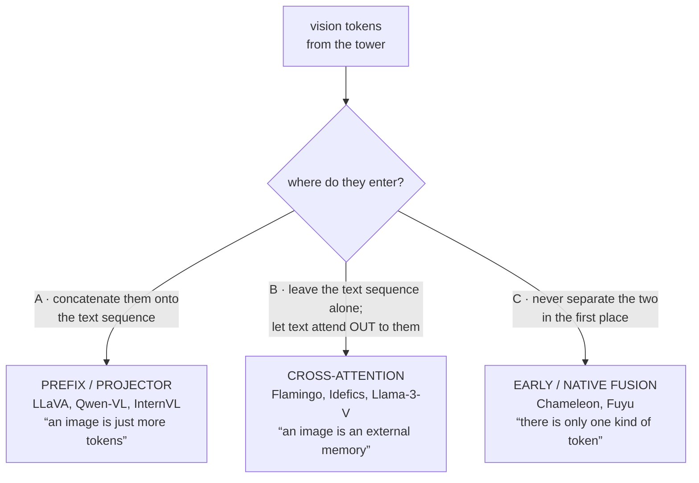
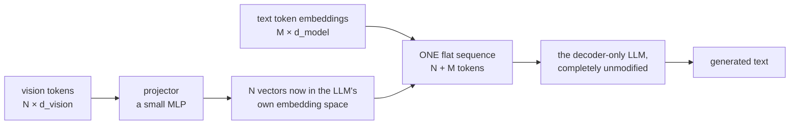
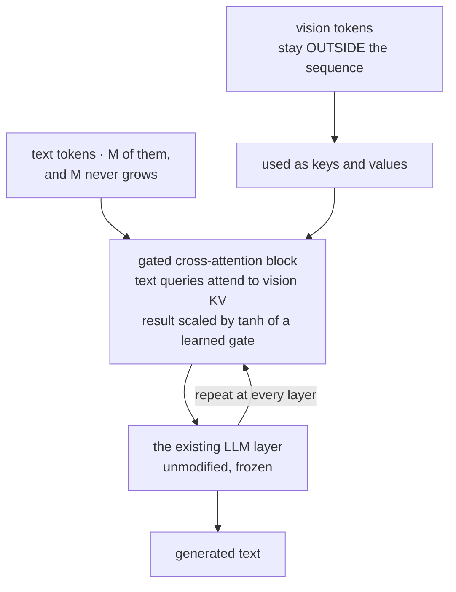
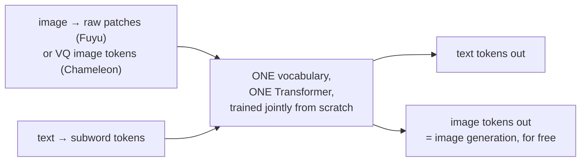
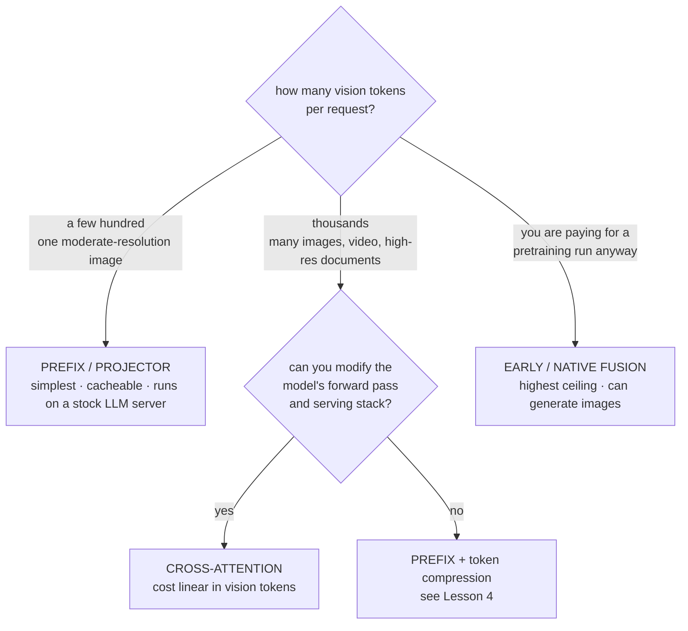

# VLM আর্কিটেকচার ও ফিউশন কৌশল

**Phase:** [Vision-Language Models](../README.md) · **Topic folder:** `03-VLM-Architectures-and-Fusion-Strategies`

## কেন এটি গুরুত্বপূর্ণ

[Lesson 1](../01-Vision-Encoders-and-Image-Tokenization/README.md) ভিশন ভেক্টরের একটি sequence তৈরি করেছে এবং [Lesson 2](../02-Vision-Language-Pretraining-Objectives/README.md) ঠিক করেছে সেই ভেক্টরগুলোর অর্থ কী। এই lesson সেই প্রশ্নের উত্তর দেয় যা এ পর্যন্ত সবকিছু পিছিয়ে রেখেছিল: **সেগুলো language model-এ কোথায় প্রবেশ করে?** বর্তমান চর্চায় ঠিক তিনটি উত্তর আছে — সেগুলোকে text sequence-এর সাথে concatenate করা, text-কে সেগুলোতে cross-attend করতে দেওয়া, অথবা প্রথমেই দুই modality-কে আলাদা না করা — এবং পছন্দটি অলংকৃত নয়। এটি নির্ধারণ করে LLM-র কতটা আপনাকে retrain করতে হবে, প্রতিটি ইমেজ কতটা context খরচ করে, inference cost ইমেজ সংখ্যার সাথে কেমন স্কেল করে, আর মডেলের শুধু-টেক্সট ক্ষমতা আদৌ টিকে থাকে কি না। একটি VLM paper-এর প্রতিটি আর্কিটেকচারাল ডায়াগ্রাম মূলত এই তিনটির মধ্যে একটি পছন্দ মাত্র।

## ওরিয়েন্টেশন: এই lesson যে এক প্রশ্নের উত্তর দেয়

আপনার কাছে ভিশন ভেক্টরের একটি sequence আছে (Lesson 1) যাদের ভাষার সাথে সম্পর্কযুক্ত অর্থ আছে (Lesson 2)। একটি language model হল Transformer block-এর একটি স্তূপ যা ভেক্টরের একটি sequence পড়ে। **ভিশন ভেক্টরগুলো কোথায় ঢোকে?** মাত্র তিনটি উত্তর আছে, আর এই ডায়াগ্রামটিই এক ছবিতে পুরো lesson:



সেকশনগুলোতে যাওয়ার আগে দুটি শব্দ আটকে রাখার মতো, কারণ papers-এ এগুলো দুর্বলভাবে ব্যবহৃত হয়। **Fusion** বলতে সেই প্রক্রিয়া যার মাধ্যমে ভিজ্যুয়াল তথ্য language model-এর গণনায় পৌঁছায়। **Frozen** বলতে একটি component-এর weight কোনো gradient পায় না — এটি ব্যবহৃত হয় কিন্তু প্রশিক্ষিত হয় না — যা এখানে অত্যন্ত গুরুত্বপূর্ণ, কারণ বেশিরভাগ প্রকৃত নির্মাণে LLM-টি ইতিমধ্যেই কাজ করা অবস্থায় এসেছে আর সেটিকে ভাঙা নয় সবচেয়ে সস্তা উপায়।

## এই lesson যা covers

- কেন নিষ্প্রভ বিকল্পটি (ইমেজকে একটি ভেক্টরে pool করা) ব্যর্থ হয় — একটি grounding কাজে মাপা
- **A. Prefix / projector fusion** (LLaVA ও বেশিরভাগ খোলা VLM): image token-এ পরিণত হয়
- **B. Cross-attention fusion** (Flamingo, Idefics, Llama-3-V): image sequence-এর বাইরে থাকে
- **C. Early / native fusion** (Chameleon, Fuyu): কোনো আলাদা tower-ই নেই
- Zero-initialized `tanh` gate, আর কেন একটি frozen LLM-এ নতুন layer ঢোকানো নিরাপদ
- খরচের অসমতা যা production-এ পছন্দ নির্ধারণ করে: quadratic sequence growth বনাম linear cross-attention
- Interleaving, multi-image, আর কোন কৌশল কোথায় ভাঙে

## 1. কাজটি, আর কেন pooling ব্যর্থ হয়

`example.py` একটি ক্ষুদ্রাকৃতি grounding সমস্যা তৈরি করে: ছয়টি বস্তুর একটি scene, প্রতিটি মডেলকে একটি ভিশন token হিসেবে দেওয়া হয় যা একটি shape ও একটি colour দুটোই encode করে; প্রশ্নটি একটি shape-এর নাম বলে তার colour চায়। Chance 16.7%। সবকিছু trainable হলে পরিমাপ করা ফলাফল:

```
architecture                        accuracy     params  text seq len  attn cells
blind (text only, no image)           16.7%    155,270             4          16
pooled image -> 1 token               43.2%    161,542             5          25
A. prefix / projector (LLaVA)        100.0%    161,542            10         100
B. cross-attention (Flamingo)        100.0%    307,724             4          16
C. early / native fusion             100.0%    157,510            10         100
```

Blind মডেলটি chance-এ আটকে আছে, যেমন হওয়ার কথা। আগ্রহের সারিটি pooled-টি: ভিশন token-গুলোকে একটি ভেক্টরে গড় করা — ঠিক যেমন একটি CLIP embedding — যা পায় 43.2%, chance-এর অনেক উপরে কিন্তু কাজটি সমাধানের কাছেও নয়। গড় ভেক্টরটিতে এখনও *কোন* colour-গুলো আছে তা থাকে, তাই সেগুলোর মধ্যে অনুমান করা ছয়টির মধ্যে অনুমান করার চেয়ে ভালো; যা হারিয়েছে তা হল কোন colour কোন shape-এর সাথে **bound** তা। এটি [Lesson 1 §6](../01-Vision-Encoders-and-Image-Tokenization/README.md#6-pooling-one-vector-or-all-of-them)-এর pooling যুক্তিই, task accuracy হিসেবে পুনরুক্ত — আর সেজন্যই এই lesson-এর প্রতিটি VLM ভিশন token-এর একটি *sequence* রাখে। তিনটি প্রকৃত fusion কৌশল-ই কাজটি সরাসরি সমাধান করে।

## 2. A. Prefix / projector fusion

প্রভাবশালী নকশা, আর যেটি [Phase 10 Lesson 1 §3](../../Phase-10-Advanced-and-Frontier-Topics/01-Multimodal-LLMs/README.md#3-from-an-aligned-space-to-a-multimodal-llm-llava) রূপরেখা দিয়েছিল:



LLM-এ কিছুই বদলায় না। ভিশন token-গুলো কেবল embedding, আর সাধারণ causal self-attention যেকোনো text token-কে সেগুলোর যেকোনোটিতে ফিরে attend করতে দেয়। এর সুবিধাগুলো প্রায় সম্পূর্ণ ব্যবহারিক: নতুন parameter-এর সংখ্যা ক্ষুদ্র (একটি MLP), যেকোনো বিদ্যমান LLM inference stack-ই পরিবর্তন ছাড়াই এটি serve করে, আর কথোপকথনের যেকোনো জায়গায় image ও text-এর interleave তুচ্ছভাবে প্রকাশ করা যায় — আপনি সঠিক অবস্থানে sequence-এ ভিশন token স্ফলাইস করেন মাত্র।

এর খরচ হল image এখন context window-এ থাকে। Self-attention মোট sequence দৈর্ঘ্যের বর্গে, প্রতিটি ভিশন token প্রতিটি layer-এ একটি KV-cache entry পায়, আর একটি 576- বা 3,136-token ইমেজ (Lesson 1-এর প্রকৃত সংখ্যা) ব্যবহারকারীর প্রকৃত প্রশ্নকে খর্ব করে দিতে পারে। উপরের খেলনা-রানে, prefix fusion একটি 4-token sequence-কে 10-token-এ বদলে attention 16 cell থেকে 100-এ নিয়ে গেছে।

## 3. B. Cross-attention fusion

Flamingo-র নকশা, Idefics ও Llama-3-V-তে পুনরুজ্জীবিত: text stream-কে যেমন আছে তেমনই রাখো, আর LLM-এর বিদ্যমান layer-গুলোর মাঝে নতুন **gated cross-attention** block ঢোকাও, যেখানে text query ভিশন key/value-তে attend করে।



```
for each layer:
    text = text + tanh(gate) · CrossAttn(q=text, kv=vision)
    text = LLM_layer(text)                        # unchanged, frozen
```

Text sequence কখনো বাড়ে না। ইমেজের দাম পড়ে cross-attention-এ, যার খরচ `text_len × vision_len` — ভিশন token সংখ্যায় **linear**, sequence-এ তাদের যোগের বর্গ না। অনেক ইমেজের জন্য, বা খুব উচ্চ-রেজোলিউশন ইমেজের জন্য, এটি কাঠামোগতভাবে ভালো বন্দোবস্ত, এজন্যই long interleaved document ও video-র লক্ষ্য করা মডেলগুলোতে cross-attention বারবার ফিরে আসে।

দামগুলোও প্রকৃত: এটি যথেষ্ট নতুন parameter যোগ করে (খেলনা মডেলে, মোটের ~50%, কারণ প্রতি layer-এ একটি পুরো gated block যোগ হয়), মডেলের forward pass পরিবর্তন করতে হয় — তাই একটি স্টক text-only inference server এটি চালাতে পারবে না — আর "image, তারপর text, তারপর দ্বিতীয় image" প্রকাশ করতে হয় explicit masking যন্ত্রপাতি দিয়ে যাতে নিয়ন্ত্রণ করা যায় কোন text span কোন ইমেজ দেখতে পারে, sequence order থেকে বিনামূল্যে পাওয়ার বদলে।

### Zero-initialized gate

`tanh(gate)` মোড়ক যার `gate` **zero** দিয়ে initialize করা — এই বিবরণটিই পুরো পদ্ধতিকে একটি frozen LLM-এ কার্যকর করে তোলে। Initialization-এ `tanh(0) = 0`, তাই প্রতিটি ঢোকানো block একটি নির্ভুল identity আর পরিবর্তিত মডেল bit-for-bit সেটাই গণনা করে যা মূল গণনা করত। `example.py` §3 এটি যাচাই করে — একই language-model weight একটি cross-attention model ও একটি text-only model-এ load করে output তুলনা করা হয়:

```
max |cross-attn model - text-only model| at init : 0.00e+00
gate values after training, layer by layer      : +0.125, -0.134, -0.133
```

Training তখন gate-গুলোকে কেবল ততটাই খোলে যতটা ভিশন signal-এর দাম আছে, আর ফলে প্রাপ্ত মানগুলো এক ধরনের সরাসরি পাঠযোগ্য মাপ — প্রতিটি layer কতটা ইমেজ ঢুকিয়েছে। একই zero-init কৌশল দেখা যায় [LoRA](../../Phase-05-Finetuning-LLMs/02-LoRA-and-QLoRA/README.md)-তে (`B` matrix zero-init যাতে adapter no-op দিয়ে শুরু হয়) এবং ControlNet-এ — এটি একটি কাজ করা মডেলে ক্ষমতা যোগ করার প্রমিত উপায়, প্রথম step-এ ভাঙা ছাড়া।

## 4. C. Early / native fusion

Chameleon ও Fuyu-র অবস্থান: একটি আলাদা pretrained vision tower-ই সমস্যা। Early fusion-এ কোনো tower interface-ই নেই: raw patch vector (Fuyu raw pixel-এ একটি linear layer প্রয়োগ করে; Chameleon VQ tokenizer দিয়ে image-কে discrete token-এ পরিমাণায়িত করে) pretraining-এর প্রথম layer থেকেই text-এর মতো একই Transformer-এ প্রবেশ করে, আর এক সেট weight পুরোটা জুড়ে দুই modality-ই প্রক্রিয়া করে।



সুবিধাগুলো ধারণাগত এবং, scale-এ, বাস্তব: কোনো frozen tower নেই মানে tower যা ফেলে দিয়েছে তা দ্বারা imposed যে ceiling (Lesson 2 §4) তাও নেই, অন্য কারো pretraining থেকে উত্তরাধিকার সূত্রে পাওয়া resolution বাধ্যবাধকতাও নেই, আর — Chameleon-এর জন্য — image *generation* text-এর মতোই একই next-token অবজেকটিভ থেকে বেরিয়ে আসে, কারণ vocabulary-তে image-ও কেবল token ([Lesson 11](../11-Beyond-Vision-Full-Multimodality/README.md) এটিতে ফিরে আসে)।

অসুবিধা খরচ। Freeze করার মতো কোনো pretrained language model নেই কারণ text ও vision weight কখনো আলাদাই ছিল না; আপনি একটি পূর্ণ multimodal pretraining run-এর জন্য দেন, আর প্রথম দিকের multimodal training কুখ্যাতভাবে অস্থির (Chameleon-এর paper-এ norm-growth ও divergence সমস্যাগুলোতে প্রকৃত স্থান নিবেদিত যা তাদের সমাধান করতে হয়েছিল)। `example.py` frozen-backbone টেবিলে পরিপূর্ণতার জন্য early fusion অন্তর্ভুক্ত করে, কিন্তু সেই column খুব একটা এটিতে খাটে না — খেলনা কাজটি যথেষ্ট সহজ যে frozen backbone-ও এটি সমাধান করে।

## 5. Frozen-LLM দৃষ্টিভঙ্গি

একটি প্রকৃত VLM শুরু হয় একটি language model থেকে যা ইতিমধ্যেই কাজ করে, তাই "এই কৌশলটির কত নতুন যন্ত্রপাতি দরকার?" প্রায়ই সিদ্ধান্তকারী প্রশ্ন। LLM frozen থাকলে:

```
architecture                        accuracy   trainable  % of model
A. prefix / projector (LLaVA)        100.0%       6,662       4.1%
B. cross-attention (Flamingo)        100.0%     152,844      49.7%
C. early / native fusion              99.7%       2,630       1.7%
```

Prefix fusion একটি projector-কে প্রশিক্ষণ দেয় আর কিছুই নয় — সেই অনুপাতটিই একক বৃহত্তম কারণ LLaVA-ধাঁচের রেসিপি খোলা-সোর্স VLM কাজে আধিপত্য করে: এক GPU-তে ঘণ্টার মধ্যে একটি বিশ্বাসযোগ্য VLM বানাতে পারেন। Cross-attention অনেক parameter যোগ করে কিন্তু কোনো বিদ্যমান weight স্পর্শ করে না — যা ঠিক Flamingo-কে frozen 70B মডেলে ভিশন জুড়তে দিয়েছে, যখন সেই মডেলের পূর্ণ fine-tuning নাগালের বাইরে ছিল।

## 6. পছন্দ করা

|                            | Prefix / projector                       | Cross-attention              | Early / native        |
| -------------------------- | ---------------------------------------- | ---------------------------- | --------------------- |
| New parameters             | tiny (MLP)                               | large (block per layer)      | none separate         |
| LLM weights touched        | none required                            | none                         | all (trained jointly) |
| Image cost in LLM          | quadratic (context growth)               | linear (cross-attn)          | quadratic             |
| Serving stack              | any stock LLM server                     | needs custom forward         | custom                |
| Interleaving / multi-image | free (sequence order)                    | needs masking machinery      | free                  |
| Image generation           | no                                       | no                           | yes (Chameleon-style) |
| Typical users              | LLaVA, Qwen-VL, InternVL, most open VLMs | Flamingo, Idefics, Llama-3-V | Chameleon, Fuyu       |



ব্যবহারিক নিয়ম: token বাজেট না বাধ্য করা পর্যন্ত prefix fusion। যখন image-গুলো context-এ প্রাধান্য নেয় — প্রতি অনুরোধে অনেক image, দীর্ঘ video, বা উচ্চ-রেজোলিউশন document — cross-attention-এর linear স্কেলিং একটি বিলাসিতা থেমে যায়, আর বিকল্প হল বদলে ভিশন token-গুলো compress করা, যা [Lesson 4](../04-Connectors-and-Visual-Token-Compression/README.md)-এর বিষয়।

## ভিডিও স্ক্রিপ্ট রূপরেখা

1. কাজটি: ছয়টি বস্তু, "ত্রিভুজের রং কী?" — ক্ষুদ্রাকৃতিতে grounding
2. Blind ও pooled baseline: 16.7% ও 43.2%, আর pooled মডেলের আংশিক কৃতিত্ব binding সম্পর্কে কী প্রকাশ করে
3. A. Prefix fusion — image token হয়ে যায়; LLM-এ কিছুই বদলায় না; context বিল পরে আসে
4. B. Cross-attention — text stream ছোট থাকে; image-এর দাম linear
5. Zero-init gate, প্রদর্শিত: init-এ অভিন্ন output, training-এর পর অ-শূন্য gate
6. C. Early fusion — একটি Transformer, কোনো tower নেই, frozen কিছুই নেই, বিনামূল্যে image generation
7. Frozen টেবিল: trainable-এ 4.1% বনাম 49.7%, আর প্রতিটি কী কিনে দেয়
8. সিদ্ধান্ত-টেবিল, আর সেই ক্ষেত্র যেখানে prefix fusion সুস্পষ্ট উত্তর হতে থামে
9. পুনরালোচনা + [Lesson 4](../04-Connectors-and-Visual-Token-Compression/README.md)-এর প্রাকদর্শন: ভিশন sequence-কে নিজেই ছোট করা

## পরবর্তী পাঠ

- Liu, Li, Wu, Lee (2023), *Visual Instruction Tuning* (LLaVA; prefix/projector fusion)
- Alayrac et al. (2022), *Flamingo: a Visual Language Model for Few-Shot Learning* (gated cross-attention ও zero-init gate)
- Laurençon et al. (2024), *What matters when building vision-language models?* (এই নির্দিষ্ট পছন্দগুলোর নিয়ন্ত্রিত তুলনা; Idefics2 ablations)
- Team Chameleon (2024), *Chameleon: Mixed-Modal Early-Fusion Foundation Models*
- Bavishi et al. (2023), *Fuyu-8B: A Multimodal Architecture for AI Agents* (সরাসরি decoder-এ linear patch projection)