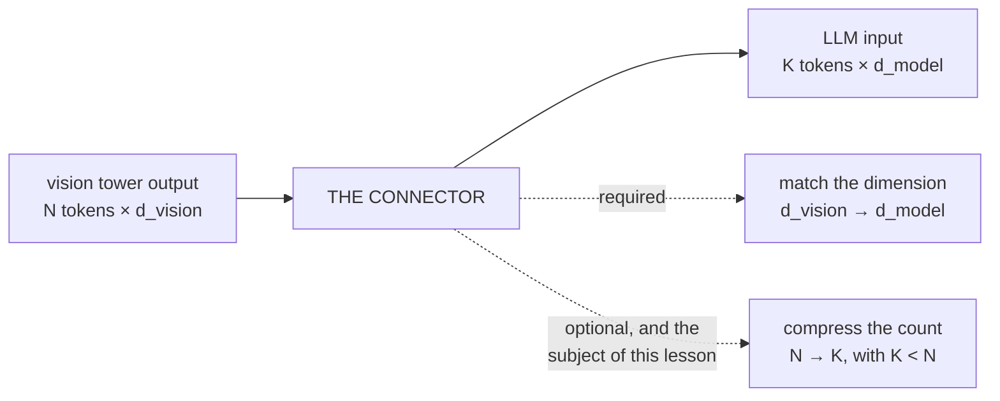
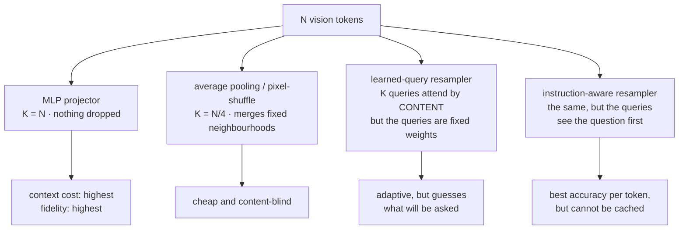
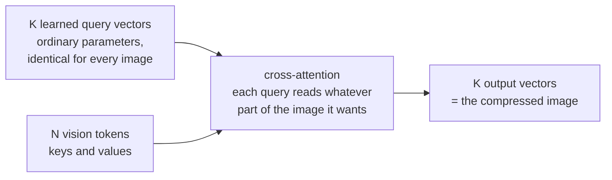
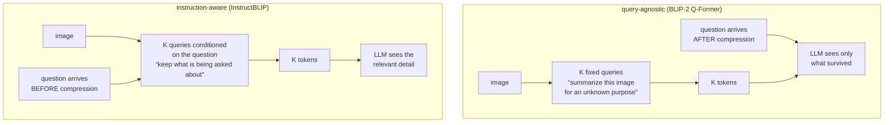

# Connector ও Visual Token Compression

**Phase:** [Vision-Language Models](../README.md) · **Topic folder:** `04-Connectors-and-Visual-Token-Compression`

## কেন এটি গুরুত্বপূর্ণ

এই phase-এর আগের দুটি তথ্য এখন সরাসরি সংঘাতের পথে। [Lesson 1](../01-Vision-Encoders-and-Image-Tokenization/README.md) দেখিয়েছে যে একটি image-এর খরচ 336px-এ 576টি token এবং 896px-এ 3,136টি token, আর অবস্থান, ছোট লেখা বা গণনা সম্পর্কে প্রশ্নের উত্তর দিতে সেই token-গুলোকে pool করে ফেলে না দিয়ে রেখে দিতে হয়। [Lesson 3](../03-VLM-Architectures-and-Fusion-Strategies/README.md) দেখিয়েছে যে প্রভাবশালী fusion কৌশলটি সেই প্রতিটি token-কে LLM-এর context-এ ঢোকায়, যেখানে attention quadratic এবং প্রতিটি token প্রতিটি layer-এ একটি KV-cache entry দাবি করে। কোথাও একটা ছাড় দিতেই হবে, আর যে component-এ সেই ছাড়টি ঘটে তা হলো **connector** — vision tower ও language model-এর মাঝের ছোট module। এর design শুধু একটি image কতগুলো token খরচ করে তা-ই ঠিক করে না, বরং LLM শেষ পর্যন্ত যখন image-টি দেখে তখন image সম্পর্কে *কোন* তথ্যগুলো তখনো পুনরুদ্ধারযোগ্য তা-ও ঠিক করে। এই lesson উভয় দিকের সেই বিনিময় নিয়ে, এবং এমন একটি design পছন্দ নিয়ে যা বিনিময়টিকে গুণগতভাবে বদলে দেয়।

## ওরিয়েন্টেশন: connector কী, এক ছবিতে

**Connector** (এটিকে "projector", "adapter", "resampler" বা "bridge"-ও বলা হয় — papers একমত নয়) হলো vision tower ও language model-এর মাঝের ছোট module। এর একটি বাধ্যতামূলক কাজ ও একটি ঐচ্ছিক কাজ আছে, আর সব আকর্ষণীয় সিদ্ধান্ত থাকে ঐচ্ছিকটিতেই:



`N` Lesson 1 দ্বারা স্থির (336px-এ 576টি token, AnyRes tiling-এ 3,136টি)। `K` হলো যার জন্য language model আসলে দাম দেয়। নিচের সবকিছু এই নিয়ে যে `K < N` হলে চারটি connector family *কোন* তথ্য রাখবে তা কীভাবে বেছে নেয় — এবং তাদের একটিকে নিয়ে, যেটি আগে user-এর প্রশ্ন দেখে নিয়ে বিনিময়টিকে গুণগতভাবে বদলে দেয়।

## এই lesson যা কভার করে

- Connector-এর কাজ, এবং ব্যবহৃত চারটি family: MLP, pooling/pixel-shuffle, learned-query resampler, instruction-aware resampler
- Perceiver Resampler ও Q-Former: একটি স্থির learned query set দিয়ে cross-attention
- পরিমাপ: প্রতিটি family-র accuracy বনাম compression ratio, এমন একটি কাজে যেখানে উত্তর একটি নির্দিষ্ট খুঁটিনাটি
- কেন query-agnostic compression-এর একটি কঠিন ceiling আছে, এবং instruction-এর উপর condition করলে কী পাওয়া যায়
- Compression আসলে কী সাশ্রয় করে, বাস্তব token ও attention সংখ্যায়
- Production-এ কোন পছন্দ কোথায় ব্যবহৃত হয়, এবং প্রতিটির সাথে আসা failure mode

## 1. একটি connector-কে কী করতে হয়

ন্যূনতমভাবে, connector `d_vision → d_model` map করে যাতে vision vector-গুলো LLM-এর embedding-এর সাথে dimension-এ সামঞ্জস্যপূর্ণ হয়। LLaVA-র connector-এর পুরো কাজ এটুকুই: একটি two-layer MLP, প্রতি token-এ প্রয়োগ করা, `N` টি token ঢোকে এবং `N` টি token বের হয়। LLaVA-1.5-এর ablation-এ দেখা গেছে যে এটি তার প্রতিস্থাপিত আরও জটিল বিকল্পটিকে হারিয়েছে, যা সত্যিই একটি কাজের ফলাফল — connector-এর বেশিরভাগ কঠিনতা projection-এ নয়।

আসল প্রশ্ন হলো token-সংখ্যা। একবার যদি মেনে নেন যে `N` খুব বড়, তাহলে connector-কে **compress**-ও করতে হবে: `K < N` টি vector emit করতে হবে যা LLM-কে যা-ই জিজ্ঞাসা করা হোক তা সংরক্ষণ করে। চারটি family এটি করে:

| Family | Mechanism | `K` | Examples |
|---|---|---|---|
| **MLP projector** | প্রতি token-এ linear layer | `K = N` | LLaVA-1.5, বেশিরভাগ open VLM |
| **Pooling / pixel-shuffle** | পাশাপাশি token-দের গড় বা reshape | `N/4`, `N/9`, … | LLaVA-NeXT variants, InternVL, Qwen2-VL-এর merger |
| **Learned-query resampler** | `K` টি learned query vision token-গুলোতে cross-attend করে | যেকোনো `K` | Flamingo-র Perceiver Resampler, BLIP-2-এর Q-Former, Qwen-VL |
| **Instruction-aware resampler** | একই, তবে query-গুলো prompt-ও দেখে | যেকোনো `K` | InstructBLIP |



## 2. Resampler: learned query দিয়ে cross-attention

Flamingo-র Perceiver Resampler ও BLIP-2-এর Q-Former-এর পেছনের ধারণা একই: প্রতিটি vision token-কে রূপান্তর করার বদলে `K` টি **learned query vector** তৈরি করুন — সাধারণ parameter — এবং সেগুলোকে `N` টি vision token-এ cross-attend করতে দিন। তাদের `K` টি output-ই হলো compressed sequence।



```
queries : (K, d_model)   # learned parameters, the same for every image
out = CrossAttn(q = queries, kv = vision_tokens)     # (K, d_model)
```

Pooling-এর তুলনায় এর আকর্ষণ হলো adaptivity: একটি query একটি স্থির spatial neighbourhood গড় করার বদলে image-এর যেখানেই তথ্যবহুল কিছু থাকুক সেখানে attend করা শিখতে পারে। BLIP-2 এর উপর জোরালোভাবে নির্ভর করে — এর Q-Former একটি পুরো image-কে 32টি query-তে compress করে এবং LLM-এর সাথে দেখা হওয়ার আগেই নিজেই contrastive, matching ও captioning objective দিয়ে pretrained হয়।

কিন্তু "learned parameters" কথাটির মানে খেয়াল করে দেখুন: **প্রতিটি** image-কে একই `K` টি প্রশ্ন করা হয়, এবং সেগুলো বেছে নেওয়া হয়েছিল training-এর সময়, user কী জিজ্ঞাসা করবে তা কেউ জানার আগে। পরের section ঠিক এই সীমাবদ্ধতাটিই মাপে।

## 3. পরিমাপ: accuracy বনাম compression

`example.py` চারটি family-কে 16টি বস্তুর একটি scene-এ চালায়, প্রতিটি বস্তু একটি vision token যা একটি shape ও একটি colour বহন করে, আর একটি প্রশ্ন একটি shape-এর নাম বলে তার colour জানতে চায়। Chance 16.7%। Downstream-এর সবকিছু অভিন্ন রাখা হয়; কেবল connector ও `K` বদলায়:

```
connector                             K=16       K=8       K=4       K=1
------------------------------------------------------------------------
MLP projector (no compression)     100.0%        --        --        --
average pooling                    100.0%     60.8%     42.8%     28.7%
learned-query resampler             98.9%     90.4%     60.7%     29.1%
instruction-aware resampler        100.0%    100.0%    100.0%    100.0%
```

এই table থেকে তিনটি বিষয় বেরিয়ে আসে।

**Pooling ধারাবাহিকভাবে খারাপ হয়, এবং একটি কাঠামোগত কারণে।** এটি spatially local ও content-blind: group `g` সবসময় একই slot-গুলো গড় করে, তাই group যত বড় হয় তার ভেতরের বস্তুগুলো একে অপরের সাথে ঝাপসা হয়ে যায় এবং shape→colour binding ধ্বংস হয়। এটি [Lesson 3](../03-VLM-Architectures-and-Fusion-Strategies/README.md#1-the-task-and-why-pooling-fails)-এর pooled baseline, একবারে না এসে ধীরে ধীরে আসছে। বাস্তবে এর রক্ষাকবচ হলো, আসল image-গুলো spatially redundant — পাশাপাশি patch-গুলো সাধারণত সত্যিই একই রকম — এ কারণেই natural photograph-এ 2×2 merge প্রায় বিনামূল্যে হয় এবং সবচেয়ে বেশি ক্ষতি করে ঘন লেখা ও chart-এ, ঠিক যেখানে patch-গুলো redundant নয়।

**Learned-query resampler pooling-কে হারায় কিন্তু একই দেয়ালে ঠেকে।** `K = 8`-এ এটি 90.4% ধরে রাখে যেখানে pooling 60.8%-এ নেমে গেছে, কারণ এর query-গুলো অবস্থান নয়, content অনুযায়ী attend করে। কিন্তু `K = 4` ও `K = 1`-এ এটিও ভেঙে পড়ে। একটি vector 16টি shape→colour binding ধরে রাখতে পারে না, আর query-গুলো স্থির parameter হওয়ায় resampler জানতে পারে না *কোন* binding রাখতে হবে।



**Instruction-এর উপর condition করলে ceiling পুরোপুরি সরে যায়।** Instruction-aware resampler — একই architecture, একই parameter-সংখ্যা, একই `K` — cross-attend করার আগে তার query-গুলোতে প্রশ্নের embedding যোগ করে। `K = 1`-এও এটি 100%-এ থাকে, কারণ একে কেবল সেই একটি binding রাখতে হয় যার কথা আসলে জিজ্ঞাসা করা হয়েছে। এটিই InstructBLIP-এর কেন্দ্রীয় আবিষ্কার, এবং এই কারণেই একটি query-agnostic Q-Former সাধারণত ভুল default: আপনি একটি module-কে অজানা উদ্দেশ্যে একটি image-এর সারসংক্ষেপ করতে বলছেন, তারপর কী বাদ পড়েছে তা না জানার জন্য LLM-কে দোষ দিচ্ছেন।

সমস্যাটা, এবং instruction-aware compression সর্বজনীন না হওয়ার কারণ: compressed token-গুলো এখন prompt-এর উপর নির্ভর করে, তাই একই image সম্পর্কে ভিন্ন ভিন্ন প্রশ্নে সেগুলো **cache করে পুনরায় ব্যবহার** করা যায় না, এবং একটি multi-turn কথোপকথনে প্রতিটি নতুন turn-এ image-এর representation বদলে যায়। Query-agnostic compression prompt-independent, তাই একটি image একবার encode করে বারবার ব্যবহার করা যায় — একটি serving-side বৈশিষ্ট্য যেখানে Lesson 10 আবার ফিরে আসে।

## 4. Compression আসলে কী কিনে দেয়

সাশ্রয়টি নির্দিষ্ট করে বলা দরকার। Vision token-গুলো যোগ একটি 100-token prompt-এর উপর LLM self-attention-এর এক layer-এর জন্য:

```
setting                                   vis tokens   LLM attn cells    saving
CLIP ViT-L/14 @336, no compression               576          456,976      1.0x
2x2 pixel-shuffle (4x fewer)                     144           59,536      7.7x
resampler to 64 queries                           64           26,896     17.0x
resampler to 32 queries                           32           17,424     26.2x
AnyRes 896px, no compression                   3,136       10,471,696      0.0x
```

দুই প্রান্তের মধ্যে প্রায় তিন order of magnitude-এর ব্যবধান — একটি uncompressed AnyRes image-এর তুলনায় 32টি resampler query attention কাজে 600× পার্থক্য — এবং এটি গুণিত হয় প্রতিটি layer, প্রতিটি generated token (KV cache-এর মাধ্যমে) এবং একটি multi-image request-এর প্রতিটি image জুড়ে। এ কারণেই প্রতিটি production VLM কোথাও না কোথাও compress করে। শেষ সারিটি থাকার কারণও এটিই: high-resolution tiling (Lesson 1 §5) ও token compression সাধারণত *একসাথে* deploy করা হয়, কারণ তা না হলে tiling-এর token-সংখ্যা বহন করা অসম্ভব।

## 5. একটি connector বেছে নেওয়া

- **MLP, কোনো compression নেই** — যখন image কম এবং resolution মাঝারি তখন এটিই default। সর্বোচ্চ fidelity, সবচেয়ে সরল, cacheable, context-এ সবচেয়ে ব্যয়বহুল।
- **Pixel-shuffle / patch merge** — natural image-এ প্রায় বিনামূল্যে 4× কাটছাঁট; high-resolution tiling-এর standard সঙ্গী। ঘন লেখা ও chart-এ এর দিকে নজর রাখুন।
- **Learned-query resampler** — অনেক image বা video-র জন্য সঠিক হাতিয়ার, যেখানে প্রতি frame-এ একটি স্থির ছোট token budget-ই sequence length-কে টেকসই করার একমাত্র উপায়। মেনে নিন যে query-গুলোর শেখা আগ্রহের বাইরের খুঁটিনাটি হারিয়ে গেছে।
- **Instruction-aware resampling** — প্রতি token-এ সেরা accuracy, বিশাল ব্যবধানে, তবে prompt-dependent (uncacheable) vision feature-এর মূল্যে।

এই lesson যে সাধারণ নিয়মটি রেখে যায়: **compression সমানভাবে lossy নয়।** এটি যা গুরুত্বপূর্ণ বলে train হয়েছে তা সংরক্ষণ করে এবং বাকিটা নিঃশব্দে ফেলে দেয়, আর ফেলে দেওয়া তথ্য downstream-এ আর পুনরুদ্ধার করা যায় না। যখন একটি VLM আত্মবিশ্বাসের সাথে একটি ছোট সাইনবোর্ডের লেখা বানিয়ে বলে, তখন দোষী হওয়ার সম্ভাবনা language model-এর মতোই connector-এরও অন্তত সমান — একটি diagnosis যা [Lesson 7](../07-VLM-Hallucination-and-Alignment/README.md) যথাযথভাবে বিস্তারিত করে।

## ভিডিও স্ক্রিপ্ট আউটলাইন

1. সংঘাত: প্রতি image-এ 3,136টি token বনাম একটি context window যাকে কথোপকথনও ধরে রাখতে হয়
2. একটি connector ন্যূনতমভাবে কী করে (dimension match) এবং সাধারণত আর কী করে (compress)
3. চারটি family, এবং Perceiver/Q-Former mechanism বিস্তারিতভাবে
4. পরিমাপ করা table: pooling বনাম learned query বনাম instruction-aware, K যখন 16 থেকে 1-এ নামে
5. কেন pooling ধীরে ধীরে ব্যর্থ হয় — spatial locality ও redundancy, এবং কোথায় redundancy ফুরিয়ে যায়
6. কেন learned-query resampler দেয়ালে ঠেকে: প্রশ্নের অস্তিত্বের আগেই বেছে নেওয়া স্থির query
7. K=1-এ instruction-aware resampling, এবং এর সাথে আসা caching খরচ
8. সাশ্রয়ের table, এবং কেন compression ও tiling একসাথে deploy করা হয়
9. পুনরালোচনা + [Lesson 5](../05-Training-a-VLM-Staged-Pipeline/README.md)-এর প্রাকদর্শন: এই stack-টি আসলে train করা

## আরও পড়ুন

- Liu et al. (2023), *Improved Baselines with Visual Instruction Tuning* (LLaVA-1.5; MLP connector ablation)
- Li et al. (2023), *BLIP-2: Bootstrapping Language-Image Pre-training with Frozen Image Encoders and Large Language Models* (Q-Former)
- Jaegle et al. (2021), *Perceiver IO* এবং Alayrac et al. (2022), *Flamingo* (learned-query resampler)
- Dai et al. (2023), *InstructBLIP: Towards General-purpose Vision-Language Models with Instruction Tuning* (instruction-aware query conditioning)
- Chen et al. (2024), *InternVL / InternVL 1.5* (dynamic high-resolution tiling-এর পাশাপাশি pixel-shuffle compression)
