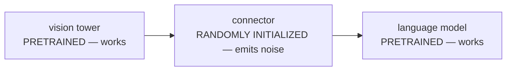
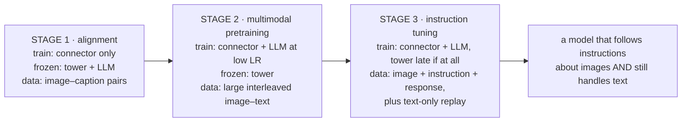
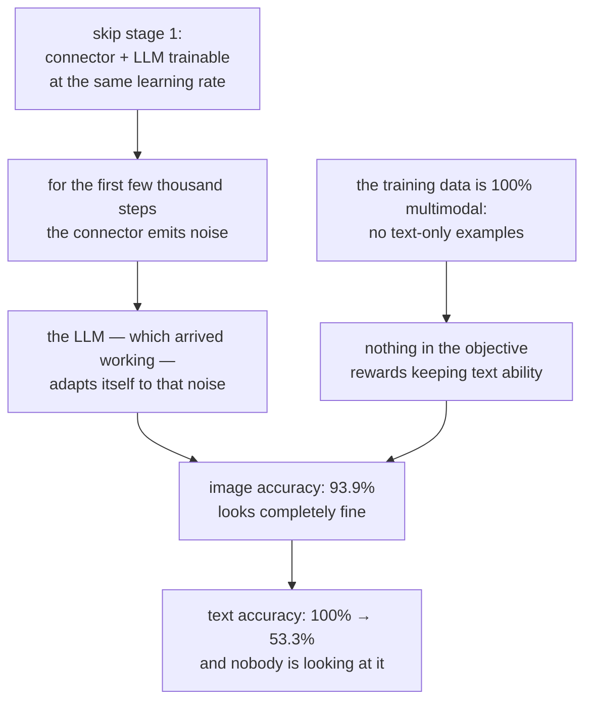

# একটি VLM প্রশিক্ষণ: ধাপে ধাপে Pipeline

**Phase:** [Vision-Language Models](../README.md) · **Topic folder:** `05-Training-a-VLM-Staged-Pipeline`

## কেন এটি গুরুত্বপূর্ণ

Lesson 1–4 অংশগুলো জোড়া লাগিয়েছে: একটি vision tower, একটি অবজেকটিভ যা তার feature-গুলোকে অর্থ দিয়েছে, একটি fusion কৌশল, আর একটি connector। এগুলোকে একসাথে জুড়ে ফলাফলের উপর gradient descent চালানোই সেই জায়গা যেখানে বেশিরভাগ চেষ্টা ব্যর্থ হয়, আর এমনভাবে ব্যর্থ হয় যা অদৃশ্য থাকে যদি আপনি শুধু সেই multimodal benchmark-টিই দেখেন যেটি optimize করছিলেন। Randomly initialized connector-টি প্রথম কয়েক হাজার step ধরে noise বের করে; language model-টি, যা কাজ করা অবস্থায় এসেছিল, সেই noise-এর সাথে নিজেকে খাপ খাইয়ে নেয়; training data সম্পূর্ণ multimodal, তাই model-এর শুধু-টেক্সট ক্ষমতাকে কিছুই ধরে রাখে না; আর যখন image accuracy ভালো দেখায়, ততক্ষণে যে LLM দিয়ে শুরু করেছিলেন সেটি নিঃশব্দে খারাপ হয়ে গেছে। এই lesson সেই schedule নিয়ে যা এসব এড়ায় — কোন stage কী train করে, কোন learning rate-এ, কোন data-য় — আর এটি প্রতিটি failure mode দাবি না করে পরিমাপ করে। এটি [Phase 05 Lesson 4](../../Phase-05-Finetuning-LLMs/04-Instruction-Tuning-SFT/README.md)-এর multimodal প্রতিরূপ, আর সেই lesson-এর বেশিরভাগ যন্ত্রপাতি (loss masking, data mixing, learning-rate শৃঙ্খলা) অপরিবর্তিতভাবে এখানে চলে আসে।

## ওরিয়েন্টেশন: তিনটি component, যার দুটি ইতিমধ্যেই কাজ করে

যেকোনো schedule অর্থবহ হওয়ার আগে, training শুরুর সময় আপনার হাতে কী আছে তা পরিষ্কার থাকা দরকার:



এই অসমতাই এই lesson-এর প্রতিটি সিদ্ধান্ত চালায়। একটি component ভাঙা এবং বড় update দরকার; বাকি দুটি converged এবং বড় update-এ কেবল ক্ষতিগ্রস্তই হতে পারে। একটি schedule আসলে "কে নড়তে পারবে, কখন, এবং কত দ্রুত" প্রশ্নের একটি উত্তর, যা তিনটি knob দিয়ে প্রকাশ করা হয়:

| Knob | এটি কী করে | নিচে কোথায় আসে |
|---|---|---|
| **Freezing** | একটি component কোনো gradient-ই পায় না | §2, §3, §5 |
| **প্রতি group-এ learning rate** | প্রতি step-এ প্রতিটি component কতদূর নড়তে পারে | §3 |
| **Data mixture** | gradient আদৌ কোন ক্ষমতাগুলো নিয়ে | §3 (replay), §6 |

আর একটি পরিভাষা ঠিক করে নেওয়া দরকার, কারণ এটি সেই ব্যর্থতার নাম যা নিয়ে এই lesson মূলত: **catastrophic forgetting** হল যখন নতুন data-য় training model-এর আগে থেকে থাকা একটি ক্ষমতাকে ধ্বংস করে। আপনি ইচ্ছাকৃতভাবে পুরোনো ক্ষমতাটি আবার না মাপলে এটি অদৃশ্য — আর `example.py` ঠিক সেটাই করে।

## এই lesson যা covers

- প্রচলিত দুই- ও তিন-stage রেসিপি, আর প্রতিটি stage আসলে কীসের জন্য
- প্রতিটি stage-এ কী freeze করতে হবে, আর stage-ভেদে উত্তর কেন বদলায়
- টেক্সট ক্ষমতার catastrophic forgetting, একই model-এ পরিমাপ করা
- প্রচলিত সমাধান হিসেবে data replay, আর এটি কেন কাজ করে
- এমন একটি prompt-এ loss masking যার বেশিরভাগই vision token
- Vision tower unfreeze করা উচিত কি না, আর এতে কী লাভ হয়
- প্রকৃত pipeline-এ data mixture, resolution curriculum, আর packing

## 1. এসব পরিমাপে ব্যবহৃত setup

`example.py` একটি ছোট causal Transformer তৈরি করে এবং একে একটি **শুধু-টেক্সট** lookup task-এ pretrain করে: key/value জোড়ার একটি তালিকা, তারপর একটি query key, উত্তর = সেই key-এর value। এটি 100%-এ পৌঁছায়। এটিই "একটি language model যা ইতিমধ্যেই কাজ করে"-এর প্রতিনিধি, আর — গুরুত্বপূর্ণভাবে — এটি আমাদের এমন একটি ক্ষমতা দেয় যা multimodal training-এর *পরে* আবার মাপা যায়। এরপর vision যোগ করা হয় একই key/value জোড়াগুলোকে text token-এর বদলে vision token হিসেবে দিয়ে। দুটি task-ই model, vocabulary এবং LM head ভাগ করে, তাই language model-এর যেকোনো ক্ষতি সঙ্গে সঙ্গে হারানো text accuracy হিসেবে দেখা দেয় — production evaluation suite-এ forgetting ঠিক এভাবেই ধরা হয়।

Script-এর vision tower-এর output ইচ্ছাকৃতভাবে সরু রাখা হয়েছে, কারণ একটি প্রকৃত tower-ও একটি ইমেজের সবকিছু সামনে পাঠাতে পারে না — Lesson 2 §4-এর যুক্তি, কাঠামোগতভাবে বাস্তবায়িত।

## 2. প্রচলিত রেসিপি

প্রায় প্রতিটি open VLM এর কোনো না কোনো সংস্করণ অনুসরণ করে:

| Stage | Train করে | Frozen | Data | উদ্দেশ্য |
|---|---|---|---|---|
| **1. Alignment** | শুধু connector | vision tower, LLM | image–caption জোড়া (সস্তা, প্রচুর) | connector-কে শেখানো visual feature-গুলো এমন জায়গায় রাখতে যেখানে LLM ইতিমধ্যেই সেগুলো পড়তে পারে |
| **2. Pretraining** *(বড় model-এ)* | connector + LLM | tower (সাধারণত) | বড় interleaved image–text corpora | শুধু captioning নয়, প্রকৃত multimodal দক্ষতা গড়ে তোলা |
| **3. Instruction tuning** | connector + LLM (± tower, দেরিতে) | — | বাছাই করা (image, instruction, response) triple | ইমেজ সম্পর্কে instruction মেনে চলানো ([Lesson 6](../06-Visual-Instruction-Tuning-and-VLM-Data/README.md)) |



Stage 1-এর পেছনের যুক্তিটি স্পষ্ট করে বলা দরকার: initialization-এর সময় connector-এর output হল *LLM-এর embedding space-এ noise*। যদি সেই মুহূর্তে LLM trainable থাকে, তবে এটি তার প্রথম দিকের gradient step-গুলো noise-কে জায়গা দিতে শেখায় খরচ করে — একটি কাজ করা model-কে একটি ভাঙা input-এর সাথে খাপ খাওয়ানো। একে freeze করলে connector বাধ্য হয় LLM-এর দিকে সরতে, উল্টোটা নয় — আর সেটাই অর্থবহ দিক, কারণ দুটি component-এর একটি ইতিমধ্যেই কাজ করে।

## 3. পরিমাপ করা: ছয়টি schedule

ছয়টিই অভিন্ন pretrained weight থেকে শুরু হয়; শুধু schedule আলাদা। `text` হল *মূল* শুধু-টেক্সট ক্ষমতা, পরে আবার মাপা, আর এটি 100%-এ শুরু হয়েছিল:

```
schedule                                       image    text  forgetting
stage 1 only (projector, frozen LM)           39.9% 100.0%       0.0%
stage 1 -> stage 2, LM frozen                 40.9% 100.0%       0.0%
stage 1 -> stage 2, LM unfrozen               91.3% 100.0%       0.0%
stage 1 -> stage 2, LM unfrozen, HIGH lr      93.6%  83.8%      16.2%
stage 1 -> stage 2 + 50% text replay          91.1% 100.0%       0.0%
NO stage 1: unfreeze everything at once       93.9%  53.3%      46.7%
```

চারটি পাঠ:

**LLM freeze করলে গঠনগতভাবেই forgetting অসম্ভব হয়ে যায়।** টেক্সট weight-গুলো কখনো নড়ে না, তাই text score বদলাতে পারে না। কিন্তু লক্ষ করুন, একটি frozen-LLM pipeline image task-এ কতটা পিছিয়ে থাকে — 40%। একা একটি connector-কে visual feature-গুলো এমন একটি model-এর কাছে পাঠযোগ্য করতে হয় যাকে কখনো সেগুলো পড়তে বলা হয়নি, আর ঠিক সেই সীমাটির জন্যই stage 2-এর অস্তিত্ব। (প্রকৃত LLaVA-1.0-ও একই আকারের ফলাফল দেখিয়েছিল: শুধু-projector training এমন একটি model তৈরি করে যা মোটামুটি caption করে কিন্তু instruction খারাপভাবে মানে।)

**ছোট learning rate-এ unfreeze করা এখানে প্রায় বিনামূল্যে, আর যে rate connector-এর জন্য উপযুক্ত সেটি মোটেই বিনামূল্যে নয়।** Connector একটি নতুন module যার বড় update দরকার; LLM একটি converged module যার ছোট update দরকার। দুটোকেই 2e-3-এ চালালে 16 point টেক্সট ক্ষমতা হারায়। বাস্তবে এটি parameter-group learning rate দিয়ে সামলানো হয় — connector উঁচু, LLM 10–100× কম, vision tower আরও কম (বা শূন্য)।

**Replay সরাসরি forgetting ঠিক করে।** Multimodal stage-এ শুধু-টেক্সট data আবার মিশিয়ে দিলে image accuracy-র কোনো খরচ ছাড়াই 100% text accuracy ফিরে আসে, স্পষ্ট কারণে: objective-এ এখন সেই ক্ষমতাটি আছে যা আপনি রাখতে চাইছেন। প্রতিটি গুরুতর VLM training mixture-এ ঠিক এই উদ্দেশ্যে শুধু-টেক্সট data-র একটি উল্লেখযোগ্য অংশ থাকে — এটি কোনো regularizer নয়, এটিই সেই জিনিস যা সংরক্ষিত হচ্ছে।



**Stage 1 বাদ দেওয়াই তালিকার সবচেয়ে খারাপ বিকল্প** — 46.7% forgetting, প্রায় অর্ধেক টেক্সট ক্ষমতা ধ্বংস — অথচ image accuracy ভালোভাবে চলা schedule-গুলো থেকে আলাদা করা যায় না। এই সমন্বয়টিই ফাঁদ: আপনি যে metric দেখছেন তা ঠিকঠাক দেখায়, আর ক্ষতিটা এমন জায়গায় যেখানে আপনি তাকাচ্ছেন না।

## 4. Loss masking

[Phase 05 Lesson 4](../../Phase-05-Finetuning-LLMs/04-Instruction-Tuning-SFT/README.md) প্রতিষ্ঠা করেছিল যে SFT শুধু response-এর উপর loss গণনা করে, prompt-কে context হিসেবে ধরে। VLM-এর জন্য যুক্তিটি আরও অনেক শক্তিশালী, কারণ prompt দীর্ঘতর এবং কম অনুমেয় — এতে শত শত vision token এবং ইচ্ছামতো ভাষায় লেখা একটি instruction থাকে। `example.py` §2 দুটোই মাপে, prompt-এ একটি randomly phrased instruction দিয়ে:

```
loss computed over                          image acc  text acc
the answer only (standard SFT)                 87.2%     94.3%
every token in the sequence                    76.1%     80.6%
```

এগারো point image accuracy, শুধু loss কোথায় প্রয়োগ হচ্ছে তা থেকে। কারণটি সরল: random instruction token-গুলো গঠনগতভাবেই অননুমেয়, তাই কোনো capacity-ই loss-এর সেই অংশ কমাতে পারে না; সেগুলোর উপর training noise-এ gradient খরচ করে এবং task বহনকারী একমাত্র token-টির signal পাতলা করে দেয়। একটি প্রকৃত VLM-এ উত্তরটি হয়তো 3,000-এর মধ্যে 20টি token, আর তরলীকরণ সেই অনুপাতে আরও খারাপ।

সংশ্লিষ্ট প্রশ্ন — *vision token-এর উপর কি কখনো loss প্রয়োগ করা উচিত?* — এর উত্তর একই কারণে একই, সাথে একটি অতিরিক্ত কারণ: একটি standard VLM-এ একটি continuous projected patch embedding-কে vocabulary token-এর মতো predict করা সুসংজ্ঞায়িতই নয়। Vision token-গুলো context, কখনো target নয়। (Chameleon-এর মতো model যেগুলো ইমেজকে discrete token-এ quantize করে সেগুলোকে *অবশ্যই* সেগুলো predict করতে train করা হয় — কিন্তু সেখানে image token-গুলো প্রকৃত vocabulary entry, আর সেটাই generation সম্ভব করে; দেখুন [Lesson 11](../11-Beyond-Vision-Full-Multimodality/README.md)।)

## 5. Vision tower কি train করা উচিত?

```
vision tower                     image    text
frozen                          91.1%    100.0%
trained (unfrozen)              97.9%    100.0%
```

Tower unfreeze করলে সাহায্য হয়, আর কারণটি Lesson 2 §4: tower-এর নিজস্ব pretraining objective কিছু জিনিস ফেলে দিয়েছিল, আর শুধু tower-এর weight-ই সেগুলো পুনরুদ্ধার করতে পারে। একটি প্রকৃত model-এ ঝুঁকিটিও সমানুপাতিক — আপনি এমন feature fine-tune করছেন যা অর্জন করতে বিপুল compute লেগেছে, এমন একটি dataset-এ যা কয়েক order of magnitude ছোট, আর tower-কে সেই সবকিছুতে খারাপ করে ফেলা পুরোপুরি সম্ভব যা আপনার fine-tuning set cover করে না। বর্তমান চর্চা যেখানে এসে দাঁড়িয়েছে: alignment জুড়ে frozen, তারপর দেরিতে model-এর বাকি অংশের চেয়ে অনেক কম learning rate-এ unfreeze, অথবা ছোট training budget-এর জন্য পুরোপুরি frozen রাখা।

## 6. প্রকৃত pipeline যা যোগ করে

- **Data mixture** হল প্রধান lever, আর এটি একসাথে কয়েকটি মাত্রায় একটি mixture: caption data, VQA, OCR/document data, chart/diagram data, coordinate সহ grounding data, multi-image ও interleaved document, আর শুধু-টেক্সট replay। [Lesson 6](../06-Visual-Instruction-Tuning-and-VLM-Data/README.md) এগুলো কীভাবে তৈরি হয় তা নিয়ে।
- **Resolution curriculum**: প্রথম দিকের stage-গুলো কম resolution-এ train করুন (সস্তা, আর connector-এর placement শিখতে detail লাগে না), পরের stage-গুলোতে বাড়ান। যেহেতু vision token `res²` হারে বাড়ে, এটি উপলব্ধ সবচেয়ে বড় compute lever-গুলোর একটি।
- **Sequence packing** টেক্সট training-এর চেয়ে বেশি গুরুত্বপূর্ণ, কারণ image sample-গুলোর token সংখ্যা ব্যাপকভাবে আলাদা — একটি thumbnail বনাম একটি 12-tile document-এ 10× পার্থক্য — তাই naive batching বিপুল পরিমাণ padding নষ্ট করে।
- **Aspect-ratio bucketing / native resolution** (Lesson 1 §2) যাতে সবকিছু বর্গাকারে resize করতে না হয়।
- **Training-এ multi-image ও interleaved sample, নইলে model inference-এ সেগুলো সামলাতে পারবে না।** শুধু single-image sample-এ train করা একটি model দুটি ইমেজ দিলে প্রায়ই গুলিয়ে ফেলে প্রশ্নটি কোন ইমেজ নিয়ে।

## Video Script Outline

1. "পুরোটা একসাথে train করে ফেলুন"-এর ভেতরে লুকিয়ে থাকা চারটি failure mode
2. পরিমাপের setup: একটি শুধু-টেক্সট pretrained LM যার টেক্সট ক্ষমতা আমরা পরে আবার যাচাই করতে পারি
3. প্রচলিত stage table — কী train হয়, কী frozen, কোন data
4. Stage 1 কেন LLM freeze করে: step 0-তে connector noise বের করে, আর কাজ করা component-টির ভাঙাটির সাথে খাপ খাওয়ানো উচিত নয়
5. ছয়-schedule table, সারি ধরে ধরে — সেই ফাঁদের সারিটি সহ যেখানে image accuracy ঠিক দেখায় আর LLM অর্ধেক ধ্বংস
6. Parameter group হিসেবে learning rate: একটি নতুন connector আর একটি converged LLM আলাদা step size চায়
7. Replay: সমাধান, আর কেন এটিই স্পষ্ট সমাধান
8. বেশিরভাগ-vision prompt-এ loss masking: 87.2% বনাম 76.1%
9. Tower unfreeze করা: এটি কী পুনরুদ্ধার করে আর কী ঝুঁকিতে ফেলে
10. সারসংক্ষেপ + [Lesson 6](../06-Visual-Instruction-Tuning-and-VLM-Data/README.md)-এর পূর্বাভাস: stage 3-এ যে data যায়

## Further Reading

- Liu, Li, Wu, Lee (2023), *Visual Instruction Tuning* এবং Liu et al. (2023), *Improved Baselines with Visual Instruction Tuning* (দুই-stage রেসিপি ও তার ablation)
- Laurençon et al. (2024), *What matters when building vision-language models?* (freezing, staging ও data mixture-এর পদ্ধতিগত ablation)
- McKinzie et al. (2024), *MM1: Methods, Analysis & Insights from Multimodal LLM Pre-training* (pretraining data mixture ও resolution-এর একটি বড়, যত্নশীল গবেষণা)
- Beyer et al. (2024), *PaliGemma: A versatile 3B VLM for transfer* (resolution curriculum সহ একটি স্পষ্টভাবে staged রেসিপি)
- Luo et al. (2023), *An Empirical Study of Catastrophic Forgetting in Large Language Models* (forgetting ঘটনাটি সরাসরি পরিমাপ করা)
