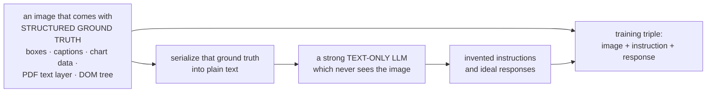
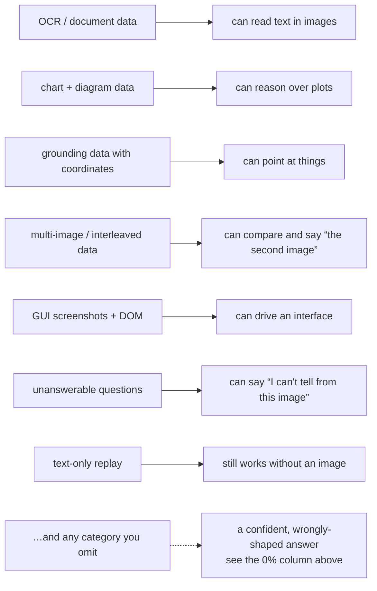

# Visual Instruction Tuning ও VLM Data

**Phase:** [Vision-Language Models](../README.md) · **Topic folder:** `06-Visual-Instruction-Tuning-and-VLM-Data`

## কেন এটি গুরুত্বপূর্ণ

[Lesson 5](../05-Training-a-VLM-Staged-Pipeline/README.md) schedule ঠিক করে দিয়েছে: কী freeze করতে হবে, কোন learning rate-এ, কোন ক্রমে। এটি সবচেয়ে প্রভাবশালী চলকটিকে অস্পৃষ্ট রেখে গেছে — *training example-গুলোতে কী আছে*। অভিন্ন আর্কিটেকচার, অভিন্ন tower এবং অভিন্ন schedule-এর দুটি VLM-এর মধ্যে তারা কী করতে পারে তার পার্থক্য প্রায় পুরোপুরিই তাদের instruction data-র পার্থক্য, আর সেই পার্থক্য মোটেই সূক্ষ্ম নয়। শুধু ছোট VQA উত্তরে tune করা একটি model প্রতিটি অনুরোধের উত্তর একটি ছোট VQA উত্তর দিয়েই দেবে, "এই diagram-টি বিস্তারিত বর্ণনা করো"-সহ। যে model কখনো লেখা-সহ কোনো ইমেজ দেখেনি সেটি আত্মবিশ্বাসের সাথে বানিয়ে বলবে একটি সাইনবোর্ডে কী লেখা আছে। এই lesson হল multimodal পরিস্থিতিতে [Phase 05 Lesson 4](../../Phase-05-Finetuning-LLMs/04-Instruction-Tuning-SFT/README.md)-এর যুক্তি, যেখানে এটি আরও তীক্ষ্ণ, কারণ visual instruction data প্রাকৃতিকভাবে প্রায় নেই-ই এবং তা তৈরি করে নিতে হয়।

## ওরিয়েন্টেশন: একটি example দেখতে কেমন

**Visual instruction tuning** হল supervised fine-tuning ([Phase 05 Lesson 4](../../Phase-05-Finetuning-LLMs/04-Instruction-Tuning-SFT/README.md)) যেখানে instruction-এর একটি অংশ হল একটি ইমেজ। একটি training example হল একটি **triple**:

| Field | উদাহরণ |
|---|---|
| image | একটি রান্নাঘরের ছবি |
| instruction | "How many chairs are at the table?" |
| response | "Three." |

আর loss শুধু response-এর উপর প্রয়োগ করা হয় ([Lesson 5 §4](../05-Training-a-VLM-Staged-Pipeline/README.md#4-loss-masking))। কঠিনতা format-এ নয় — কঠিনতা হল এই triple-গুলো প্রাকৃতিকভাবে প্রায় ঘটেই না। Web-এ কোটি কোটি (image, caption) জোড়া আছে আর প্রায় কোনো (image, instruction, response) triple নেই, তাই **data তৈরি করে নিতে হয়**, আর শেষ model-এর প্রতিটি ক্ষমতা ফিরে যায় এমন একটি সিদ্ধান্তে যা কেউ সেটি তৈরির সময় নিয়েছিল। এই lesson সেটাই পরিমাপ করে।

## এই lesson যা covers

- একটি visual instruction example আসলে কী, আর LLaVA-কে কেন সেগুলো উদ্ভাবন করতে হয়েছিল
- GPT-assisted synthesis কৌশল যা এই ক্ষেত্রের প্রথম instruction set তৈরি করেছিল
- পরিমাপ করা: একটি নির্দিষ্ট example budget-এ task coverage বনাম প্রতি-task accuracy
- পরিমাপ করা: phrasing diversity, template overfitting, আর level-বনাম-drop পার্থক্য
- পরিমাপ করা: mixture-এ অনুপস্থিত একটি ক্ষমতা যোগ করতে কী খরচ হয়
- একটি আধুনিক mixture-এ যে task type-গুলো থাকতেই হবে, আর প্রতিটি কোথা থেকে আসে
- Quality control: dedup, decontamination, আর synthetic data-র ঝুঁকি

## 1. Visual instruction data কী, আর এটি কোথা থেকে আসে

একটি example হল একটি triple: একটি ইমেজ, একটি instruction, আর আপনি যে response চান। 2023 সালে সমস্যা ছিল যে এরকম কিছুই বড় পরিসরে ছিল না। Image-caption জোড়া কোটি কোটি ছিল, কিন্তু একটি caption কোনো instruction নয়, আর caption একটি model-কে প্রশ্নের উত্তর দিতে, formatting অনুরোধ মানতে, অসম্ভব অনুরোধ প্রত্যাখ্যান করতে বা একটি chart-এর axis জুড়ে যুক্তি করতে শেখায় না।

LLaVA-র সমাধান এই ধারাটিকে সংজ্ঞায়িত করেছে। এমন একটি বিদ্যমান dataset থেকে ইমেজ নিন যাতে **সমৃদ্ধ symbolic annotation** আছে — COCO, তার object box ও একাধিক মানুষের লেখা caption-সহ — সেই annotation-গুলোকে টেক্সটে serialize করুন, আর *শুধু সেই টেক্সট* একটি শক্তিশালী শুধু-টেক্সট LLM-কে (তখন GPT-4) দিন, সাথে দৃশ্যটি সম্পর্কে কথোপকথন, বিস্তারিত বর্ণনা, ও জটিল যুক্তির প্রশ্ন উদ্ভাবন করার একটি instruction। LLM কখনো ইমেজটি দেখে না; এটি annotation থেকে কাজ করে, তাই এর উত্তরগুলো নিজের অনুমানের বদলে বাস্তব কিছুর উপর grounded। Output হল (image, instruction, response) triple, যত পরিমাণের জন্য আপনি টাকা দিতে পারেন।



Generator কখনো ইমেজ দেখে না — এটিই মূল ভার বহনকারী খুঁটিনাটি: এটি এমন annotation নিয়ে লেখে যা সত্য বলে জানা, তাই এটি object উদ্ভাবন করতে পারে না। এর ভুলগুলো তথ্যের নয়, *গুরুত্ব আরোপের* ভুল — যা একটি VLM-কে এমন ইমেজ caption করতে বলার চেয়ে অনেক নিরাপদ failure mode, যেগুলো সে ভুল পড়তে পারে।

তারপর থেকে প্রায় প্রতিটি visual instruction set সেই কৌশলেরই একটি রূপভেদ: একটি ইমেজ সম্পর্কে নির্ভরযোগ্য structured সত্যের একটি উৎস খুঁজুন (annotation, একটি chart-এর rendering code, একটি PDF-এর text layer, একটি screenshot-এর DOM tree, একটি UI-এর accessibility tree), আর একটি language model দিয়ে সেটিকে instruction ও উত্তরে রূপান্তর করুন।

## 2. Coverage ঠিক করে ক্ষমতা

`example.py` mixture ছাড়া সবকিছু স্থির রাখে — একই আর্কিটেকচার, একই initialization, একই ~96,000 training example — আর বদলায় সেই example-গুলো কোন task cover করে। পাঁচটি object-এর একটি scene-এর উপর পাঁচটি instruction type সংজ্ঞায়িত; `COLOR_LEFT` (নাম দেওয়া object-টির বাঁ দিকের object-এর রং) **কোনো run-এই কখনো train হয় না** এবং এটি পরীক্ষা করতে আছে যে দুটি শেখা দক্ষতা জুড়ে দেওয়া বিনামূল্যে আসে কি না।

```
trained on                COLOR_OF       COUNT      EXISTS     LEFT_OF  COLOR_LEFT
----------------------------------------------------------------------------------
COLOR_OF only              100.0%       0.0%       0.0%       0.0%      21.7%
COLOR_OF + COUNT           100.0%      98.9%       0.0%       0.0%      21.7%
all 4 trained tasks        100.0%      83.1%      99.8%      92.8%      11.3%
chance                      20.0%      16.7%      50.0%      10.0%      20.0%
```

**শূন্য, chance নয়।** Single-task model-টি যে task-গুলো কখনো দেখেনি সেগুলোতে chance-এ score করে না — এটি 0% পায়, কারণ এটি প্রতিটি instruction-এর উত্তর দেয় সেই ধরনের token দিয়ে যা তার training data ব্যবহার করেছিল। একটি `COLOR_OF`-tuned model-কে "কতগুলো?" জিজ্ঞেস করুন, এটি একটি রঙের নাম বলবে। এটি ইমেজটি নিখুঁতভাবে দেখতে পায়; এটি শুধু জানে না অন্য কোনো instruction-এর মানে কী, আর এটি ব্যর্থ হয় *আত্মবিশ্বাসের সাথে এবং ভুল format-এ*। প্রকৃত VLM-গুলো হতাশ করার এটিই সবচেয়ে সাধারণ উপায়: তাদের instruction data যা cover করেছে তারা সেটাই করে, আর অন্যত্র বিশ্বাসযোগ্য অর্থহীন কিছু তৈরি করে।

**Coverage সস্তা।** একই budget চার ভাগে ভাগ করলে model চারটি task-এই কাজের হয়ে ওঠে, প্রতি-task সামান্য খরচে (COUNT কমে যায় কারণ এটি তার data-র তিন-চতুর্থাংশ ছেড়ে দেয়)। এই বিনিময়ের কারণেই প্রকৃত instruction set-গুলো একক ধরনের একটি বড় corpus-এর বদলে কয়েক ডজন task type-এর mixture।

**Composition বিনামূল্যে নয়।** প্রতিটি mixture-এর জন্যই `COLOR_LEFT` chance-এ থাকে। Model একটি রং জানাতে পারে এবং বাঁ দিকের object খুঁজে পেতে পারে, কিন্তু দুটিকে জুড়তে পারে না, কারণ কিছুই তাকে তা করতে বলেনি। এই scale-এ অংশগুলো সমগ্রকে নির্দেশ করে না। প্রকৃত VLM-গুলো আরও গুরুত্বপূর্ণ জায়গায় একই প্যাটার্ন দেখায়: টেক্সট পড়তে পারা একটি model আর table নিয়ে যুক্তি করতে পারা একটি model স্বয়ংক্রিয়ভাবে এমন model নয় যা *একটি ইমেজের ভেতরের* table পড়তে পারে।

## 3. Phrasing diversity

একই task, একই budget; একমাত্র পার্থক্য হল training-এর সময় প্রতিটি instruction কতগুলো ভাষারূপ পায়। Evaluation-এ এমন একটি phrasing আছে যাতে কোনো run train হয়নি:

```
trained with                 seen phrasing   UNSEEN phrasing    drop
1 phrasing                          80.9%            74.4%      6.5%
3 phrasings                         93.9%            92.6%      1.3%
```

দুটি আলাদা প্রভাব, আর ছোটটিই বিখ্যাত। **Drop** হল template overfitting: একটি ভাষারূপে train করা model-কে কখনো ভাষারূপকে অপ্রাসঙ্গিক ধরার কোনো কারণ দেওয়া হয়নি, তাই ভাষা বদলালে এটি point হারায়। **Level** বেশি গুরুত্বপূর্ণ: multi-phrasing model-টি এমনকি যে ভাষারূপে এটি train *হয়েছিল* তাতেও 13 point ভালো। Phrasing বৈচিত্র্য augmentation-এর মতো কাজ করে — এটি model-কে একটি surface shortcut-এর বদলে phrasing-গুলোর মধ্যে যা সাধারণ (task-টি) তার উপর নির্ভর করতে বাধ্য করে। দুটি প্রভাবই একই দিকে ঠেলে, আর এজন্যই instruction set-গুলো প্রতি task-এ অনেক template দিয়ে তৈরি করা হয়, আর "benchmark-এ ভালো score করে, ব্যবহারকারীর হাতে ভঙ্গুর" সাধারণত model-এর বদলে একটি template-দরিদ্র tuning set-এ ফিরে যায়।

## 4. একটি অনুপস্থিত ক্ষমতা যোগ করা

```
                                     COLOR_LEFT   other 4 (avg)
4-task mixture (no COLOR_LEFT)           10.9%          93.9%
5-task mixture (with COLOR_LEFT)         49.8%          79.2%
```

অনুপস্থিত task-টি যোগ করা — একই মোট budget-এ, তাই অন্য প্রতিটি task তার data-র এক-পঞ্চমাংশ হারিয়েছে — এটিকে chance থেকে chance-এর অনেক উপরে নিয়ে যায়, আর বাকিগুলো একটি বাস্তব কিন্তু সীমিত মূল্য দেয়। এই অসমতাই instruction tuning-এর অর্থনীতি: **যে ক্ষমতা আপনার নেই তার coverage, যে ক্ষমতা আছে তার আরও example-এর চেয়ে বেশি কিছু কেনে**, সেই বিন্দু পর্যন্ত যেখানে mixture বিস্তৃত এবং প্রান্তিক task-টি বিরল। এজন্যই এমন দক্ষতার জন্য data তৈরিতে এত প্রচেষ্টা যায় যা কোনো প্রাকৃতিকভাবে পাওয়া image-text corpus-এ নেই।

## 5. একটি আধুনিক mixture-এ কী থাকে

| Category | সাধারণ উৎস | এটি কী শেখায় |
|---|---|---|
| Detailed captioning | LLM-দিয়ে পুনর্লিখিত dense caption | দীর্ঘ বর্ণনা, format নিয়ন্ত্রণ |
| Conversational VQA | annotation থেকে LLaVA-ধাঁচের synthesis | একটি ইমেজ নিয়ে multi-turn কথোপকথন |
| Academic VQA | instruction দিয়ে reformat করা VQAv2, GQA, OK-VQA | ছোট-উত্তরের accuracy, benchmark format |
| **OCR ও document** | সত্য হিসেবে text layer-সহ render করা PDF/রসিদ | আদৌ ইমেজের ভেতরের টেক্সট পড়তে পারা |
| **Chart ও diagram** | জানা data থেকে render করা chart; data-ই answer key | structured visual যুক্তি |
| **Grounding** | detection dataset; box-গুলো coordinate টেক্সট হিসেবে serialize করা | নির্দেশ করা, referring expression ([Lesson 8](../08-VLM-Capabilities-Grounding-OCR-Video-GUI/README.md)) |
| Multi-image / interleaved | বাছাই করা জোড়া, ইমেজ sequence, web document | তুলনা, "the second image", ইমেজ জুড়ে context |
| **GUI / agentic** | screenshot + accessibility tree বা DOM | element শনাক্তকরণ, UI action |
| Figure-সহ গণিত ও বিজ্ঞান | diagram-সহ textbook-ধাঁচের সমস্যা | visual chain-of-thought |
| Refusal ও উত্তরহীন প্রশ্ন | ইচ্ছাকৃতভাবে ইমেজ থেকে উত্তর দেওয়া যায় না এমন প্রশ্ন | "I can't tell from this image" বলতে পারা ([Lesson 7](../07-VLM-Hallucination-and-Alignment/README.md)) |
| **Text-only replay** | LLM-এর নিজস্ব SFT data | LLM-এর আগে থেকে যা ছিল তা না হারানো (Lesson 5 §3) |



Bold করা সারিগুলোই একটি demo-মানের VLM-কে একটি কাজের VLM থেকে আলাদা করে, আর সবগুলোই গঠনগতভাবে synthetic: আপনি ইমেজ ও ground truth একসাথে তৈরি করেন (আপনার বেছে নেওয়া data থেকে একটি chart render করুন, এমন একটি page-এর screenshot নিন যার DOM আপনার কাছে আছে), তাই label annotate করা নয় বরং নিখুঁত।

**উত্তরহীন প্রশ্ন**-এর সারিটি বিশেষ মনোযোগের দাবি রাখে। যদি প্রতিটি training example-এর এমন উত্তর থাকে যা ইমেজ থেকে বের করা যায়, তবে আপনি model-কে শিখিয়েছেন যে একটি উত্তর সবসময় থাকে — আর VLM-গুলো প্রত্যাখ্যানের বদলে কেন hallucinate করে তার একটি বড় অংশ এটাই। সেই সংযোগটিই [Lesson 7](../07-VLM-Hallucination-and-Alignment/README.md)-এর বিষয়।

## 6. Quality control

- **আপনার evaluation set-এর বিরুদ্ধে decontaminate করুন।** Public dataset থেকে synthesize করা instruction data প্রায়ই এমন ইমেজ ব্যবহার করে যা benchmark-এ আছে। [Lesson 9](../09-Evaluating-VLMs/README.md) দেখায় এটি রিপোর্ট করা সংখ্যাগুলোকে কতটা বিকৃত করে।
- **শুধু টেক্সট নয়, ইমেজও deduplicate করুন।** একই ছবি ভিন্ন annotation-সহ অনেক source dataset-এ দেখা যায়।
- **Teacher artifact-এর দিকে নজর রাখুন।** একটি শক্তিশালী VLM দিয়ে তৈরি data সেই model-এর বাচালতা, formatting-এর অভ্যাস, refusal-এর ধরন, ও তথ্যগত ভুল উত্তরাধিকার সূত্রে পায় — আপনি তার আচরণ distill করছেন, দোষ-ত্রুটি সহ ([Phase 09 Lesson 5](../../Phase-09-Deployment-and-Inference-Optimization/05-Model-Distillation-and-Pruning/README.md))।
- **যা যাচাই করা যায় তা যাচাই করুন।** Render করা chart, generate করা document, আর detection থেকে পাওয়া grounding-এর জন্য answer key গণনাযোগ্য; generator-কে বিশ্বাস না করে সেটি ব্যবহার করুন। ভালো ও মাঝারি synthetic set-এর মধ্যে এটিই একক বৃহত্তম মানগত পার্থক্য।
- **উত্তর-দৈর্ঘ্যের ভারসাম্য।** ভারসাম্য ছাড়া ছোট-উত্তরের VQA-কে দীর্ঘ বর্ণনার সাথে মেশালে এমন model তৈরি হয় যা খোলামেলা প্রশ্নে এক-শব্দের উত্তর দেয়, অথবা হ্যাঁ/না প্রশ্নে অনুচ্ছেদ লেখে। LLaVA-1.5-এর সমাধান ছিল ছোট-উত্তরের data-য় স্পষ্ট format instruction।

## Video Script Outline

1. Visual instruction data কেন তৈরি করে নিতে হয় — caption কোনো instruction নয়
2. LLaVA-র synthesis কৌশল: ground truth হিসেবে annotation, generator হিসেবে একটি শুধু-টেক্সট LLM
3. Coverage table: অ-train করা task-এ 0% (chance নয়), আর "আত্মবিশ্বাসের সাথে ভুল format" দেখতে কেমন
4. নির্দিষ্ট budget-এ বৈচিত্র্য: চারটি task একে অপরকে কী খরচ করায়
5. Composition বিনামূল্যে নয় — held-out `COLOR_LEFT`-এর ফলাফল
6. Phrasing diversity: যে drop নিয়ে সবাই কথা বলে, আর level প্রভাব যা বেশি গুরুত্বপূর্ণ
7. অনুপস্থিত ক্ষমতা যোগ করা: chance → দক্ষ, বাকিদের জন্য সীমিত খরচে
8. Mixture table, আর কেন bold করা সারিগুলো সবই গঠনগতভাবে synthetic
9. উত্তরহীন প্রশ্ন, আর hallucination-এর সেতু
10. Quality control: decontamination, dedup, teacher artifact, যাচাইযোগ্য answer key
11. সারসংক্ষেপ + [Lesson 7](../07-VLM-Hallucination-and-Alignment/README.md)-এর পূর্বাভাস

## Further Reading

- Liu, Li, Wu, Lee (2023), *Visual Instruction Tuning* (GPT-assisted data synthesis যা এই ধারা শুরু করেছিল)
- Liu et al. (2023), *Improved Baselines with Visual Instruction Tuning* (LLaVA-1.5-এর mixture, format prompt, ও academic-VQA মিশ্রণ)
- Dai et al. (2023), *InstructBLIP* (instruction-tuning generalization-এর একটি বড় held-out-task গবেষণা)
- Tong et al. (2024), *Cambrian-1: A Fully Open, Vision-Centric Exploration of Multimodal LLMs* (পদ্ধতিগত instruction-mixture curation ও ক্ষমতার উপর এর প্রভাব)
- Laurençon et al. (2024), *The Cauldron / Idefics2* (50+ instruction dataset-এর একটি খোলা, স্পষ্টভাবে নথিভুক্ত mixture)
