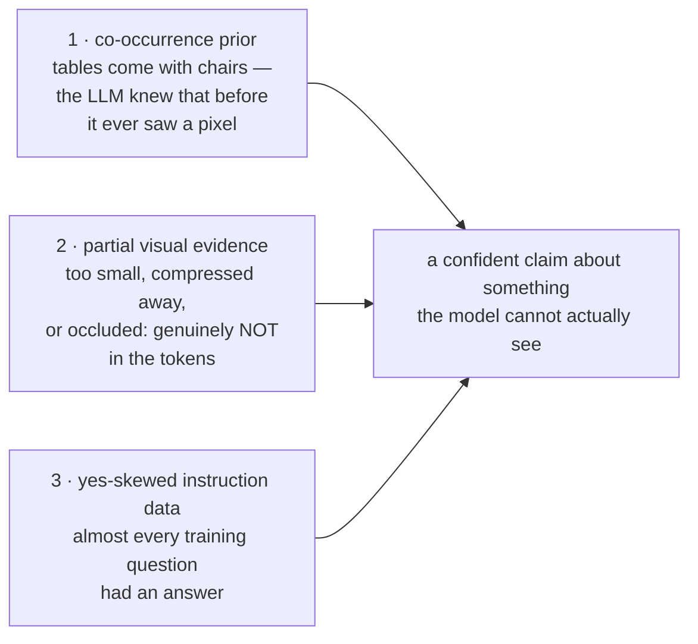
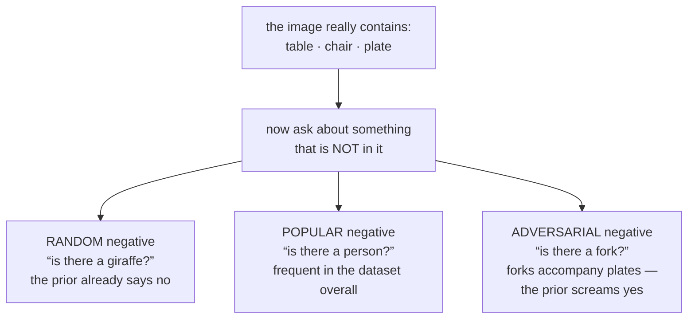
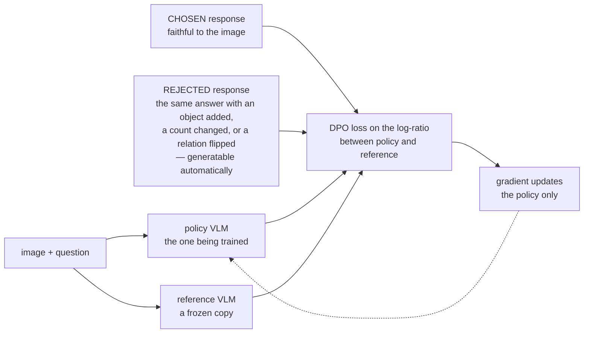

# VLM Hallucination ও Alignment

**Phase:** [Vision-Language Models](../README.md) · **Topic folder:** `07-VLM-Hallucination-and-Alignment`

## কেন এটি গুরুত্বপূর্ণ

একটি text LLM hallucinate করে যখন সে এমন কোনো তথ্য দাবি করে যার কোনো ভিত্তি তার কাছে নেই। একটি VLM আরও নির্দিষ্ট, এবং কিছু দিক থেকে আরও খারাপ, কিছু করে: সে এমন একটি ইমেজ সম্পর্কে তথ্য দাবি করে *যা তার context-এ ঠিক সেখানেই আছে*, অর্থাৎ তাকে দেওয়া প্রমাণের বিরোধিতা করে। সে ছবিতে নেই এমন একটি চেয়ারের কথা বলে, যেখানে তিনজন মানুষ সেখানে চারজন গোনে, বস্তুটি ডানে থাকলেও "left" বলে, অথবা একটি সাইনবোর্ড থেকে এমন লেখা পড়ে যা তার encoder-এর resolve করার পক্ষে অনেক ছোট। [Phase 08 Lesson 6](../../Phase-08-Evaluation-of-LLMs/06-VLM-as-a-Judge/README.md) এই failure mode-গুলো evaluator-এর দিক থেকে দেখেছিল; এই lesson এগুলো কোথা থেকে আসে আর আসলে কী এগুলো দূর করে তা নিয়ে। সংক্ষিপ্ত রূপ, যা lesson-এর বাকি অংশ পরিমাপযোগ্য করে তোলে: hallucination হল সেটাই যা একটি model করে যখন visual প্রমাণ অনুপস্থিত বা দুর্বল এবং ফাঁক পূরণের জন্য একটি শক্তিশালী prior হাতের কাছে থাকে — আর এই phase-এর প্রতিটি ধাপ, tower-এর resolution থেকে connector-এর compression থেকে instruction data-র yes-skew পর্যন্ত, এই দুটি পদের একটিকে নিয়ন্ত্রণ করে।

## ওরিয়েন্টেশন: দুটি শব্দ, আর দ্বিতীয়টি কেন আলাদা

একটি VLM-এর জন্য **Hallucination** মানে ইমেজ সম্পর্কে এমন কিছু দাবি করা যা সেই ইমেজের ক্ষেত্রে সত্য নয়। **Alignment** মানে model-এর আচরণ বদলানো যাতে তা মানুষ আসলে যা চায় তার সাথে মেলে — এখানে, অনুমান করা বন্ধ করা। দুটি পরিভাষাই [Phase 06](../../Phase-06-Alignment-and-RLHF/README.md) থেকে আসে, কিন্তু multimodal ক্ষেত্রটি একটি দিক থেকে আলাদা, যা কোন সমাধান কাজ করে তা বদলে দেয়:

| | Text LLM | VLM |
|---|---|---|
| প্রমাণ থাকে… | training data-র কোথাও, অথবা কোথাও না | *ঠিক context window-এর মধ্যেই* |
| তাই একটি ভুল দাবির মানে… | model কখনো জানত না, অথবা ভুল মনে রেখেছে | model তাকায়নি — **অথবা প্রমাণ encoder পেরিয়ে টিকেই থাকেনি** |
| যা সমাধানকে বানায়… | আরও ভালো data, retrieval, calibration | সেগুলো, **সাথে** Lesson 1 ও 4-এর resolution, tiling ও connector সংক্রান্ত পছন্দ |

শেষ সারিটিই এই lesson-এর ব্যবহারিক মর্মকথা। একটি VLM hallucination প্রায়ই মোটেই কোনো language failure নয়: বস্তুটি 12 pixel চওড়া ছিল, tower চলেছিল 336px-এ, connector চারটি patch-কে একটিতে merge করেছিল, আর language model পর্যন্ত পৌঁছাতে পৌঁছাতে দেখার মতো কিছুই অবশিষ্ট ছিল না। সেই পরিস্থিতিতে alignment model-কে *আত্মবিশ্বাসের সাথে অনুমান করা* থেকে থামাতে পারে; হারিয়ে যাওয়া pixel-গুলো ফিরিয়ে দিতে পারে না।

## এই lesson যা covers

- একটি VLM hallucination-এর তিনটি উপাদান: co-occurrence prior, আংশিক visual প্রমাণ, আর yes-skewed training data
- Blind-baseline diagnostic: একটি benchmark score-এর কতটুকুর জন্য আদৌ কোনো ইমেজ লাগে না
- POPE ও এর তিনটি negative-sampling regime, আর কেন একটিমাত্র সংখ্যা উদ্ধৃত করা অর্থহীন
- CHAIR, এবং open-ended captioning-এর metric
- VLM-এর জন্য Alignment: RLHF-V, POVID, এবং grounded preference pair-এর উপর DPO — implement ও পরিমাপ করা
- Alignment যা ঠিক *করে না*, আর সেই mitigation-গুলো যা আদৌ alignment নয়

## 1. তিনটি উপাদান

**Co-occurrence prior।** বাস্তব ইমেজ বস্তুর এলোমেলো সংগ্রহ নয়। টেবিলের সাথে চেয়ার আসে, রাস্তার সাথে গাড়ি, রান্নাঘরের সাথে সিংক। Text-এ প্রশিক্ষিত একটি LLM একটি pixel দেখার আগেই এই correlation-গুলো নিজের ভেতরে গেঁথে নেয়, আর এগুলো সত্যিই উপকারী — যতক্ষণ না এগুলো তাকানোর বিকল্প হয়ে দাঁড়ায়।

**আংশিক visual প্রমাণ।** বেশিরভাগ আলোচনা এই উপাদানটি এড়িয়ে যায়। একটি VLM-এর কাছে ইমেজটি থাকে না; তার কাছে থাকে কেবল সেটুকু যা tower-এর resolution ([Lesson 1](../01-Vision-Encoders-and-Image-Tokenization/README.md)), তার pretraining অবজেকটিভের compression ([Lesson 2 §4](../02-Vision-Language-Pretraining-Objectives/README.md#4-what-contrastive-pretraining-destroys)), আর connector-এর token বাজেট ([Lesson 4](../04-Connectors-and-Visual-Token-Compression/README.md)) পেরিয়ে টিকে থাকে। একটি 336px ইমেজের একটি ছোট বস্তু token-গুলোতে হয়তো আদৌ represent-ই হয় না। যখন প্রশ্নটি এমন কিছু নিয়ে যা token-গুলোতে নেই, তখন model "ইমেজ উপেক্ষা করছে" না — প্রমাণটি সেখানে নেই, আর prior-ই একমাত্র অবশিষ্ট জিনিস।

**Yes-skewed instruction data।** বেশিরভাগ VQA training data এমন প্রশ্নের উত্তর দেয় যেগুলোর উত্তর *আছে*, আর অস্তিত্ব-সংক্রান্ত প্রশ্ন ব্যাপকভাবে "yes"-এর দিকে হেলে থাকে। সেই data-য় tune করা একটি model বাকি সবকিছুর উপর একটি affirmative prior শিখে নেয়।



`example.py` এমন একটি জগৎ তৈরি করে যেখানে তিনটিই স্পষ্ট নিয়ন্ত্রণে: correlated group-এ 12 ধরনের বস্তু, প্রতিটি উপস্থিত বস্তু model-এর vision token-এ পৌঁছায় কেবল 0.6 সম্ভাবনায়, আর training data-য় একটি tunable yes-fraction।

```
model                                 accuracy  yes-rate   halluc.   misses
BLIND (no vision at all)                65.0%    55.1%     40.1%    29.8%
grounded, 80% YES training data         74.2%    70.7%     46.5%     5.0%
grounded, balanced training data        83.9%    46.6%     12.8%    19.5%
```

দুটি ফলাফল নিয়ে একটু ভাবা দরকার। **Blind model একটি balanced yes/no benchmark-এ 65% score করে**, যদিও কাঠামোগতভাবে সে কিছুই দেখতে অক্ষম — নিছক co-occurrence prior। আর **yes-skewed model balanced-টির চেয়ে খারাপ**, অভিন্ন আর্কিটেকচার ও অভিন্ন ইমেজ থাকা সত্ত্বেও: সে data-র affirmative prior উত্তরাধিকার সূত্রে পায়, আর তার ভুলগুলো প্রায় পুরোটাই hallucination (46.5%), miss নয় (5.0%)। [Lesson 6](../06-Visual-Instruction-Tuning-and-VLM-Data/README.md)-এর data mixture সিদ্ধান্তটি এখানে একটি hallucination rate হিসেবে দেখা দেয়।

## 2. পরিমাপ: POPE

POPE (Li et al., 2023) hallucination-কে গোনার মতো কিছুতে পরিণত করে: প্রতিটি ইমেজের জন্য "Is there a {object}?" প্রশ্নের একটি balanced সেট জিজ্ঞেস করা হয়, অর্ধেক উপস্থিত বস্তু নিয়ে আর অর্ধেক অনুপস্থিত বস্তু নিয়ে। Negative-গুলোর উপর accuracy-ই hallucination-এর পরিমাপ। এর আসল অবদান হল এটি লক্ষ্য করা যে **কোন অনুপস্থিত বস্তু নিয়ে জিজ্ঞেস করা হচ্ছে তা সবকিছু বদলে দেয়**, এবং তিনটি regime সংজ্ঞায়িত করা: `random` (যেকোনো অনুপস্থিত বস্তু), `popular` (সেই অনুপস্থিত বস্তু যা সামগ্রিকভাবে dataset-এ ঘন ঘন আসে), আর `adversarial` (সেই অনুপস্থিত বস্তু যা *উপস্থিত* বস্তুগুলোর সাথে সবচেয়ে বেশি co-occur করে)।

```
negatives are chosen from                                 acc   halluc.
random        any absent object                         74.2%     46.5%
popular       absent objects that are common overall    66.3%     62.2%
adversarial   absent objects that co-occur with the scene 73.3%     49.4%
```

একটি model, ইমেজের একটি সেট, তিনটি score যা accuracy-তে আট পয়েন্ট আর hallucination rate-এ ষোলো পয়েন্ট জুড়ে ছড়ানো — আর `random`, যে সংখ্যাটি একটি paper উদ্ধৃত করত যদি কেবল একটিই উদ্ধৃত করত, সেটিই সবচেয়ে সহজ। দুটি কঠিনতর regime-ই model-এর দৃষ্টিশক্তির বদলে prior-কে লক্ষ্য করে কাজ করে; দুটির মধ্যে কোনটি বেশি কামড়ায় তা নির্ভর করে data-য় কোন prior প্রাধান্য পায় তার উপর (এখানে, সামগ্রিক বস্তু-frequency)। **Negative-sampling regime ছাড়া একটি hallucination সংখ্যা কোনো সংখ্যাই নয়।**



যেকোনো বাস্তব evaluation-এ POPE-এর দুটি সঙ্গী থাকা উচিত:

- **Blind baseline।** আপনার benchmark একটি text-only model দিয়ে চালান। সে যা score করে, সেটুকুই আপনার benchmark-এর সেই অংশ যা vision নয়, prior মাপে। [Lesson 9](../09-Evaluating-VLMs/README.md) এটিকে একটি সাধারণ নিয়মে পরিণত করে, কারণ এটি hallucination benchmark-এর চেয়ে অনেক বেশি কিছুর ক্ষেত্রে প্রযোজ্য।
- **দুই ধরনের error-ই, সাথে yes-rate।** যে model সবসময় "no" উত্তর দেয় তার hallucination rate 0%। Miss rate ছাড়া hallucination রিপোর্ট করা ঠিক সেই অধঃপতিত আচরণকেই পুরস্কৃত করে।

Yes/no প্রশ্নের বদলে open-ended captioning-এর জন্য **CHAIR** হল মানদণ্ড: একটি generated caption-এ উল্লিখিত বস্তুগুলো parse করুন, ইমেজের ground-truth বস্তু-তালিকার সাথে তুলনা করুন, আর উল্লিখিত বস্তুগুলোর মধ্যে যেগুলো নেই তাদের ভগ্নাংশ রিপোর্ট করুন (per-instance ও per-sentence)। এর জন্য একটি annotated বস্তু-vocabulary লাগে, যে কারণে POPE-এর discriminative format বেশি জনপ্রিয় হয়েছে — কিন্তু CHAIR failure-টি সেই format-এ মাপে যেটিতে ব্যবহারকারীরা আসলে এর মুখোমুখি হন।

## 3. সমাধান: grounded preference pair-এর উপর DPO

[Phase 06](../../Phase-06-Alignment-and-RLHF/README.md)-এর alignment যন্ত্রপাতি একটি পরিবর্তন নিয়ে VLM-এ স্থানান্তরিত হয়: **preference pair-গুলো কীসে ভিন্ন**। Text RLHF-এ preferred response বেশি helpful বা বেশি harmless। Multimodal alignment-এ (RLHF-V, POVID, ও তাদের উত্তরসূরিরা) preferred response হল সেটি যা *ইমেজের প্রতি বিশ্বস্ত*, আর rejected-টি তারই একটি ইচ্ছাকৃতভাবে বিকৃত সংস্করণ — একই উত্তর, যেখানে একটি বস্তু যোগ করা হয়েছে, একটি সংখ্যা বদলানো হয়েছে, অথবা একটি সম্পর্ক উল্টে দেওয়া হয়েছে। সেই বিকৃতি স্বয়ংক্রিয়ভাবে তৈরি করা যায়, আর এটাই পদ্ধতিটিকে scale করার উপযোগী করে।



`example.py` [DPO](../../Phase-06-Alignment-and-RLHF/04-Direct-Preference-Optimization-DPO/README.md) ঠিক সেভাবেই implement করে যেভাবে Phase 06 এটিকে সংজ্ঞায়িত করে — একটি frozen reference model, `β`-scaled log-ratio, `−log σ(β[(π_c − ref_c) − (π_r − ref_r)])` — এমন pair-এর উপর যেখানে chosen = grounded উত্তর আর rejected = hallucinated উত্তর:

```
                            accuracy  yes-rate   hallucination rate
random, before DPO            74.2%    70.7%               46.5%
random, after  DPO            82.8%    48.9%               16.2%
popular, before DPO           66.3%    78.6%               62.2%
popular, after  DPO           74.7%    57.1%               32.4%
adversarial, before DPO       73.3%    72.8%               49.4%
adversarial, after  DPO       84.8%    49.3%               13.8%
```

Adversarial split-এ hallucination মোটামুটি দুই-তৃতীয়াংশ কমে, প্রতিটি split-এ accuracy বাড়ে, আর yes-rate ~72% থেকে ~49%-এ নেমে আসে। শেষ কলামটিই update আসলে কী করেছে তার সবচেয়ে স্পষ্ট বিবৃতি: এটি SFT data-র বসানো affirmative prior সরিয়ে দিয়েছে, model-কে আরও ভালো দেখতে শেখায়নি।

এটিই আবার সীমাও। **DPO এমন প্রমাণ জাদুবলে তৈরি করতে পারে না যা token-এ নেই।** এই simulation-এ উপস্থিত বস্তুর 40% কখনো model-এ পৌঁছায় না, আর কোনো preference optimization সেগুলো পুনরুদ্ধার করতে পারে না; alignment যা ঠিক করে তা হল সেগুলোর অনুপস্থিতিতে আত্মবিশ্বাসের সাথে অনুমান করার ব্যাপারে model-এর আগ্রহ। DPO-র পরের অবশিষ্ট ~14% hallucination rate অনেকাংশে ঠিক সেই অপরিবর্তনীয় অনিশ্চয়তা। Alignment আরও জোরে চাপালে আপনি hallucination-এর বিনিময়ে miss পাবেন — এমন একটি model যা খুব বেশি "no" বলে — যা [Phase 06 Lesson 6](../../Phase-06-Alignment-and-RLHF/06-Safety-Bias-and-Toxicity-Mitigation/README.md)-এর over-refusal সমস্যার multimodal সংস্করণ।

অন্য সীমাটি হল coverage, আর এটি সেই একই কথা যা [Lesson 6](../06-Visual-Instruction-Tuning-and-VLM-Data/README.md) instruction data নিয়ে বলেছিল: preference data সেই failure mode-ই ঠিক করে যার জন্য তা সংগ্রহ করা হয়েছিল। স্পষ্ট object hallucination থেকে তৈরি একটি preference সেট একটি model-কে axis label ভুল পড়া বন্ধ করতে শেখাবে না।

## 4. যে mitigation-গুলো alignment নয়

যেহেতু মূল কারণ প্রায়ই ভুল জায়গায় আত্মবিশ্বাস নয় বরং অনুপস্থিত প্রমাণ, তাই সবচেয়ে কার্যকর কয়েকটি সমাধান stack-এর অন্য কোথাও ঘটে:

- **Resolution ও token বাজেট।** বস্তুটি যদি 12 pixel চওড়া হয় আর tower 336px-এ চলে, তবে সমাধান হল tiling (Lesson 1 §5), preference data নয়।
- **কম আক্রমণাত্মক connector compression**, যেসব কাজে detail লাগে সেগুলোতে (Lesson 4)।
- **Instruction mixture-এ উত্তরহীন ও negative example** — model-কে শেখানো যে "I can't tell from this image" একটি বৈধ response। যদি প্রতিটি training example-এর একটি উত্তর থাকে, তবে আপনি model-কে শিখিয়েছেন যে একটি উত্তর সবসময় আছে।
- **Decoding-time intervention।** Visual Contrastive Decoding (VCD) আসল ইমেজ থেকে তৈরি logits-কে ইচ্ছাকৃতভাবে বিকৃত একটি কপি থেকে তৈরি logits-এর বিপরীতে তুলনা করে, model যা এমনিতেই বলত তা বিয়োগ করে দেয়; পার্থক্যটুকুই সেই অংশ যা আসলে ইমেজ দ্বারা চালিত। সম্পর্কিত কাজ decoding-এর সময় vision token-এর প্রতি attention বাড়িয়ে দেয়। এগুলোর জন্য কোনো retraining লাগে না, আর এগুলো সরাসরি [Phase 09 Lesson 7](../../Phase-09-Deployment-and-Inference-Optimization/07-Generation-and-Decoding-Strategies/README.md)-এর সাথে যুক্ত।
- **Grounded output format।** Model-কে দাবির পাশাপাশি bounding box বা উদ্ধৃত উৎস-লেখা নির্গত করতে বাধ্য করলে ungrounded দাবি কাঠামোগতভাবে কঠিনতর এবং স্বাধীনভাবে যাচাইযোগ্য হয়ে ওঠে ([Lesson 8](../08-VLM-Capabilities-Grounding-OCR-Video-GUI/README.md))।

## ভিডিও স্ক্রিপ্ট আউটলাইন

1. কী একটি VLM hallucination-কে আলাদা করে: context-এ থাকা প্রমাণের বিরোধিতা
2. তিনটি উপাদান, আর যেটি সাধারণত বাদ পড়ে — প্রমাণ প্রায়ই token-এ থাকেই না
3. Balanced benchmark-এ blind baseline-এর 65% score
4. Yes-skewed data: একই model, একই ইমেজ, খারাপ grounding — data mixture একটি hallucination rate হিসেবে
5. POPE-এর তিনটি regime, আর একটি model থেকে আট পয়েন্টের বিস্তার
6. কেন yes-rate ও দুই ধরনের error একসাথে রিপোর্ট করতে হবে
7. CHAIR ও open-ended captioning-এর ক্ষেত্র
8. Grounded preference pair: বিকৃত-response data কীভাবে তৈরি হয়
9. DPO run: hallucination দুই-তৃতীয়াংশ কম, yes-rate আবার 50%-এ
10. Alignment যা পারে না — অনুপস্থিত প্রমাণ, আর hallucination/miss-এর বিনিময়
11. Alignment-বহির্ভূত সমাধান: resolution, compression, উত্তরহীন example, contrastive decoding, grounded output
12. পুনরালোচনা + [Lesson 8](../08-VLM-Capabilities-Grounding-OCR-Video-GUI/README.md)-এর প্রাকদর্শন

## আরও পড়ুন

- Li, Du, Zhou, Wang, Zhao, Wen (2023), *Evaluating Object Hallucination in Large Vision-Language Models* (POPE ও এর তিনটি negative-sampling regime)
- Rohrbach et al. (2018), *Object Hallucination in Image Captioning* (CHAIR)
- Yu et al. (2023), *RLHF-V: Towards Trustworthy MLLMs via Behavior Alignment from Fine-grained Correctional Human Feedback*
- Zhou et al. (2024), *Aligning Modalities in Vision Large Language Models via Preference Fine-tuning* (POVID; স্বয়ংক্রিয়ভাবে তৈরি dispreferred response)
- Leng et al. (2023), *Mitigating Object Hallucinations in Large Vision-Language Models through Visual Contrastive Decoding*
- Rafailov et al. (2023), *Direct Preference Optimization* — algorithm-টি নিজেই, [Phase 06 Lesson 4](../../Phase-06-Alignment-and-RLHF/04-Direct-Preference-Optimization-DPO/README.md) থেকে পুনরায় দেখা
