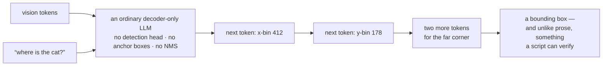
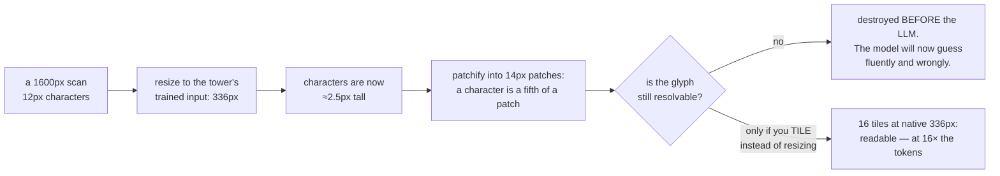
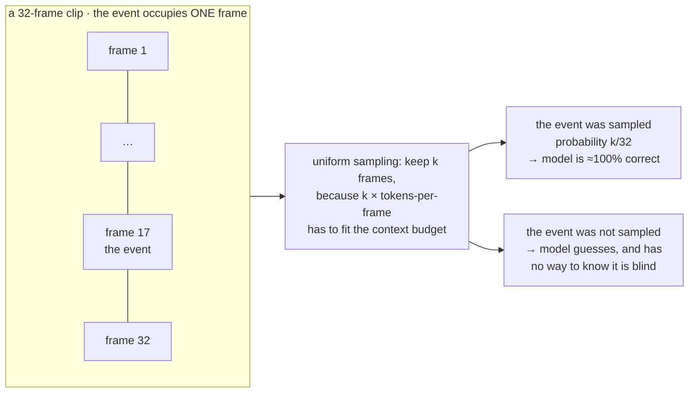

# VLM-এর সক্ষমতা: Grounding, OCR, Document, Video ও GUI

**Phase:** [Vision-Language Models](../README.md) · **Topic folder:** `08-VLM-Capabilities-Grounding-OCR-Video-GUI`

## কেন এটি গুরুত্বপূর্ণ

এ পর্যন্ত সবকিছুতে "একটি ইমেজ সম্পর্কে একটি প্রশ্নের উত্তর দাও"-কেই কাজ হিসেবে ধরা হয়েছে। যে সক্ষমতাগুলো VLM-কে অর্থনৈতিকভাবে আকর্ষণীয় করে তোলে সেগুলো এর চেয়ে বেশি নির্দিষ্ট: এই ছবিতে ত্রুটিটি দেখিয়ে দাও, এই রসিদটি পড়ো, এই table-টি বের করো, এই video-তে যে মুহূর্তে মেশিনটি থেমে যায় সেটি খুঁজে বের করো, এই screen-এ Submit বোতামে click করো। এগুলোর প্রতিটিকে একটি আলাদা গবেষণা ক্ষেত্রের মতো দেখায়, আর প্রতিটিই শেষ পর্যন্ত একটি কঠিন সীমাবদ্ধতা দ্বারা নিয়ন্ত্রিত হয় যার সাথে কোনো পরিমাণ language modelling তর্ক করতে পারে না — একটি vocabulary সীমা, একটি resolution সীমা, অথবা একটি sampling সীমা। এই lesson চারটি সবচেয়ে বড় সক্ষমতা-পরিবার নেয়, দেখায় প্রতিটি কীভাবে নতুন আর্কিটেকচার ছাড়াই একটি সাধারণ autoregressive VLM-এ প্রকাশ করা যায়, এবং আসলে যে সীমাবদ্ধতাটি বাঁধে সেটি মাপে। এটি Lesson 1–7-এর ব্যবহারিক ফসল এবং [Lesson 9](../09-Evaluating-VLMs/README.md)-এর evaluation প্রশ্নগুলোর input।

## ওরিয়েন্টেশন: চারটি সক্ষমতা, চারটি কঠিন সীমা

নিচের প্রতিটি পরিবার হল সেই জিনিস যার জন্য কেউ আসলে একটি VLM কেনে, আর প্রতিটিই এমন একটি সীমা দ্বারা নিয়ন্ত্রিত যা language model-এর *upstream*-এ বসে থাকে। প্রথমে এই table-টি পড়ুন; তারপর অংশগুলো একে একে প্রতিটি সীমা মাপে।

| সক্ষমতা | এর অর্থ | যে সীমা বাঁধে |
|---|---|---|
| **Grounding** | নির্দেশ করা: box, point, "কোনটি" | coordinate vocabulary-র resolution (§1) |
| **OCR / document** | ইমেজে লেখা, table ও form পড়া | downscaling-এর পর প্রতি অক্ষরে pixel (§2) |
| **Video** | সময়ের মধ্যে ঘটা কোনো কিছু সম্পর্কে উত্তর দেওয়া | token বাজেটে কতগুলো frame আঁটে (§3) |
| **GUI / agent** | interface element চেনা ও click করা | তিনটিই একসাথে (§4) |

বিস্তারিত দেখার আগে যে একীভূতকারী কৌশলটি লক্ষ্য করার মতো: **এগুলোর কোনোটির জন্যই নতুন আর্কিটেকচার লাগে না।** একটি box হল token, একটি transcription হল token, একটি click হল token। এখানে সবকিছুই [Phase 03 Lesson 1](../../Phase-03-LLM-Architectures-and-Types/01-Decoder-Only-Models-GPT-Family/README.md)-এর সেই একই decoder-only model, ভিন্ন training data সহ — আর ঠিক এই কারণেই সীমাগুলো upstream-এ, encoder ও connector যা পার হতে দেয় তার মধ্যে।

## এই lesson যা covers

- Grounding: সাধারণ token হিসেবে box ও point, এবং coordinate quantization কীভাবে একটি precision ceiling বসায়
- পরিমাপ করা: bin সংখ্যা বনাম localization error বনাম exact-match accuracy — তিনটি বক্ররেখা যা ভিন্নভাবে চলে
- OCR ও document: কেন model-এর মান নয়, resolution-ই ঠিক করে লেখা পড়া যাবে কি না
- পরিমাপ করা: downscaling-এর ফাংশন হিসেবে পাঠযোগ্যতা, আর সেটি বজায় রাখার token বিল
- Chart, table ও structured extraction: একটি language model থেকে machine-readable output বের করা
- Video: কেন প্রতিটি video ফলাফল আসলে একটি frame-sampling ফলাফল
- GUI ও screen understanding: agentic VLM-এর যা দরকার যা photo VLM-এর দরকার নেই
- Referring/segmentation পরিবার, আর যেখানে একটি সাধারণ VLM আর যথেষ্ট থাকে না

## 1. Grounding: coordinate হল নিছক token

Pix2Seq থেকে আসা এবং Kosmos-2, Qwen-VL, Florence-2, PaliGemma ও অন্যরা যা গ্রহণ করেছে সেই মূল উপলব্ধি: **আপনার কোনো detection head লাগে না**। ইমেজকে coordinate bin-এর একটি grid-এ discretize করুন, vocabulary-তে প্রতি bin-এ একটি token যোগ করুন, আর grounding হয়ে যায় একটি sequence-prediction সমস্যা যা অন্য যেকোনোটি থেকে আলাদা করা যায় না:

```
"Where is the cat?"  ->  "<box>(x=412, y=178)(x=690, y=520)</box>"
```

কোনো anchor নেই, কোনো non-maximum suppression নেই, কোনো আর্কিটেকচারাল পরিবর্তন নেই — এটি একটি data-ও-vocabulary সিদ্ধান্ত। এই কারণেই একটি general-purpose VLM আদৌ কোনো কিছু নির্দেশ করতে পারে, আর এই কারণেই একই model box, point, polygon, বা box-interleaved caption ("a <box>cat</box> sitting on a <box>mat</box>") নির্গত করতে পারে, কেবল সেভাবে format করা data-য় প্রশিক্ষিত হয়ে।



যে design পছন্দটি গুরুত্বপূর্ণ তা হল **কতগুলো bin**। `example.py` §1 একই model-কে তিনটি grid resolution দিয়ে প্রশিক্ষণ দেয় এবং তিনটি ভিন্ন জিনিস রিপোর্ট করে:

```
 coord bins  exact-bin acc  mean loc. error  quantization floor
          4         91.0%           0.0974              0.0954
         16         60.2%           0.0319              0.0239
         64          4.8%           0.0357              0.0060
```

- **Quantization floor** হল সেই error যা একটি *নিখুঁত* model-ও নিকটতম bin-এ round করার কারণে করবে। Grid যত সূক্ষ্ম হয় এটি তত কমে, তাই একটি মোটা grid model যত ভালোই হোক precision-এ একটি সীমা বসিয়ে দেয়।
- **Exact-bin accuracy** উল্টো দিকে ধসে পড়ে, কারণ model-কে একই প্রমাণ থেকে অনেক বেশি class-এর মধ্যে বেছে নিতে হয়।
- যে সংখ্যাটি আসলে গুরুত্বপূর্ণ — **mean localization error** — উন্নত হয় আর তারপর *saturate* করে। 4 → 16 bin একটি প্রকৃত 3× উন্নতি; 16 → 64 কিছুই কিনে দেয় না, কারণ ততক্ষণে grid নয়, model-ই সীমা।

সাধারণ শিক্ষা: model-এর নিজস্ব precision-এর বাইরে অতিরিক্ত bin কাগজে-কলমে বিনামূল্যের precision, বাস্তবে কিছুই না। আসলে আরও ভালোভাবে localize করতে হলে model-কে আরও বেশি pixel দিতে হয়। বাস্তব system-গুলো মাঝামাঝি বসে — একটি normalized ইমেজের উপর ~1000 bin (Pix2Seq, Qwen-VL), অথবা dedicated location token-এর একটি 32×32 grid (Kosmos-2)।

লক্ষ্য করার মতো দ্বিতীয় একটি পরিণতি: grounded output **যাচাইযোগ্য**। একটি box-কে ground truth-এর সাথে, বা একটি detector-এর সাথে এমনভাবে তুলনা করা যায় যা "the cat is on the left" দিয়ে করা যায় না। এটি grounding-কে একটি সক্ষমতার পাশাপাশি hallucination-এর একটি mitigation-ও করে তোলে ([Lesson 7 §4](../07-VLM-Hallucination-and-Alignment/README.md#4-mitigations-that-are-not-alignment))।

## 2. OCR ও document: resolution-ই ঠিক করে

ফলিত VLM কাজে সবচেয়ে সাধারণ ভুল নির্ণয় হল অপাঠ্য লেখাকে একটি model failure হিসেবে ধরা। `example.py` §2 দেখায় কেন সাধারণত তা নয়। একটি প্রকৃত 32×32 ইমেজে একটি 10-glyph বর্ণমালা থেকে একটি glyph থাকে; ইমেজটিকে encoder-এর input resolution-এ downscale করা হয়, একটি স্থির 4×4 patch size-এ patchify করা হয়, এবং classify করা হয়:

```
 input res   tokens   glyph 16px   glyph 8px   glyph 4px
       32px       64       81.4%      95.6%      97.7%
       16px       16       97.2%      98.2%      32.0%
        8px        4       99.0%      47.7%      19.9%
```

শেষ কলাম বরাবর নিচে নামলে, একটি 4-pixel glyph পূর্ণ resolution-এ পাঠযোগ্য এবং ইমেজ অর্ধেক করা মাত্রই উধাও। নিচের সারি বরাবর, যে একই encoder একটি বড় glyph নিখুঁতভাবে পড়ে সে একটি ছোটটিতে chance-স্তরে। পাঠযোগ্যতা যা ঠিক করে তা হল **downscaling-এর পরে** glyph-এর আকার — আর `tokens` কলামটি সেটি বজায় রাখার বিল, যা `res²` হারে বাড়ে।



এটিকে বাস্তবে scale করুন: একটি 1600px scan-এর একটি 12px অক্ষর, একটি 336px encoder input-এ downscale করা হলে, প্রায় 2.5 pixel লম্বা। সেই encoder-এর ওপাশে এমন কোনো language model নেই যা এটি পড়তে পারে, কারণ LLM পর্যন্ত পৌঁছানোর আগেই তথ্যটি ধ্বংস হয়ে গেছে। প্রতিটি সমাধানই upstream-এ:

- **উচ্চতর input resolution** — সরাসরি, এবং quadratic হারে ব্যয়বহুল।
- **Dynamic tiling / AnyRes** ([Lesson 1 §5](../01-Vision-Encoders-and-Image-Tokenization/README.md#5-high-resolution-in-practice-dynamic-tiling)) — tile-গুলোকে native resolution-এ encode করা; document-এর জন্য প্রচলিত উত্তর।
- **উদ্দেশ্য-নির্মিত high-resolution encoder** — Donut, Pix2Struct, এবং document-বিশেষজ্ঞ পরিবার, যারা লেখার পাঠযোগ্যতার জন্য সাধারণ vision মান ছেড়ে দেয়।
- **Native-resolution tower** — কোনো square resize-ই নেই (Qwen2-VL, NaViT-ধাঁচের)।

Resolution-এর উপর আরও দুটি document-নির্দিষ্ট সমস্যা বসে। **Reading order** — একটি দুই-কলামের PDF, একটি form, একটি table — একটি layout সমস্যা যা patch sequence নিজে থেকে সমাধান করে না, যে কারণে layout-সচেতন training data গুরুত্বপূর্ণ। আর **structured output**: একটি table বের করা মানে machine-readable কাঠামো (JSON, HTML, Markdown) নির্গত করা, যা [Phase 07 Lesson 5](../../Phase-07-Prompt-Engineering-and-In-Context-Learning/05-Structured-Output-and-Function-Calling/README.md)-এর এলাকা, বাড়তি মোচড়টি হল schema-র *content* pixel-এ grounded হতে হবে। Chart হল একই সমস্যার একটি কঠিনতর রূপ: একটি rendered chart-এর answer key হল সেই data যা থেকে সেটি render করা হয়েছিল, যা synthetic chart data-কে অস্বাভাবিকভাবে উচ্চমানের (Lesson 6 §5) আর chart benchmark-গুলোকে অস্বাভাবিকভাবে পরিচ্ছন্ন করে তোলে।

## 3. Video: reasoning সমস্যার পোশাক পরা একটি sampling সমস্যা

`example.py` §3 এটিকে যতটা সম্ভব স্পষ্ট করে তোলে। একটি 32-frame clip-এ গুরুত্বপূর্ণ ঘটনাটি ঠিক একটি frame-এ থাকে; model `k`-টি uniformly sampled frame দেখে:

```
 frames sampled  vision tokens*  event captured   accuracy  acc | captured
              1              64           2.8%     19.1%         100.0%
              4             256          12.3%     26.5%         100.0%
              8             512          25.0%     37.1%         100.0%
             16           1,024          48.9%     56.6%         100.0%
             32           2,048         100.0%    100.0%         100.0%
```



শেষ কলামটিই পুরো বক্তব্য: **সঠিক frame পেলে model নিখুঁত**। সামগ্রিক accuracy capture rate অনুসরণ করে, model-এর সক্ষমতা নয়। মাঝের কলামের "video understanding"-এর প্রতিটি পয়েন্টই sampling, modelling নয়।

1 fps-এ একটি 10-মিনিটের clip হল 600 frame। প্রতি frame-এ মিতব্যয়ী 64 token হলেও প্রশ্ন জিজ্ঞেস করার আগেই সেটি 38,400 token, তাই [Lesson 4](../04-Connectors-and-Visual-Token-Compression/README.md)-এর token বাজেটই `k` ঠিক করে। এরপরের কৌশলগুলো সবই একটি স্থির বাজেট আরও ভালোভাবে খরচ করার উপায়:

- **Uniform sampling** — default, এবং উপরে যেটি মাপা হয়েছে।
- **Keyframe selection / scene-change detection** — যেখানে video বদলায় সেখানে frame খরচ করা।
- **আক্রমণাত্মক per-frame compression** — প্রতি frame-এ 8–32 token পর্যন্ত একটি resampler, temporal coverage-এর বিনিময়ে spatial detail ছেড়ে দেওয়া। প্রায়ই সঠিক বিনিময়, আর screen-এর লেখা পড়ার জন্য ঠিক ভুলটি।
- **Temporal pooling / merging** পাশাপাশি frame-জুড়ে (Qwen2-VL frame-এর জোড়া merge করে), এই তথ্যটি কাজে লাগিয়ে যে পরপর frame-গুলো প্রায় অভিন্ন।
- **Question-conditioned retrieval** — প্রথমে প্রশ্ন ব্যবহার করে candidate frame বেছে নেওয়া। [Lesson 4 §3](../04-Connectors-and-Visual-Token-Compression/README.md#3-measured-accuracy-vs-compression)-এর instruction-aware compression ভাবনা, সময়-অক্ষ বরাবর প্রয়োগ করা।

সত্যিকারের temporal সবকিছু — ক্রম, কার্যকারণ, পুনরাবৃত্তি গোনা, "ঠিক আগে কী ঘটেছিল" — এর উপরে বসে এবং sampling পর্যাপ্ত হলেই কেবল নাগালে আসে। এই কারণেই video benchmark-এর সংখ্যাগুলো evaluation protocol-এর প্রতি এত সংবেদনশীল: frame সংখ্যা বদলালে model-এ হাত না দিয়েই ফলাফল বদলে যায়।

## 4. GUI ও screen understanding

Screen understanding হল সেই জায়গা যেখানে এই lesson-এর কয়েকটি সীমাবদ্ধতা পরস্পরের সাথে সংঘর্ষে আসে, আর এটিই সবচেয়ে দ্রুত এগোনো সক্ষমতা-ক্ষেত্র কারণ "computer-use" agent-দের এটিই দরকার।

- **লেখায় ঠাসা ও high-resolution।** একটি 2560×1440 screenshot-এর সর্বত্র ছোট, তীক্ষ্ণ লেখা; §2-এর যুক্তি পূর্ণ শক্তিতে প্রযোজ্য, যে কারণে GUI model-গুলো tiling সহ high resolution-এ চলে।
- **নির্ভুল grounding প্রয়োজন।** "Click the third item in the dropdown"-এর জন্য এমন coordinate দরকার যা আসলে element-টির উপর গিয়ে পড়ার মতো নির্ভুল — §1-এর precision ceiling একটি metric-এর বদলে একটি কার্যকরী প্রয়োজনীয়তায় পরিণত হয়।
- **Output একটি action, বর্ণনা নয়।** একটি GUI VLM `click(x, y)`, `type("...")`, `scroll(...)` নির্গত করে — grounded function call, যা [Phase 07 Lesson 5](../../Phase-07-Prompt-Engineering-and-In-Context-Learning/05-Structured-Output-and-Function-Calling/README.md)-এর structured output, pixel-grounded argument সহ।
- **বিনামূল্যের উচ্চমানের training data।** Screenshot-এর সাথে একটি DOM বা accessibility tree আসে যা প্রতিটি element ও তার সঠিক box-এর নাম দেয়, তাই instruction data সঠিক answer key সহ এবং কোনো annotation ছাড়াই তৈরি করা যায়।

## 5. Referring ও segmentation: যেখানে একটি সাধারণ VLM থেমে যায়

Box-কে tokenize করা সস্তা; pixel-নির্ভুল mask-কে নয়। একটি mask-কে coordinate token হিসেবে নির্গত করা সম্ভব (polygon vertex, যেমন Florence-2 করে) কিন্তু মোটা দাগের। প্রধান পদ্ধতিটি বরং কাজটি অন্যকে দিয়ে দেয়: LISA-ধাঁচের model-গুলো একটি বিশেষ `<SEG>` token নির্গত করে যার hidden state একটি dedicated segmentation decoder-এ (একটি SAM-পরিবারের model) দেওয়া হয়, ফলে VLM language-ও-reference reasoning করে আর একজন বিশেষজ্ঞ pixel-গুলো তৈরি করে। এটি পুরো lesson-এর জন্য একটি উপযোগী সীমানা-চিহ্ন — token-sequence কৌশলটি বিশাল পরিমাণ ক্ষেত্র জুড়ে কাজ করে, আর dense per-pixel output হল যেখানে এটি ফুরিয়ে যায়।

## ভিডিও স্ক্রিপ্ট রূপরেখা

1. চারটি সক্ষমতা-পরিবার, আর এই দাবি যে প্রতিটির একটি বাঁধনকারী সীমাবদ্ধতা আছে
2. Detection head ছাড়া grounding: vocabulary হিসেবে coordinate
3. তিন-বক্ররেখার table — floor, exact-match, ও প্রকৃত error — আর কেন এগুলো আলাদা দিকে যায়
4. Hallucination mitigation হিসেবে grounded output
5. Resolution table: একটি 4px glyph 32px-এ পাঠযোগ্য আর 16px-এ উধাও
6. এটিকে একটি বাস্তব document-এ scale করা: একটি 336px input-এ 12px লেখা মানে 2.5 pixel
7. Upstream সমাধানগুলো, সবগুলোরই দাম token-এ পরিশোধ করতে হয়
8. Chart ও table: structured output যার schema pixel-এ grounded হতে হবে
9. Video table, আর "frame-টি sample হলে accuracy" কলাম
10. Video-র জন্য বাজেট কৌশল: keyframe, compression, merging, question-conditioned retrieval
11. GUI: যেখানে high resolution, নির্ভুল grounding, ও action output সব মিলিত হয় — বিনামূল্যের training data সহ
12. Segmentation: সেই সীমানা যেখানে token sequence আর যথেষ্ট থাকে না
13. পুনরালোচনা + [Lesson 9](../09-Evaluating-VLMs/README.md)-এর প্রাকদর্শন

## আরও পড়ার জন্য

- Chen et al. (2022), *Pix2Seq: A Language Modeling Framework for Object Detection* (token হিসেবে coordinate)
- Peng et al. (2023), *Kosmos-2: Grounding Multimodal Large Language Models to the World* (location token ও grounded captioning)
- Kim et al. (2022), *OCR-free Document Understanding Transformer* (Donut) এবং Lee et al. (2022), *Pix2Struct* (high-resolution document encoder)
- Masry et al. (2022), *ChartQA* (chart reasoning, এবং rendered-data answer key)
- Wang et al. (2024), *Qwen2-VL* (native dynamic resolution ও video-র জন্য frame merging)
- Cheng et al. (2024), *SeeClick* / Hong et al. (2023), *CogAgent* (GUI grounding ও screen agent)
- Lai et al. (2023), *LISA: Reasoning Segmentation via Large Language Model* (pixel-এর কাজ একটি বিশেষজ্ঞ decoder-কে দেওয়া)
