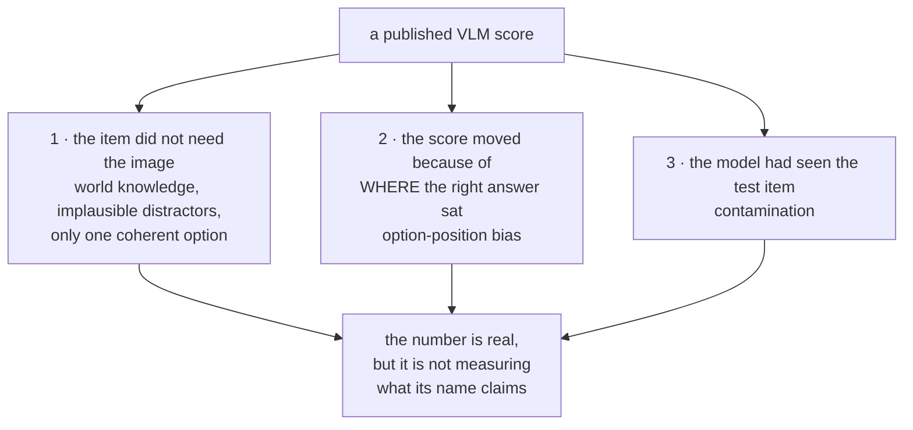
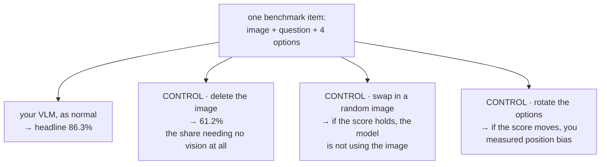
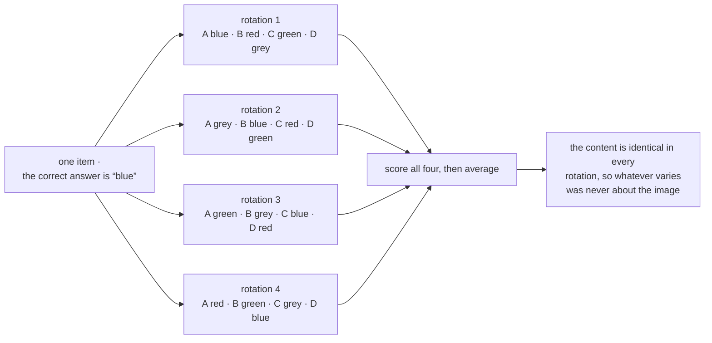
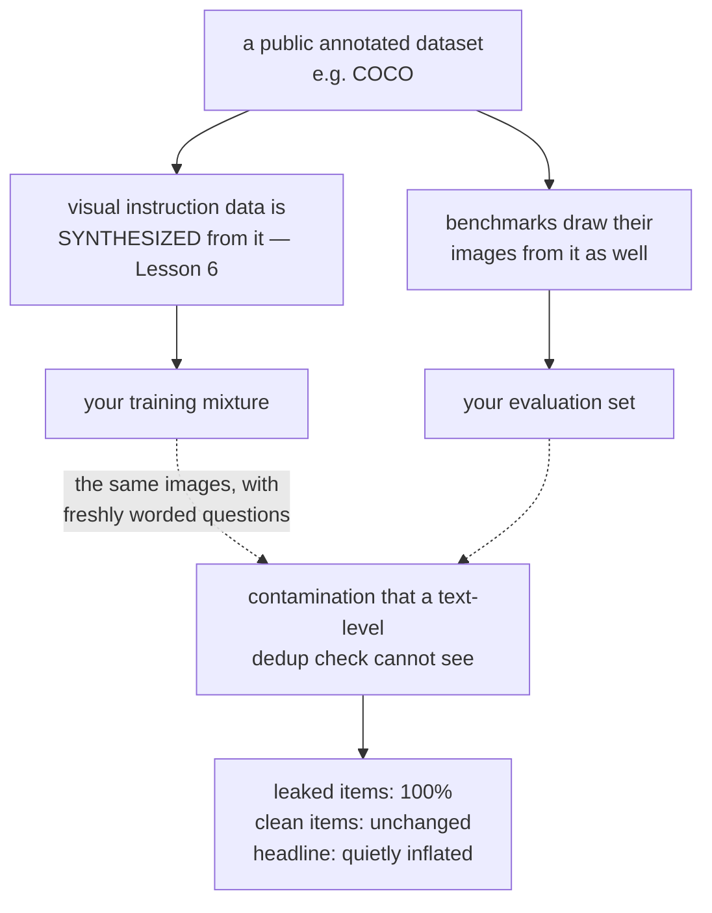

# VLM মূল্যায়ন

**Phase:** [Vision-Language Models](../README.md) · **Topic folder:** `09-Evaluating-VLMs`

## কেন এটি গুরুত্বপূর্ণ

[Phase 08](../../Phase-08-Evaluation-of-LLMs/README.md) দেখিয়েছে একটি text LLM-কে সৎভাবে মূল্যায়ন করা কতটা কঠিন: এমন metric যা দাবিকৃত জিনিসটি মাপে না, পক্ষপাতদুষ্ট judge, contamination, আর saturate হয়ে যাওয়া benchmark। এই প্রতিটি সমস্যা VLM-এর ক্ষেত্রেও আছে, সাথে একটি নতুন সমস্যা যা নির্দিষ্ট ও সর্বব্যাপী — **একটি VLM benchmark-এর একটি বড় অংশ ইমেজ ছাড়াই সমাধান করা যায়**। ভালো বিশ্বজ্ঞান সম্পন্ন একটি text-only model প্রশ্নের text, option-এর তালিকা আর সাধারণ সম্ভাব্যতা থেকেই "ভিজ্যুয়াল" প্রশ্নের এক বিস্ময়কর অংশের উত্তর দিতে পারে, আর যে score সেই অংশটিকে আলাদা করে না, সেটি ভিশন সিস্টেম নয় বরং language model-এর prior মাপছে। এই lesson একটি ছোট benchmark harness তৈরি করে যা সেই তিনটি pathology পুনরুৎপাদন করে যেগুলো প্রকাশিত VLM সংখ্যাকে সবচেয়ে বেশি অকার্যকর করে, আর শেষ হয় সেই reporting checklist দিয়ে যা একটি ফলাফলকে ব্যাখ্যাযোগ্য করে।

## ওরিয়েন্টেশন: কেন একটি VLM score বিশ্বাস করা কঠিনতর

[Phase 08](../../Phase-08-Evaluation-of-LLMs/README.md)-এর সবকিছু এখনও প্রযোজ্য। নতুন যা, তা হল একটি multimodal benchmark-এর ভুল হওয়ার একটি অতিরিক্ত উপায় আছে: এটি ভিশন পরীক্ষা করছে বলে *মনে হতে* পারে অথচ text থেকেই উত্তরযোগ্য। তিনটি আলাদা সমস্যা, যা তিনটি সেকশন পালাক্রমে আলোচনা করে:



পুরো lesson জুড়ে দুটি শব্দ ব্যবহৃত হয়। একটি **blind baseline** হল ইমেজ সরিয়ে একই benchmark চালানো — এটি যা score করে তা হল সেই অংশ যার কোনো ভিশন লাগে না। **Circular evaluation** প্রতিটি multiple-choice item-কে তার option-গুলোর প্রতিটি rotation-এ একবার করে score করে গড় নেয়, যাতে option-এর ক্রম কোনো model-কে বাড়তি সুবিধা দিতে না পারে। কোনোটির জন্যই নতুন benchmark লাগে না; দুটোই protocol-এর পছন্দ যা আপনি আজই একটি বিদ্যমান harness-এ যোগ করতে পারেন।

## এই lesson যা covers

- Blind baseline: একটি VLM benchmark-এর কতটা অংশে কোনো ভিজ্যুয়াল input লাগে না, মাপা
- Benchmark-এ ভিজ্যুয়াল shortcut আদৌ কেন থাকে, আর MMStar-ধাঁচের filtering কীভাবে সেগুলো সরায়
- Option-position bias, আর সমাধান হিসেবে circular evaluation
- Contamination, যা VLM-এর ক্ষেত্রে দুর্ঘটনাবশত নয় বরং স্বাভাবিকভাবেই ঘটে
- Answer extraction: generation-and-parse বনাম option log-likelihood
- Benchmark-এর পরিসর: MMMU, MMBench, DocVQA, ChartQA, POPE, MathVista আর video benchmark-গুলো প্রত্যেকে আসলে কী মাপে
- একটি ন্যূনতম reporting checklist

## 1. Blind baseline

`example.py` একটি synthetic scene-এর উপর চার-option-এর একটি MCQ benchmark তৈরি করে। এর অর্ধেক item **vision-necessary** (option-গুলো চারটি রং; কেবল ইমেজই বলে কোনটি সঠিক)। বাকি অর্ধেক **shortcut** item, যাদের distractor-গুলো সম্পূর্ণ ভুল *ধরনের* উত্তর — এমন item যা প্রকৃত benchmark-এ দেখা যায় অবিশ্বাস্য distractor, একমাত্র ব্যাকরণগতভাবে সুসংগত option, বা এমন প্রশ্ন হিসেবে যার উত্তর জগতের default।

```
model                   FULL benchmark   vision-necessary   shortcut items
VLM (sees the image)            86.3%             73.3%           100.0%
BLIND (text only)               61.2%             24.3%           100.0%
```

Headline হল 86.3%। **কোনো ভিজ্যুয়াল input ছাড়াই** একটি model একই item-গুলোতে 61.2% score করে। সেই headline-এর মাত্র 25 পয়েন্ট ভিশনের কৃতিত্ব, আর vision-necessary কলামটি — যেখানে blind model chance-এ বসে থাকে, যেমন থাকার কথা — একমাত্র কলাম যা benchmark-টি যা মাপার দাবি করে তা মাপছে।

এটি কোনো synthetic কৌতূহল নয়। MMMU, ScienceQA ও MMBench-এর বিশ্লেষণে দেখা গেছে item-গুলোর বড় অংশ text-only model দিয়ে উত্তরযোগ্য, আর **MMStar** বিশেষভাবে তৈরি হয়েছিল সেই item-গুলো filter করে বাদ দিয়ে যেগুলো শক্তিশালী LLM ইমেজ ছাড়াই উত্তর দিতে পারত। কার্যকর নিয়মটি সহজ ও সস্তা: **ইমেজ সরিয়ে আপনার harness চালান।** এটি যা score করে তা আপনার benchmark-এর সেই অংশ যা ভিশন নিয়ে নয়। এটি [Phase 08 Lesson 6](../../Phase-08-Evaluation-of-LLMs/06-VLM-as-a-Judge/README.md)-এর ungrounded-judge control-এর একই চাল, এখানে judge-এর বদলে benchmark-এর উপর প্রয়োগ করা।



ফলাফল গুরুত্বপূর্ণ হলে আরও দুটি সম্পর্কিত control চালানো উচিত: **shuffled-image** (প্রতিটি প্রশ্নকে এলোমেলো অন্য একটি ইমেজের সাথে জোড়া দিন — যে model দুই ক্ষেত্রেই একই score করে সে ইমেজ ব্যবহার করছে না) এবং **no-question** (শুধু option)।

## 2. Option-position bias ও circular evaluation

বেশিরভাগ VLM benchmark multiple-choice, আর বেশিরভাগ VLM-কে score করা হয় সে কোন *অক্ষর* output করে তা দিয়ে। এতে উত্তরের অবস্থান model-এর একটি input হয়ে যায়, আর model-গুলোর অবস্থান-পছন্দ থাকে — যা আসে এমন instruction data থেকে যা position-balanced নয়, ঠিক যেমন [Phase 08 Lesson 3](../../Phase-08-Evaluation-of-LLMs/03-LLM-as-a-Judge/README.md) judge-দের জন্য নথিভুক্ত করেছিল।

`example.py` §2 একটি model-কে এমন data-তে tune করে যেখানে সঠিক option 55% সময় position A-তে থাকে, এবং সেটিকে একটি balanced-data model-এর সাথে তুলনা করে। এমন একটি test set-এ যার সঠিক উত্তরগুলো *সত্যিই* সমভাবে বণ্টিত:

```
                                 A       B       C       D
balanced-data model         25.4%   25.6%   25.9%   23.1%
position-skewed model       31.8%   23.0%   23.8%   21.4%
```

```
                             A-heavy test set   balanced test set   circular eval
balanced-data model                    86.2%              86.3%           86.4%
position-skewed model                  94.2%              88.3%           88.4%
```



Skewed model-টি এমন একটি benchmark-এ ছয় পয়েন্ট বেশি পায় যা ঘটনাক্রমে A-র পক্ষে — আর মানুষের জোড়া দেওয়া একটি benchmark-এর balanced হওয়ার বিশেষ কোনো কারণ নেই। **Circular evaluation** (MMBench-এর সমাধান) প্রতিটি item-কে `N_options` বার score করে, option-গুলোর প্রতিটি rotation-এ একবার, আর গড় নেয়। সব rotation-এ বিষয়বস্তু অভিন্ন, তাই যেকোনো পার্থক্য বিশুদ্ধ position bias, আর গড় নেওয়া সেটি সরিয়ে দেয়: skewed model-এর 94.2% নেমে আসে 88.4%-এ, তার প্রকৃত সক্ষমতার সাথে সামঞ্জস্যপূর্ণ। এতে inference খরচ 4×, আর যখনই সংখ্যাটি উদ্ধৃত হবে তখন এটি সেই খরচের যোগ্য।

## 3. Contamination

```
model                                leaked items   clean items   FULL test
trained on train set only                  85.8%         86.4%      86.3%
train set + 400 leaked test items         100.0%         88.5%      89.6%
```

400টি leaked item (test set-এর 10%) 100%-এ পৌঁছে যায় — মুখস্থ, সমাধান নয়। Clean item-এ contaminated model সামান্য এগিয়ে, আর সেই ছোট ব্যবধান কেবল বাড়তি training data-র সাধারণ কাজ। তাই সক্ষমতা অপরিবর্তিত থাকা অবস্থায় headline বাড়ে, এবং **score-এর কোনো কিছুই দুই ক্ষেত্রকে আলাদা করে না।**



এখানে VLM-গুলো অস্বাভাবিকভাবে উন্মুক্ত, একটি কাঠামোগত কারণে যা স্পষ্টভাবে বলা দরকার: visual instruction data নিয়মিতভাবে *public dataset থেকে* synthesize করা হয় ([Lesson 6 §1](../06-Visual-Instruction-Tuning-and-VLM-Data/README.md#1-what-visual-instruction-data-is-and-where-it-comes-from)), আর সেই একই dataset-গুলোই benchmark-এর ইমেজ সরবরাহ করে। COCO-র ইমেজ training mixture-এও আছে, benchmark-এও আছে। কেউ সক্রিয়ভাবে প্রতিরোধ না করলে contamination-ই স্বাভাবিক অবস্থা, আর প্রতিরোধ মানে **ইমেজের** উপর deduplicate করা — hash এবং embedding-এর উপর near-duplicate search — কারণ প্রশ্নের text প্রায়ই নতুন করে তৈরি এবং মিলবে না।

## 4. Answer extraction benchmark-এরই অংশ

একই MCQ item score করার দুটি উপায়:

- **Generation + parse**: model-কে generate করতে দিন, তারপর একটি regex বা ছোট parser দিয়ে অক্ষরটি বের করুন। এটি instruction-following সহ পুরো সিস্টেম মাপে, এবং ভঙ্গুর — "The answer is B" parse হয়, "I think it's the blue one" প্রায়ই হয় না, আর যে model অস্বাভাবিকভাবে উত্তর বলে সে ভুল হওয়ার জন্য নয়, formatting-এর জন্য শাস্তি পায়।
- **Option log-likelihood**: model-এর অধীনে প্রতিটি option score করে সর্বোচ্চটি নিন। শক্তপোক্ত ও সস্তা, কিন্তু এটি এমন একটি পার্থক্য-করার ক্ষমতা মাপে যা model inference-এর সময় কখনো ব্যবহার করে না, এবং এটি এমন model-কে বাড়তি সুবিধা দিতে পারে যে এলোমেলো বকত।

কোনোটিই ভুল নয়; তারা ভিন্ন সিস্টেম মাপে, আর দুটির ফলাফল পরস্পর তুলনীয় নয়। একই benchmark-এর বিভিন্ন reproduction-এর মধ্যে প্রকাশিত অনেক অমিল সম্পূর্ণভাবে এটিই। **কোনটি ব্যবহার করেছেন তা উল্লেখ করুন** — আর generation ব্যবহার করলে parse-failure rate report করুন, কারণ নীরবে শূন্য-score পাওয়া একটি unparseable উত্তর একটি ভুল উত্তর থেকে আলাদা করা যায় না।

## 5. Benchmark-এর পরিসর

| Benchmark | যা মাপে | যেদিকে সতর্ক থাকবেন |
|---|---|---|
| **MMMU** | figure সহ কলেজ-স্তরের বহু-বিষয়ক reasoning | ভারী জ্ঞান-উপাদান; বড় blind-solvable অংশ |
| **MMStar** | ভিশন-অপরিহার্য item, নকশাগতভাবে filter করা | ছোট; ইচ্ছাকৃতভাবে কঠিন |
| **MMBench** | বিস্তৃত সক্ষমতার taxonomy, circular eval অন্তর্নির্মিত | Chinese/English split আলাদা |
| **MME / SEED-Bench** | বিস্তৃত perception + cognition, yes/no বা MCQ | yes/no format [Lesson 7](../07-VLM-Hallucination-and-Alignment/README.md)-এর bias-গুলোকে আমন্ত্রণ জানায় |
| **POPE / CHAIR** | object hallucination | negative-sampling regime উল্লেখ করুন (Lesson 7 §2) |
| **DocVQA / InfographicVQA** | প্রকৃত document পড়া | resolution-নির্ভর; input resolution report করুন (Lesson 8 §2) |
| **ChartQA / PlotQA** | chart reasoning | numeric-tolerance নিয়ম score-কে উল্লেখযোগ্যভাবে বদলায় |
| **TextVQA / OCRBench** | scene ও ঘন text | একই resolution সতর্কতা |
| **MathVista / MathVerse** | ভিজ্যুয়াল গাণিতিক reasoning | MathVerse বিশেষভাবে পরীক্ষা করে diagram আদৌ ব্যবহৃত হচ্ছে কি না |
| **RefCOCO / grounding suites** | IoU দিয়ে localization | IoU threshold ও coordinate format গুরুত্বপূর্ণ (Lesson 8 §1) |
| **Video-MME / MVBench / EgoSchema** | video বোঝা | frame সংখ্যা ও sampling ফলাফলে প্রাধান্য পায় (Lesson 8 §3) |
| **VLM arenas / judge-based evals** | open-ended সহায়কতা | [Phase 08 Lesson 3](../../Phase-08-Evaluation-of-LLMs/03-LLM-as-a-Judge/README.md) ও [Lesson 6](../../Phase-08-Evaluation-of-LLMs/06-VLM-as-a-Judge/README.md)-এর প্রতিটি bias উত্তরাধিকারসূত্রে পায় |

টেবিল জুড়ে প্যাটার্নটি: **সংখ্যার উপর evaluation protocol প্রায়ই model-এর চেয়ে বড় lever।** Resolution, frame সংখ্যা, answer extraction, option-এর ক্রম, আর decontamination প্রত্যেকেই বেশিরভাগ leaderboard-এ পাশাপাশি থাকা model-গুলোর ব্যবধানের চেয়ে বেশি score সরায়।

## 6. Checklist

একটি VLM ফলাফল ব্যাখ্যাযোগ্য হতে হলে report করুন:

- একই harness-এ **blind (text-only) baseline**
- **circular / permuted-option** evaluation, অথবা একটি উল্লিখিত position-bias পরীক্ষা
- **উত্তর কীভাবে extract করা হয়েছে** (generation + parse, নাকি option log-likelihood), এবং parse-failure rate
- প্রকৃতপক্ষে ব্যবহৃত **input resolution ও vision-token সংখ্যা**
- video-র জন্য, **frame সংখ্যা ও sampling কৌশল**
- **decontamination পদ্ধতি**, কেবল প্রশ্নের text দিয়ে নয়, ইমেজ দিয়েও
- **প্রতিটি subtask-এর সংখ্যা**, শুধু একটি সামগ্রিক গড় নয়

## ভিডিও স্ক্রিপ্ট আউটলাইন

1. VLM মূল্যায়নের নির্দিষ্ট সমস্যা: একটি "ভিজ্যুয়াল" benchmark যার ইমেজ লাগে না
2. Harness, আর দুটি item পরিবার
3. Blind baseline ফলাফল: 86.3% headline, কোনো ইমেজ ছাড়াই 61.2%
4. Shortcut item কেন থাকে, আর MMStar-এর filtering পদ্ধতি
5. Shuffled-image ও no-question control
6. Position bias: অক্ষরের বণ্টন, আর কেবল option-এর অবস্থান থেকে ছয় পয়েন্টের দোলাচল
7. Circular evaluation: এর খরচ কী আর এটি কী সরায়
8. Contamination: leaked item-এ 100%, কোনো সক্ষমতা বৃদ্ধি নেই, score-এ অদৃশ্য
9. VLM contamination কেন কাঠামোগত — benchmark dataset থেকে synthesize করা instruction data
10. Benchmark-এর অংশ হিসেবে answer extraction, আর reproduction-গুলো কেন একমত হয় না
11. পরিসর-টেবিল, আর এই দাবি যে protocol model-কে হারায়
12. Reporting checklist
13. পুনরালোচনা + [Lesson 10](../10-VLM-Inference-and-Deployment/README.md)-এর প্রাকদর্শন

## আরও পড়ুন

- Chen et al. (2024), *Are We on the Right Way for Evaluating Large Vision-Language Models?* (MMStar; এই lesson-এর §1 যে blind-solvability বিশ্লেষণের উপর নির্মিত)
- Yue et al. (2023), *MMMU: A Massive Multi-discipline Multimodal Understanding and Reasoning Benchmark*
- Liu et al. (2023), *MMBench: Is Your Multi-modal Model an All-around Player?* (circular evaluation)
- Zhang et al. (2024), *MathVerse* (diagram আসলেই ব্যবহৃত হচ্ছে কি না তা আলাদা করা)
- Fu et al. (2024), *Video-MME* (video evaluation-এ frame-সংখ্যার সংবেদনশীলতা)
- Duan et al. (2024), *VLMEvalKit* (একটি harness যা benchmark জুড়ে extraction ও protocol মানক করে)
