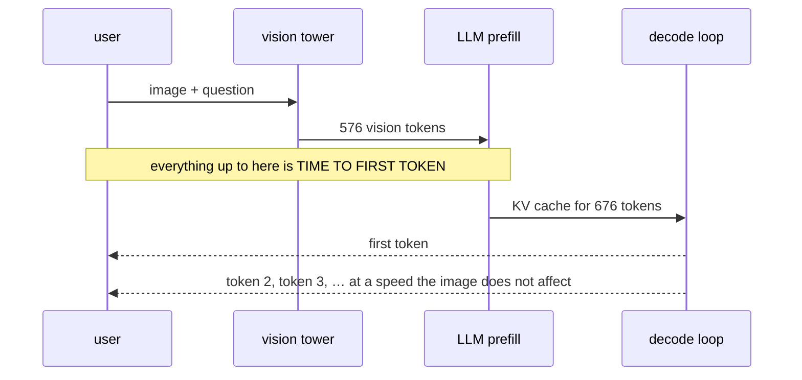
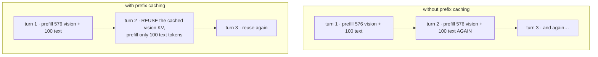
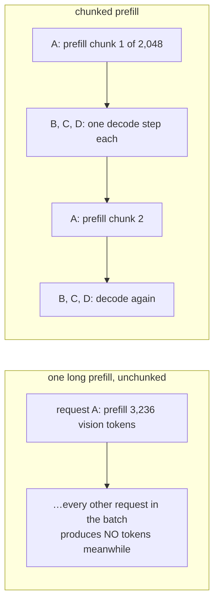

# VLM Inference ও Deployment

**Phase:** [Vision-Language Models](../README.md) · **Topic folder:** `10-VLM-Inference-and-Deployment`

## কেন এটি গুরুত্বপূর্ণ

[Phase 09](../../Phase-09-Deployment-and-Inference-Optimization/README.md) LLM inference-এর পূর্ণ চিত্র তৈরি করেছিল: prefill বনাম decode, KV cache, quantization, continuous batching, speculative decoding, আর সেই roofline গণিত যা বলে এদের কোনটি সাহায্য করবে। এর প্রায় সবকিছু VLM-এ অপরিবর্তিতভাবে প্রযোজ্য — language model এখনও সেই language model-ই। যা বদলায় তা হল **workload-এর আকার**, আর এটি এতটাই বদলায় যে Phase 09 আপনাকে যে অন্তর্দৃষ্টি দিয়ে যায় তা অকার্যকর হয়ে পড়ে। একটি text chat turn হল একশো-token-এর একটি prompt আর কয়েকশো output token, তাই decode প্রাধান্য পায়। একটি VLM request ব্যবহারকারীর প্রশ্ন শুরু হওয়ার আগেই 576 বা 3,136টি vision token বহন করে ([Lesson 1](../01-Vision-Encoders-and-Image-Tokenization/README.md)), যা এটিকে prefill-ভারী, memory-ক্ষুধার্ত, এবং batching-এর জন্য এমনভাবে বিঘ্নকারী করে তোলে যার জন্য একটি text-only serving stack tune করা নয়। এই lesson মাপে সময় আসলে কোথায় যায় এবং সেই চারটি optimization নিয়ে কাজ করে যেগুলো বিশেষভাবে গুরুত্বপূর্ণ কারণ input একটি ইমেজ।

## ওরিয়েন্টেশন: দুটি phase, আর ইমেজ কেবল একটিকে স্পর্শ করে

[Phase 09 Lesson 3](../../Phase-09-Deployment-and-Inference-Optimization/03-KV-Cache-and-Speculative-Decoding/README.md) inference-কে সম্পূর্ণ ভিন্ন খরচ-প্রোফাইলের দুটি phase-এ ভাগ করেছিল। এই lesson-এর সবকিছু আসে ইমেজ সেই বিভাজনের কোথায় পড়ে তা থেকে:

| Phase | কী ঘটে | যা দ্বারা সীমাবদ্ধ | একটি ইমেজ এর সাথে কী করে |
|---|---|---|---|
| **Prefill** | পুরো prompt সমান্তরালে process হয়, KV cache পূরণ করে | compute (FLOPs) | **576–3,136 token যোগ করে** — সাধারণত ব্যবহারকারীর text-এর চেয়ে বেশি |
| **Decode** | এক সময়ে একটি token, cache পুনর্ব্যবহার করে | memory bandwidth | **কিছুই না** |

তাই প্রথম output token আসার আগেই একটি ইমেজের পুরো দাম পরিশোধ হয়ে যায়। পুরো lesson জুড়ে তিনটি শব্দ ব্যবহৃত হয়: **TTFT** (time to first token) হল সেই বিলম্ব যা ব্যবহারকারী lag হিসেবে অনুভব করে; **KV cache** হল প্রতি-request memory যা প্রতিটি process করা token-এর key ও value ধরে রাখে, আর এটিই সীমিত করে একটি GPU-তে একসাথে কতগুলো request আঁটে; আর **prefix caching** হল অভিন্ন token দিয়ে শুরু হওয়া request-গুলোর মধ্যে সেই cache পুনর্ব্যবহার করা।

## এই lesson যা covers

- মাপা: vision tower, prefill, আর KV-cached decode, আলাদাভাবে সময় নেওয়া
- কেন ইমেজের পুরো খরচ time-to-first-token-এ পড়ে, আর কখন ব্যবহারকারী তা টের পায়
- Production গণিত: প্রকৃত vision-token বাজেট জুড়ে TTFT ও KV-cache footprint
- Concurrency সীমা হিসেবে KV cache, আর vision token compress করার দ্বিতীয় কারণ
- Prefix caching: VLM serving-এর সবচেয়ে বড় একক লাভ, আর কী সেটি হারায়
- Chunked prefill, আর কেন একজন ব্যবহারকারীর ইমেজ অন্য সবার stream-কে থমকে দেয়
- Phase 09 থেকে কী অপরিবর্তিত স্থানান্তরিত হয়, আর কী হয় না

## 1. মাপা: তিনটি খরচ, যার একটি নতুন

`example.py` §1 একটি ছোট vision tower আর একটি প্রকৃত KV cache সহ একটি ছোট decoder তৈরি করে এবং প্রতিটি phase আলাদাভাবে সময় নেয় (একটি CPU run-এর সংখ্যা; অনুপাতগুলোই মূল কথা, পরম মান নয়):

```
vision tokens produced           : 196
vision tower forward             :     39.5 ms
LLM prefill, image + text        :     38.7 ms
LLM prefill, text only           :     12.5 ms   <- the same prompt, no image
decode of 32 tokens (KV-cached)  :    182.3 ms  (5.70 ms/token)

TIME TO FIRST TOKEN              :     78.2 ms   (vision 51%, prefill 49%)
```



একটি ইমেজ যোগ করায় prefill 3.1× বেশি ব্যয়বহুল হয়েছে, আর তার কোনো কিছুর আগেই vision tower-কে চলতে হয়েছে। কাঠামোগত বিষয়টি হল সেই খরচ **কোথায়** পড়ে: সম্পূর্ণভাবে time-to-first-token-এ। Per-token decode গতি — যে tokens/second সংখ্যা একটি text-LLM benchmark report করে — অক্ষত থাকে, কারণ KV cache তৈরি হয়ে গেলে প্রতিটি নতুন token-এর খরচ ঠিক ততটাই যতটা একটি text-only model-এ হত।

তাই একটি ইমেজ কখনো stream-কে ধীর করে না; এটি stream-এর শুরু বিলম্বিত করে, আর এমন cache ও compute খরচ করে যা অন্যথায় অন্য request-কে serve করত।

## 2. Production গণিত

একই কাঠামোকে একটি A100-সদৃশ GPU-তে একটি 7B-শ্রেণির VLM-এ স্কেল করা (prefill-এর জন্য অর্জিত 150 TFLOP/s, bandwidth-bound decode-এর জন্য 1.5 TB/s, 200 output token):

```
configuration                       vis tok   TTFT ms   KV cache MB   total s
text only, no image                       0         9            52      1.88
1 image, 32 resampler queries            32        12            69      1.88
1 image, 144 tok (pixel-shuffle)        144        23           128      1.89
1 image, CLIP@336 = 576 tok             576        63           354      1.93
1 image, AnyRes 896px = 3136 tok      3,136       302         1,697      2.17
4 images @ 576 tok                    2,304       224         1,260      2.09
16 video frames @ 64 tok              1,024       105           589      1.97
64 video frames @ 64 tok              4,096       392         2,200      2.26
```

Text-only সারি থেকে একটি একক high-resolution ইমেজে TTFT 30× বাড়ে: খরচের দিক থেকে, **vision token-গুলোই prompt**। এটি ব্যবহারকারীর কাছে গুরুত্বপূর্ণ কি না তা সম্পূর্ণভাবে output-এর দৈর্ঘ্যের উপর নির্ভর করে:

```
 output tokens  text only (s)   AnyRes image (s)   image share
             1           0.02               0.31           94%
            20           0.20               0.49           60%
           200           1.88               2.17           13%
          1000           9.34               9.64            3%
```

এক-token-এর উত্তরের জন্য — একটি yes/no, একটি class label, একটি routing সিদ্ধান্ত, একটি moderation রায় — ইমেজ *নিজেই* request। একটি দীর্ঘ বর্ণনার জন্য এটি latency-র উপর নগণ্য। অর্থাৎ একই model, একই hardware-এ, কোন product serve করছে তার উপর নির্ভর করে সম্পূর্ণ ভিন্ন optimization সমস্যার মুখোমুখি।

KV কলামটিকে latency সীমা নয় বরং একটি **capacity** সীমা হিসেবে পড়া উচিত। একটি AnyRes ইমেজে একটি request-এর জন্য প্রায় 1.7 GB KV cache লাগে। এই সংখ্যাটিই, FLOPs নয়, সীমিত করে একটি GPU একসাথে কতগুলো request ধরে রাখে; কম concurrent request মানে ছোট batch, যার মানে প্রতি GPU-তে খারাপ throughput। এটিই দ্বিতীয়, কম স্পষ্ট কারণ যে [Lesson 4](../04-Connectors-and-Visual-Token-Compression/README.md)-এর token compression লাভজনক: এটি প্রতি-request latency কমায় *এবং* একটি GPU একসাথে কতগুলো request serve করতে পারে তা বহুগুণ করে।

## 3. Prefix caching

VLM serving-এ উপলব্ধ সবচেয়ে বড় একক লাভ, আর এটি একটি অত্যন্ত সাধারণ access pattern-এ প্রযোজ্য — একই ইমেজ নিয়ে কয়েকটি প্রশ্ন, বা একটি document page নিয়ে একটি multi-turn কথোপকথন:

```
 turns about one image   no caching (ms)   prefix cached (ms)   saving
                     1                63                   63        1.0x
                     4               252                   91        2.8x
                    16             1,009                  203        5.0x
```



Vision prefill প্রতি turn-এ একবার নয়, মোট একবার পরিশোধ হয়। দুটি শর্ত সত্য হতে হবে, আর ঠিক এ কারণেই কিছু নকশা এটি ছেড়ে দেয়:

1. **Vision token-গুলোকে একটি অপরিবর্তিত prefix হতে হবে।** Image-first prompt সহ prefix/projector fusion-এর ক্ষেত্রে এটি সত্য ([Lesson 3](../03-VLM-Architectures-and-Fusion-Strategies/README.md))। প্রতি request-এ বদলানো একটি system prompt, বা ইমেজের আগে গুঁজে দেওয়া text, shared prefix ভেঙে দেয় এবং সাশ্রয় হারায়।
2. **Vision token-গুলো প্রশ্নের উপর নির্ভরশীল হতে পারবে না।** [Instruction-aware compression](../04-Connectors-and-Visual-Token-Compression/README.md#3-measured-accuracy-vs-compression) প্রতি token-এ accuracy কেনে এবং এটি সম্পূর্ণ ছেড়ে দেয়, কারণ এর token প্রতিটি নতুন প্রশ্নের সাথে বদলায়। এটি serving-খরচের দিকসহ একটি প্রকৃত আর্কিটেকচারাল trade-off, আর শুধু benchmark score দেখে connector বাছাই করার সময় এটি সহজেই চোখ এড়িয়ে যায়।

এর পাশাপাশি যোগ করার মতো: ইমেজের hash দিয়ে key করা একটি সাধারণ **image-embedding cache**, যা vision tower-এর output সংরক্ষণ করে। যে application ইমেজের একটি নির্দিষ্ট catalogue নিয়ে অনেক প্রশ্নের উত্তর দেয়, সেখানে এটি tower-কে প্রতি-request খরচ থেকে প্রতি ইমেজে এককালীন খরচে রূপান্তর করে।

## 4. Batching, আর কেন ইমেজ scheduling কঠিন করে

```
request                        prefill tokens   chunks of 2048
text chat turn                            100                1
1 image @ 576 + prompt                    676                1
1 AnyRes image @ 3136                   3,236                2
8-image comparison @ 576                4,708                3
64-frame video @ 64                     4,196                3
```

দুটি সমস্যা, দুটোই vision-ভারী input-এর জন্য নির্দিষ্ট:



**একটি দীর্ঘ prefill batch-কে আটকে দেয়।** Scheduler যখন একটি request-এর 4,000+ vision token নিয়ে খাটছে, তখন batch-এর অন্য প্রতিটি request token তৈরি করা বন্ধ রাখে — একজন ব্যবহারকারীর ইমেজ অন্য সবার কাছে একটি stutter হিসেবে অনুভূত হয়। **Chunked prefill** (Phase 09 Lesson 4-এর এলাকা, কিন্তু এখানে অনেক বেশি ভার বহনকারী) prefill-কে নির্দিষ্ট আকারের টুকরোয় ভাগ করে এবং তাদের মাঝে decode step গুঁজে দেয়। একটি text-only server-এর জন্য এটি থাকলে ভালো; একটি VLM server-এর জন্য এটি প্রায় বাধ্যতামূলক।

**Request-এর খরচ অত্যন্ত পরিবর্তনশীল হয়ে যায়।** একটি text turn আর একটি video request prefill কাজে ~40× পার্থক্য করে। যে scheduler request-গুলোকে বিনিময়যোগ্য হিসেবে দেখে সে latency ও memory দুটোই ভুল পূর্বাভাস করবে, তাই production VLM serving request-গুলোকে গ্রহণ করে একটি **token বাজেটের বিপরীতে যা vision token গণনা করে**, request সংখ্যার নয়। এ কারণেই VLM endpoint-গুলো ইমেজকে text-token দামের মধ্যে না মিশিয়ে প্রতি ইমেজ (বা প্রতি image tile) দাম নির্ধারণ করে।

## 5. Phase 09 থেকে কী স্থানান্তরিত হয়, আর কী হয় না

| কৌশল | VLM-এ প্রযোজ্য? |
|---|---|
| **Quantization** ([Lesson 2](../../Phase-09-Deployment-and-Inference-Optimization/02-Quantization/README.md)) | হ্যাঁ, language model-এ ঠিক আগের মতোই। Vision tower weight-গুলোর একটি ছোট ভগ্নাংশ এবং প্রায়ই উচ্চতর precision-এ রাখা হয় — এটি প্রতি request-এ একবার চলে, তাই এর precision সস্তা, আর এটিই সেই অংশ যার ত্রুটি পুনরুদ্ধার অযোগ্য ([Lesson 7](../07-VLM-Hallucination-and-Alignment/README.md))। |
| **Paged KV cache** | হ্যাঁ, এবং text serving-এর চেয়েও বেশি গুরুত্বপূর্ণ, কারণ request-ভেদে sequence দৈর্ঘ্য এক order of magnitude পরিবর্তিত হয়। |
| **Prefix caching** | হ্যাঁ, এবং সবচেয়ে বড় একক লাভ — §3 দেখুন। |
| **Speculative decoding** ([Lesson 3](../../Phase-09-Deployment-and-Inference-Optimization/03-KV-Cache-and-Speculative-Decoding/README.md)) | শুধু decode phase-এ সাহায্য করে। Vision-প্রধান prefill-এর জন্য এটি কিছুই করে না, তাই VLM workload-এ এর সুবিধা text-only সংখ্যাগুলো যা ইঙ্গিত করে তার চেয়ে কম — আর ছোট-output request-এর জন্য শূন্য। |
| **Continuous batching** | হ্যাঁ, কিন্তু ভালোভাবে কাজ করতে chunked prefill ও token-budget admission প্রয়োজন — §4 দেখুন। |
| **Chunked prefill** | ঐচ্ছিক নয়, কার্যত বাধ্যতামূলক। |
| **Distillation / pruning** ([Lesson 5](../../Phase-09-Deployment-and-Inference-Optimization/05-Model-Distillation-and-Pruning/README.md)) | হ্যাঁ, আর VLM-এর জন্য "distillation" প্রায়ই মানে একটি বড় VLM-এর output-এ একটি ছোট model train করা — যা তার hallucination-ও উত্তরাধিকারসূত্রে পায় (Lesson 6 §6)। |
| **Token compression** | Text-এ কোনো সমতুল্য নেই এমন VLM-নির্দিষ্ট optimization: এটি একসাথে prefill FLOPs, KV memory আর concurrency সীমা কমায়। |

একজন deployment engineer-এর যে সারকথা নিয়ে যাওয়া উচিত: **tokens per second নয়, TTFT ও KV footprint profile করুন।** প্রতিটি VLM-নির্দিষ্ট lever — resolution, tiling, connector পছন্দ, prefix caching, chunked prefill — এই দুটি সংখ্যা সরায়, আর তাদের কোনোটিই একটি tokens-per-second পরিমাপে দেখা যায় না।

## ভিডিও স্ক্রিপ্ট আউটলাইন

1. কেন Phase 09-এর অন্তর্দৃষ্টির সমন্বয় দরকার: model নয়, workload-এর আকার বদলেছে
2. মাপা ভাঙন: vision tower, ইমেজসহ ও ইমেজ ছাড়া prefill, KV-cached decode
3. খরচ কোথায় পড়ে — TTFT-তে, কখনো stream-এ নয় — আর output-দৈর্ঘ্যের টেবিল যা বলে কখন এটি গুরুত্বপূর্ণ
4. Production টেবিল: একটি high-resolution ইমেজ থেকে 30× TTFT
5. Concurrency সীমা হিসেবে KV cache, আর compression-এর দ্বিগুণ লাভ
6. Prefix caching, আর যে দুটি শর্ত এটিকে সম্ভব করে
7. Serving-খরচের পরিণতিসহ connector পছন্দ: instruction-aware compression caching হারায়
8. Chunked prefill: একজন ব্যবহারকারীর ইমেজ অন্য সবার stream থমকে দেয়
9. Token-budget admission আর কেন ইমেজের দাম আলাদাভাবে ধরা হয়
10. Phase 09 থেকে স্থানান্তর-টেবিল — speculative decoding কোথায় হতাশ করে তা সহ
11. পুনরালোচনা: tokens/second নয়, TTFT ও KV footprint profile করুন
12. [Lesson 11](../11-Beyond-Vision-Full-Multimodality/README.md)-এর প্রাকদর্শন

## আরও পড়ুন

- Kwon et al. (2023), *Efficient Memory Management for Large Language Model Serving with PagedAttention* (vLLM; paged KV cache ও prefix sharing)
- Agrawal et al. (2024), *Taming Throughput-Latency Tradeoff in LLM Inference with Sarathi-Serve* (chunked prefill, যে mechanism-এর উপর §4 নির্ভর করে)
- Zheng et al. (2024), *SGLang: Efficient Execution of Structured Language Model Programs* (request জুড়ে RadixAttention prefix caching)
- Wang et al. (2024), *Qwen2-VL* (native dynamic resolution ও frame merging, অর্থাৎ প্রথম-শ্রেণির নকশা parameter হিসেবে token বাজেট)
- Phase 09 Lessons [3](../../Phase-09-Deployment-and-Inference-Optimization/03-KV-Cache-and-Speculative-Decoding/README.md), [4](../../Phase-09-Deployment-and-Inference-Optimization/04-Serving-Frameworks/README.md) ও [10](../../Phase-09-Deployment-and-Inference-Optimization/10-Production-Serving-and-Benchmarking/README.md) — text-only ভিত্তি যা এই lesson পরিবর্তন করে
