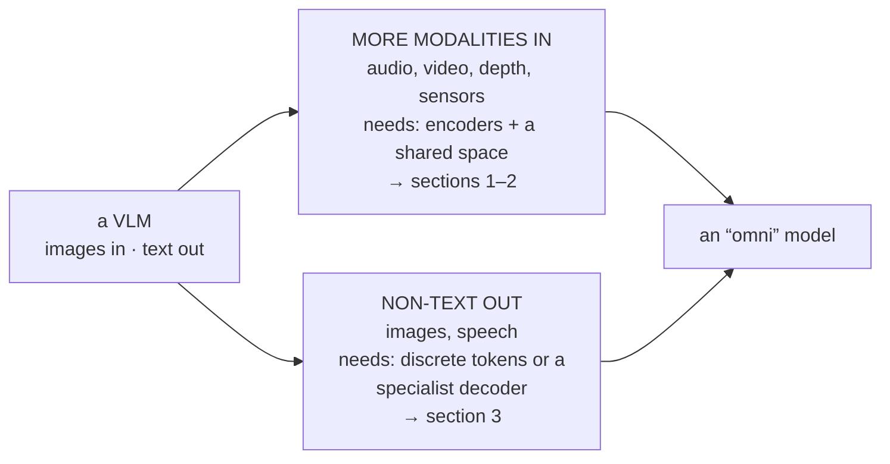
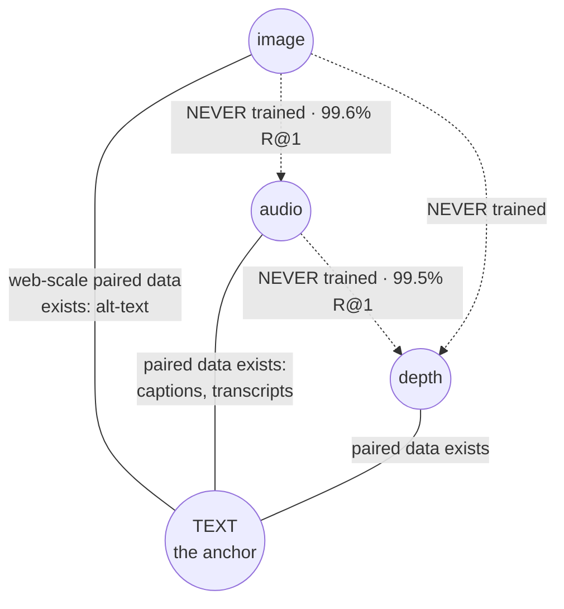
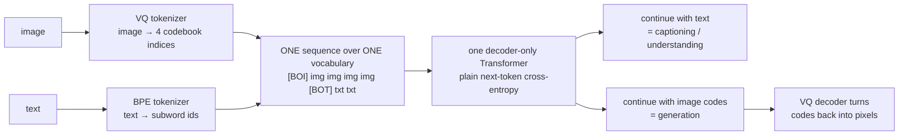
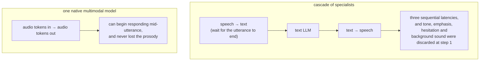

# ভিশনের বাইরে: পূর্ণ মাল্টিমোডালিটি

**Phase:** [Vision-Language Models](../README.md) · **Topic folder:** `11-Beyond-Vision-Full-Multimodality`

## কেন এটি গুরুত্বপূর্ণ

এই phase-এর দশটি lesson একটিমাত্র অতিরিক্ত modality নিয়ে ছিল — যেটি বেছে নেওয়া হয়েছিল কারণ এটি সবচেয়ে বেশি গবেষিত এবং এর ডেটাই সবচেয়ে বেশি। এই শেষ lesson জিজ্ঞেস করে: modality যখন চারটি, বা সাতটি, আর মডেলকে যখন কেবল গ্রহণ নয়, non-text output *তৈরিও* করতে হয় — "vision-language model" থেকে "omni model"-এ উত্তরণ — তখন কী বদলায়। তিনটি জিনিস সত্য প্রমাণিত হয়, আর প্রতিটিই একটি toy-তে পরিমাপযোগ্য: দুটি modality-র মধ্যে alignment তৈরি হতে পারে **তাদের মধ্যে কোনো paired ডেটা ছাড়াই**, যেকোনো modality-র generation হলো **সেই একই next-token objective** যা টেক্সটের জন্য আগে থেকেই ব্যবহৃত হচ্ছে, এবং "aligned" মানে এই **নয়** যে modality-গুলো embedding space-এর একই অঞ্চলে থাকে। এই তিনটি তথ্য, সঙ্গে phase-এর আগের সবকিছু, একটি VLM-কে একটি Gemini- বা GPT-4o-শ্রেণির multimodal system থেকে যা আলাদা করে তার বেশিরভাগ অংশ। এটি course-এর সমাপনী lesson, আর সবচেয়ে বিস্তৃতও — রেসিপিটি ইমেজ ছাড়িয়ে অনেক দূর পর্যন্ত সাধারণীকৃত হয়, এবং সীমাবদ্ধতাগুলোও তার সঙ্গে সাধারণীকৃত হয়।

## ওরিয়েন্টেশন: "omni" আসলে কী বদলায়

"multimodal" শব্দের আড়ালে দুটি স্বাধীন upgrade লুকিয়ে আছে, আর এদের আলাদা করা দরকার কারণ দুটির জন্য ভিন্ন যন্ত্রপাতি লাগে:



প্রথম upgrade-টি মূলত একটি **ডেটা** সমস্যা — বেশিরভাগ modality জোড়ার জন্য paired ডেটা নেই — আর §2 সেই কৌশলটি দেখায় যা সমস্যাটিকে বিলীন করে দেয়। দ্বিতীয়টি মূলত একটি **representation** সমস্যা: টেক্সট আগে থেকেই discrete, কিন্তু ইমেজ আর audio নয়, তাই কোনো কিছুকে এদের discrete করতে হয় (অথবা Transformer ছাড়া অন্য কিছুকে output আঁকতে হয়)। নিচের অংশগুলোর জন্য দুটি পরিভাষা: **anchor modality** হলো সেটি যার সঙ্গে training-এর সময় বাকি প্রতিটি modality-কে জোড়া বাঁধা হয় (বাস্তবে, সবসময় টেক্সট), আর **any-to-any** বোঝায় এমন একটি মডেল যা তার যেকোনো modality যেকোনো ক্রমে গ্রহণ ও তৈরি করতে পারে।

## এই lesson যা covers

- ভিশনের বাইরের modality: audio, video, 3D/depth, এবং তাদের encoder
- টেক্সট কেন anchor modality, এবং `O(n)` বনাম `O(n²)` paired-data যুক্তি
- পরিমাপ করা হয়েছে: emergent cross-modal alignment (ImageBind-এর ফলাফল), এবং এর সীমা
- Any-to-any generation: discrete tokenization, এবং understanding *ও* generation-এর জন্য একটিই objective
- পরিমাপ করা হয়েছে: একই weight-গুলো caption করছে ও generate করছে, এবং ডেটা থেকে একটি দিক বাদ দিলে কী ঘটে
- পরিমাপ করা হয়েছে: "modality gap" কোথা থেকে আসে, এবং বাস্তবে এর অর্থ কী
- Interleaved I/O, speech-to-speech, এবং native multimodality-র পক্ষে latency যুক্তি
- যা কঠিনই থেকে যায়

## 1. রেসিপিটি সাধারণীকৃত হয়

[Phase 10 Lesson 1](../../Phase-10-Advanced-and-Frontier-Topics/01-Multimodal-LLMs/README.md) দাবি করেছিল যে একটি Transformer-এর কেবল একটি shared space-এ ভেক্টর দরকার, আর এই phase-এর Lesson 1–4 ইমেজের জন্য ঠিক সেই pipeline-টি তৈরি করেছে। এর কোনো অংশই ইমেজ-নির্দিষ্ট নয়:

| Modality | Encoder | Token-এর গঠন | স্বতন্ত্র সমস্যা |
|---|---|---|---|
| **Image** | patch-এর উপর ViT | `res²/patch²` token | resolution বনাম token budget (Lesson 1, 8) |
| **Audio / speech** | log-mel spectrogram → conv + Transformer (Whisper-ধাঁচের) | প্রতি সেকেন্ডে ~50 token | একটি দীর্ঘ অক্ষ; speech আর non-speech audio ভিন্ন জিনিস চায় |
| **Video** | প্রতি-frame image encoder + temporal merging | frame × প্রতি-frame token | sampling-ই সবকিছুর উপর প্রভাব ফেলে (Lesson 8 §3) |
| **3D / depth / point cloud** | point বা voxel encoder | অনিয়মিত, কোনো স্বাভাবিক grid নেই | টেক্সটের সঙ্গে paired ডেটা খুবই কম |
| **Time series / sensors** | patch বা conv encoder | একটি দীর্ঘ অক্ষ | paired টেক্সট প্রায় নেই বললেই চলে |

Audio নিয়ে একটি কথা বলা দরকার কারণ এটি সবচেয়ে বেশি deploy হওয়া non-visual modality: **speech recognition আর সাধারণ audio understanding ভিন্ন task**, আর যে token budget একটির জন্য মানানসই তা অন্যটির জন্য খারাপভাবে মানায়। Whisper-ধাঁচের encoder-গুলো transcription-এর জন্য; সংগীত আর পরিবেশগত audio-র দরকার এমন token যা phoneme নয়, texture ধরে রাখে। Lesson 2-এর contrastive-বনাম-captioning যুক্তির সেই একই understanding-বনাম-detail টানাপোড়েন, একটি নতুন modality-তে।

## 2. টেক্সটই anchor: `O(n²)`-এর বদলে `O(n)`

`n` সংখ্যক modality থাকলে `n(n−1)/2` সম্ভাব্য জোড়া হয়, আর তাদের বেশিরভাগের জন্য paired training ডেটা নেই — (audio, depth) জোড়ার কোনো web-scale corpus নেই। ImageBind-এর পর্যবেক্ষণ হলো এর দরকারই নেই। প্রতিটি modality-কে একটি **একক anchor**-এর সঙ্গে বেঁধে দিন যার জন্য paired ডেটা *আছে*, বাকিটা আপনাআপনিই আসে।



নিরেট edge-গুলো সেই জোড়া যেগুলো আসলে train করা হয়েছিল; ড্যাশ-দেওয়া edge-গুলো সেগুলো যা তবুও কাজ করে বেরিয়ে এসেছে। `example.py` §1 এটি সরাসরি পরীক্ষা করে। এটি কেবল `(text, image)`, `(text, audio)` ও `(text, depth)` জোড়া train করে, এবং **কখনোই** একটিও `(image, audio)` জোড়া নয়:

```
training data                       text->image  text->audio  image->audio  audio->depth
untrained encoders                        0.3%         0.5%          1.1%          0.5%
trained: text-image only                100.0%         1.3%          1.5%          0.6%
trained: text-X pairs only               99.5%        99.4%         99.6%         99.5%
trained: ALL pairs (upper bound)         99.7%        99.6%        100.0%         99.5%
```

Row 3-ই ফলাফল: এমন একটি মডেল থেকে 99.6% image→audio retrieval যা দুটি modality-কে কখনো একসঙ্গে দেখেনি। কৌশলটি সাদামাটা — দুটিকেই একই text embedding-এর দিকে টানা হয়েছিল, আর একই তৃতীয় জিনিসের কাছে থাকা দুটি জিনিস একে অপরেরও কাছে থাকে — কিন্তু এর পরিণতি বড়: paired-data খরচ modality-সংখ্যার সাপেক্ষে `O(n²)`-এর বদলে `O(n)` হারে বাড়ে।

Row 2 হলো সেই control যা দাবিটিকে সৎ রাখে। কোনো কিছুর সঙ্গে বাঁধা হয়নি এমন একটি modality সবকিছুর জন্য chance-এই থেকে যায়। Alignment anchor-এর *মধ্য দিয়ে* ছড়ায় এবং কেবল সেই modality-গুলোতে যেগুলো আসলে তার সঙ্গে বাঁধা, আর ঠিক এই কারণেই বাস্তবে টেক্সটই anchor: (text, anything) জোড়া ওয়েবে পাওয়া যায়।

বাস্তব-জগতের সতর্কতা: emergent alignment সরাসরি training-এর চেয়ে দুর্বল (row 4 ভালো, এবং বাস্তব scale-এ ব্যবধান আরও বড়), আর এটি anchor-এর নিজস্ব প্রকাশক্ষমতা দ্বারা সীমাবদ্ধ — কোনো caption যা কখনো বর্ণনা করে না তা এর মধ্য দিয়ে বহন করা যায় না, যা হলো [Lesson 2 §4](../02-Vision-Language-Pretraining-Objectives/README.md#4-what-contrastive-pretraining-destroys)-এর ceiling, এবার একটি পুরো modality-র স্তরে ফিরে আসা।

## 3. Generation হলো next-token prediction

এই phase-এর এখন পর্যন্ত প্রতিটি মডেল ইমেজ গ্রহণ করে আর টেক্সট নির্গত করে। যে পরিবর্তন একটি system-কে সত্যিকারের "any-to-any" করে তোলে তা বিস্ময়করভাবে ছোট: **অন্য modality-টিকে discrete token-এ quantize করুন এবং সেগুলোকে একই vocabulary-তে রাখুন।** একটি VQ-VAE/VQ-GAN tokenizer একটি ইমেজকে codebook index-এর একটি grid-এ পরিণত করে; সেই index-গুলো vocabulary entry হয়ে যায়; `[BOI]  [BOT] <text tokens>` sequence-টি এবং তার উল্টোটি দুটোই কেবল sequence।



`example.py` §2 একটি ক্ষুদ্র Chameleon implement করে: একটি decoder-only Transformer, একটি shared vocabulary, সাধারণ next-token cross-entropy, দুই ক্রমেই train করা।

```
trained on                    understanding   generation (per-token)   exact image
captioning order only                96.2%                     3.8%          0.0%
both orders                          96.2%                   100.0%        100.0%
chance                                0.7%                     6.2%          0.0%
```

যে weight-গুলো একটি ইমেজ বর্ণনা করে সেগুলোই একটি ইমেজ আঁকতে পারে, আর architecture বা loss-এর কোনো কিছুই দিক দুটিকে আলাদা করে না — "একটি ইমেজ generate করো" মানে "পরের token predict করো" যেখানে পরের token-গুলো ঘটনাক্রমে image code। Autoregressive image generation, interleaved image-and-text output, এবং speech output — সবই এই একটি পদক্ষেপ থেকে আসে।

প্রথম row-টি একটি নতুন প্রেক্ষাপটে পরিচিত সতর্কবার্তা: কেবল captioning দিকে train করা একটি মডেল একেবারেই generate করতে পারে না (3.8%, chance-এ)। এর প্রয়োজনীয় প্রতিটি অংশ আছে, কিন্তু সেগুলোকে উল্টো দিকে চালাতে কখনো বলা হয়নি। [Lesson 6](../06-Visual-Instruction-Tuning-and-VLM-Data/README.md)-এর "capability ডেটাকে অনুসরণ করে" output দিকের ক্ষেত্রেও ঠিক ততটাই প্রযোজ্য যতটা task type-এর ক্ষেত্রে।

Toy-টি দুটি সতর্কতা লুকিয়ে রাখে, দুটিই বাস্তবে গুরুত্বপূর্ণ:

- **Quantization প্রকৃত detail হারায়।** প্রকৃত image tokenizer-গুলো high-frequency তথ্য বাদ দেয়, আর এই কারণেই token-ভিত্তিক generation ঐতিহাসিকভাবে image quality-তে diffusion-এর পেছনে থেকেছে। তাই বর্তমানের বেশ কিছু system understanding-এর জন্য token ব্যবহার করলেও output-এর জন্য একটি diffusion decoder রাখে, অথবা এমন token generate করে যা একটি diffusion model-কে condition করে।
- **বড় scale-এ mixed-modal training অস্থির।** Chameleon-এর paper-এর বড় অংশই সেই norm-growth আর divergence সমস্যা নিয়ে যা দেখা দেয় যখন text আর image token একটি softmax ভাগ করে; QK-norm আর সতর্ক normalization placement প্রয়োজনীয় ছিল, ঐচ্ছিক নয়।

## 4. Modality gap: aligned ≠ একই স্থানে অবস্থিত

```
encoders             pair             cos matched  cos within  centroid dist
UNTRAINED            text-image            +0.009      +0.553          0.990
UNTRAINED            image-audio           -0.134      +0.449          1.114
text-anchored        text-image            +0.931      +0.010          0.132
text-anchored        image-audio           +0.924      +0.009          0.136
```

আগে untrained row-গুলো পড়ুন। একটি modality-র ভেতরে দুটি *random* concept-এর cosine ~0.5 — একটি randomly initialized deep encoder সবকিছুকে একটি সরু cone-এ ঠেসে ঢোকায় — অথচ দুটি modality জুড়ে *একই* concept বসে ~0-তে, আর modality centroid-গুলো প্রায় পুরো এক unit দূরে। এর কোনোটিই বিষয়বস্তু নিয়ে নয়; এটি সেই geometry যা নিয়ে একটি random network শুরু করে, আর প্রতিটি encoder-এর cone ভিন্ন দিকে তাক করা।

CLIP-ধাঁচের model-গুলোর জন্য নথিভুক্ত **modality gap**-এর উৎস এটাই: contrastive learning এটি তৈরি করে না, এটি উত্তরাধিকার সূত্রে পায় এবং এর বিরুদ্ধে কাজ করতে হয়। এই toy-তে training cone-গুলোকে পুরোপুরি বিলীন করে দেয়, কারণ task-টি সম্পূর্ণভাবে শেখার যোগ্য; বাস্তব ডেটায়, যেখানে alignment কখনো এতটা সম্পূর্ণ হয় না এবং temperature clamp করা থাকে, একটি পরিমাপযোগ্য gap টিকে থাকে — আর এই কারণেই effect-টির একটি নাম আছে।

Course থেকে সঙ্গে নিয়ে যাওয়ার মতো তিনটি ব্যবহারিক পরিণতি:

- পরম cross-modal similarity score-গুলো within-modality score-এর সঙ্গে তুলনীয় নয়, তাই একটির উপর tune করা cosine threshold অন্যটিতে ভুল হবে।
- Modality embedding মিশিয়ে করা গাণিতিক কাজ (একটি image vector আর একটি text vector-এর গড়) কোনো অঞ্চলেই না পড়ে অদ্ভুত আচরণ করতে পারে।
- এটি একটি কারণ যার জন্য একটি VLM CLIP embedding সরাসরি একটি LLM-এ না দিয়ে একটি projector train করে ([Lesson 3](../03-VLM-Architectures-and-Fusion-Strategies/README.md))। "Aligned" কখনোই "একই জায়গায়" বোঝায়নি।

## 5. Capability-র বাইরে native multimodality যা দেয়

Specialist-দের একটি pipeline-এর বদলে সব modality-র উপর একটি মডেল তৈরির পক্ষে দুটি যুক্তি, আর কোনোটিই benchmark score নিয়ে নয়:



**Latency।** Speech-to-text → LLM → text-to-speech-এর একটি cascade তিনটি পরপর model latency বহন করে এবং transcription শেষ না হওয়া পর্যন্ত উত্তর দেওয়া শুরু করতে পারে না। যে মডেল audio token গ্রহণ করে আর audio token নির্গত করে সেটি utterance-এর মাঝপথেই উত্তর দেওয়া শুরু করতে পারে। কথোপকথনমূলক speech-এর জন্য, এই পার্থক্যটিই product।

**যে তথ্য মধ্যবর্তী representation ফেলে দেয়।** Speech-কে টেক্সটে transcribe করলে tone, emphasis, দ্বিধা, accent, একই সঙ্গে কথা বলা একাধিক বক্তা, এবং পটভূমির শব্দ বাদ পড়ে — যা কিছু এটিকে transcript নয়, speech বানিয়েছিল। [Lesson 4](../04-Connectors-and-Visual-Token-Compression/README.md)-এর সেই একই যুক্তি: মধ্যবর্তী representation যা বাদ দেয় তা downstream-এ আর পুনরুদ্ধার করা যায় না, আর দুটি মডেলের মাঝে একটি text bottleneck পুরো system-এর সবচেয়ে আক্রমণাত্মক compression।

Interleaved input ও output হলো অন্য capability যা কেবল একটি unified model-ই পরিষ্কারভাবে পায়: টেক্সট ও figure-সহ একটি document ভেতরে, টেক্সট ও generate করা diagram-সহ একটি response বাইরে, একটি sequence-এ, সঠিক ক্রমে।

## 6. যা কঠিনই থেকে যায়

- **ডেটা।** Non-visual modality-র জন্য instruction ডেটা ইমেজের তুলনায় অনেক বেশি দুর্লভ, আর [Lesson 6](../06-Visual-Instruction-Tuning-and-VLM-Data/README.md)-এর synthesis কৌশলগুলোর জন্য কাঠামোবদ্ধ সত্যের একটি উৎস দরকার যা audio বা 3D-এর ক্ষেত্রে প্রায়ই থাকে না।
- **Token budget গুণিতক হারে বাড়ে।** [Lesson 4](../04-Connectors-and-Visual-Token-Compression/README.md) ও [10](../10-VLM-Inference-and-Deployment/README.md)-এর প্রতিটি সীমাবদ্ধতা প্রতি modality-তে প্রযোজ্য হয় এবং যোগ হতে থাকে। এক মিনিটের audio, সঙ্গে এক মিনিটের video, সঙ্গে একটি document — এটি কোনো সামান্য prompt নয়।
- **Modality প্রতিযোগিতা।** নির্দিষ্ট capacity ও নির্দিষ্ট data budget-এ, একটি modality যোগ করলে বাকিদের কিছু মূল্য দিতে হয়; modality জুড়ে একটি mixture ভারসাম্য করা task জুড়ে ভারসাম্য করার চেয়ে কঠিন।
- **Evaluation।** [Lesson 9](../09-Evaluating-VLMs/README.md)-এর প্রতিটি সমস্যার একটি multimodal প্রতিরূপ আছে, আর blind-baseline সমস্যা আরও খারাপ হয়: একটি audio benchmark একটি transcript থেকেই সমাধানযোগ্য হতে পারে, একটি video benchmark একটিমাত্র frame থেকে। Control একই — modality সরিয়ে দিয়ে harness চালান।
- **Generation quality বনাম unification।** একটি autoregressive মডেল specialist diffusion generator-দের সমকক্ষ হতে পারে কি না তা সত্যিই অমীমাংসিত, আর production system-গুলোতে বর্তমান উত্তর সাধারণত "এখনো না, তাই specialist decoder রেখে দাও।"

## ভিডিও স্ক্রিপ্টের রূপরেখা

1. VLM থেকে omni model: আসলে কী বদলায় আর কী বদলায় না
2. Encoder table — audio, video, 3D — এবং রেসিপিটির অক্ষত টিকে থাকা
3. `O(n²)` paired-data সমস্যা, এবং anchor-এর ধারণা
4. পরিমাপ করা ImageBind ফলাফল: কোনো image-audio ডেটা ছাড়াই image→audio retrieval
5. যে control row দাবিটিকে সৎ রাখে — alignment কেবল anchor-এর মধ্য দিয়েই ছড়ায়
6. Discrete tokenization: vocabulary entry হিসেবে ইমেজ
7. Mini-Chameleon ফলাফল: একটি loss, understanding ও generation, এবং অনুপস্থিত-দিকের row
8. Quantization loss ও training অস্থিরতা — যে সতর্কতাগুলো production-এ diffusion decoder রেখে দেয়
9. Initialization-এ modality gap, এবং training-এর পর যা টিকে থাকে
10. Latency ও হারানো তথ্য: benchmark-এর বাইরে native multimodality কেন জেতে
11. যা কঠিনই থেকে যায় — ডেটা, budget, প্রতিযোগিতা, evaluation
12. Course-এর সমাপ্তি: পুরো phase একটি ধারায়, patch embedding থেকে omni model পর্যন্ত

## আরও পড়ুন

- Girdhar et al. (2023), *ImageBind: One Embedding Space To Bind Them All* (§2-এ পরিমাপ করা emergent-alignment ফলাফল)
- Team Chameleon (2024), *Chameleon: Mixed-Modal Early-Fusion Foundation Models* (একটি vocabulary, একটি objective, সঙ্গে stability fix-গুলো)
- Radford et al. (2022), *Robust Speech Recognition via Large-Scale Weak Supervision* (Whisper; প্রচলিত audio encoder)
- Liang et al. (2022), *Mind the Gap: Understanding the Modality Gap in Multi-modal Contrastive Representation Learning* (initialization-এ gap-এর উৎস)
- Défossez et al. (2024), *Moshi: a speech-text foundation model for real-time dialogue* (latency যুক্তি, বাস্তবে তৈরি করা)
- Wu et al. (2023), *NExT-GPT: Any-to-Any Multimodal LLM* (প্রতি output modality-র জন্য specialist decoder দিয়ে any-to-any)
