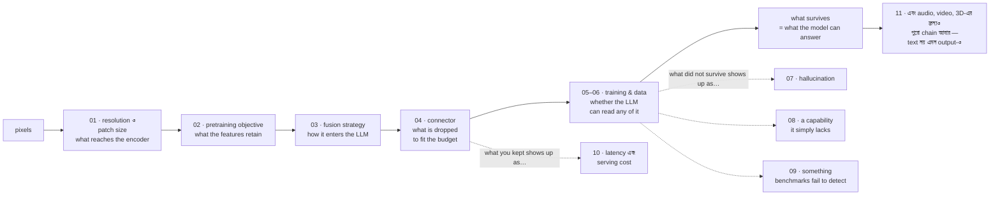

# Vision-Language Models

[← Back to curriculum index](../README.md)

vision-language model-গুলোর একটি নিবেদিত, end-to-end আলোচনা: vision encoder, সেই pretraining objective, যা এর features-কে অর্থ দেয়, vision একটি language model-এ প্রবেশ করার তিনটি উপায়, connector, যা token-এর বিনিময়ে তার খরচ দেয়, staged training pipeline, instruction data, hallucination ও alignment, production-এ গুরুত্বপূর্ণ capability পরিবারগুলো, evaluation, serving — এবং সবশেষে vision-এর বাইরের multimodality।

[Phase 10 Lesson 1](../Phase-10-Advanced-and-Frontier-Topics/01-Multimodal-LLMs/README.md) মূল ধারণাটি (CLIP-style alignment প্লাস LLaVA-style visual instruction tuning) একটি lesson-এ introduce করেছে। এই phase হলো সেই deep dive, যেটির পূর্বাভাস সেই lesson দিয়েছিল, এবং এটি সেটিকে ধরে নেয়: আপনি পড়ে না থাকলে সেটি দিয়ে শুরু করুন।

প্রতিটি lesson-এর `example.py` তার বিষয়টি synthetic data-তে PyTorch-এ from scratch তৈরি করে এবং শেখানো effect-টিকে **মাপে** — token-এর খরচের curve, contrastive loss-এর batch-size sensitivity, token compression-এর accuracy খরচ, catastrophic forgetting, DPO-এর আগে-পরে hallucination হার, ছোট text পড়ার resolution সীমা, benchmark contamination, prefill-dominated latency, এবং উদীয়মান cross-modal alignment।

## এই phase-এর topic-গুলো

| # | Topic |
|---|-------|
| 01 | [Vision Encoders and Image Tokenization](01-Vision-Encoders-and-Image-Tokenization/README.md) |
| 02 | [Vision-Language Pretraining Objectives](02-Vision-Language-Pretraining-Objectives/README.md) |
| 03 | [VLM Architectures and Fusion Strategies](03-VLM-Architectures-and-Fusion-Strategies/README.md) |
| 04 | [Connectors and Visual Token Compression](04-Connectors-and-Visual-Token-Compression/README.md) |
| 05 | [Training a VLM: the Staged Pipeline](05-Training-a-VLM-Staged-Pipeline/README.md) |
| 06 | [Visual Instruction Tuning and VLM Data](06-Visual-Instruction-Tuning-and-VLM-Data/README.md) |
| 07 | [VLM Hallucination and Alignment](07-VLM-Hallucination-and-Alignment/README.md) |
| 08 | [VLM Capabilities: Grounding, OCR, Documents, Video and GUIs](08-VLM-Capabilities-Grounding-OCR-Video-GUI/README.md) |
| 09 | [Evaluating VLMs](09-Evaluating-VLMs/README.md) |
| 10 | [VLM Inference and Deployment](10-VLM-Inference-and-Deployment/README.md) |
| 11 | [Beyond Vision: Full Multimodality](11-Beyond-Vision-Full-Multimodality/README.md) |

## সমগ্র phase-জুড়ে চলা সুতো

প্রতিটি lesson-এ একটি trade-off ফিরে আসে, এবং এটি শুরু থেকেই নাম করা মূল্যবান: **একটি ছবির তথ্যকে lossy ধাপের একটি শৃঙ্খল পেরিয়ে টিকে থাকতে হয়, এবং প্রতিটি ধাপ token-এর বিনিময়ে মূল্য দেয়।**

Resolution ঠিক করে কী encoder-এ পৌঁছায় (01)। pretraining objective ঠিক করে features সেগুলোর কতটুকু ধরে রাখে (02)। fusion strategy ঠিক করে কীভাবে তা LLM-এ প্রবেশ করে এবং সেখানে কী খরচ হয় (03)। connector ঠিক করে context budget-এ মানানোর জন্য কতটা ফেলে দেওয়া হয় (04)। training ঠিক করে LLM তার text ক্ষমতা হারানো ছাড়া সেগুলোর কোনোটা পড়তে পারে কি না (05, 06)। সেই শৃঙ্খলের শেষে যা অনুপস্থিত, তা-ই নিয়ে model hallucinate করে (07), যা পড়তে বা নির্দেশ করতে পারে না (08), যা benchmark detect করতে ব্যর্থ হয় (09), এবং যা serving বিল নির্ধারণ করে (10)। Lesson 11 দেখায় একই শৃঙ্খল audio, video এবং 3D-এর জন্য চলছে — এবং আরও একটি ধাপ, যেখানে output text হওয়া বন্ধ করে দেয়।

## Prerequisites

- [Phase 02](../Phase-02-Transformer-Architecture-Deep-Dive/README.md) — attention, positional encoding, এবং এই phase-এর উদাহরণগুলো পুনরায় ব্যবহার করে এমন mini-Transformer
- [Phase 03 Lesson 1](../Phase-03-LLM-Architectures-and-Types/01-Decoder-Only-Models-GPT-Family/README.md) — প্রতিটি VLM-এর ভিত্তি decoder-only model
- [Phase 05 Lesson 4](../Phase-05-Finetuning-LLMs/04-Instruction-Tuning-SFT/README.md) — instruction tuning, Lesson 05 এবং 06-এ image-এ বিস্তৃত
- [Phase 06 Lesson 4](../Phase-06-Alignment-and-RLHF/04-Direct-Preference-Optimization-DPO/README.md) — DPO, Lesson 07-এ hallucination-এ প্রয়োগ করা
- [Phase 08](../Phase-08-Evaluation-of-LLMs/README.md) এবং [Phase 09](../Phase-09-Deployment-and-Inference-Optimization/README.md) — Lesson 09 এবং 10 যে evaluation ও serving ভিত্তি পরিবর্তন করে
- [Phase 10 Lesson 1](../Phase-10-Advanced-and-Frontier-Topics/01-Multimodal-LLMs/README.md) — যে overview এই phase বিস্তৃত করে