# LLM টিউটোরিয়াল — Beginner থেকে Advanced

Large Language Model (LLM) শেখানোর জন্য একটি সম্পূর্ণ YouTube playlist curriculum: একদম গোড়ার math/DL prerequisites থেকে শুরু করে classic NLP → Transformer internals → LLM architectures ও types → pretraining → fine-tuning → alignment/RLHF → prompting → evaluation → deployment/inference optimization → frontier research → vision-language models এবং multimodality।

এই কোর্সের পরিধি মূলত **model নিজেই** — তার math, architecture, training, alignment, evaluation এবং inference internals; text-only LLM-গুলোর জন্য (Phase 00–10) এবং vision-language / multimodal model-গুলোর জন্য (Phase 11)। ইচ্ছাকৃতভাবে model-এর উপরে তৈরি হওয়া অ্যাপ্লিকেশনগুলো বাদ দেওয়া হয়েছে (RAG pipeline, agent, chatbot ইত্যাদি), যাতে প্রতিটি lesson model-এর উপরই কেন্দ্রীভূত থাকে — model-কে ঘিরে গড়ে ওঠা software-এর উপর নয়।

## এই repo কীভাবে সাজানো

- প্রতিটি **`Phase-XX-*`** folder কোর্সের একটি ধাপ, যা ক্রমানুসারে পড়ানো হয়।
- প্রতিটি phase-এর ভেতরে নম্বরযুক্ত **topic folder** থাকে (`01-...`, `02-...`, …), যা phase-এর ভেতরে ক্রমানুসারে পড়ানো হয়।
- প্রতিটি topic folder = **একটি ভিডিও**, এবং এতে থাকে:
  - `README.md` — lesson-এর doc / video script: theory, explanation এবং script outline।
  - `example.py` — সেই lesson-এর জন্য একটি runnable, commented code demo।
- প্রথম দিকের architecture/foundation topic-গুলো **from scratch** বানানো হয়েছে raw PyTorch-এ (attention, transformer block, mini-GPT, একটি ছোট pretraining run), যাতে internals কখনো black box না থাকে। পরের applied phases-গুলোতে (fine-tuning, deployment) **industry-standard library** ব্যবহার করা হয়েছে (Hugging Face `transformers`/`peft`/`trl`, `vLLM` ইত্যাদি)।
- Status: পুরো folder/file structure এখন scaffolded; lesson content এখন **phase-by-phase** লেখা হচ্ছে। যেসব topic-এর `README.md`-তে এখনও "Content for this lesson is not yet written" লেখা আছে, সেগুলোর content এখনও লেখা হয়নি।

## কোর্সের গতিপথ

```mermaid
flowchart LR
    P0["00 · Prerequisites<br/>math · NN · PyTorch"] --> P1["01 · Language modeling<br/>embeddings → RNNs → attention"]
    P1 --> P2["02 · Transformer internals<br/>build one from scratch"]
    P2 --> P3["03 · Architectures<br/>decoder · encoder · MoE · scaling"]
    P3 --> P4["04 · Pretraining"]
    P4 --> P5["05 · Fine-tuning<br/>LoRA · PEFT · SFT"]
    P5 --> P6["06 · Alignment<br/>RLHF · DPO · reasoning"]
    P6 --> P7["07 · Prompting &<br/>in-context learning"]
    P7 --> P8["08 · Evaluation"]
    P8 --> P9["09 · Deployment &<br/>inference optimization"]
    P9 --> P10["10 · Frontier topics<br/>MoE · Mamba · interpretability"]
    P10 --> P11["11 · Vision-language models<br/>এবং multimodality"]
```

Phase 00–02 মেশিনারি তৈরি করে, 03–06 একটি model তৈরি ও align করে, 07–09 model ব্যবহার ও মাপে, আর 10–11 স্ট্যান্ডার্ড text-only রেসিপির বাইরে যায়। প্রতিটি phase তার উপর নির্ভরশীল lesson-গুলোর সাথে লিঙ্ক করা, তাই উপরের চেইনটিই হলো পড়ার ক্রম।

## Curriculum সূচি

### [Phase 00 — Prerequisites](Phase-00-Prerequisites/README.md)
| # | Topic |
|---|-------|
| 01 | [Python and Math Refresher](Phase-00-Prerequisites/01-Python-and-Math-Refresher/README.md) |
| 02 | [Neural Networks Basics](Phase-00-Prerequisites/02-Neural-Networks-Basics/README.md) |
| 03 | [Introduction to NLP](Phase-00-Prerequisites/03-Intro-to-NLP/README.md) |
| 04 | [PyTorch Fundamentals](Phase-00-Prerequisites/04-PyTorch-Fundamentals/README.md) |

### [Phase 01 — Language Modeling Foundations](Phase-01-Language-Modeling-Foundations/README.md)
| # | Topic |
|---|-------|
| 01 | [What is a Language Model](Phase-01-Language-Modeling-Foundations/01-What-is-a-Language-Model/README.md) |
| 02 | [Word Embeddings](Phase-01-Language-Modeling-Foundations/02-Word-Embeddings/README.md) |
| 03 | [RNNs, LSTMs and GRUs](Phase-01-Language-Modeling-Foundations/03-RNN-LSTM-GRU/README.md) |
| 04 | [Sequence-to-Sequence and Attention](Phase-01-Language-Modeling-Foundations/04-Seq2Seq-and-Attention/README.md) |
| 05 | [Introduction to Transformers](Phase-01-Language-Modeling-Foundations/05-Intro-to-Transformers/README.md) |

### [Phase 02 — Transformer Architecture Deep Dive](Phase-02-Transformer-Architecture-Deep-Dive/README.md)
| # | Topic |
|---|-------|
| 01 | [Tokenization](Phase-02-Transformer-Architecture-Deep-Dive/01-Tokenization/README.md) |
| 02 | [Self-Attention and Multi-Head Attention](Phase-02-Transformer-Architecture-Deep-Dive/02-Self-Attention-and-Multi-Head-Attention/README.md) |
| 03 | [Positional Encoding](Phase-02-Transformer-Architecture-Deep-Dive/03-Positional-Encoding/README.md) |
| 04 | [Transformer Encoder-Decoder Architecture](Phase-02-Transformer-Architecture-Deep-Dive/04-Transformer-Encoder-Decoder/README.md) |
| 05 | [Layer Norm, Residuals and Feed-Forward Sublayers](Phase-02-Transformer-Architecture-Deep-Dive/05-LayerNorm-Residuals-FFN/README.md) |
| 06 | [Building a Mini-Transformer / Mini-GPT From Scratch](Phase-02-Transformer-Architecture-Deep-Dive/06-Mini-Transformer-From-Scratch/README.md) |
| 07 | [Efficient Attention: FlashAttention, Sparse and Linear Attention](Phase-02-Transformer-Architecture-Deep-Dive/07-Efficient-Attention-FlashAttention-and-Approximations/README.md) |

### [Phase 03 — LLM Architectures and Types](Phase-03-LLM-Architectures-and-Types/README.md)
| # | Topic |
|---|-------|
| 01 | [Decoder-Only Models: the GPT Family](Phase-03-LLM-Architectures-and-Types/01-Decoder-Only-Models-GPT-Family/README.md) |
| 02 | [Encoder-Only Models: the BERT Family](Phase-03-LLM-Architectures-and-Types/02-Encoder-Only-Models-BERT-Family/README.md) |
| 03 | [Encoder-Decoder Models: T5 and BART](Phase-03-LLM-Architectures-and-Types/03-Encoder-Decoder-Models-T5-BART/README.md) |
| 04 | [Mixture of Experts](Phase-03-LLM-Architectures-and-Types/04-Mixture-of-Experts/README.md) |
| 05 | [Scaling Laws](Phase-03-LLM-Architectures-and-Types/05-Scaling-Laws/README.md) |
| 06 | [Long-Context Techniques](Phase-03-LLM-Architectures-and-Types/06-Long-Context-Techniques/README.md) |
| 07 | [Survey of Popular Open LLMs](Phase-03-LLM-Architectures-and-Types/07-Survey-of-Popular-Open-LLMs/README.md) |

### [Phase 04 — Pretraining LLMs](Phase-04-Pretraining-LLMs/README.md)
| # | Topic |
|---|-------|
| 01 | [Pretraining Data Pipeline](Phase-04-Pretraining-LLMs/01-Pretraining-Data-Pipeline/README.md) |
| 02 | [Pretraining Objectives](Phase-04-Pretraining-LLMs/02-Pretraining-Objectives/README.md) |
| 03 | [Distributed Training Basics](Phase-04-Pretraining-LLMs/03-Distributed-Training-Basics/README.md) |
| 04 | [Mixed Precision and Optimization](Phase-04-Pretraining-LLMs/04-Mixed-Precision-and-Optimization/README.md) |
| 05 | [Pretraining a Small LLM From Scratch](Phase-04-Pretraining-LLMs/05-Pretraining-a-Small-LLM-From-Scratch/README.md) |

### [Phase 05 — Fine-tuning LLMs](Phase-05-Finetuning-LLMs/README.md)
| # | Topic |
|---|-------|
| 01 | [Full Fine-tuning vs Parameter-Efficient Fine-tuning](Phase-05-Finetuning-LLMs/01-Full-Finetuning-vs-PEFT/README.md) |
| 02 | [LoRA and QLoRA](Phase-05-Finetuning-LLMs/02-LoRA-and-QLoRA/README.md) |
| 03 | [Prompt Tuning, Prefix Tuning and Adapters](Phase-05-Finetuning-LLMs/03-Prompt-Tuning-Prefix-Tuning-Adapters/README.md) |
| 04 | [Instruction Tuning (SFT)](Phase-05-Finetuning-LLMs/04-Instruction-Tuning-SFT/README.md) |
| 05 | [Fine-tuning with Hugging Face (PEFT + TRL)](Phase-05-Finetuning-LLMs/05-Finetuning-with-HuggingFace-PEFT-TRL/README.md) |
| 06 | [Domain-Specific Fine-tuning Case Study](Phase-05-Finetuning-LLMs/06-Domain-Specific-Finetuning-Case-Study/README.md) |

### [Phase 06 — Alignment and RLHF](Phase-06-Alignment-and-RLHF/README.md)
| # | Topic |
|---|-------|
| 01 | [The Alignment Problem](Phase-06-Alignment-and-RLHF/01-The-Alignment-Problem/README.md) |
| 02 | [Reward Modeling](Phase-06-Alignment-and-RLHF/02-Reward-Modeling/README.md) |
| 03 | [RLHF with PPO](Phase-06-Alignment-and-RLHF/03-RLHF-with-PPO/README.md) |
| 04 | [Direct Preference Optimization (DPO)](Phase-06-Alignment-and-RLHF/04-Direct-Preference-Optimization-DPO/README.md) |
| 05 | [RLAIF and Constitutional AI](Phase-06-Alignment-and-RLHF/05-RLAIF-and-Constitutional-AI/README.md) |
| 06 | [Safety, Bias and Toxicity Mitigation](Phase-06-Alignment-and-RLHF/06-Safety-Bias-and-Toxicity-Mitigation/README.md) |
| 07 | [Reasoning Models and GRPO](Phase-06-Alignment-and-RLHF/07-Reasoning-Models-and-GRPO/README.md) |

### [Phase 07 — Prompt Engineering and In-Context Learning](Phase-07-Prompt-Engineering-and-In-Context-Learning/README.md)
| # | Topic |
|---|-------|
| 01 | [Prompting Basics: Zero-Shot and Few-Shot](Phase-07-Prompt-Engineering-and-In-Context-Learning/01-Prompting-Basics-Zero-Few-Shot/README.md) |
| 02 | [Chain-of-Thought and Reasoning Prompts](Phase-07-Prompt-Engineering-and-In-Context-Learning/02-Chain-of-Thought-and-Reasoning-Prompts/README.md) |
| 03 | [Tree-of-Thought and ReAct](Phase-07-Prompt-Engineering-and-In-Context-Learning/03-Tree-of-Thought-and-ReAct/README.md) |
| 04 | [Automatic Prompt Optimization](Phase-07-Prompt-Engineering-and-In-Context-Learning/04-Automatic-Prompt-Optimization/README.md) |
| 05 | [Structured Output and Function Calling](Phase-07-Prompt-Engineering-and-In-Context-Learning/05-Structured-Output-and-Function-Calling/README.md) |

### [Phase 08 — Evaluation of LLMs](Phase-08-Evaluation-of-LLMs/README.md)
| # | Topic |
|---|-------|
| 01 | [Evaluation Metrics](Phase-08-Evaluation-of-LLMs/01-Evaluation-Metrics/README.md) |
| 02 | [Standard Benchmarks](Phase-08-Evaluation-of-LLMs/02-Standard-Benchmarks/README.md) |
| 03 | [LLM-as-a-Judge](Phase-08-Evaluation-of-LLMs/03-LLM-as-a-Judge/README.md) |
| 04 | [Hallucination and Factuality Evaluation](Phase-08-Evaluation-of-LLMs/04-Hallucination-and-Factuality-Evaluation/README.md) |
| 05 | [Human Evaluation Methodologies](Phase-08-Evaluation-of-LLMs/05-Human-Evaluation-Methodologies/README.md) |
| 06 | [VLM-as-a-Judge](Phase-08-Evaluation-of-LLMs/06-VLM-as-a-Judge/README.md) |

### [Phase 09 — Deployment and Inference Optimization](Phase-09-Deployment-and-Inference-Optimization/README.md)
| # | Topic |
|---|-------|
| 01 | [GPU and Hardware Fundamentals](Phase-09-Deployment-and-Inference-Optimization/01-GPU-and-Hardware-Fundamentals/README.md) |
| 02 | [Quantization](Phase-09-Deployment-and-Inference-Optimization/02-Quantization/README.md) |
| 03 | [KV Cache and Speculative Decoding](Phase-09-Deployment-and-Inference-Optimization/03-KV-Cache-and-Speculative-Decoding/README.md) |
| 04 | [Serving Frameworks](Phase-09-Deployment-and-Inference-Optimization/04-Serving-Frameworks/README.md) |
| 05 | [Model Distillation and Pruning](Phase-09-Deployment-and-Inference-Optimization/05-Model-Distillation-and-Pruning/README.md) |
| 06 | [Cost and Latency Optimization](Phase-09-Deployment-and-Inference-Optimization/06-Cost-and-Latency-Optimization/README.md) |
| 07 | [Generation and Decoding Strategies](Phase-09-Deployment-and-Inference-Optimization/07-Generation-and-Decoding-Strategies/README.md) |
| 08 | [Kernel and Compiler Optimization](Phase-09-Deployment-and-Inference-Optimization/08-Kernel-and-Compiler-Optimization/README.md) |
| 09 | [Distributed Inference at Scale](Phase-09-Deployment-and-Inference-Optimization/09-Distributed-Inference-at-Scale/README.md) |
| 10 | [Production Serving and Benchmarking](Phase-09-Deployment-and-Inference-Optimization/10-Production-Serving-and-Benchmarking/README.md) |
| 11 | [Frontier Inference Systems](Phase-09-Deployment-and-Inference-Optimization/11-Frontier-Inference-Systems/README.md) |

### [Phase 10 — Advanced and Frontier Topics](Phase-10-Advanced-and-Frontier-Topics/README.md)
| # | Topic |
|---|-------|
| 01 | [Multimodal LLMs](Phase-10-Advanced-and-Frontier-Topics/01-Multimodal-LLMs/README.md) |
| 02 | [Mixture of Experts, Advanced](Phase-10-Advanced-and-Frontier-Topics/02-Mixture-of-Experts-Advanced/README.md) |
| 03 | [State Space Models (Mamba)](Phase-10-Advanced-and-Frontier-Topics/03-State-Space-Models-Mamba/README.md) |
| 04 | [Model Merging and Editing](Phase-10-Advanced-and-Frontier-Topics/04-Model-Merging-and-Editing/README.md) |
| 05 | [Interpretability and Mechanistic Interpretability](Phase-10-Advanced-and-Frontier-Topics/05-Interpretability-and-Mechanistic-Interpretability/README.md) |

### [Phase 11 — Vision-Language Models](Phase-11-Vision-Language-Models/README.md)
| # | Topic |
|---|-------|
| 01 | [Vision Encoders and Image Tokenization](Phase-11-Vision-Language-Models/01-Vision-Encoders-and-Image-Tokenization/README.md) |
| 02 | [Vision-Language Pretraining Objectives](Phase-11-Vision-Language-Models/02-Vision-Language-Pretraining-Objectives/README.md) |
| 03 | [VLM Architectures and Fusion Strategies](Phase-11-Vision-Language-Models/03-VLM-Architectures-and-Fusion-Strategies/README.md) |
| 04 | [Connectors and Visual Token Compression](Phase-11-Vision-Language-Models/04-Connectors-and-Visual-Token-Compression/README.md) |
| 05 | [Training a VLM: the Staged Pipeline](Phase-11-Vision-Language-Models/05-Training-a-VLM-Staged-Pipeline/README.md) |
| 06 | [Visual Instruction Tuning and VLM Data](Phase-11-Vision-Language-Models/06-Visual-Instruction-Tuning-and-VLM-Data/README.md) |
| 07 | [VLM Hallucination and Alignment](Phase-11-Vision-Language-Models/07-VLM-Hallucination-and-Alignment/README.md) |
| 08 | [VLM Capabilities: Grounding, OCR, Documents, Video and GUIs](Phase-11-Vision-Language-Models/08-VLM-Capabilities-Grounding-OCR-Video-GUI/README.md) |
| 09 | [Evaluating VLMs](Phase-11-Vision-Language-Models/09-Evaluating-VLMs/README.md) |
| 10 | [VLM Inference and Deployment](Phase-11-Vision-Language-Models/10-VLM-Inference-and-Deployment/README.md) |
| 11 | [Beyond Vision: Full Multimodality](Phase-11-Vision-Language-Models/11-Beyond-Vision-Full-Multimodality/README.md) |

---

**মোট:** 12টি phase · 70টি topic/video।