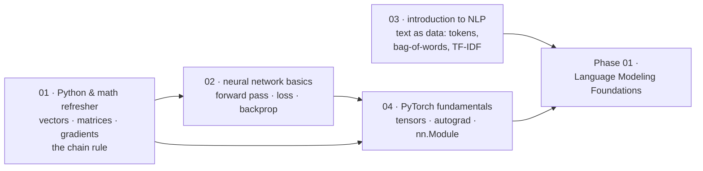

# Prerequisites

[← Back to curriculum index](../README.md)

Brush up on the math, Python, and deep-learning basics needed before touching a Transformer.

## The path through this phase

Four lessons, and only one of them is about text. The goal is that nothing in Phase 02 — where a Transformer gets taken apart — is unfamiliar *mathematics* or unfamiliar *PyTorch*, so that all your attention can go on the architecture itself.

Skip a lesson if you already know it — they are independent except that 02 assumes 01, and 04 is easier after both.

## Topics in this phase

| # | Topic |
|---|-------|
| 01 | [Python and Math Refresher](01-Python-and-Math-Refresher/README.md) |
| 02 | [Neural Networks Basics](02-Neural-Networks-Basics/README.md) |
| 03 | [Introduction to NLP](03-Intro-to-NLP/README.md) |
| 04 | [PyTorch Fundamentals](04-PyTorch-Fundamentals/README.md) |
