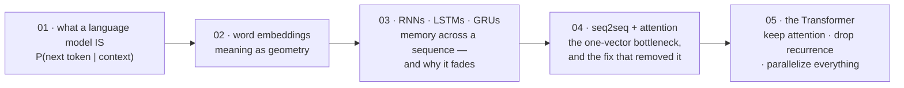

# Language Modeling Foundations

[← Back to curriculum index](../README.md)

Understand what a language model actually is and how the field evolved from n-grams to attention before Transformers existed.

## The path through this phase

This phase is deliberately historical: each lesson introduces a solution, and the next lesson shows the problem that solution still had. By the end, the Transformer arrives not as a novelty but as the obvious response to a specific bottleneck you have already seen fail.

## Topics in this phase

| # | Topic |
|---|-------|
| 01 | [What is a Language Model](01-What-is-a-Language-Model/README.md) |
| 02 | [Word Embeddings](02-Word-Embeddings/README.md) |
| 03 | [RNNs, LSTMs and GRUs](03-RNN-LSTM-GRU/README.md) |
| 04 | [Sequence-to-Sequence and Attention](04-Seq2Seq-and-Attention/README.md) |
| 05 | [Introduction to Transformers](05-Intro-to-Transformers/README.md) |
