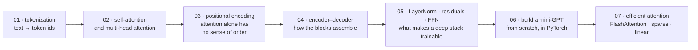

# Transformer Architecture Deep Dive

[← Back to curriculum index](../README.md)

Take the Transformer apart piece by piece and rebuild a mini version from scratch in PyTorch.

## The path through this phase

Every component of a Transformer, in the order you need it to build one — ending with a working mini-GPT written from scratch, then the efficiency work that makes real context lengths possible.

Lessons 01–05 are the parts; Lesson 06 is where they become a model you can train and sample from. Lesson 07 then asks what has to change when the sequence gets long.

## Topics in this phase

| # | Topic |
|---|-------|
| 01 | [Tokenization](01-Tokenization/README.md) |
| 02 | [Self-Attention and Multi-Head Attention](02-Self-Attention-and-Multi-Head-Attention/README.md) |
| 03 | [Positional Encoding](03-Positional-Encoding/README.md) |
| 04 | [Transformer Encoder-Decoder Architecture](04-Transformer-Encoder-Decoder/README.md) |
| 05 | [Layer Norm, Residuals and Feed-Forward Sublayers](05-LayerNorm-Residuals-FFN/README.md) |
| 06 | [Building a Mini-Transformer / Mini-GPT From Scratch](06-Mini-Transformer-From-Scratch/README.md) |
| 07 | [Efficient Attention: FlashAttention, Sparse and Linear Attention](07-Efficient-Attention-FlashAttention-and-Approximations/README.md) |
