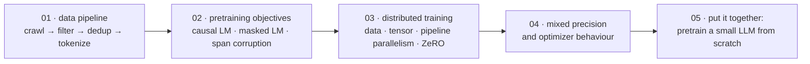

# Pretraining LLMs

[← Back to curriculum index](../README.md)

Go behind the scenes of how a base model is actually trained from raw text at scale.

## The path through this phase

Pretraining is where a model acquires everything it knows, and it is mostly an *engineering* problem: the objective is one line of code, and the other four lessons are about making that line run on a trillion tokens without falling over.

Lesson 05 is the payoff: the same loop, at a size that runs on one machine, with the loss curve and the samples to prove it worked.

## Topics in this phase

| # | Topic |
|---|-------|
| 01 | [Pretraining Data Pipeline](01-Pretraining-Data-Pipeline/README.md) |
| 02 | [Pretraining Objectives](02-Pretraining-Objectives/README.md) |
| 03 | [Distributed Training Basics](03-Distributed-Training-Basics/README.md) |
| 04 | [Mixed Precision and Optimization](04-Mixed-Precision-and-Optimization/README.md) |
| 05 | [Pretraining a Small LLM From Scratch](05-Pretraining-a-Small-LLM-From-Scratch/README.md) |
