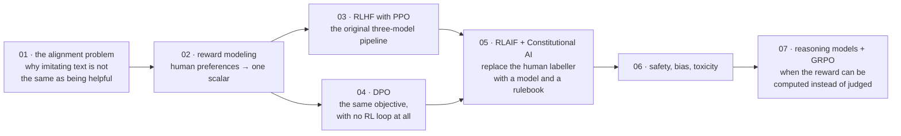

# Alignment and RLHF

[← Back to curriculum index](../README.md)

Understand how models are steered toward helpful, honest, and harmless behavior after pretraining.

## The path through this phase

Fine-tuning ([Phase 05](../Phase-05-Finetuning-LLMs/README.md)) teaches a model to imitate good answers. Alignment teaches it to *prefer* them — which needs a signal that says one response is better than another, and a way to optimize against that signal without destroying the model.

## Topics in this phase

| # | Topic |
|---|-------|
| 01 | [The Alignment Problem](01-The-Alignment-Problem/README.md) |
| 02 | [Reward Modeling](02-Reward-Modeling/README.md) |
| 03 | [RLHF with PPO](03-RLHF-with-PPO/README.md) |
| 04 | [Direct Preference Optimization (DPO)](04-Direct-Preference-Optimization-DPO/README.md) |
| 05 | [RLAIF and Constitutional AI](05-RLAIF-and-Constitutional-AI/README.md) |
| 06 | [Safety, Bias and Toxicity Mitigation](06-Safety-Bias-and-Toxicity-Mitigation/README.md) |
| 07 | [Reasoning Models and GRPO](07-Reasoning-Models-and-GRPO/README.md) |
