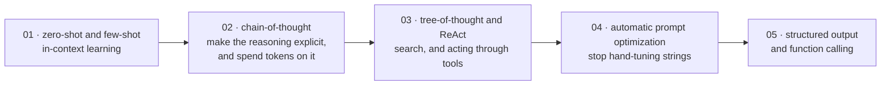

# Prompt Engineering and In-Context Learning

[← Back to curriculum index](../README.md)

Get the most out of a frozen model purely through how you talk to it.

## The path through this phase

Everything here happens at inference time, with the weights frozen — which is exactly why it matters: it is the only phase whose techniques you can apply to a model you did not train and cannot modify.

## Topics in this phase

| # | Topic |
|---|-------|
| 01 | [Prompting Basics: Zero-Shot and Few-Shot](01-Prompting-Basics-Zero-Few-Shot/README.md) |
| 02 | [Chain-of-Thought and Reasoning Prompts](02-Chain-of-Thought-and-Reasoning-Prompts/README.md) |
| 03 | [Tree-of-Thought and ReAct](03-Tree-of-Thought-and-ReAct/README.md) |
| 04 | [Automatic Prompt Optimization](04-Automatic-Prompt-Optimization/README.md) |
| 05 | [Structured Output and Function Calling](05-Structured-Output-and-Function-Calling/README.md) |
