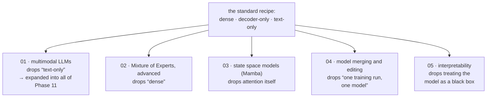

# Advanced and Frontier Topics

[← Back to curriculum index](../README.md)

Explore where LLM research is headed beyond the now-standard Transformer recipe.

## The path through this phase

Phases 02–09 built one specific recipe: a dense, decoder-only, text-only Transformer. Each lesson here breaks a different assumption in that sentence, and the lessons are independent — read them in any order.

## Topics in this phase

| # | Topic |
|---|-------|
| 01 | [Multimodal LLMs](01-Multimodal-LLMs/README.md) |
| 02 | [Mixture of Experts, Advanced](02-Mixture-of-Experts-Advanced/README.md) |
| 03 | [State Space Models (Mamba)](03-State-Space-Models-Mamba/README.md) |
| 04 | [Model Merging and Editing](04-Model-Merging-and-Editing/README.md) |
| 05 | [Interpretability and Mechanistic Interpretability](05-Interpretability-and-Mechanistic-Interpretability/README.md) |
