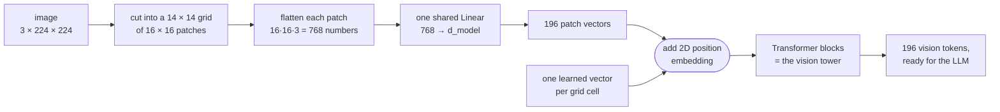
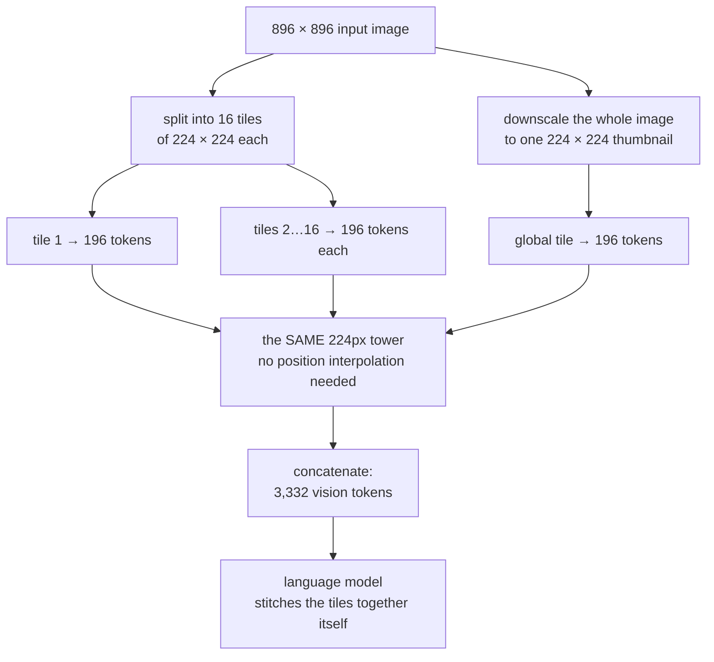
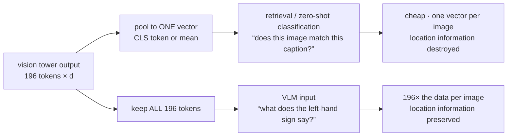

# Vision Encoders and Image Tokenization

**Phase:** [Vision-Language Models](../README.md) · **Topic folder:** `01-Vision-Encoders-and-Image-Tokenization`

## Why this matters

[Phase 10 Lesson 1](../../Phase-10-Advanced-and-Frontier-Topics/01-Multimodal-LLMs/README.md) made the central claim of this whole phase in one sentence: a decoder-only Transformer doesn't care what a token *means*, only that it is a vector in the right space, so multimodality reduces to producing such vectors. That lesson then jumped straight to CLIP and LLaVA. This phase goes back and builds the pipeline properly, and the first thing that pipeline needs is the piece that sits before any of it: something that turns a grid of pixels into a **sequence**. That component — the vision encoder — determines almost everything downstream. How many tokens an image costs, whether the model can read small text, whether it knows *where* things are, how much of the LLM's context window an image eats, and how expensive prefill is at serving time are all decided here, in the tokenizer for images, exactly as [text tokenization](../../Phase-02-Transformer-Architecture-Deep-Dive/01-Tokenization/README.md) decides those things for text. This lesson builds an image tokenizer from scratch and measures its costs; the rest of the phase is about what you attach to it.

## The one-paragraph orientation

A **vision encoder** (or "vision tower") is the image half of a VLM: pixels in, a sequence of vectors out. The dominant design is a **Vision Transformer (ViT)** — the same architecture from [Phase 02](../../Phase-02-Transformer-Architecture-Deep-Dive/README.md), applied to square patches of an image instead of subword tokens. Everything in this lesson is the image counterpart of something you have already seen for text:

| Text pipeline (Phases 02–03) | Image pipeline (this lesson) |
|---|---|
| a string | a pixel grid, `(3, H, W)` |
| BPE tokenizer splits it into subwords | patch embedding cuts it into fixed-size squares |
| a vocabulary of ~50k learned embeddings | no vocabulary — each patch is projected directly |
| embedding-table lookup per token | one shared `Linear` over the flattened patch |
| positions along **one** axis | positions along **two** axes (a grid) |
| ~1 token per 4 characters of text | 196 tokens per 224×224 image |
| the sequence enters the Transformer | the *identical kind of* sequence enters the Transformer |

The last row is the point of the whole phase: after this stage, nothing downstream can tell that the tokens came from pixels. So whatever the encoder loses here is lost for good — which is why a lesson about patch sizes turns out to govern hallucination (Lesson 7), OCR ability (Lesson 8) and your serving bill (Lesson 10).

## What this lesson covers

- Patch embedding: the one operation that turns an image into a token sequence, and why it's a `Conv2d` with `kernel_size == stride`
- Vision-encoder families and what they trade: ViT, CNN towers, ConvNeXt, and hybrid designs
- 2D positional encoding for images, and how a fixed position grid is stretched to a new resolution
- The resolution cost curve: tokens grow as `res²`, vision-tower attention as `res⁴`
- Dynamic tiling / AnyRes: the production answer to high-resolution images
- Pooling: why a CLIP retrieval model keeps one vector per image and a VLM keeps all of them
- Which encoder checkpoints VLMs actually use in practice, and why

## 1. Patch embedding: the image tokenizer

Text arrives as discrete symbols, and [Phase 02 Lesson 1](../../Phase-02-Transformer-Architecture-Deep-Dive/01-Tokenization/README.md) was about carving a string into a sequence of them. An image arrives as a dense `(C, H, W)` float tensor with no symbols in it at all, and there is no obvious vocabulary to carve it into. The Vision Transformer's answer (Dosovitskiy et al., 2021) is deliberately crude and works remarkably well: cut the image into a grid of non-overlapping fixed-size patches — 14×14 or 16×16 pixels is standard — flatten each patch into a vector of `patch² × 3` numbers, and push all of them through **one shared linear layer** into `d_model` dimensions.



Three things are worth noticing in that diagram before moving on. The patch grid is **fixed by the input resolution**, so the token count is decided before any learning happens (§4). The projection is **one shared layer**, so patch 1 and patch 196 are embedded by identical weights — all knowledge of *where* a patch came from arrives through the position embedding (§3). And the tower's output is a **sequence**, not a picture: from here on the model manipulates 196 vectors in some order, with no 2D structure except what the position embeddings encoded.

Every ViT implementation writes this as a single `nn.Conv2d(3, d_model, kernel_size=P, stride=P)`. That is not an approximation or a convolutional shortcut — when kernel size equals stride, the patches never overlap and the convolution is *literally* "flatten each patch, apply the same `Linear`." `example.py` §1 checks this by hand: it reshapes the conv weight into a matrix, multiplies it against a manually sliced flattened patch, and confirms the result matches the conv output to `1e-6`. There is no residual convolutional inductive bias left; the model has to learn spatial structure from the position embeddings and attention alone.

The vital consequence is the **token budget**. 224px with 16px patches is 196 tokens. That is the entire representation of the image, and it is roughly the length of a 150-word paragraph. Everything the model will ever know about the picture has to survive in those 196 vectors.

## 2. Encoder families: what actually produces those vectors

Patch embedding gives you a sequence; something then has to contextualize it. Four families show up in real VLMs:

| Family | How it produces tokens | Strengths | Weaknesses |
|---|---|---|---|
| **ViT** (CLIP-ViT, SigLIP, DINOv2) | patch embed → stack of standard Transformer blocks | uniform token grid, scales well with data, trivially compatible with the LLM's own machinery | quadratic in token count, weak at very high resolution, data-hungry |
| **CNN tower** (ResNet, EfficientNet) | conv stages → final feature map flattened to tokens | strong locality prior, cheap at high resolution, good with less data | fixed receptive-field structure, weaker global reasoning, largely displaced in modern VLMs |
| **ConvNeXt / hierarchical** (ConvNeXt, Swin) | multi-scale stages, progressively downsampled | multi-scale features, sub-quadratic at high resolution | more complex to interface, non-uniform token grid |
| **Native-resolution ViT** (NaViT, Qwen-VL's ViT) | variable patch counts per image, sequence packing | no fixed square resize, handles arbitrary aspect ratios | requires masking/packing machinery in training |

The important architectural point is that all four end at the same place — a `(N, d_vision)` sequence — so the rest of the VLM stack is agnostic to which one you use. In practice the choice is driven less by architecture than by **what the encoder was pretrained on**, which is Lesson 2's subject: a CLIP or SigLIP tower has been trained against language and therefore emits features that already correlate with words, while a DINOv2 tower has been trained by self-supervision only and emits features with sharper spatial structure but no linguistic alignment. Several strong VLMs concatenate features from both.

## 3. Position: telling the model where each patch was

A patch sequence has the same problem [Phase 02 Lesson 3](../../Phase-02-Transformer-Architecture-Deep-Dive/03-Positional-Encoding/README.md) identified for text: attention is permutation-invariant, so without an explicit signal the model cannot tell a patch in the top-left from one in the bottom-right. The standard fix is a **learned position embedding per grid cell**, added to the patch vector — the direct 2D analogue of learned absolute position embeddings for text. Modern towers increasingly use 2D RoPE instead, which extends the rotary scheme from Phase 02 to two axes and generalizes to unseen grid sizes more gracefully.

Learned absolute grids have one specific practical problem. A tower pretrained at 224px owns exactly `14 × 14 = 196` position vectors. Run it at 448px and you need `28 × 28 = 784` — positions that were never trained. The universal fix is to treat the position grid as a small 2D image with `d_model` channels and **bicubically interpolate** it to the new grid size. `example.py` §3 implements this and measures a round trip (14 → 28 → 14) on both a random grid and a smoothed one, showing that the error drops when the grid is spatially smooth. That's the whole justification: real trained position grids are strongly correlated between neighbouring cells, so resampling them is a mild approximation rather than nonsense. It is still an approximation, which is why models that change resolution are almost always fine-tuned briefly afterwards.

## 4. The resolution cost curve

This is the number that governs every design decision in the rest of the phase. With a fixed patch size, token count grows with the **square** of the image side, and self-attention inside the tower grows with the square of *that*:

```
resolution   patch tokens   attn cells (N²)   relative attn cost
   224px             196            38,416                 1.0x
   448px             784           614,656                16.0x
   896px           3,136         9,834,496               256.0x
  1344px           7,056        49,787,136              1296.0x
```

(Real counts, printed by `example.py` §2.) Two separate costs are hiding in that table. The vision tower's own `res⁴` attention cost is the visible one, but the one that usually dominates a deployed system is the **linear** one: those 3,136 tokens are then handed to the LLM, where they occupy context, get a KV cache entry in every layer, and are attended over by every generated token. A single 896px image at 3,136 tokens costs more LLM context than most user questions in the same request — a fact that Lessons 4 and 10 both come back to.

## 5. High resolution in practice: dynamic tiling

You cannot always answer "then use lower resolution": reading a receipt, a chart's axis labels, or the text on a road sign genuinely requires pixels. The production answer, used by LLaVA-NeXT/AnyRes, InternVL, Qwen-VL and others, is **tiling**: split the high-resolution image into tiles at the tower's *native* trained resolution, encode each tile independently, and also encode one downscaled copy of the whole image as a "thumbnail" tile for global layout. Concatenate all the resulting tokens.



The thumbnail branch is the part people forget, and it is what makes the scheme work: each detail tile sees its own 224px region at full fidelity but has no idea what the rest of the image looks like, so without a global view the model can describe a doorknob and miss that it is looking at a door.

`example.py` §4 computes both budgets for a 896×896 image. Tiling does **not** reduce the token count — it's 3,332 vs 3,136, essentially the same — but it cuts vision-tower attention work by ~15× and, more importantly, keeps every tile at the resolution the encoder was actually trained for, eliminating the position-interpolation mismatch entirely. The price is that patches in different tiles never attend to each other inside the tower; cross-tile integration is deferred to the LLM, which is why the global thumbnail tile matters so much.

## 6. Pooling: one vector or all of them

A vision tower can be read out in two ways, and the choice separates retrieval models from VLMs:

- **Pool to a single vector** (the CLS token, or a mean over patches). This is what CLIP does, because its contrastive loss only ever compares one image vector to one text vector. Cheap, and enough for retrieval or zero-shot classification.
- **Keep the full patch sequence.** This is what a VLM does, because "what is written on the left-hand sign?" is unanswerable from a global summary.



`example.py` §5 makes the loss concrete: it builds two images containing an identical bright square, one top-left and one bottom-right, strips out the position term, and shows their mean-pooled representations have cosine similarity `1.0000` — literally indistinguishable — while 50% of the individual patch tokens differ. Pooling destroys location. That is fine for "does this image match the caption?" and fatal for "what is in the top-right corner?"

This is also the tension the whole phase runs on: keeping all tokens preserves detail and costs context. Lesson 4 is entirely about that trade.

## 7. What VLMs actually use

For orientation, since checkpoint names appear constantly in VLM papers:

- **CLIP ViT-L/14 @336px** — 576 tokens/image; the original LLaVA vision tower and still a common baseline.
- **SigLIP / SigLIP2 (So400m)** — trained with the sigmoid loss from Lesson 2; now the more common default in new open VLMs.
- **DINOv2** — self-supervised, no language alignment, unusually strong spatial/dense features; often fused with a CLIP-style tower.
- **Native-resolution towers (Qwen-VL series, NaViT-style)** — variable token counts per image with packing; avoids square-resizing entirely.

## Video Script Outline

1. Motivation — Phase 10 said "just make vectors"; this lesson builds the thing that makes them
2. Patch embedding from scratch, and the `Conv2d(kernel=stride)` identity, verified numerically
3. The token budget: 196 vectors is the entire image
4. Encoder families and the real selection criterion — what the tower was pretrained on, not its blocks
5. 2D position embeddings, and interpolating a 14×14 grid up to 28×28
6. The `res²` / `res⁴` cost table, and which of the two costs actually bites in deployment
7. Dynamic tiling: same token count, native resolution, no cross-tile attention
8. Pooling demo — two images, identical mean-pooled vectors, 50% of tokens different
9. Recap + preview of [Lesson 2](../02-Vision-Language-Pretraining-Objectives/README.md): how these features get aligned with language in the first place

## Further Reading

- Dosovitskiy et al. (2021), *An Image is Worth 16x16 Words* (the ViT patch-embedding scheme everything here is built on)
- Radford et al. (2021), *Learning Transferable Visual Models From Natural Language Supervision* (CLIP; the vision towers most VLMs start from)
- Oquab et al. (2023), *DINOv2: Learning Robust Visual Features without Supervision* (the self-supervised alternative tower)
- Dehghani et al. (2023), *Patch n' Pack: NaViT, a Vision Transformer for any Aspect Ratio and Resolution* (native-resolution encoding)
- Liu et al. (2024), *LLaVA-NeXT* (the AnyRes dynamic-tiling scheme described in §5)
