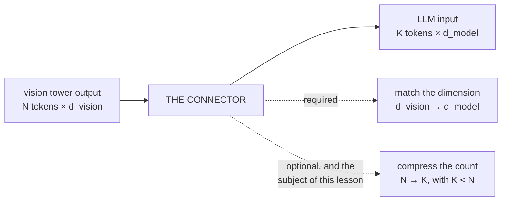
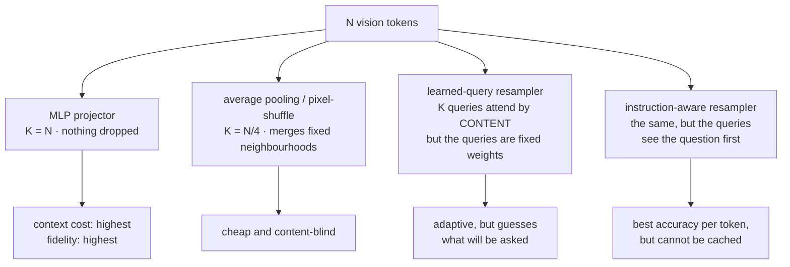
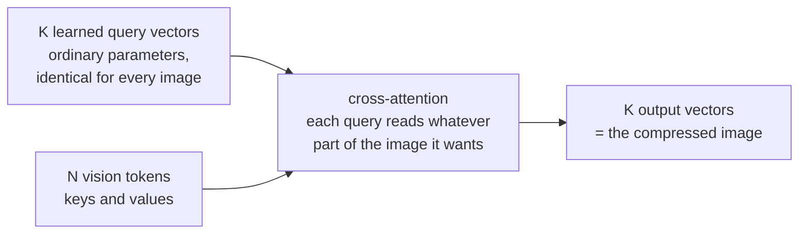
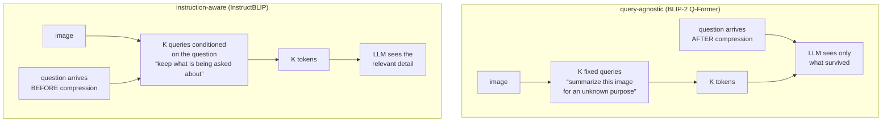

# Connectors and Visual Token Compression

**Phase:** [Vision-Language Models](../README.md) · **Topic folder:** `04-Connectors-and-Visual-Token-Compression`

## Why this matters

Two facts from earlier in this phase are on a collision course. [Lesson 1](../01-Vision-Encoders-and-Image-Tokenization/README.md) showed that a single image costs 576 tokens at 336px and 3,136 tokens at 896px, and that answering questions about locations, small text, or counts requires keeping those tokens rather than pooling them away. [Lesson 3](../03-VLM-Architectures-and-Fusion-Strategies/README.md) showed that the dominant fusion strategy puts every one of those tokens into the LLM's context, where attention is quadratic and every token claims a KV-cache entry in every layer. Something has to give, and the component where it gives is the **connector** — the small module between vision tower and language model. Its design decides not just how many tokens an image costs but *which* facts about the image are still recoverable when the LLM finally sees it. This lesson is about the trade in both directions, and about one design choice that changes it qualitatively.

## Orientation: what a connector is, in one picture

The **connector** (also "projector", "adapter", "resampler", or "bridge" — the papers do not agree) is the small module between the vision tower and the language model. It has one required job and one optional one, and the optional one is where all the interesting decisions live:



`N` is fixed by Lesson 1 (576 tokens at 336px, 3,136 with AnyRes tiling). `K` is what the language model actually pays for. Everything below is about how the four connector families choose *which* information to keep when `K < N` — and about one of them that changes the trade qualitatively by looking at the user's question first.

## What this lesson covers

- The connector's job, and the four families in use: MLP, pooling/pixel-shuffle, learned-query resampler, instruction-aware resampler
- Perceiver Resampler and Q-Former: cross-attention with a fixed set of learned queries
- Measured: accuracy vs. compression ratio for each family, on a task where the answer is one specific detail
- Why query-agnostic compression has a hard ceiling, and what conditioning on the instruction buys
- What compression actually saves, in real token and attention numbers
- Where each choice is used in production, and the failure mode each one carries

## 1. What a connector has to do

Minimally, the connector maps `d_vision → d_model` so vision vectors are dimensionally compatible with the LLM's embeddings. That is the whole job of LLaVA's connector: a two-layer MLP, applied per token, `N` tokens in and `N` tokens out. LLaVA-1.5's ablations found this beat the more elaborate alternative it replaced, which is a genuinely useful result — most of the connector's difficulty is not in the projection.

The real question is the token count. Once you accept that `N` is too large, a connector must also **compress**: emit `K < N` vectors that preserve whatever the LLM will be asked about. Four families do this:

| Family | Mechanism | `K` | Examples |
|---|---|---|---|
| **MLP projector** | per-token linear layers | `K = N` | LLaVA-1.5, most open VLMs |
| **Pooling / pixel-shuffle** | average or reshape adjacent tokens | `N/4`, `N/9`, … | LLaVA-NeXT variants, InternVL, Qwen2-VL's merger |
| **Learned-query resampler** | `K` learned queries cross-attend to the vision tokens | any `K` | Flamingo's Perceiver Resampler, BLIP-2's Q-Former, Qwen-VL |
| **Instruction-aware resampler** | same, but the queries also see the prompt | any `K` | InstructBLIP |



## 2. The resampler: cross-attention with learned queries

The idea behind Flamingo's Perceiver Resampler and BLIP-2's Q-Former is the same one: instead of transforming each vision token, create `K` **learned query vectors** — ordinary parameters — and let them cross-attend to the `N` vision tokens. Their `K` outputs are the compressed sequence.



```
queries : (K, d_model)   # learned parameters, the same for every image
out = CrossAttn(q = queries, kv = vision_tokens)     # (K, d_model)
```

Its appeal over pooling is adaptivity: a query can learn to attend to whatever in the image is informative, wherever it happens to be, rather than averaging a fixed spatial neighbourhood. BLIP-2 leans on this hard — its Q-Former compresses a whole image to 32 queries and is itself pretrained with contrastive, matching, and captioning objectives before ever meeting the LLM.

But look closely at what "learned parameters" means: the same `K` questions are asked of **every** image, and they were chosen during training, before anyone knew what the user would ask. That is the constraint the next section measures.

## 3. Measured: accuracy vs. compression

`example.py` runs the four families on a scene of 16 objects, each one vision token carrying a shape and a colour, with a question naming one shape and asking its colour. Chance is 16.7%. Everything downstream is held identical; only the connector and `K` change:

```
connector                             K=16       K=8       K=4       K=1
------------------------------------------------------------------------
MLP projector (no compression)     100.0%        --        --        --
average pooling                    100.0%     60.8%     42.8%     28.7%
learned-query resampler             98.9%     90.4%     60.7%     29.1%
instruction-aware resampler        100.0%    100.0%    100.0%    100.0%
```

Three things fall out of that table.

**Pooling degrades steadily and for a structural reason.** It is spatially local and content-blind: group `g` always averages the same slots, so as groups grow the objects inside a group blur into each other and the shape→colour binding is destroyed. This is [Lesson 3](../03-VLM-Architectures-and-Fusion-Strategies/README.md#1-the-task-and-why-pooling-fails)'s pooled baseline arriving gradually rather than all at once. Its saving grace in practice is that real images are spatially redundant — adjacent patches usually *are* similar — which is why 2×2 merges are nearly free on natural photographs and hurt most on dense text and charts, exactly where patches are not redundant.

**The learned-query resampler beats pooling but hits the same wall.** At `K = 8` it holds 90.4% where pooling has fallen to 60.8%, because its queries attend by content rather than position. But at `K = 4` and `K = 1` it collapses too. One vector cannot hold 16 shape→colour bindings, and since the queries are fixed parameters, the resampler cannot know *which* binding to keep.



**Conditioning on the instruction removes the ceiling entirely.** The instruction-aware resampler — same architecture, same parameter count, same `K` — adds the question's embedding to its queries before cross-attending. At `K = 1` it stays at 100%, because it only ever has to keep the one binding that was actually asked about. This is InstructBLIP's central finding, and the reason a query-agnostic Q-Former is usually the wrong default: you are asking a module to summarize an image for an unknown purpose, and then blaming the LLM for not knowing what got dropped.

The catch, and the reason instruction-aware compression is not universal: the compressed tokens now depend on the prompt, so they cannot be **cached and reused** across different questions about the same image, and in a multi-turn conversation the image's representation shifts under each new turn. Query-agnostic compression is prompt-independent, so an image can be encoded once and reused — a serving-side property Lesson 10 comes back to.

## 4. What compression actually buys

The savings are worth being concrete about. For one layer of LLM self-attention over the vision tokens plus a 100-token prompt:

```
setting                                   vis tokens   LLM attn cells    saving
CLIP ViT-L/14 @336, no compression               576          456,976      1.0x
2x2 pixel-shuffle (4x fewer)                     144           59,536      7.7x
resampler to 64 queries                           64           26,896     17.0x
resampler to 32 queries                           32           17,424     26.2x
AnyRes 896px, no compression                   3,136       10,471,696      0.0x
```

Nearly three orders of magnitude separate the extremes — 32 resampler queries against an uncompressed AnyRes image is a 600× difference in attention work — and it multiplies across every layer, every generated token (via the KV cache), and every image in a multi-image request. That is why every production VLM compresses somewhere. It is also why the last row exists: high-resolution tiling (Lesson 1 §5) and token compression are usually deployed *together*, because tiling's token count is unaffordable otherwise.

## 5. Choosing a connector

- **MLP, no compression** — the default when images are few and resolution is moderate. Highest fidelity, simplest, cacheable, most expensive in context.
- **Pixel-shuffle / patch merge** — a nearly free 4× cut on natural images; the standard companion to high-resolution tiling. Watch it on dense text and charts.
- **Learned-query resampler** — the right tool for many images or video, where a fixed small token budget per frame is the only thing that makes the sequence length viable. Accept that details outside the queries' learned interests are gone.
- **Instruction-aware resampling** — best accuracy per token by a wide margin, at the cost of prompt-dependent (uncacheable) vision features.

The general rule this lesson leaves you with: **compression is not lossy in a uniform way.** It preserves what it was trained to think matters and silently discards the rest, and the discarded material is unrecoverable downstream. When a VLM confidently invents the text on a small sign, the connector is at least as likely to be the culprit as the language model — a diagnosis [Lesson 7](../07-VLM-Hallucination-and-Alignment/README.md) develops properly.

## Video Script Outline

1. The collision: 3,136 tokens per image vs. a context window that also has to hold the conversation
2. What a connector minimally does (dimension match) and what it usually also does (compress)
3. The four families, and the Perceiver/Q-Former mechanism in detail
4. The measured table: pooling vs. learned queries vs. instruction-aware, as K falls from 16 to 1
5. Why pooling fails gradually — spatial locality and redundancy, and where redundancy runs out
6. Why the learned-query resampler hits a wall: fixed queries chosen before the question exists
7. Instruction-aware resampling at K=1, and the caching cost that comes with it
8. The savings table, and why compression and tiling are deployed together
9. Recap + preview of [Lesson 5](../05-Training-a-VLM-Staged-Pipeline/README.md): actually training this stack

## Further Reading

- Liu et al. (2023), *Improved Baselines with Visual Instruction Tuning* (LLaVA-1.5; the MLP connector ablation)
- Li et al. (2023), *BLIP-2: Bootstrapping Language-Image Pre-training with Frozen Image Encoders and Large Language Models* (the Q-Former)
- Jaegle et al. (2021), *Perceiver IO* and Alayrac et al. (2022), *Flamingo* (the learned-query resampler)
- Dai et al. (2023), *InstructBLIP: Towards General-purpose Vision-Language Models with Instruction Tuning* (instruction-aware query conditioning)
- Chen et al. (2024), *InternVL / InternVL 1.5* (pixel-shuffle compression alongside dynamic high-resolution tiling)
