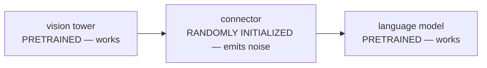
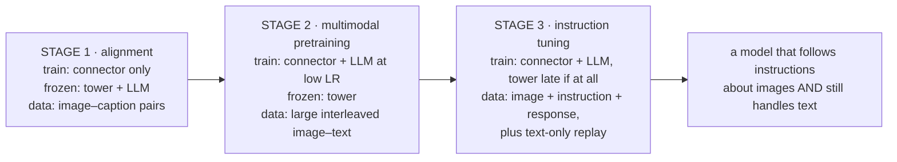
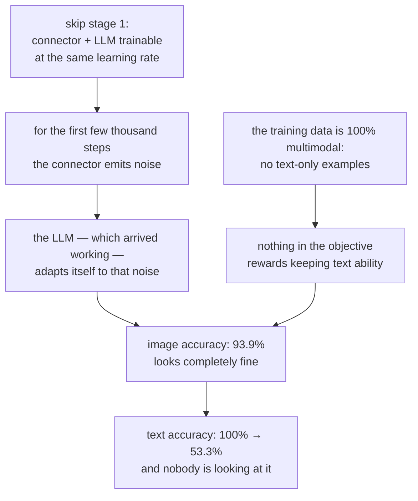

# Training a VLM: the Staged Pipeline

**Phase:** [Vision-Language Models](../README.md) · **Topic folder:** `05-Training-a-VLM-Staged-Pipeline`

## Why this matters

Lessons 1–4 assembled the parts: a vision tower, an objective that gave its features meaning, a fusion strategy, and a connector. Wiring them together and running gradient descent on the result is where most attempts fail, and they fail in a way that is invisible if you only look at the multimodal benchmark you were optimizing. The randomly initialized connector emits noise for the first few thousand steps; the language model, which arrived working, adapts to that noise; the training data is entirely multimodal, so nothing anchors the model's text-only ability; and by the time image accuracy looks good, the LLM you started from has been quietly degraded. This lesson is about the schedule that avoids all of that — which stage trains what, at which learning rate, on which data — and it measures each failure mode instead of asserting it. It is the multimodal counterpart to [Phase 05 Lesson 4](../../Phase-05-Finetuning-LLMs/04-Instruction-Tuning-SFT/README.md), and most of that lesson's machinery (loss masking, data mixing, learning-rate discipline) carries over unchanged.

## Orientation: three components, two of which already work

Before any schedule makes sense, be clear about what you are holding at the start of training:



That asymmetry drives every decision in this lesson. One component is broken and needs large updates; the other two are converged and can only be damaged by large updates. A schedule is just an answer to "who is allowed to move, when, and how fast", expressed through three knobs:

| Knob | What it does | Where it appears below |
|---|---|---|
| **Freezing** | a component receives no gradient at all | §2, §3, §5 |
| **Learning rate per group** | how far each component may move per step | §3 |
| **Data mixture** | which abilities the gradient is even about | §3 (replay), §6 |

And one term to fix, because it names the failure this lesson is mostly about: **catastrophic forgetting** is when training on new data destroys an ability the model already had. It is invisible unless you deliberately re-measure the old ability — which is exactly what `example.py` does.

## What this lesson covers

- The canonical two- and three-stage recipe, and what each stage is actually for
- What to freeze in each stage, and why the answer changes between stages
- Catastrophic forgetting of text ability, measured on the same model
- Data replay as the standard fix, and why it works
- Loss masking with a prompt that is mostly vision tokens
- Whether to unfreeze the vision tower, and what it buys
- Data mixtures, resolution curricula, and packing in real pipelines

## 1. The setup used to measure all of this

`example.py` builds a small causal Transformer and pretrains it on a **text-only** lookup task: a list of key/value pairs, then a query key, answer = that key's value. It reaches 100%. That is the stand-in for "a language model that already works," and — crucially — it gives us an ability we can re-measure *after* multimodal training. Vision is then introduced by supplying the same key/value pairs as vision tokens rather than text tokens. Both tasks share the model, the vocabulary, and the LM head, so any damage to the language model shows up immediately as lost text accuracy, exactly how forgetting is detected in production evaluation suites.

The vision tower in the script has a deliberately narrow output, because a real tower cannot forward everything in an image either — Lesson 2 §4's point, made structural.

## 2. The canonical recipe

Nearly every open VLM follows some version of this:

| Stage | Trains | Frozen | Data | Purpose |
|---|---|---|---|---|
| **1. Alignment** | connector only | vision tower, LLM | image–caption pairs (cheap, plentiful) | teach the connector to place visual features where the LLM can already read them |
| **2. Pretraining** *(larger models)* | connector + LLM | tower (usually) | large interleaved image–text corpora | build genuine multimodal competence, not just captioning |
| **3. Instruction tuning** | connector + LLM (± tower, late) | — | curated (image, instruction, response) triples | make it follow instructions about images ([Lesson 6](../06-Visual-Instruction-Tuning-and-VLM-Data/README.md)) |



The logic behind stage 1 is worth stating plainly: at initialization, the connector's output is *noise in the LLM's embedding space*. If the LLM is trainable at that moment, it spends its early gradient steps learning to accommodate noise — adapting a working model to a broken input. Freezing it forces the connector to move toward the LLM instead of the reverse, which is the direction that makes sense, since one of the two components already works.

## 3. Measured: six schedules

All six start from the identical pretrained weights; only the schedule differs. `text` is the *original* text-only ability, re-measured afterwards, and it started at 100%:

```
schedule                                       image    text  forgetting
stage 1 only (projector, frozen LM)           39.9% 100.0%       0.0%
stage 1 -> stage 2, LM frozen                 40.9% 100.0%       0.0%
stage 1 -> stage 2, LM unfrozen               91.3% 100.0%       0.0%
stage 1 -> stage 2, LM unfrozen, HIGH lr      93.6%  83.8%      16.2%
stage 1 -> stage 2 + 50% text replay          91.1% 100.0%       0.0%
NO stage 1: unfreeze everything at once       93.9%  53.3%      46.7%
```

Four readings:

**Freezing the LLM makes forgetting impossible by construction.** The text weights never move, so the text score cannot change. But notice how far short a frozen-LLM pipeline lands on the image task — 40%. A connector alone has to make visual features legible to a model that has never been asked to read them, and that ceiling is exactly why stage 2 exists. (Real LLaVA-1.0 showed the same shape of result: projector-only training produces a model that captions acceptably and follows instructions poorly.)

**Unfreezing at a small learning rate is nearly free here, and the same rate that suits the connector is not free at all.** The connector is a fresh module that needs large updates; the LLM is a converged one that needs small ones. Running both at 2e-3 costs 16 points of text ability. In practice this is handled with parameter-group learning rates — connector high, LLM 10–100× lower, vision tower lower still (or zero).

**Replay fixes forgetting directly.** Mixing text-only data back into the multimodal stage restores 100% text accuracy at no cost to image accuracy, for the obvious reason: the objective now contains the ability you are trying to keep. Every serious VLM training mixture includes a substantial fraction of text-only data for precisely this purpose — it is not a regularizer, it is the thing being preserved.



**Skipping stage 1 is the worst option on the board** — 46.7% forgetting, nearly half the text ability destroyed — while producing image accuracy indistinguishable from the well-behaved schedules. That combination is the trap: the metric you are watching looks fine, and the damage is somewhere you are not looking.

## 4. Loss masking

[Phase 05 Lesson 4](../../Phase-05-Finetuning-LLMs/04-Instruction-Tuning-SFT/README.md) established that SFT computes the loss only over the response, treating the prompt as context. For VLMs the argument is much stronger, because the prompt is longer and less predictable — it contains hundreds of vision tokens and an arbitrarily phrased instruction. `example.py` §2 measures both, with a randomly phrased instruction in the prompt:

```
loss computed over                          image acc  text acc
the answer only (standard SFT)                 87.2%     94.3%
every token in the sequence                    76.1%     80.6%
```

Eleven points of image accuracy, purely from where the loss is applied. The mechanism is straightforward: the random instruction tokens are unpredictable by construction, so no capacity can lower that part of the loss; training on them spends gradient on noise and dilutes the signal from the one token that carries the task. In a real VLM the answer might be 20 tokens out of 3,000, and the dilution is proportionally worse.

The related question — *should the loss ever be applied to vision tokens?* — has the same answer for the same reason, and one extra: predicting a continuous projected patch embedding as if it were a vocabulary token is not even well-defined in a standard VLM. Vision tokens are context, never targets. (Models like Chameleon that quantize images into discrete tokens *are* trained to predict them — but there the image tokens are real vocabulary entries, which is what makes generation possible; see [Lesson 11](../11-Beyond-Vision-Full-Multimodality/README.md).)

## 5. Should the vision tower train?

```
vision tower                     image    text
frozen                          91.1%    100.0%
trained (unfrozen)              97.9%    100.0%
```

Unfreezing the tower helps, and the reason is Lesson 2 §4: the tower's own pretraining objective discarded things, and only the tower's weights can recover them. The risk on a real model is proportionate — you are fine-tuning features that took enormous compute to acquire, on a dataset orders of magnitude smaller, and it is entirely possible to make the tower worse at everything your fine-tuning set does not cover. Current practice converged on: frozen through alignment, then unfrozen late at a much lower learning rate than the rest of the model, or left frozen entirely for smaller training budgets.

## 6. What real pipelines add

- **Data mixture** is the main lever, and it is a mixture in several dimensions at once: caption data, VQA, OCR/document data, chart/diagram data, grounding data with coordinates, multi-image and interleaved documents, and text-only replay. [Lesson 6](../06-Visual-Instruction-Tuning-and-VLM-Data/README.md) is about how these are built.
- **Resolution curriculum**: train early stages at low resolution (cheap, and the connector doesn't need detail to learn placement), raise it in later stages. Since vision tokens scale as `res²`, this is one of the largest compute levers available.
- **Sequence packing** matters more than in text training because image samples have wildly different token counts — a thumbnail versus a 12-tile document is a 10× difference — so naive batching wastes enormous amounts of padding.
- **Aspect-ratio bucketing / native resolution** (Lesson 1 §2) to avoid square-resizing everything.
- **Multi-image and interleaved samples in training, or the model will not handle them at inference.** A model trained only on single-image samples routinely confuses which image a question refers to when given two.

## Video Script Outline

1. The four failure modes hiding in "just train the whole thing"
2. The measurement setup: a text-only pretrained LM whose text ability we can re-check afterwards
3. The canonical stage table — what trains, what's frozen, what data
4. Why stage 1 freezes the LLM: at step 0 the connector emits noise, and the working component should not adapt to the broken one
5. The six-schedule table, row by row — including the trap row where image accuracy looks fine and the LLM is half-destroyed
6. Learning rates as parameter groups: a fresh connector and a converged LLM want different step sizes
7. Replay: the fix, and why it is the obvious one
8. Loss masking with a mostly-vision prompt: 87.2% vs 76.1%
9. Unfreezing the tower: what it recovers and what it risks
10. Recap + preview of [Lesson 6](../06-Visual-Instruction-Tuning-and-VLM-Data/README.md): the data that goes into stage 3

## Further Reading

- Liu, Li, Wu, Lee (2023), *Visual Instruction Tuning* and Liu et al. (2023), *Improved Baselines with Visual Instruction Tuning* (the two-stage recipe and its ablations)
- Laurençon et al. (2024), *What matters when building vision-language models?* (systematic ablations of freezing, staging, and data mixtures)
- McKinzie et al. (2024), *MM1: Methods, Analysis & Insights from Multimodal LLM Pre-training* (a large, careful study of pretraining data mixture and resolution)
- Beyer et al. (2024), *PaliGemma: A versatile 3B VLM for transfer* (an explicitly staged recipe with resolution curriculum)
- Luo et al. (2023), *An Empirical Study of Catastrophic Forgetting in Large Language Models* (the forgetting phenomenon measured directly)
